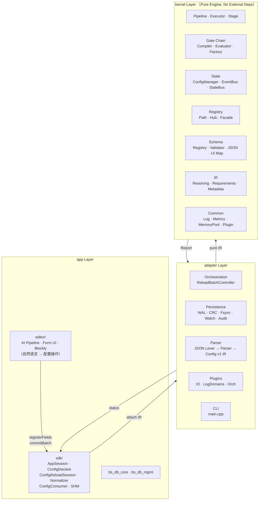
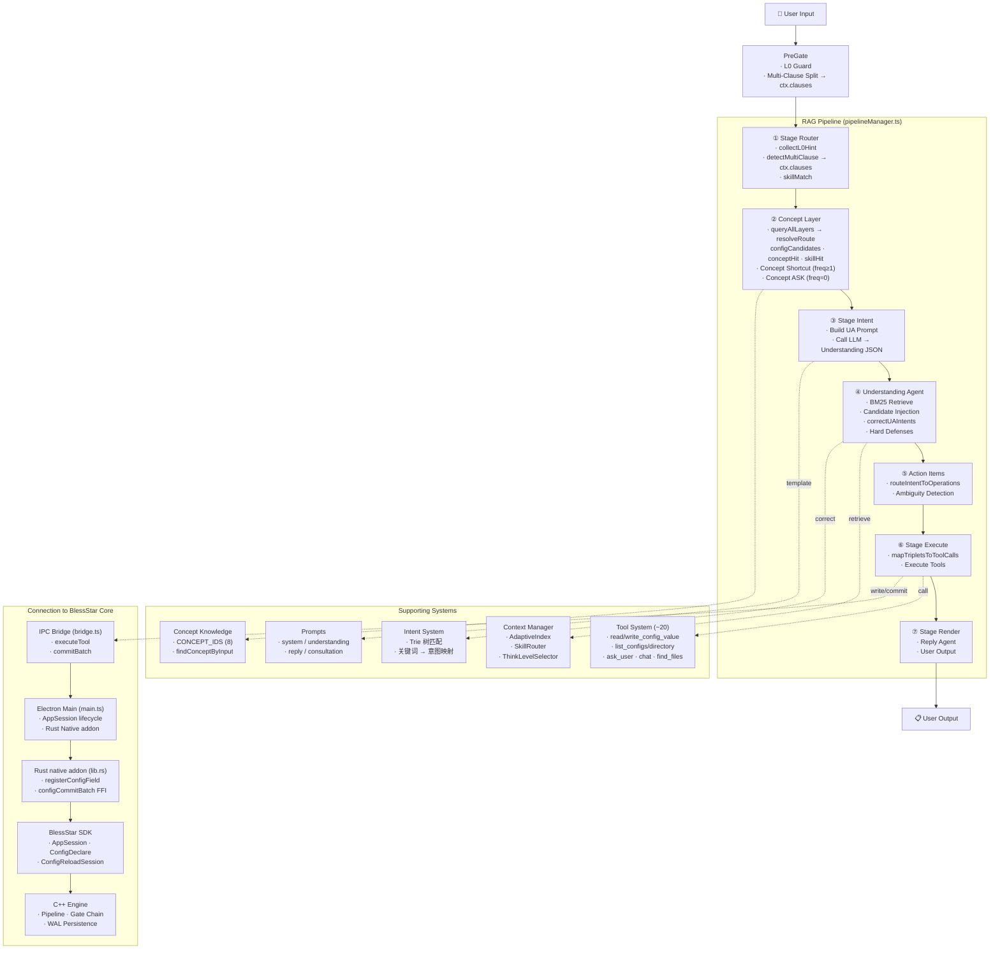

# BlessStar — 配置驱动应用运行时引擎

BlessStar 是一个配置驱动的应用运行时引擎，采用 **Kernel → Adapter → App** 三层单向依赖架构。它将业务配置以标准化指令（IR）的形式注入内核，实现配置的全生命周期管理——从格式归一化、门禁校验、原子持久化，到内核状态同步与热更新。

内置 **AI 配置管理管线**（Electron 编辑器），支持自然语言理解与配置操作。

---

## 核心目录树

```
BlessStar/
│
├── CMakeLists.txt              # 顶层 CMake 构建
├── CMakePresets.json
├── README.md
│
├── kernel/                     # 纯引擎 — 无外部依赖
│   ├── common/                 # 日志 / 指标 / 内存池 / 插件
│   ├── gate_chain/             # 门禁链：AST 编译 / 求值 / 工厂
│   ├── io/                     # IO 门面
│   ├── ir/                     # 中间表示 + 需求 + 解析器
│   ├── pipeline/               # Pipeline 执行器 + 阶段编排
│   ├── registry/               # 路径注册 + 门面 + 集线器
│   ├── report/                 # 执行报告 + 结果
│   ├── runtime/                # 内核 / 内核池 / 配置上下文
│   ├── schema/                 # Schema 注册 / 校验 / JSON 转换
│   ├── state/                  # 状态机 / 事件总线 / 配置管理器
│   └── ui_map/                 # Schema → UIDL 转换
│
├── adapter/                    # 编排 + 持久化层
│   ├── cli/                    # CLI 入口
│   ├── io/                     # IO 提供者（本地文件 / DB / 远程）
│   ├── log/                    # 日志总线（内存 / spdlog）
│   ├── manifest/               # 插件清单 + IR 需求
│   ├── orchestration/          # ReloadBatchController
│   ├── parser/                 # JSON 词法/语法 → Config v1 IR
│   ├── persistence/            # WAL / CRC / Fsync / Watch
│   ├── plugins/                # 内置插件（IO / 日志域 / 编排）
│   └── src/                    # 核心编排实现（attach / bootstrap）
│
├── app/
│   ├── bs_db_core/             # 数据库内核抽象
│   ├── bs_db_mgmt/             # 数据库连接管理
│   ├── editor/                 # Electron 配置编辑器
│   │   ├── electron/           # 主进程（AppSession 生命周期）
│   │   ├── native/             # Rust 原生 addon（napi-rs FFI 桥）
│   │   └── src/                # TypeScript 前端 + AI 管线
│   │       ├── ai/             # AI 管线（pipeline · tools · prompts · context）
│   │       ├── components/     # React UI（blockly · forms · layout）
│   │       ├── routes/         # 路由页面
│   │       └── types/          # API 类型定义
│   └── sdk/                    # BlessStar SDK
│       ├── include/bs/app/sdk/ # 公共 Header（~30 个）
│       └── src/                # 核心实现（session · config · normalizer · shm）
│
└── Bussiness System/           # [同级目录] 外部业务系统，不属核心仓库
```

---

## 构建

```bash
# C++ 核心（kernel + adapter + sdk）
cmake -S . -B build -DCMAKE_BUILD_TYPE=Release
cmake --build build

# Rust 原生 addon（editor native）
cd app/editor/native && cargo build

# TypeScript 前端 + Electron
cd app/editor && npm install && npm run build

# 全量测试
ctest --test-dir build --output-on-failure
```

---

## 整体架构



**层间契约**：
- `app → adapter`：通过 `AttachIR` 提交标准化指令
- `adapter → kernel`：通过 `Pipeline.Execute(IR)` 执行纯引擎运算
- `kernel → adapter`：返回 `Report`（含 Status/CAS/Error 信息）

---

## AI 管线架构

### 管线数据流



### 管线阶段详解

#### ① Stage Router (`stage-router.ts`)
- **功能**：`collectL0Hint` 提取操作类型 hint（read/write/list）；`detectMultiClause` 按中文标点分割多意图；`skillMatch` 检查 `/command` 路由
- **输出**：`ctx.clauses`（子句数组） + `ctx.isCommand`

#### ② Concept Layer (`pipelineManager.ts:126-225`)
- **核心调用**：`queryAllLayers(text)` → `resolveRoute(hits)` → `{ configCandidates, conceptHit, skillHit }`
- **短路规则**：
  - `conceptHit.freq ≥ 1` + 非查询模式 → 直接输出概念解释（无 LLM）
  - `conceptHit.freq = 0` + 非 MODIFY/非查询子句 → ASK 澄清

#### ③ Stage Intent (`stage-intent.ts`)
- **功能**：构建 UA Prompt 的 `thinking` 模板，填充候选配置项
- **输出**：`ctx.uaUserMessage`（LLM 调用 prompt）

#### ④ Understanding Agent (`pipelineManager.ts:556-665`)
- **关键步骤**：
  1. `retrievePerClause(text)`：BM25 倒排检索 → `combinedCandidates`
  2. `buildUAPromptWithCandidates(injectedContext, toolSummaries)` → LLM
  3. `correctUAIntents`：后处理修正（MODIFY→QUERY_LIST 转换等）
  4. **硬过滤器**（D38-HARD-DEFENSE）：修复 LLM 输出缺陷

#### ⑤ Action Items (`pipelineManager.ts:677-865`)
- **`routeIntentToOperations(intent, configKey, value)`** 映射规则：
  - `QUERY_LIST + noKey` → LIST（列出全部）
  - `QUERY_LIST + directory-type` → BROWSE_DIR（浏览目录）
  - `MODIFY + key + value` → READ + WRITE（先读后写）
- **歧义检测**：`isListNoKey` + `extractDomainHints` → 筛选领域候选 → ASK

#### ⑥ Stage Execute (`stage-execute.ts`)
- `mapTripletsToToolCalls` → 调用工具系统执行具体操作（支持并行）

#### ⑦ Stage Render (`stage-render.ts`)
- 构建 Reply Agent prompt，将工具调用结果转化为自然语言回复

### 核心设计原则

| 原则 | 说明 |
|------|------|
| **三层确定性路由** | ConfigLayer → ConceptLayer → SkillLayer，逐层短路，避免不必要 LLM 调用 |
| **自适应学习** | `confirmRoute()` 提升高频匹配的 freq，用户越用越快 |
| **LLM 最小化** | 硬编码兜底（L0/trie） > 确定性路由 > LLM |
| **业务系统无关** | AI 管线通过 `BusinessAdapterRegistry` 接口隔离，不感知具体业务 |

### AI 管线 vs BlessStar 核心

```
AI 管线（app/editor/src/ai/）             BlessStar 核心（kernel/ + adapter/ + sdk/）
─────────────────────────                ─────────────────────────────────
自然语言理解                             配置引擎
意图 → 操作映射                           IR 执行
LLM 调用                                 确定性 Pipeline
自适应索引（freq-based）                   门禁校验
对话管理                                  原子持久化
Tool 编排                                状态同步
```


