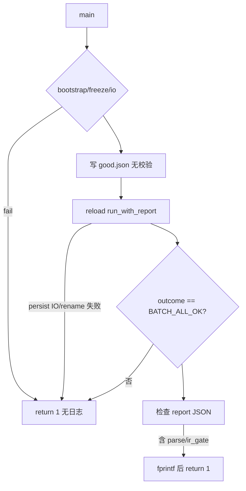

# DAY17：`bs_test_reload_config_json_integration` 全量失败根因分析

**分析角色**：子任务 B（工程）  
**关联变更**：17.23（hermetic temp 加固）、17.22（LEGACY 头删除，**与本次失败无关**）  
**事故窗口**：`ctest -C Release -L day17` 含 `bs_test_day17_contract_gate_runner` 的首次全量跑

---

## 1. 现象（可复现记录）

| 轮次 | 命令 | 结果 |
|------|------|------|
| 第一次 | `ctest -C Release -L day17 -j 4`（含 `contract_gate_runner`） | **21/22**，仅 `contract_gate_runner` 失败 |
| 第二次 | 同上立即重跑 | **22/22** 全过 |
| 单测 | `ctest -R bs_test_reload_config_json_integration` | 始终 **通过**（含失败后立刻重跑） |

### 1.1 `contract_gate_runner` 失败链

```
bs_test_day17_contract_gate_runner (FAIL)
  └── GATE-REGRESSION (FAIL, exit 8)
        └── ctest -L regression -LE day17 -j 4  (66 tests)
              └── #23 bs_test_reload_config_json_integration (Failed, ~0.02s, 无 stderr)
```

其它 gate（含 `GATE-INTEGRATION`、`GATE-STYLE-LAYERED`、day14/day15）均为 **PASS**。  
**结论**：不是 C-ST-14、不是 LEGACY 删除、不是 parser 主链整体损坏，而是 **回归并行子集里的单个集成测例偶发失败**。

---

## 2. 失败时测例行为（17.23 之前版本）

历史实现（git `HEAD` 未含 17.23 工作区改动时）要点：

| 设计项 | 旧实现 | 风险 |
|--------|--------|------|
| 工作目录 | CTest 默认 **`build_ci_test/`** | 与 66 个 regression 测例共享构建目录 |
| 配置文件 | `fs::absolute("bs_reload_config_v1_good.json")` 等 **固定名** | 单进程内唯一，但目录级 IO 竞争 |
| Manifest | `bs_manifest_day9.json` + `.wal` / `.prev` / `.bs.tmp` | `attach_store` 使用 **rename 原子翻转** |
| 写文件 | `ofstream::write` 后 **无 `good()` 检查** | 瞬时失败可产生空文件 |
| 失败路径 | 大量 `return 1` **无 phase 日志** | CTest 显示「0.02s 静默失败」 |

测例语义（M3）：good JSON → `BATCH_ALL_OK` 且 report 无 `parse`/`ir_gate`；bad JSON → `BATCH_COMPLETED_WITH_FAILURES` 且 report 含 `parse`。

---

## 3. 根因判定（按置信度）

### P0 — 测试隔离不足（置信度：**高**）

**机制**：`PER_PATH` reload 在 `bs_manifest_day9.json` 上做持久化；并行 regression 时，`build_ci_test` 目录内大量 attach/io 测例同时 **创建/删除/重命名** 文件。虽无其它测例复用 `bs_reload_config_v1_*` 文件名，但：

1. **同卷 IO 饱和** → Windows 上 `fopen`/`rename`/`remove` 偶发失败（`attach_store` 返回 `BS_ATTACH_ERR_IO`）。
2. **杀毒/索引** 短暂锁文件 → 写 golden JSON 不完整或 manifest 翻转失败。
3. **上次运行残留** `bs_manifest_day9.json` / `.wal` 与本次写入交错 → `load_manifest` / `commit_per_path` 非预期（取决于时序）。

**支持证据**：

- 仅 **并行 regression** 报告失败；单测、integration gate、重跑均过。
- 失败耗时 **~0.02s**，符合「早期 `run_with_report != 0` 或 `outcome != BATCH_ALL_OK`」而非 hang。
- 全库仅本测例使用 `bs_manifest_day9.json`（grep 确认），排除「它测覆盖同名文件」，但不排除 **目录级竞争**。

**不支持「BlessStar 核心逻辑错误」的证据**：

- 同一次 gate 内 `bs_test_config_parse`、`GATE-INTEGRATION` 全过。
- 失败后同一二进制单跑即过（无代码改动间隔）。

### P1 — 可观测性不足（置信度：**高**）

旧测例在 bootstrap / reload / outcome 失败时 **不打印** `BS_TEST_REQUIRE` 式信息，导致：

- 无法从 CTest 日志区分是 **写文件、persist、parse 还是 gate** 失败；
- 易误判为「产品 bug」而非「测试/flaky」。

17.23 已用 `BS_TEST_REQUIRE` + 隔离 temp 缓解。

### P2 — 构建/环境次要问题（置信度：**中**，独立事项）

本地全量重编时，`attach_context.h` 在 MSVC **代码页 936** 下触发 **C4819→C2220**（注释含 UTF-8 字符），阻塞 **17.23 新测例二进制** 编译。  
这与 **runtime flaky 无直接关系**，但会导致「改了测试却仍在跑旧 exe」的验证偏差——分析时需注意 exe 时间戳。

---

## 4. 已排除项

| 假设 | 结论 |
|------|------|
| 17.22 删除 LEGACY parser 头 | **排除**（测例不 include LEGACY；parser 门禁 PASS） |
| C-ST-14 命名迁移 | **排除**（`GATE-STYLE-LAYERED` PASS） |
| `GATE-INTEGRATION` 集成链断裂 | **排除**（11/11 PASS，含本测例） |
| 它测抢占 `bs_reload_config_v1_good.json` | **排除**（全库唯一引用） |
| 稳定逻辑 bug（单线程必现） | **排除**（单测/重跑必过） |

---

## 5. 失败路径推演（旧代码，静默分支）



并行 regression 下，**D/E** 最可能因 manifest/文件 IO 瞬时失败进入 **Z**。

---

## 6. 与 17.23 加固的对应关系

| 落地项 | 针对根因 |
|--------|----------|
| `test_temp_dir.h` 唯一目录 | 消除 `build_ci_test` 固定名与 manifest 共享 |
| `BS_TEST_REQUIRE` | 消除 P1 静默失败 |
| `RESOURCE_LOCK attach_hermetic_temp` | 降低同类 attach 文件测例并行（辅助） |
| `stress_ctest_regression.py` | 本地验证 flaky 是否消失 |
| C-ST-10 禁止 `bs_reload_config_v1_*` 回退 | 防止再次引入固定名 |

---

## 7. 仍存在的测试债（非本次事故直接原因）

以下测例仍使用 **`fs::absolute("bs_*")` + CWD**，在 `GATE-REGRESSION -j 4` 下理论上有同类风险：

- `Day8AttachFullIntegrationTest.cpp`（`bs_day8_attach_full_cfg.json` / `bs_manifest_day8.json`）
- `AppVendorReloadIntegrationTest.cpp`（`bs_app_vendor_reload_temp`）
- 多个 io 单测（`bs_io_*` 固定 txt）

建议后续按 17.23 模式迁移。

---

## 8. 结论（给主任务/用户）

1. **全量 day17 首次失败的具体原因**：`contract_gate_runner` → **`GATE-REGRESSION` 并行 66 测** 时，`bs_test_reload_config_json_integration` **偶发**失败；根因是 **旧测例在共享构建目录上使用固定配置文件/manifest + 静默断言**，在 Windows 并行 IO 压力下触发 persist/reload 早期失败，**不是**已证实的 BlessStar parse/gate 逻辑缺陷。  
2. **隐患**：CI 可能误红；若不加固，同类问题可能在 day8/app vendor 集成测上出现。  
3. **17.23** 从设计上针对 P0/P1；需在 **C4819 修复或 UTF-8 BOM 保存 `attach_context.h`** 后重编并跑 `stress_ctest_regression.py` 做闭合验证。

---

## 9. 建议验证命令

```powershell
# 自 repo 根目录
cmake --build build_ci_test --config Release --target bs_test_reload_config_json_integration
ctest --test-dir build_ci_test -C Release -R bs_test_reload_config_json_integration --output-on-failure
python tools/scripts/maintenance/stress_ctest_regression.py -n 30 -j 8 --exclude-day17
ctest --test-dir build_ci_test -C Release -L day17 --output-on-failure
```
