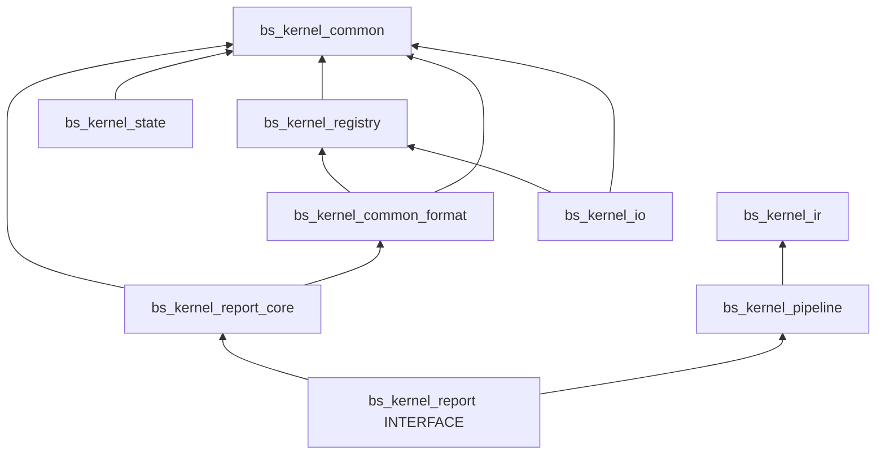
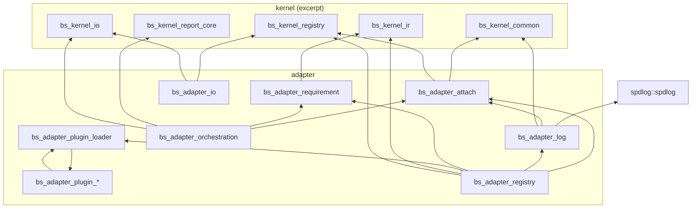

# 第一阶段架构复盘（第8天 · IMPL-08-15 / 08-14）

> **状态**：✅ 定稿（2026-05-18）· 08-17 阶段 3（orch Registry + YAML + IR 子集校验）已落地  
> **依据**：《架构方案选择记录》第8天 · 用户已裁定 REV-VIII / R8-xx  
> **回归基线**：Debug `ctest` **57/57**（变更 8.9）

## 1. 裁定摘要（§5️⃣）

| R8 | 裁定 | IMPL | 工程状态 |
|----|------|------|----------|
| R8-01 | BsStatus 唯一 | 08-01 | ✅ |
| R8-02 | AttachContext C | 08-06 | ✅ 三阶段 |
| R8-03 | A+B+C | 08-20/02/07 | 🟡 CI Include gate + test_support |
| R8-04 | C ABI ADR | 08-04 | ✅ `docs/adr/ADR-BS-ABI-001.md` |
| R8-05 | IO-II 文档 | 08-05 | ✅ `docs/IO-II-REGISTRY-COUPLING.md` |
| R8-06 | report 双库 | 08-08 | 🟡 `report_core` + INTERFACE |
| R8-07 | state A+B | 08-09/10 | 🟡 集成测 + freeze notifier |
| R8-09 | A+B | 05-01/08-12 | ✅ freeze grep + 相位测试 |
| R8-10 | format 下沉 common | 08-18 | ✅ `bs_kernel_common_format` |
| R8-11 | 动态 domain_id | 08-13 | ✅ |
| R8-12 | 链接扇出文档 | 08-14 | ✅ 本文 §3 |
| R8-13 | ConfigManager 拆头 | 08-21 | ✅ |
| R8-08 | 插件化 C | 08-17 | ✅ 阶段 2+3：loader + 三插件 + orch Registry |
| R8-14 | WIRE 跟踪 | 08-22 | 🟪 本文 §4 |

## 2. 与第1～7天对照

- **第7天 A″+L″**：`BsStatus` / 单 LogBus；第8天删除 `BsError`（08-01）。  
- **第5～6天 Registry + IO-II**：attach 经 `RegistryFacade`；IO read 须在 resolve 后（见 **08-05**）。  
- **第8天新增**：`AttachContext`、Include 门禁、report/format 拆分、插件化 P2、相位与 domain_id 测试。  
- **刻意未做**：WIRE-07 入口层（08-22）、全量 P-C、动态 `dlopen`、Attach 热更新。

## 3. adapter / kernel 链接扇出（R8-12 · IMPL-08-14）

> **来源**：根目录 `CMakeLists.txt` · `target_link_libraries`（2026-05-18）。  
> **规则**：`kernel → adapter` 单向；adapter 库 **不得** 被 `bs_kernel_*` 链接。  
> **维护**：新增 `target_link_libraries` 须在 PR 中更新本节或附 diff 说明。

### 3.1 内核库依赖（简图）

### 3.2 Adapter 库依赖（扇出中心：`bs_adapter_registry`）

**扇出要点（08-17 阶段 3 后）**：

| 目标 | 直接 `PUBLIC` 依赖数 | 说明 |
|------|----------------------|------|
| `bs_adapter_registry` | kernel×2 + adapter×4+loader | core + `plugin_loader`；**不再**直链 `bs_adapter_io` / orch |
| `bs_adapter_orchestration` | 4 | reload factory + gate + report |
| `bs_adapter_plugin_orch` | orch + requirement + support | P2 orch-reload |
| `bs_adapter_plugin_io` | io + registry + support | P2 io-standard |

### 3.3 测试 / 工具库（摘录）

| 目标 | 链接 | 用途 |
|------|------|------|
| `bs_kernel_test_support` | `bs_kernel_common` | 内核测 mock LogBus |
| `bs_adapter_cli` | `bs_kernel_ir`, `bs_kernel_report` | CLI；不链 bootstrap |

### 3.4 新增依赖审批（R8-12）

1. **禁止**：`bs_kernel_*` → 任意 `bs_adapter_*`。  
2. **adapter 新增 PUBLIC 依赖**：PR 中写明扇出理由并更新 §3.2。  
3. **优先**：链 `bs_kernel_report_core` 而非 INTERFACE `bs_kernel_report`（除非需要 pipeline 元数据）。

## 4. WIRE-07 状态表（R8-14 · 08-22）

| ID | 说明 | 状态 |
|----|------|------|
| WIRE-07-01 | CLI attach→reload | 🟪 二期 08-23 |
| WIRE-07-02 | KernelConfig→log level | 🟪 二期 08-24 |
| WIRE-07-03 | 真实 IR gate | 🟪 二期 08-24 |
| IMPL-06-03 | 字节→IR | 🟪 本期不做 |

## 5. 第8天工程 / 文档批次记录

| 批次 | 内容 | ctest |
|------|------|-------|
| 8.1 | IMPL-08-06 阶段1 + 08-20/05-01 + 本初稿 | **50/50** ✅ |
| 8.2 | 阶段2 + test_support + report_core + format | **50/50** ✅ |
| 8.3 | 阶段3 + 08-21 + 08-09/10 | **51/51** ✅ |
| 8.4 | 08-12 + 08-13 | **51/51** ✅ |
| 8.5 | 08-04/05/14 文档 | — |
| 8.6 | 08-17 插件 loader + 三静态插件 | **52/52** ✅ |
| 8.7 | 08-16 回归矩阵 + 集成测 | **54/54** ✅ |
| 8.8 | 08-17 阶段3 + 08-15 定稿 | **57/57** ✅ |

## 6. 文档索引

| 文档 | 路径 |
|------|------|
| C ABI ADR | `docs/adr/ADR-BS-ABI-001.md` |
| IO-II 与 Registry | `docs/IO-II-REGISTRY-COUPLING.md` |
| 回归报告 | `docs/PHASE1_REGRESSION_REPORT.md` |
| 插件清单 | `adapter/manifest/attach_plugins.yaml` |
| 编码规范 | `docs/CODING_STYLE.md` §11 |
| 架构裁定全文 | `架构方案选择记录.md` 第8天 |

## 7. 08-17 阶段 3 落地摘要（PLUGIN-VIII）

| 项 | 落点 |
|----|------|
| `/adapter/orchestration/reload_batch` | `reload_batch_factory.*` · `plugin_orch.cpp` |
| `ReloadBatchControllerFactory` | `bs_reload_batch_controller_create_from_binding` |
| `attach_plugins.yaml` 解析 | `attach_manifest_yaml.cpp` · freeze 前 `load_all` |
| `ir_requirements_ref` 子集校验 | `plugin_ir_requirements.cpp`（`bs_adapter_requirement`） |
| Manifest 路径 | `manifest_config.h.in` → `build/generated/...` |

**二期**：`dlopen`、插件 manifest CI、scheme_map 从 YAML 驱动。
