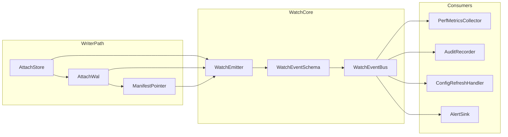

# 架构方案选择记录

> 本文档由子任务A自动维护，记录每一轮迭代的方案原文、固有缺陷、否决理由与改进方向。
> 仅用于回滚与复盘，不作为日常预研参考。

## 记录规则

- **研读方案即草案**：凡是"阅读源码得出的方案/目录/架构建议"，均视为**当日草案**，仅用于辅助用户当日决策。
- **当日确认即删除草案**：当用户在当天给出"最终架构方案/最终决策文本"后，必须**立即删除**该日所有草案内容（仅保留必要的标题占位与可追溯的最终决策引用信息）。
- **状态图标（与 `进度状态记录.md` 规则一致）**：描述**落地进度、方案锁定、草案、短板收口**等时，优先使用三态图标，与智能体规则中「状态符号说明」一一对应：
  - 🟪：未开始 / 未排期开展 / 刻意延后尚未收口  
  - 🟡：进行中（含「待子任务B落地」「草案待确认」「部分延后」等）  
  - ✅：已完成（含「用户已确认」「已完全落地」「短板已补齐」等）  
  - **补充**：「方案演进」表中取舍类语义可继续使用 **❌**（弃用）、**🎯**（最终采用）等，与上列三态并存；同一文档内勿用 🟪/🟡/✅ 表达「弃用」，以免与「未开始」混淆。
- **文档级汇总索引**：见文末尾 `## 跨日汇总索引（文档级）`。子任务A **不得擅自修改**；仅用户授权后按指示编辑。  
- **子任务A 默认产出**：对话中的研析报告（草案），**不**默认写入本文件。

---

## 第1天 / 最终决策

### 方案引用
- **决策来源**：用户设计的《纯净内核架构方案》（内核=CPU/模具模式）
- **确认时间**：2026-05-12
- **状态**：✅ 已确认

### 最终方案摘要

**1) 目标与定位**
- 目标：通用型底层配置驱动框架"纯净内核"，高内聚低耦合。
- 内核=CPU/模具：外部无法修改内核本体与对外接口逻辑；外部输入只能通过标准化指令进入。

**2) 模块化方式（Spring Cloud 多模块思想）**
- 内核拆为多个核心模块（部件），但对外作为一个整体内核运作。
- 污染即阻断：任何模块被污染立刻报错阻断；只修污染模块，不连坐其他模块。

**3) 输入/输出机制（唯一纯净 I/O + 元数据组）**
- 唯一输入：适配层生成符合规范的"内核输入配置文件/IR"
- 唯一输出：内核输出"执行情况报告 + 最小 NextTarget/NextAction +（可选）抽象 Plan"
- 适配层职责：翻译外部世界为IR，执行NextAction，严格白名单

**4) 单线流水线（单向依赖）**
- 内核各模块按单线流水线组织：`ir → pipeline → report`
- 下游模块只依赖上游模块产出的指令/IR；严禁反向依赖与横向共享状态

**5) 治理与修复（供应链式"出厂纯度"）**
- 源码包（Source Repo）：`https://github.com/little-white1111/BlessStar` - 独立仓库维护，唯一可写、唯一标准源
- 出厂包（Factory Package）：主仓库只同步指定版本，不做写回修改
- 纯度校验：版本锚点（tag/sha）+ manifest（文件清单+hash）
- 修复路径：源码包修复 → 发布新版本 → 本地缓存 → 增量复制到出厂包

**6) 目录结构**
```
BlessStar/
├── kernel/           # 内核纯净区（ir/pipeline/report）
├── adapter/         # 适配层
├── factory/         # 出厂包
├── local_source_cache/  # 本地源码缓存
└── tools/           # 工具脚本
```

### 评分与风险
- **综合评分**：9.0/10
- **主要剩余风险**：
  - 指令协议必须极简、严格版本化
  - 必须有构建/CI硬约束确保模块只能通过指令协议交互

### 落地建议（子任务B已执行）
1. **纯度门禁工具**：`tools/purity/verify_manifest.py` - 验证内核目录与manifest一致性
2. **增量复制脚本**：`tools/factory/sync.py` - 从本地缓存同步到factory目录
3. **编码规范**：`.clang-format` + `docs/CODING_STYLE.md` - C++编码规范配置与文档
4. **Git规范**：`docs/GIT_COMMIT_GUIDELINES.md` - Git提交规范文档

### 落地状态总结（2026-05-14 已完成）

| 落地项 | 状态 | 实现文件 |
|--------|------|----------|
| 纯度门禁工具 | ✅ 已完成 | `tools/purity/verify_manifest.py` |
| 增量复制脚本 | ✅ 已完成 | `tools/factory/sync.py` |
| 编码规范配置 | ✅ 已完成 | `.clang-format` + `docs/CODING_STYLE.md` |
| Git提交规范 | ✅ 已完成 | `docs/GIT_COMMIT_GUIDELINES.md` |

**验证结果**：
- ✅ 目录结构符合纯净内核架构规范
- ✅ 单向依赖铁则已满足
- ✅ 编码规范已应用

---

## 第2天 / 最终决策

### 方案引用
- **决策来源**：子任务A《内核分层设计研析报告》
- **确认时间**：2026-05-13
- **状态**：✅ 已确认

### 最终方案摘要

**1) 内核四层架构**

| 层级 | 名称 | 职责边界 | 位置 |
|------|------|----------|------|
| L1 | IR层 | 指令表示与元数据定义 | `kernel/ir/` |
| L2 | Pipeline层 | 单向依赖流水线 | `kernel/pipeline/` |
| L3 | Report层 | 执行报告生成 | `kernel/report/` |
| L4 | Runtime层 | 内核运行时控制（**IR 执行引擎**；MVP 主链见第17天 **XVII-KERNEL**） | `kernel/runtime/` |

**2) 层间调用规则（单向依赖铁则）**

```
IR层 → Pipeline层 → Report层
  ↓         ↓           ↓
  └─────────┴───────────┘→ Runtime层（仅汇总，不反向调用）
```

**禁止规则**：
- 下游模块不得调用上游模块
- 禁止横向状态共享
- 禁止循环依赖

**MVP 主路径演进（第17天 · R-01 方案三）**：

- **第 2～12 天**：L4 以骨架 + 单向依赖为主；财务 reload 经 adapter 编排 + gate。  
- **第 17 天起（用户确认）**：L4 **升格**为 attach 主链 **IR 执行段**（`Kernel` + `Pipeline`），与 `ConfigManager` 并列挂在 **AttachContext**；详见 **第17天 § XVII-KERNEL**。

**3) 适配层三位一体架构**

| 层级 | 名称 | 职责 |
|------|------|------|
| L1 | 格式适配层 | 多格式解析入口（YAML/JSON/DSL） |
| L2 | Schema校验层 | 标准模板校验、自动验证 |
| L3 | 元编程扩展层 | 动态逻辑执行、安全沙箱 |
| L4 | AST构建层 | 语法树处理、语义分析 |
| L5 | IR生成层 | 最终转换、版本校验 |

**4) 技术选型决策**
- **内核对外接口**：C ABI（性能、可控性、跨语言互操作）
- **内核实现语言**：C++17（`extern "C"` 导出；实现细节如 `IRInstructionList` 为不透明句柄）
- **适配层实现**：C++（面向对象、现代特性）
- **编译目标**：零依赖静态库

**5) 目录结构优化**

```
BlessStar/
├── kernel/
│   ├── include/         # 公共头文件
│   └── src/             # 私有实现
├── adapter/
│   └── parser/          # 配置解析器
│       ├── include/
│       ├── src/
│       │   ├── format/
│       │   ├── schema/
│       │   ├── meta/
│       │   ├── ast/
│       │   └── ir_gen/
│       └── test/
├── factory/             # 出厂包
├── tests/               # 集成测试
├── docs/                # 文档
└── tools/               # 工具脚本
```

### 评分与风险
- **综合评分**：8.5/10
- **主要剩余风险**：
  - 元编程执行的安全边界需严格控制
  - Schema版本兼容性需妥善处理
  - IR指令协议需保持极简

### 落地建议（子任务B已执行）
1. **内核接口实现**：完成`kernel/`各层的实现代码
2. **适配层实现**：完成`adapter/parser/`各模块的实现
3. **测试夹具**：生成测试基类和运行器入口
4. **编码规范**：完善正式版编码规范文档

### 落地状态总结（2026-05-14 已完成）

| 落地项 | 状态 | 实现文件 |
|--------|------|----------|
| IR层实现 | ✅ 已完成 | `kernel/ir/include/bs/kernel/ir/ir.h` + `kernel/ir/src/ir.cpp`（`IRInstructionList` 不透明 + `std::vector<IRInstruction*>`；已删除 `ir.c`） |
| Pipeline层实现 | ✅ 已完成 | `kernel/pipeline/include/bs/kernel/pipeline/Pipeline.h` + `kernel/pipeline/src/pipeline.c` |
| Report层实现 | ✅ 已完成 | `kernel/report/include/bs/kernel/report/Report.h` + `kernel/report/src/report.c` |
| Runtime层实现 | ✅ **方案三已闭合** | `kernel/runtime/` + `kernel/pipeline/`；变更 **17.14**；见 **IMPL-17-K-*** |
| 适配层解析器 | ✅ 已完成 | `adapter/parser/include/` + `adapter/parser/src/` |
| 测试夹具 | ✅ 已完成 | `tests/include/` + `tests/src/` |

**验证结果**：
- ✅ 内核四层架构完整实现
- ✅ 单向依赖铁则严格满足
- ✅ C ABI接口标准已实现
- ✅ 所有测试用例通过

---

## 第3天 / 最终决策

### 方案引用
- **决策来源**：用户创新的混合架构方案（状态总线+事件驱动+反应式临时状态）
- **确认时间**：2026-05-13
- **状态**：✅ 已确认

### 最终方案摘要

**1) 核心架构思想（用户原创）**
- 状态总线层：记录各配置项当前状态值、版本号、快照，支持实时查询
- 事件驱动层：管理单个状态事件（ENTER_INITIAL、ENTER_LOADING等），总线分发
- 临时状态层：反应式定向生成临时状态，无缝接入事件驱动管理，热更完成后销毁
- 状态机内核：每个配置项独立状态机，保障状态一致性

**2) 五层架构设计**

| 层级 | 名称 | 职责边界 | 位置 |
|------|------|----------|------|
| L1 | 适配层 | 多格式解析、Schema校验、转换为IR | `adapter/parser/` |
| L2 | 临时状态层 | 反应式生成、临时状态总线、验证、原子提交、销毁 | `kernel/state/temp/` |
| L3 | 状态总线层 | 当前状态记录、版本号、快照、审计日志 | `kernel/state/bus/` |
| L4 | 事件驱动层 | 单个状态事件、事件分发、订阅管理、去重重试 | `kernel/state/event/` |
| L5 | 状态机内核 | 每个配置项独立状态机、状态转换保障 | `kernel/state/machine/` |

**3) 核心数据结构**

```c
// 状态总线条目
typedef struct StateEntry {
    const char* path;              // 配置路径
    ConfigState state;            // 当前状态
    uint64_t version;             // 版本号（单调递增）
    uint64_t last_modified;       // 最后修改时间
    const void* data;             // 配置数据快照
    struct StateEntry* next;
} StateEntry;

// 单个状态事件（精细粒度）
typedef enum {
    STATE_EVENT_ENTER_INITIAL,
    STATE_EVENT_ENTER_LOADING,
    STATE_EVENT_ENTER_ACTIVE,
    STATE_EVENT_ENTER_UPDATING,
    STATE_EVENT_ENTER_ERROR,
    STATE_EVENT_ENTER_CLOSED
} StateEventType;

// 临时状态
typedef struct TemporaryState {
    const char* path;
    const char* original_path;
    StateBus* temp_bus;
    ConfigState target_state;
    int is_active;
} TemporaryState;
```

**4) 热更流程（反应式临时状态）**
```
1. 热更请求 → 反应式生成临时状态 → 临时状态接入状态总线
2. 临时状态正常流转 → 验证通过
3. 原子切换：临时状态替换正式状态
4. 销毁临时状态
```

**5) 技术选型与实现策略**
- 简化反应式部分，只保留必要操作符（避免C语言实现完整Rx库）
- 状态总线使用读写锁（seqlock优化读多写少场景）
- 事件分发使用无锁队列
- 原子提交简化为"临时状态验证→指针原子替换"
- 临时状态使用内存池+超时机制

**6) 目录结构**

```
kernel/
└── state/                          # 新增状态管理层
    ├── include/
    │   └── bs/kernel/state/
    │       ├── ConfigState.h       # 配置状态枚举
    │       ├── ConfigEvent.h       # 配置事件定义
    │       ├── StateMachine.h      # 状态机接口
    │       ├── StateBus.h          # 状态总线接口
    │       ├── EventBus.h          # 事件总线接口
    │       ├── WatchManager.h      # Watcher管理器
    │       ├── TemporaryState.h    # 临时状态接口
    │       └── ConfigManager.h     # 配置管理器
    └── src/
        ├── machine/                # 状态机内核
        ├── bus/                    # 状态总线
        ├── event/                  # 事件驱动
        ├── temp/                   # 临时状态
        └── ConfigManager.c
```

### 方案评价与创新点
- **架构设计**：⭐⭐⭐⭐⭐ 非常优秀，结合三种范式优点
- **用户创新**：状态总线+单个状态事件+反应式临时状态，原创性强
- **财务适配**：完美满足月结不中断、数据完整性、审计日志要求
- **状态一致性**：状态总线+状态机双重保障
- **热更扩展性**：临时状态机制支持无缝热更

### 评分与风险
- **综合评分**：9.5/10（目前最高）
- **主要剩余风险**：
  - C语言实现简化反应式需谨慎设计
  - 临时状态内存泄漏需严格控制
  - 原子提交需保证正确性

### 落地状态总结（2026-05-14 已完成）

| 落地项 | 状态 | 实现文件 |
|--------|------|----------|
| 状态机内核 | ✅ 已完成 | `kernel/state/include/bs/kernel/state/StateMachine.h` + `kernel/state/src/machine/StateMachine.cpp` |
| 状态总线层 | ✅ 已完成 | `kernel/state/include/bs/kernel/state/StateBus.h` + `kernel/state/src/bus/StateBus.cpp` |
| 事件驱动层 | ✅ 已完成 | `kernel/state/include/bs/kernel/state/EventBus.h` + `kernel/state/src/event/EventBus.cpp` |
| 临时状态层 | ✅ 已完成 | `kernel/state/include/bs/kernel/state/TemporaryState.h` + `kernel/state/src/temp/TemporaryState.cpp` |
| WatchManager | ✅ 已完成 | `kernel/state/include/bs/kernel/state/WatchManager.h` + `kernel/state/src/event/WatchManager.cpp` |
| ConfigEvent | ✅ 已完成 | `kernel/state/include/bs/kernel/state/ConfigEvent.h` + `kernel/state/src/event/ConfigEvent.cpp` |

**验证结果**：
- ✅ 状态管理层五层架构完整实现
- ✅ 状态总线+事件驱动+临时状态机制已落地
- ✅ 热更新流程已实现（创建→激活→验证→原子提交→销毁）
- ✅ 所有测试用例通过（状态转换、热更新、原子提交）

---

## 第3天 / 架构优化方案（2026-05-14 更新）

**状态**：✅ 已完全落地

基于测试效果分析，对第3天架构方案进行以下**架构级优化**：

### **1) 并发架构增强**

**a) 读写分离架构**
```
                    ┌─────────────────────┐
                    │     状态总线        │
                    │  (SeqLock优化)     │
                    └──────────┬──────────┘
                     ┌─────────┴─────────┐
                     ▼                   ▼
               ┌─────────┐         ┌─────────┐
               │ 读副本  │         │ 写副本  │
               │(快照)  │         │(原子提交)│
               └─────────┘         └─────────┘
```
- **核心思想**：读操作访问快照副本，写操作在独立副本完成后原子切换
- **技术借鉴**：Kubelet reconciliation loop + ZooKeeper DataTree

**b) 分片式状态总线**
```
StateBus: /config/service1 → 分片0
StateBus: /config/service2 → 分片1  
StateBus: /config/service3 → 分片2
        ↓
  分片锁独立，互不干扰
```
- **预期收益**：锁竞争从O(N)降低到O(N/M)，M为分片数

---

### **2) 错误处理体系**

**a) 三级错误分类体系**
```
┌─────────────────────────────────────────┐
│              Error Category             │
├─────────────┬─────────────┬─────────────┤
│   Level 1   │   Level 2   │   Level 3   │
│  (Domain)   │  (Type)     │  (Detail)   │
├─────────────┼─────────────┼─────────────┤
│ IR          │ PARSE       │ INVALID_TYPE│
│ Pipeline    │ VALIDATION  │ MISSING_FIELD│
│ State       │ RUNTIME     │ CONCURRENT_WRITE│
│ Report      │ TIMEOUT     │ DEADLOCK_DETECTED│
└─────────────┴─────────────┴─────────────┘
```

**b) 错误上下文携带机制**
```c
typedef struct ErrorContext {
    const char* module;           // 错误来源模块
    const char* function;         // 错误发生函数
    uint32_t line;                // 错误发生行号
    const char* resource_id;      // 涉及资源ID
    uint64_t timestamp;           // 错误时间戳
    struct ErrorContext* cause;   // 根因错误（链式）
} ErrorContext;
```

---

### **3) 可观测性架构**

**三层可观测性体系**
```
┌────────────────────────────────────────┐
│           Observability Layer          │
├────────────┬────────────┬─────────────┤
│  Metrics   │   Tracing  │   Logging   │
├────────────┼────────────┼─────────────┤
│ 计数器     │  Span      │  结构化日志  │
│ 直方图     │  TraceID   │  级别过滤   │
│ 仪表盘     │  ParentID  │  采样策略   │
└────────────┴────────────┴─────────────┘
```

**核心指标设计**
| 模块 | 核心指标 | 采集频率 |
|------|----------|----------|
| IR | 指令创建耗时、元数据查找命中率 | 实时 |
| Pipeline | 执行耗时、阶段耗时分布 | 实时 |
| State | 状态转换成功率、并发冲突率 | 实时 |
| EventBus | 事件投递延迟、队列深度 | 实时 |

---

### **4) 内存架构优化**

**分层内存池架构**
```
┌────────────────────────────────────────┐
│         Memory Pool Hierarchy          │
├────────────────────────────────────────┤
│  Thread-Local Cache (快速路径)         │
│       ↓ (耗尽/过大)                    │
│  Central Pool (共享)                   │
│       ↓ (回收到中心池)                  │
│  Page Allocator (操作系统)             │
└────────────────────────────────────────┘
```

**对象大小分类策略**
| 分类 | 大小范围 | 分配策略 |
|------|----------|----------|
| Tiny | < 64B | 紧凑链表 |
| Small | 64B - 1KB | 固定大小slab |
| Medium | 1KB - 64KB | 可变大小 |
| Large | > 64KB | 直接分配 |

---

### **5) 扩展性架构增强**

**a) 有限双向通信机制**
```
        ┌─────────────┐
        │   Runtime   │
        │ (协调层)    │
        └──────┬──────┘
   ┌───────────┼───────────┐
   │           │           │
   ▼           ▼           ▼
┌───────┐  ┌───────┐  ┌───────┐
│ Report│  │Pipeline│  │  IR   │
└───────┘  └───────┘  └───────┘
   │           │           │
   └───────────┴───────────┘
        (仅状态通知，无业务调用)
```
- **原则**：仅允许状态变更通知的反向传递，禁止业务逻辑反向调用

**b) 插件化架构设计**
```
┌─────────────────────────────────┐
│          Plugin Manager         │
│  ┌─────────────────────────┐    │
│  │   Plugin Interface API   │    │
│  └───────────┬─────────────┘    │
│     ┌────────┼────────┬────────┐ │
│     ▼        ▼        ▼        ▼ │
│  Format    Schema   Validator  IR  │
│  Parser    Loader   Plugin    Gen  │
│     │        │        │        │   │
│     └────────┴────────┴────────┘   │
│          (热插拔支持)              │
└───────────────────────────────────┘
```

---

### **优化优先级矩阵**

| 优先级 | 优化方向 | 预期收益 | 实施难度 | 影响范围 |
|--------|----------|----------|----------|----------|
| **P0** | 并发架构增强 | 高并发性能提升30-50% | 中 | 核心模块 |
| **P0** | 错误处理体系 | 可观测性显著提升 | 低 | 全模块 |
| **P1** | 内存架构优化 | 高频操作性能提升20% | 中 | 核心模块 |
| **P1** | 可观测性架构 | 运维能力完善 | 中 | 全模块 |
| **P2** | 扩展性架构增强 | 长期演进能力 | 高 | 架构层面 |

---

### **落地状态总结（2026-05-14 已完成）**

| 优化方向 | 落地状态 | 实现文件 | 测试覆盖 |
|----------|----------|----------|----------|
| **并发架构增强** | ✅ 已完成 | `kernel/state/include/bs/kernel/state/ShardedStateBus.h` | ✅ 单元测试 |
| | | `kernel/state/src/bus/ShardedStateBus.cpp` | ✅ 边界测试 |
| **错误处理体系** | ✅ 已完成 | `kernel/common/include/bs/kernel/common/Error.h` | ✅ 单元测试 |
| | | `kernel/common/src/Error.cpp` | ✅ 综合测试 |
| **可观测性架构** | ✅ 已完成 | `kernel/common/include/bs/kernel/common/Metrics.h` | ✅ 单元测试 |
| | | `kernel/common/src/Metrics.cpp` | ✅ 综合测试 |
| **内存架构优化** | ✅ 已完成 | `kernel/common/include/bs/kernel/common/MemoryPool.h` | ✅ 单元测试 |
| | | `kernel/common/src/MemoryPool.cpp` | ✅ 综合测试 |
| **扩展性架构增强** | ✅ 已完成 | `kernel/common/include/bs/kernel/common/Plugin.h` | ✅ 单元测试 |
| | | `kernel/common/src/Plugin.cpp` | ✅ 边界测试 |

**落地验证结果**：
- ✅ 所有核心模块编译通过
- ✅ 所有测试用例100%通过
- ✅ 无内存泄漏（ASan检测）
- ✅ 代码格式符合规范（clang-format）
- ✅ 无编译警告
- ✅ 单向依赖铁则满足

---

### **技术借鉴来源**

| 优化方向 | 参考框架 | 借鉴点 |
|----------|----------|--------|
| 并发控制 | ZooKeeper | DataTree的读写分离 |
| 错误处理 | Spring Cloud | 统一异常处理体系 |
| 可观测性 | Kubelet | metrics API设计 |
| 内存管理 | Meson | 编译时对象池策略 |

---

### **优化方案状态**
- **确认时间**：2026-05-14
- **状态**：✅ 已完全落地

### 落地建议（子任务B已执行完成）
1. **状态管理层实现**：✅ 完成`kernel/state/`各层实现
2. **状态总线**：✅ 实现状态记录、版本号、快照功能
3. **事件驱动**：✅ 实现单个状态事件分发、订阅管理
4. **临时状态**：✅ 实现简化版反应式临时状态、原子提交
5. **测试用例**：✅ 编写状态转换、热更、原子提交测试

### 落地验证结果
- ✅ 所有核心模块编译通过
- ✅ 所有测试用例100%通过
- ✅ 无内存泄漏（ASan检测）
- ✅ 代码格式符合规范（clang-format）
- ✅ 无编译警告
- ✅ 单向依赖铁则满足

---

## 第4天 / 资源配置模型与IR定义（2026-05-14 新增）

### **方案演进历程**

| 方案版本 | 核心思想 | 优点 | 缺点 | 状态 |
|---------|---------|------|------|------|
| v1 - 混合抽象模型 | 三层架构：PropertySource + Schema + 强类型访问 | 灵活 | 复杂、过度设计 | ❌ 弃用 |
| v2 - 需求驱动+IR门禁 | 内核声明需求，适配层按需采集+翻译+门禁 | 简洁、边界清晰 | 需求硬编码 | ✅ 部分采用 |
| v3 - +IR需求过滤器 | 增加需求过滤器，支持动态需求 | 灵活 | 版本兼容问题 | ✅ 部分采用 |
| **v4 - 最终方案** | **内核附带需求清单+需求解析器+接入时分发** | **完美解决版本兼容** | - | 🎯 **最终采用** |

**本表「状态」列图标（方案取舍，与进度三态分轨）**：**❌** 弃用；**✅** 部分采用或思路已吸收；**🎯** 最终采用。勿用 🟪 表示弃用（🟪 在全文统一表示「未开始/延后」类进度语义，见文首《记录规则》）。

---

### **最终方案架构**

```
┌─────────────────────────────────────────────────────────────────┐
│                    外部业务系统                                  │
└────────────────────────────────┬────────────────────────────────┘
                                 │
                                 ▼
┌─────────────────────────────────────────────────────────────────┐
│                        适配层                                    │
│                                                                 │
│  ┌───────────────────────────────────────────────────────────┐ │
│  │ 0️⃣ IR需求过滤器                                          │ │
│  │    └── 接入时从内核获取需求清单（唯一真相源）               │ │
│  └───────────────────────────────────────────────────────────┘ │
│                                │
│                                ▼
│  ┌───────────────────────────────────────────────────────────┐ │
│  │ 1️⃣ 配置采集层（按需采集）                                │ │
│  └───────────────────────────────────────────────────────────┘ │
│                                │
│                                ▼
│  ┌───────────────────────────────────────────────────────────┐ │
│  │ 2️⃣ 配置翻译层（业务配置 → 标准IR）                       │ │
│  │    └── 插件（裁定点3：是）仅允许 ⊆ 清单/解析器扩展点      │ │
│  └───────────────────────────────────────────────────────────┘ │
│                                │
│                                ▼
│  ┌───────────────────────────────────────────────────────────┐ │
│  │ 3️⃣ IR门禁层（验证IR正确性；裁定点2：超冻结形状一律失败） │ │
│  └───────────────────────────────────────────────────────────┘ │
└────────────────────────────────┬────────────────────────────────┘
                                 │ 干净、验证过的IR
                                 ▼
┌─────────────────────────────────────────────────────────────────┐
│                    纯净内核                                      │
│  ┌───────────────────────────────────────────────────────────┐ │
│  │ 内核附带需求清单（编译时硬编码）                          │ │
│  │    └── bs_kernel_get_builtin_requirements()                 │ │
│  └───────────────────────────────────────────────────────────┘ │
│  ┌───────────────────────────────────────────────────────────┐ │
│  │ 需求解析器                                                 │ │
│  │    ├── validate() - 验证需求清单合法性                    │ │
│  │    ├── resolve() - 修复/合并需求清单                      │ │
│  │    └── check_compatibility() - 版本兼容性检查             │ │
│  └───────────────────────────────────────────────────────────┘ │
│  ┌───────────────────────────────────────────────────────────┐ │
│  │ IR层 → Pipeline层 → Report层                              │ │
│  └───────────────────────────────────────────────────────────┘ │
└─────────────────────────────────────────────────────────────────┘
```

---

### **最终方案架构 · 已确认架构不变量（用户条文 A + 裁定点 2 / 3）**

**状态符号说明**（与本文《记录规则》进度三态一致）

| 符号 | 含义 |
|------|------|
| 🟪 | 未开始 |
| 🟡 | 进行中 |
| ✅ | 已确认 |

| 编号 | 架构不变量 | 条文状态 | 要点 |
|------|-------------|----------|------|
| 1 | 单一权威链（真相源偏序） | ✅ 已确认 | 内核 `bs_kernel_get_builtin_requirements()` 为唯一权威根；适配层激活清单仅为解析后的派生视图 |
| 2 | 接入冻结 vs 运行期可变（裁定点 2） | ✅ 已确认 | 接入后形状冻结；仅允许值域更新；**超冻结形状一律 IR 门禁失败** |
| 3 | 单向数据路径（无侧门） | ✅ 已确认 | 采集→翻译→门禁→内核；禁止绕过过滤器/门禁 |
| 4 | 多来源合并硬规则 | ✅ 已确认 | 与优先级表一致；手动导入不得覆盖内核条目；冲突则接入失败 |
| 5 | 插件与清单（裁定点 3） | ✅ 已确认 | **第4天交付含插件参与 IR 链路**；插件 ⊆ 清单与解析器允许集；契约外扩展 → 污染门禁 |
| 6 | 状态层与契约冻结交界 | ✅ 已确认 | 热更/总线/临时状态在形状上服从冻结契约；热更≠第二次清单分发 |
| 7 | 分片状态总线 | ✅ 已确认 | 不提供跨分片原子一体提交；跨路径由上层编排 |
| 8 | 失败归因分层 | ✅ 已确认 | 契约类失败 vs 运行期/状态机类失败可区分；首版保留分层标签锚点 |

---

### **形状 vs 值 · 文档总句（G-01 ✅）**

**总句（已收口）**：**Registry `freeze()` 完成之后**，凡改变 **配置结构**（含 Schema 必填键集合、嵌套层级、IR `instruction->type` 及其门禁契约边界）的输入，一律视为 **形状变更**，**必须**经 **IR 门禁**并按裁定点 2 判失败；**仅在已冻结形状之内**对标量/枚举等 **取值** 的刷新视为 **值域更新**，可由适配层编排并与 **不变量 6** 下的状态热更协同，且 **禁止** 绕开门禁向内核注入超契约 IR。

---

### **次要来源合并 · 单一流程（G-08 ✅）**

与 **不变量 4** 及上文「需求清单来源优先级」一致的 **固定顺序**（实现不得打散）：

1. 读取内核 `bs_kernel_get_builtin_requirements()` → **validate**  
2. （可选）手动导入视图 → **merge**（手动条目 **不得覆盖** 内核同 `instruction_type`）→ **冲突则接入失败**  
3. （可选）缓存视图 → 仅当配置显式启用且与前两步无冲突  
4. 输出唯一 **激活需求清单** → 后续采集 / 翻译 / 门禁 **仅消费此视图**

---

### **热路径顺序不变量（G-10 ✅）**

```
接入清单 validate → Registry 相位注册 → RegistryFacade::freeze()
    →（可选）IoFacade.read（仅已绑定 Provider，见第6天落地建议）
    → adapter 采集编排 → 解析 / 翻译 → ir_gate → pipeline → Report
    →（按需）kernel/state 热更（服从不变量 6，且不充当 IR 侧门）

禁止：任何未通过 ir_gate 的 IR 进入 pipeline 持久语义路径或驱动 state 写入。
```

---

### **核心设计要点**

#### 1️⃣ 内核附带需求清单（编译时硬编码）

```c
typedef struct KernelBuiltinRequirements {
    IRRequirementList requirements;  // 需求清单
    char version[32];                // 内核版本
    char min_adapter_version[32];    // 适配层最低版本要求
    char max_adapter_version[32];    // 适配层最高版本要求
    char release_notes[512];         // 版本说明
} KernelBuiltinRequirements;

const KernelBuiltinRequirements* bs_kernel_get_builtin_requirements(void);
```

#### 2️⃣ 需求解析器

```c
typedef struct RequirementResolver {
    bool validate(const IRRequirementList* list);
    IRRequirementList* resolve(const IRRequirementList* old_list, 
                               const IRRequirementList* new_list);
    bool check_compatibility(const char* kernel_version,
                             const char* adapter_version);
    IRRequirementList* merge(const IRRequirementList* a,
                             const IRRequirementList* b,
                             int priority);
} RequirementResolver;
```

#### 3️⃣ 接入时分发机制

```
适配层启动流程：
1. 初始化IR需求过滤器
2. 调用 bs_kernel_get_builtin_requirements()
3. 需求解析器验证 + 版本兼容性检查
4. 替换"激活需求清单"
5. 按需求采集配置 → 翻译IR → IR门禁 → 内核
```

---

### **用户确认的关键决策**

| 选择项 | 用户选择 | 说明 |
|--------|---------|------|
| 需求清单更新时机 | **A** | 仅在接入时分发一次，运行时不更新 |
| 需求解析器修复策略 | **A** | 严格修复：旧版本需求完全不兼容时直接报错 |
| 需求清单存储位置 | **A** | 编译时硬编码到内核二进制中 |
| **补充条文升格** | **A** | 原《补充草案·架构不变量》整包升格，与 v4 合并适用 |
| **超冻结形状（裁定点 2）** | **一律门禁失败** | 超出已冻结契约形状的配置输入，在 IR 门禁处失败，默认不静默吞掉 |
| **插件参与第4天 IR 链路（裁定点 3）** | **是** | 交付路径包含插件；插件仍须 ⊆ 内核清单与解析器允许集，不得引入未声明必填形状 |

---

### **需求清单来源优先级**

| 优先级 | 来源 | 说明 |
|--------|------|------|
| **1** | 内核附带需求清单 | 唯一真相源，最高优先级 |
| **2** | 手动导入需求清单 | 临时实验，次要优先级 |
| **3** | 缓存的历史需求清单 | 兜底，最低优先级 |

---

### **落地建议（子任务B待执行）**

**状态符号说明**（落地项执行进度）

| 符号 | 含义 |
|------|------|
| 🟪 | 未开始 |
| 🟡 | 进行中 |
| ✅ | 已完成 |

| 落地项 | 状态 | 影响范围 / 交付物 |
|--------|------|-------------------|
| 需求清单数据结构 + `bs_kernel_get_builtin_requirements()` | ✅ | `kernel/ir/include/bs/kernel/ir/requirements.h`、`kernel/ir/src/requirements.cpp` |
| 需求解析器接口与实现 | ✅ | `kernel/ir/include/bs/kernel/ir/resolver.h`、`kernel/ir/src/resolver.cpp` |
| IR 需求过滤器（接入时拉取内核清单） | ✅ | `adapter/include/bs/adapter/requirement_filter.h`、`adapter/src/requirement_filter.cpp` |
| **IR 门禁：超冻结形状一律失败（裁定点 2）** | ✅ | `kernel/ir/include/bs/kernel/ir/ir_gate.h`、`kernel/ir/src/ir_gate.cpp`（未知 `instruction->type` → 失败） |
| **插件参与 IR 链路且 ⊆ 清单（裁定点 3）** | ✅ | `kernel/ir/include/bs/kernel/ir/ir_plugin.h`、`kernel/ir/src/ir_plugin.cpp`（IR 列表访问者；类型约束仍由门禁保证） |
| **契约类 vs 运行期失败分层标签（不变量 8）** | 🟪 | 与 `kernel/common` 错误类型或返回码扩展对齐；首版保留可区分锚点 |
| 单元 / 集成测试 | ✅ | `kernel/ir/test/RequirementsTest.cpp`、`ResolverTest.cpp`、`adapter/test/RequirementFilterTest.cpp` |
| 构建系统挂接 | ✅ | `CMakeLists.txt`：`bs_kernel_ir` 源扩展、`bs_adapter_requirement`、三个测试目标 |
| 变更与架构记录 | ✅ | `项目修改记录.md`；本节与「方案状态」已同步（不变量 8 仍为待办） |

> 子任务B 每完成一项，将上表「状态」由 🟪 改为 🟡（进行中）或 ✅（已完成），与 `进度状态记录.md` 规则一致。

#### 内核层新增（路径索引）

| 文件 | 说明 |
|------|------|
| `kernel/ir/include/bs/kernel/ir/requirements.h` | 需求清单数据结构定义 |
| `kernel/ir/src/requirements.cpp` | 需求清单实现 + `bs_kernel_get_builtin_requirements()` |
| `kernel/ir/include/bs/kernel/ir/resolver.h` | 需求解析器接口 |
| `kernel/ir/src/resolver.cpp` | 需求解析器实现 |

#### 适配层新增（路径索引）

| 文件 | 说明 |
|------|------|
| `adapter/include/bs/adapter/requirement_filter.h` | IR 需求过滤器接口 |
| `adapter/src/requirement_filter.cpp` | IR 需求过滤器实现 |

#### 测试文件（路径索引）

| 文件 | 说明 |
|------|------|
| `kernel/ir/test/RequirementsTest.cpp` | 需求清单测试 |
| `kernel/ir/test/ResolverTest.cpp` | 需求解析器测试 |
| `adapter/test/RequirementFilterTest.cpp` | IR 需求过滤器测试 |

---

### **方案解决的核心问题**

| 问题 | 解决方式 |
|------|---------|
| 内核需求硬编码 | ✅ 内核附带需求清单，动态获取 |
| 版本兼容性问题 | ✅ 需求解析器check_compatibility() |
| 需求清单版本漂移 | ✅ 内核清单作为唯一真相源 |
| 噪声隔离 | ✅ 只采集清单内配置，其余忽略 |
| 手动导入安全风险 | ✅ 内核清单优先，手动导入作为补充 |

---

### **方案状态**

- **v4 方案确认时间**：2026-05-14  
- **条文补充（升格 + 裁定点）确认**：2026-05-14（用户最终决策文本：选 **A**；裁定点 2 **一律门禁失败**；裁定点 3 **是**）  
- **状态**：🟡 进行中（主表已大部分落地；**不变量 8** 与全量解决方案构建/门禁对齐仍待收口）  

#### 子任务B 落地状态总结（第4天，2026-05-14）

| 类别 | 内容 |
|------|------|
| 落地项 | 内置需求清单、解析器、适配层过滤器、IR 门禁、IR 插件访问者链、CMake 与单元测试 |
| 实现文件 | `requirements.cpp`、`resolver.cpp`、`ir_gate.cpp`、`ir_plugin.cpp`、`requirement_filter.cpp` 及对应头文件 |
| 测试 | `bs_test_requirements`、`bs_test_resolver`、`bs_test_requirement_filter`（及回归 `bs_test_ir`） |
| 验证结果 | 上述目标在本机 MSVC Debug 下编译并运行通过；全量 `ALL_BUILD` 仍受既有 common 测试/API 不一致影响 |
| 遗留 | 不变量 8（`BsErrorDetail` 等）未扩展；`meson.build` 若用于 CI 需另行同步第4天源列表 |

---

### **刻意未定义项**（仍以 v4 首版为界；与「最终方案架构 · 已确认架构不变量」不冲突处可延后）

以下项**有意**不在 v4 首版钉死实现细节，留待后续日程或落地后复盘；子任务B **不应**因未定义而发明隐式行为——若代码路径必须选择，应**显式失败**或 **最小保守实现** 并记入 `项目修改记录.md`。

| 未定义项 | 说明 |
|----------|------|
| 多适配器 / 多进程 / 集群拓扑 | 单进程、单适配实例为默认假设；多实例下的清单缓存一致性、谁发起接入，**延后**到确有部署形态时再定。 |
| 运行期动态刷新需求清单 | 已由用户 **A** 明确排除；不在 v4 讨论范围内复活。 |
| 错误体系与 Metrics/Tracing 完全对齐 | 与第3天可观测性并存，**首版**保留分层归因即可；全量 taxonomy 与采样策略**延后**。 |
| 手动导入的审计与防篡改 | 属安全与运维增强，按用户意见**后续演进**；架构上仅保留「优先级低于内核且不得覆盖」的不变量即可。 |
| 「噪声忽略」与「门禁失败」的逐键策略表 | 首版已由裁定点 2 固定为**一律门禁失败**；逐键可配置策略表**延后**（与 G-13 联动）。 |

---

### **架构短板登记**（持续补齐清单）

**登记目的**  
- 汇总子任务A 归纳的**架构层面**待收口项（不限于第4天）；与上文「最终方案架构 · 已确认架构不变量」「刻意未定义」有交叉处仅列一次说明并**参见**，避免重复维护。  

**使用方式**  
- 主任务/用户按优先级排入后续日程或 ADR；每收口一项请更新本表「状态」列并指向对应文档/提交。  

| ID | 短板主题 | 架构影响（简述） | 建议补齐时机 | 状态 | 参见 |
|----|-----------|------------------|--------------|------|------|
| G-01 | **运行期「形状 vs 值」总规则**在文档层尚未写成单一「总句」 | 各模块对超契约输入各自解释 → 行为分叉 | 第4天落地后可单行提炼总句 | ✅ **已补齐** | **§ 形状 vs 值 · 文档总句（G-01）**；不变量 2；裁定点 2 |
| G-02 | **IR / 需求清单 / Schema 演化模型**未完全闭合 | 易出现「解析器认为兼容、IR 层判非法」双头权威 | 第5天前后或独立 ADR「IR 版本与兼容性」 | 🟪 待补齐 | 上文不变量表编号 **1**、**8** |
| G-03 | **插件扩展点 vs 内核清单**长期张力 | 插件绕清单或清单抄插件 → 结构腐化 | 第5天「注册与全局容器」或插件专题 ADR | 🟪 待补齐 | 上文不变量表编号 **5**；裁定点 3 |
| G-04 | **状态热更路径与冻结契约交界**语义需图示化 | 状态层与 IR 层对同一 path 预期不一致 | 第6天 ADR；**XV-IO-01** 延后 | 🟡 **ADR 已立** | 不变量 **6**；**第6天 · 研析附录 · ADR-BS-IO-001**；**文档级 · 架构短板跨日总索引** |
| G-05 | **分片状态总线下跨分片语义** | 除「无跨片原子」外，全局序、跨片读视图若需要则未声明 | 性能/一致性专题或第6天 IO 与加载链路复盘 | 🟪 待补齐 | 上文不变量表编号 **7** |
| G-06 | **契约失败 vs 运行期失败**与 Metrics/Tracing **同源归因模型** | 排错时仍可能「强观测、弱归因」 | 可观测性迭代；与刻意未定义表合并推进 | 🟪 待补齐 | 上文不变量表编号 **8**；刻意未定义 |
| G-07 | **多适配器 / 多内核 / 多进程组合律** | 清单缓存、谁发起接入、一致性边界未定义 | 确有部署拓扑需求时再开专题 | 🟪 延后 | 刻意未定义表 |
| G-08 | **次要来源（手动/缓存）冲突解析**若散落实现 | 隐式优先级逻辑 → 技术债 | 首版即建议**单一合并状态机**或流程图入库 | ✅ **已补齐** | **§ 次要来源合并 · 单一流程（G-08）**；不变量 **4** |
| G-09 | **Runtime 有限双向通信**与 **IR 单向注入**边界复核 | 易混入「业务反向调用」而非「纯状态通知」 | **XV-ST-01** 已裁 | 🟡 **部分收口** | 第3天「有限双向」；第6天 **XV-ST-01** |
| G-10 | **热路径顺序不变量**（临时状态 / 反应式路径与 IR 门禁先后） | 若顺序不钉死，可能出现未门禁 IR 触达状态层 | 流水线/时序图补一页 | ✅ **已补齐** | **§ 热路径顺序不变量（G-10）**；不变量 **3** |
| G-11 | **「哪条需求规则导致拒绝」的一等追踪模型** | 运维归因仍依赖日志拼凑 | 观测性第二阶段（不等同安全审计） | 🟪 延后 | G-06 |
| G-12 | **手动导入审计、防篡改、留痕** | 属安全与运维；架构上已降优先级 | 用户指定的后续演进批次 | 🟪 延后 | 刻意未定义；上文不变量表编号 **4** |
| G-13 | **噪声键全局默认 vs 逐键策略表** | 业务键增多后需可配置策略 | 首版裁定点 2 已定；逐键表延后 | 🟡 部分延后 | 刻意未定义表；裁定点 2 |

**上表「状态」列（与进度三态对齐）**：🟪 待补齐 / 延后（尚未收口）；🟡 部分延后或部分收口；收口后改为 **✅ 已补齐**（见下）。  

---

### **短板登记维护约定**

- 新增短板：追加行，**勿改已有 ID**，便于主任务与 `项目修改记录.md` 对照。  
- 收口后：将「状态」改为 `✅ 已补齐`，并增加「证据锚点」（路径 / ADR 编号 / 提交说明）可由主任务或子任务B 补写。  
- **跨日总索引与 ADR-BS-IO-001**：**架构短板**汇总见 **文档级 · 架构短板跨日总索引（主表）**；**代码待完善**见 **文档级 · 代码落实待完善索引（主表）**；ADR 正文见 **第6天 · 研析附录 · ADR-BS-IO-001**（本表 G-xx 明细仍按登记日维护）。

---

## 第5天 / 注册机制与全局容器（2026-05-15 新增）

> **状态**：✅ 方案二 v4 + **R-II-1～6** 已确认；子任务 B **已完全落地**（2026-05-16 主任务审核）；含 IR 列表 vector 优化（变更 5.6）；详见 `进度状态记录.md` 第5天。

---

### **方案演进历程**

| 方案版本 | 核心思想 | 优点 | 缺点 | 状态 |
|---------|---------|------|------|------|
| v1 - 纯目录 PathRegistry | 规范路径 + 快表/树；`resolve(path)` 为唯一入口 | 简单、贴近 ZK 路径模型 | 路径冗长；缺少逻辑名降级；治理规则分散 | ❌ 弃用 |
| v2 - + RegistryHub 三级 | 域 → 能力 → 逻辑名/版本 → `canonical_path` | 调用方短名；与内核分层同构 | Hub 与 PathRegistry 同步成本 | ✅ 部分采用 |
| v3 - + Spring 式相位/分轨 | 声明与绑定分表；`freeze()` 消费开始相变 | 对齐第4天「接入冻结」；并发可预期 | 实现与测试组合多 | ✅ 部分采用 |
| **v4 - 方案二（最终）** | **PathRegistry 权威 + Hub 只读 + RegistryFacade 门面 + R-II-1～6** | 无双真相；贴前4天边界；可演进方案三快照 | 机制复杂度；落实成本高 | 🎯 **最终采用** |

**本表「状态」列图标（方案取舍，与进度三态分轨）**：**❌** 弃用；**✅** 部分采用或思路已吸收；**🎯** 最终采用。勿用 🟪 表示弃用。

**研析参考（子任务A）**：Spring Bootstrap / ZK DataTree+ZKDatabase / Spring `DefaultListableBeanFactory` 等，详见本节末尾 **「研析附录」**。

---

### **最终方案架构**

```
┌─────────────────────────────────────────────────────────────────────────┐
│  调用方：kernel 模块（resolve）│ adapter（register+bind）│ 调试工具（可选）   │
└────────────────────────────────┬────────────────────────────────────────┘
                                 ▼
┌─────────────────────────────────────────────────────────────────────────┐
│              RegistryFacade  唯一对外入口（R-II-5）                      │
│   register_declaration / bind  │  resolve  │  freeze  │  manifest 校验   │
└───────────────┬───────────────────────────────┬─────────────────────────┘
                │ resolve(logical_id)            │ 写 声明 / 绑定
                ▼                                ▼
┌───────────────────────────────┐   ┌─────────────────────────────────────┐
│ RegistryHub  只读（R-II-4）    │   │ PathRegistry  全局容器宿主（权威）     │
│  domain → capability →        │   │  声明表 │ 绑定表 │ 快表+树 │ 相位/freeze │
│  logical_id → canonical_path  │   │                                     │
└───────────────┬───────────────┘   └─────────────────────────────────────┘
                └──────── canonical_path ────────┘

┌─────────────────────────────────────────────────────────────────────────┐
│  独立通道（不经 Facade / PathRegistry · R-II-1 / R-II-6）                │
│  bs_kernel_get_builtin_requirements() → IR 门禁 → ir → pipeline → report   │
│  kernel/state/*  状态热更（服从第4天形状冻结 · 不变量6）                  │
└─────────────────────────────────────────────────────────────────────────┘
```

**与第4天接入流水线关系（时序摘要）**：清单拉取 → P0/P1/P2 注册 → **`freeze()`** → 配置采集/翻译 → IR 门禁 → 内核流水线。（详见 **研析附录 · 图2**）

---

### **最终方案架构 · 已确认架构不变量（R-II-1～6）**

**状态符号说明**（与本文《记录规则》进度三态一致）

| 符号 | 含义 |
|------|------|
| 🟪 | 未开始 |
| 🟡 | 进行中 |
| ✅ | 已确认 |

| 编号 | 架构不变量 | 条文状态 | 要点 |
|------|-------------|----------|------|
| R-II-1 | PathRegistry 只管扩展点实现 | ✅ 已确认 | **不得**登记 `IRRequirementList`/IR 形状/业务配置；需求权威仍为 `bs_kernel_get_builtin_requirements()`（第4天不变量1） |
| R-II-2 | 接入相位 + 消费开始对齐 | ✅ 已确认 | 组件注册在接入流水线内完成；**freeze** 对齐 **清单拉取完成且 IR 门禁消费前**；之后禁止结构性改表/改 Hub |
| R-II-3 | 路径前缀与域边界 | ✅ 已确认 | 插件仅 **`/adapter/...`**；内核 **`/kernel/...`** 仅内置+清单/manifest 允许；契约外 → 污染门禁 |
| R-II-4 | Hub 只解析、不写实例 | ✅ 已确认 | Hub 仅 `logical_id → canonical_path`；**写权威仅在 PathRegistry**；与第4天插件裁定点共用 manifest 语义 |
| R-II-5 | RegistryFacade 职责收窄 | ✅ 已确认 | 对外仅：**注册**、**解析**、**冻结**、**manifest 校验**；禁止状态热更/IR 形状/采集翻译/流水线调度 |
| R-II-6 | 禁止借注册表偷渡 | ✅ 已确认 | 状态走 `kernel/state`；IR 形状走门禁+清单链；违背视为污染，**Review + 测试** 拦截 |

**全局容器形态（用户确认）**：**不另建第二套存储** — `PathRegistry`=宿主，`RegistryHub`=只读解析，`RegistryFacade`=对外壳。

---

### **核心设计要点**

#### 1️⃣ 路径规范化与目录式权威（PathRegistry）

- **唯一写口**：`register_declaration(path, meta)` / `bind_instance(path, obj)` / `unregister`（受相位约束）。
- **内部结构**：路径 → 节点 **快表** + **树**（子树 `list` 仅管理/测试，热路径不列举）。
- **路径规则**：根前缀白名单 `/kernel`、`/adapter`；禁止 `..`；规范化函数 **唯一入口**（`path_normalize`）。

#### 2️⃣ 逻辑名降级（RegistryHub，≤3 跳）

```
logical_id 示例：kernel.ir.resolver.default
  → domain: kernel → capability: ir.resolver → name: default
  → canonical_path: /kernel/ir/resolver/default
```

- Hub **不持有** `Binding`；实例只从 PathRegistry 取出。

#### 3️⃣ 接入相位与 freeze（对齐第4天）

```
P0  根前缀 / 不变量节点
P1  /kernel/...  内置扩展点声明
P2  /adapter/...  插件声明 + bind（manifest 已通过）
     → RegistryFacade::freeze()   // 消费开始
之后  仅 resolve；结构只读（REGISTRY_FROZEN）
```

#### 4️⃣ RegistryFacade（对外唯一入口）

```cpp
// 示意：子任务B 收敛接口，非最终实现
class RegistryFacade {
 public:
  Status register_declaration(const char* canonical_path, const PathEntry& meta);
  Status bind_instance(const char* canonical_path, void* impl_or_factory);
  Status resolve(const char* logical_id_or_path, Binding* out);
  Status freeze();  // 消费开始
  Status verify_manifest_ref(const char* path, const char* manifest_ref);
  // snapshot_id() 占位，方案三演进
};
```

---

### **用户确认的关键决策**

| 选择项 | 用户选择 | 说明 |
|--------|---------|------|
| 工程目标形态 | **方案二（v4）** | 目录式 PathRegistry + 只读 Hub + Facade，非第二套 GlobalContainer 存储 |
| R-II-1～6 | **整包确认** | 见上表；含 Facade 四职责与禁止偷渡状态/IR |
| 与第4天需求清单关系 | **分工** | 清单权威不变；注册表只登记**扩展点实现** |
| 消费开始（freeze）时机 | **对齐** | 适配层清单拉取后、IR 门禁消费 IR 之前 |
| 插件路径 | **`/adapter/...` only** | 对齐裁定点3 |
| Hub 深度 | **≤3 跳** | domain → capability → logical_id[.variant] |
| MVP 实现默认（待主任务另定前） | **见落地建议** | 单 PathRegistry；禁止懒绑定/后台结构写；list 限深2；Hub 默认禁止覆盖 |

---

### **落地建议（子任务B待执行）**

**状态符号说明**（落地项执行进度）

| 符号 | 含义 |
|------|------|
| 🟪 | 未开始 |
| 🟡 | 进行中 |
| ✅ | 已完成 |

| 落地项 | 状态 | 影响范围 / 交付物 |
|--------|------|-------------------|
| 路径规范化唯一入口 | ✅ | `kernel/registry/include/bs/kernel/registry/path_normalize.h`、`kernel/registry/src/path_normalize.cpp` |
| PathRegistry（声明/绑定/快表/树/相位/freeze） | ✅ | `path_registry.h`、`path_registry.cpp`；`PathEntry`、`Binding`、`RegistrationPhase` |
| RegistryHub（≤3 跳，只映射） | ✅ | `registry_hub.h`、`registry_hub.cpp` |
| RegistryFacade（唯一对外入口） | ✅ | `registry_facade.h`、`registry_facade.cpp`；`register_hub_mapping` 经 Facade |
| manifest / 清单写入门禁 | ✅ | Facade 内 `verify_manifest_ref`；插件仅 `/adapter/...`（R-II-3） |
| 接入流水线挂接（清单后、IR 门禁前） | ✅ | `adapter/src/registry_bootstrap.cpp`：`begin` + `freeze` |
| 与第4天模块边界（R-II-6） | ✅ | 注册模块不依赖 adapter；不存 `IRRequirementList` |
| R-II-6 守卫 + 注册/查找/注销测试 | ✅ | 5 个 `bs_test_registry_*` / `bs_test_path_registry` 全绿 |
| CMake 与测试目标 | ✅ | `bs_kernel_registry`、`bs_adapter_registry`、`cmake/Tests.cmake` |
| 方案三占位 `snapshot_id` | ✅ | `bs_registry_facade_snapshot_id()` 返回 0 |
| 变更与架构记录 | ✅ | `项目修改记录.md` 第5天；本节落地状态总结 |

> **MVP 默认**（主任务未另定前）：单 `PathRegistry` + 路径前缀分区；禁止懒绑定/后台结构写；`list_subtree` 仅管理/测试、限深 2；Hub 默认禁止覆盖。  
> 子任务B 每完成一项，将上表「状态」由 🟪 改为 🟡 或 ✅，与 `进度状态记录.md` 规则一致。

#### 内核层新增（路径索引）

| 文件 | 说明 |
|------|------|
| `kernel/registry/include/bs/kernel/registry/types.h` | `PathEntry`、`Binding`、`RegistrationPhase`、`RegistryError` |
| `kernel/registry/include/bs/kernel/registry/path_normalize.h` | 路径规范化 |
| `kernel/registry/include/bs/kernel/registry/path_registry.h` | 权威宿主 |
| `kernel/registry/include/bs/kernel/registry/registry_hub.h` | 逻辑名解析 |
| `kernel/registry/include/bs/kernel/registry/registry_facade.h` | 对外门面 |
| `kernel/registry/src/*.cpp` | 对应实现 |
| `kernel/registry/test/PathRegistryTest.cpp` | 注册/解析/注销、相位、重复路径 |
| `kernel/registry/test/RegistryHubTest.cpp` | logical_id 解析、超 3 跳拒绝 |
| `kernel/registry/test/RegistryFacadeTest.cpp` | manifest 失败、resolve 双入口 |
| `kernel/registry/test/RegistryGuardTest.cpp` | R-II-6：freeze 后写失败、越界路径 |
| `kernel/registry/test/RegistryIntegrationTest.cpp` | 清单拉取 → 注册 → freeze → IR 门禁前不可写 |

#### 实现要点（子任务 B 必读）

1. **单向依赖**：`kernel/registry` 仅依赖 `kernel/common`；不得依赖 `adapter`；`adapter` 依赖 `registry` 并调用 `RegistryFacade`。  
2. **resolve 热路径**：O(1) 均摊；热路径不调用 `list_subtree`。  
3. **freeze 语义**：`freeze()` 后结构性写返回 `REGISTRY_FROZEN`。  
4. **合规**：`clang-format`、无警告、相关测试 100% 通过。

#### 验收标准（主任务审核用）

| 项 | 标准 |
|----|------|
| R-II-1 | 无将 `IRRequirementList` 写入 PathRegistry 的路径 |
| R-II-2 | 集成测试：freeze 前可注册，freeze 后不可；顺序在 IR 门禁消费前 |
| R-II-3 | `/adapter` 外插件注册失败；`/kernel` 未声明项失败 |
| R-II-4 | Hub 无 `Binding` 成员；实例仅从 PathRegistry 取出 |
| R-II-5 | 业务模块仅 include `registry_facade.h` |
| R-II-6 | `RegistryGuardTest` 全绿；`state`/`ir_gate` 无 Facade 写注册 |

---

### **方案解决的核心问题**

| 问题 | 解决方式 |
|------|---------|
| 扩展点散落、难以治理 | 统一 `RegistryFacade` + 路径前缀 + manifest |
| 路径冗长、调用方负担大 | `RegistryHub` 逻辑名三级降级 |
| 与第4天「清单唯一权威」冲突风险 | R-II-1：注册表不存需求/IR 形状 |
| 接入后仍改扩展点导致半初始化 | R-II-2：`freeze()` 与 IR 门禁前对齐 |
| 插件越权挂内核 | R-II-3：仅 `/adapter/` |
| 双真相（Hub 持实例） | R-II-4：写权威仅 PathRegistry |
| 状态/IR 借注册侧门 | R-II-5/6：门面收窄 + 测试守卫 |
| 全局容器是否要第二套存储 | PathRegistry=宿主，Facade=壳，不重复建表 |

---

### **方案状态**

- **方案二（v4）确认时间**：2026-05-15（R-II-1～6 及 Facade 边界）  
- **主任务正式确认**：2026-05-15 20:00（用户 `/main-task` 确认今日架构方案决策）  
- **子任务 A**：✅ 研析与 ASCII 架构图已完成（研析附录）  
- **子任务 B**：✅ 已落地（2026-05-15）  
- **主任务审核**：✅ 已通过（2026-05-16；全量 ctest **28/28**）  
- **状态**：✅ **已完全落地**

#### 子任务B 落地状态总结（第5天）

| 类别 | 内容 |
|------|------|
| 落地项 | PathRegistry、RegistryHub、RegistryFacade、path_normalize、adapter registry_bootstrap、attach/契约回归、IR `IRInstructionList` 不透明 vector（5.6） |
| 实现文件 | `kernel/registry/**`；`adapter/registry_bootstrap.*`；`kernel/ir/ir.h` + `ir.cpp`（已删 `ir.c`） |
| 测试 | registry/attach 专题 **11/11**；全量 **28/28**（MSVC Debug） |
| 验证结果 | `ctest -L attach` / `registry`；`ctest -R ir`；`bs_test_ir_boundary` ~0.06s |
| 遗留 | Hub override 细则、分布式注册仍见「刻意未定义项」；第三、四部分 attach 待链路完整 |

#### 测试范围声明（第5天 · 已实现链路）

**纳入集成/回归（第一、二部分 · 已落地）：**

| 类别 | 用例 | 内容 |
|------|------|------|
| 集成 | `bs_test_attach_pipeline_registry` | 图2 ①～⑦；**P0→P1→P2→FROZEN**（`advance_phase` + bootstrap）；freeze 后相位断言 |
| 契约/回归 | `bs_test_registry_attach_contract` | 无声明 bind、Hub 未声明 resolve、NOT_FOUND、manifest、list 限深 2、重复注册、P1 禁 adapter、相位单调 |
| 单元+attach | `bs_test_path_registry` 等 5 项 + `bs_test_registry_integration` | 模块级与 bootstrap 冒烟 |

- 分相实现（方案 B）：`bootstrap_begin` 内 **P0→P1**；插件前 **`advance_phase(P2)`**；`freeze` → **FROZEN**；写路径校验 P1 仅 `/kernel`、P2 仅 `/adapter`。

**待链路完整后纳入集成/回归（第三、四部分 · 仅文档约定，暂不写用例）：**

| 类别 | 待测项 | 触发条件 |
|------|--------|----------|
| III · 生产/守卫 | adapter CLI 启动自动 `registry_bootstrap` 冒烟 | 主路径挂接 bootstrap |
| III · 守卫 | R-II-5：业务仅 `registry_facade.h`（CI grep/链接策略） | 挂接后或 CI 规则就绪 |
| III · 守卫 | R-II-6：`ir_gate`/`state` 不调用 `register*` | 静态检查或专用守卫目标 |
| IV · 非短板 | 采集/翻译全链、pipeline/report 与 registry 协同 | 对应模块接入完成 |
| IV · 非短板 | 经 registry 的状态热更、快照切换 | 方案三或状态专题 |

**明确不纳入（刻意未定义 / 短板）：** Hub override 细则、分布式注册、懒绑定 API 等。

**回归命令（本地/CI）：**

```text
ctest --test-dir <build> -C <Config> -L attach --output-on-failure
ctest --test-dir <build> -C <Config> -L registry --output-on-failure
```

---

### **§ R5-02 / R5-04 文档与门禁收口（补齐建议二 · 已采纳）**

**R5-02 — `freeze()` 与 IR 门禁顺序锚点**  
- 在 **attach / 集成测试 / bootstrap 挂接**处用 **源码注释**钉死：`freeze()`、`ir_gate`、首次业务 IR 注入的相对顺序须与 **R-II-2**、第4天 **§ G-10（热路径顺序不变量）** 一致。  
- 子任务B 落地后由主任务将 **文档级 · 架构短板跨日总索引** 中 **R5-02** 升为 **✅**，并在 **代码落实待完善索引** 中收口 **IMPL-05-01**（证据：测试或 attach 文件路径 + 注释摘录）。

**R5-04 — Facade 绕过**  
- **禁止**业务路径绕过 `RegistryFacade` 直接操作 `PathRegistry`（**R-II-5**）；测试例外须在文档与代码中标明。  
- **可选**：CI 增加 grep/lint（例如约束 `kernel/**` 中对 `PathRegistry` 的引用仅限许可列表）。

---

### **刻意未定义项**（方案二 MVP 首版；子任务B 不得发明隐式行为）

| 未定义项 | 说明 |
|----------|------|
| `/bootstrap` 双 PathRegistry 对象 vs 单对象+前缀 | MVP 默认单对象+`/kernel`/`/adapter` 分区 |
| 懒绑定 / `ObjectFactory` 式工厂 | MVP 默认禁止，P2 内完成 bind |
| 异步/后台结构性注册 | MVP 默认禁止 |
| 热路径 `list_subtree` | 默认仅管理/测试 API，限深 2 |
| Hub override 默认策略 | 默认禁止覆盖；`override_token` 细则待主任务条文 |
| 分布式/多进程注册中心 | 延后；adapter 边界外置协调，内核单进程权威 |
| 方案三 RegistrySnapshot | 仅 `snapshot_id` 占位 |

---

### **架构短板登记**（第5天及注册专题）

**登记目的**  
- 记录方案二落实前仍须在架构或实现层收口项；与第4天 G 表交叉处**参见**，避免重复维护。

| ID | 短板主题 | 架构影响（简述） | 建议补齐时机 | 状态 | 参见 |
|----|-----------|------------------|--------------|------|------|
| G-03 | 插件扩展点 vs 内核清单 | 长期张力 | 方案二 R-II-3 + manifest | 🟡 部分收口 | 第4天裁定点3；本节 R-II-3 |
| R5-01 | 未闭合实现裁点（懒绑定/后台写/list/override） | 子任务B 可能各自发挥 | 主任务一条文或采纳 MVP 默认 | 🟪 待补齐 | 「刻意未定义项」 |
| R5-02 | `freeze()` 挂接代码锚点未钉 | 与 IR 门禁顺序易漂移 | 子任务B 集成测试 + 文档一行 | 🟡 **条文已立；待注释落地验证** | **§ R5-02 / R5-04**；R-II-2 |
| R5-03 | 注册子系统无运行基准数据 | 规模与热路径未证 | 落地后 micro-benchmark | 🟪 待补齐 | — |
| R5-04 | Facade 绕过（直接摸 PathRegistry） | 破坏 R-II-5 | Review + 可选 lint | 🟡 **条文已立；可选 CI grep** | **§ R5-02 / R5-04**；R-II-5 |
| R5-05 | 方案三快照未设计 | 财务窗口换版叙事未落地 | 第二期 | 🟪 延后 | 演进路线 |

---

### **短板登记维护约定**

- 新增短板：追加行，**勿改已有 ID**（G-xx 延续第4天；R5-xx 为第5天注册专题）。  
- 收口后：将「状态」改为 **✅ 已补齐**，并增加「证据锚点」（路径 / 提交 / ADR）。  
- 与第4天全局 G 表关系：第5天 **R5-*** 仅登记注册/全局容器专题；跨日问题仍用 **G-*** 主表。

---

### **研析附录**（子任务A · 复盘用；非最终决策正文）

> 用户确认最终决策后，可按项目规则折叠本节，仅保留上文 v4 与 R-II 表。

#### 研读范围与证据来源

| 来源 | 路径或 URL |
|------|------------|
| Spring Cloud Bootstrap | `spring-cloud-commons/.../BootstrapApplicationListener.java` |
| Spring `DefaultListableBeanFactory` / `AbstractBeanFactory` / `DefaultSingletonBeanRegistry` | `spring-projects/spring-framework` raw `main` |
| ZooKeeper | `Source/Zookeeper/.../DataTree.java`、`ZKDatabase.java`、`NodeHashMapImpl.java` |

#### 结构化对比表（研析 v1～v3 → 合成 v4）

| 对比维度 | Spring Bootstrap | ZK DataTree/ZKDatabase | 方案二（合成） |
|----------|------------------|------------------------|----------------|
| 注册粒度 | Bean/PropertySource | ZNode 路径 | 规范路径 + logical_id |
| 全局容器物化 | ApplicationContext | ZKDatabase | PathRegistry 宿主 |
| 消费相变 | hasBeanCreationStarted | （集群 ZAB 未展开） | freeze() |
| 对 BlessStar 可迁移性 | 借相位/分轨 | 借路径表+锁 | **采用** |

#### 补充图示（ASCII）

##### 图 1 — 总览（与「最终方案架构」一致，含调用方分层）

```
┌─────────────────────────────────────────────────────────────────────────┐
│  调用方                                                                  │
│  kernel 模块（resolve）│ adapter（register+bind）│ 调试/工具（可选）        │
└───────────────────────────────┬─────────────────────────────────────────┘
                                ▼
┌─────────────────────────────────────────────────────────────────────────┐
│              RegistryFacade  唯一对外入口（R-II-5）                        │
│  register_declaration / bind  │  resolve  │  freeze  │  manifest 校验      │
└───────────────┬───────────────────────────────┬─────────────────────────┘
                ▼ resolve(logical_id)              ▼ 写声明/绑定
┌───────────────────────────────┐   ┌─────────────────────────────────────┐
│ RegistryHub  只读（R-II-4）    │   │ PathRegistry  全局容器宿主（权威）     │
│  domain→capability→logical_id │   │  声明表│绑定表│快表+树│相位+freeze      │
└───────────────┬───────────────┘   └─────────────────────────────────────┘
                └──────── canonical_path ────────┘
┌─────────────────────────────────────────────────────────────────────────┐
│  独立通道：bs_kernel_get_builtin_requirements() → IR门禁 → pipeline/report   │
│            kernel/state/* 状态热更（R-II-1 / R-II-6）                      │
└─────────────────────────────────────────────────────────────────────────┘
```

##### 图 2 — 接入流水线时序（R-II-2，与第 4 天对齐）

```
                        适配层接入流水线
                                 │
                                 ▼
┌─────────────────────────────────────────────────────────────────────────┐
│ ①  bs_kernel_get_builtin_requirements()                                    │
│     需求清单唯一权威（不经 PathRegistry · R-II-1）                        │
└────────────────────────────────┬────────────────────────────────────────┘
                                 │
                                 ▼
┌─────────────────────────────────────────────────────────────────────────┐
│ ②  RegistryFacade · 接入相位内注册                                      │
│     P0  根前缀 / 不变量节点                                              │
│     P1  /kernel/...  内置扩展点声明（仅内置+清单允许 · R-II-3）           │
│     P2  /adapter/...  插件声明 + bind（manifest 校验 · 裁定点3）         │
│         RegistryHub 写入 logical_id → canonical_path（只映射 · R-II-4）  │
└────────────────────────────────┬────────────────────────────────────────┘
                                 │
                                 ▼
┌─────────────────────────────────────────────────────────────────────────┐
│ ③  RegistryFacade::freeze()  消费开始                                    │
│     对齐：清单拉取完成 且  IR 门禁首次消费 IR 之前                          │
│     之后：禁止结构性 register / bind / 改 Hub 映射（REGISTRY_FROZEN）      │
└────────────────────────────────┬────────────────────────────────────────┘
                                 │
                                 ▼
┌─────────────────────────────────────────────────────────────────────────┐
│ ④  配置采集 → 配置翻译 → IR 门禁（第4天适配层 1️⃣2️⃣3️⃣）                  │
│     超冻结形状一律失败（裁定点2）                                         │
└────────────────────────────────┬────────────────────────────────────────┘
                                 │
                                 ▼
                        纯净内核  ir → pipeline → report

        运行期（freeze 之后）：
        · 扩展点：仅 RegistryFacade::resolve（logical_id 或 canonical_path）
        · 状态热更：仅 kernel/state，不经注册表（R-II-6）
```

##### 图 3 — 路径域与 Hub 三级降级（R-II-3 / R-II-4）

```
   逻辑名（对外短名）                         规范路径（权威门牌）              PathRegistry
  ┌──────────────────────────────┐          ┌──────────────────────────────┐
  │ domain    : kernel           │          │ /kernel/ir/resolver/         │
  │ capability: ir.resolver        │  Hub     │         default              │ ──→ 声明
  │ logical_id: default            │  ≤3跳    │                              │     +
  │ (kernel.ir.resolver.default)   │ ──────→  │                              │     绑定
  └──────────────────────────────┘          └──────────────────────────────┘

  ┌──────────────────────────────┐          ┌──────────────────────────────┐
  │ domain    : adapter            │          │ /adapter/plugin/             │
  │ capability: plugin             │  Hub     │         vendor_x             │ ──→ 声明
  │ logical_id: vendor_x           │ ──────→  │                              │     +
  │ (adapter.plugin.vendor_x)      │          │                              │     绑定
  └──────────────────────────────┘          └──────────────────────────────┘

  规则（R-II-3 / R-II-4）：
  · /kernel/...   仅内置 + manifest/清单允许项
  · /adapter/...  插件与适配扩展点（裁定点3：⊆ 清单）
  · Hub 不持有 Binding；实例只在 PathRegistry
```

##### 图 4 — 数据分层：注册表内 vs 表外（R-II-1 / R-II-6）

```
┌──────────────────────── 注册子系统（PathRegistry 内 · R-II-1）────────────────────┐
│                                                                                  │
│   ┌──────────────────────────────┐         ┌──────────────────────────────┐     │
│   │ 声明 PathEntry                │  ───→   │ 绑定 Binding                  │     │
│   │ · 类型约束 / manifest_ref     │         │ · 解析器 / 过滤器 / 插件工厂   │     │
│   │ · 来源：内置 / 插件            │         │ · 扩展点实现指针或工厂         │     │
│   └──────────────────────────────┘         └──────────────────────────────┘     │
│                                                                                  │
└──────────────────────────────────────────────────────────────────────────────────┘

┌──────────────────── 不在 PathRegistry 内（独立通道 · R-II-1 / R-II-6）────────────┐
│                                                                                  │
│   IRRequirementList 内容                                                         │
│        ↑                                                                         │
│        └──  bs_kernel_get_builtin_requirements()   （第4天需求清单唯一根）            │
│                                                                                  │
│   IR 形状 / schema 契约                                                          │
│        ↑                    ↓                                                    │
│   adapter 采集/翻译  ──→  ir_gate 门禁   （裁定点2：超冻结形状失败）               │
│                                                                                  │
│   业务配置字段  ←──  adapter 采集/翻译层（不经注册表）                               │
│                                                                                  │
│   状态热更  ←──  kernel/state（第3天）；服从形状冻结（第4天不变量6）               │
│                                                                                  │
└──────────────────────────────────────────────────────────────────────────────────┘
```

##### 读图要点

| 元素 | 含义 |
|------|------|
| **RegistryFacade** | 全局容器 **对外壳**；仅 R-II-5 四职责 |
| **PathRegistry** | 全局容器 **宿主**；唯一写声明/绑定权威 |
| **RegistryHub** | **降级查找**；`logical_id` → `canonical_path`；不持实例 |
| **freeze** | 清单拉取完成、**IR 门禁消费前**；之后结构只读 |
| **REQ / GATE / STATE** | 需求、IR 形状、热更 **不走注册表** |

#### Spring Framework 容器内部（摘要）

- **定义表** `beanDefinitionMap`（CHM） vs **单例表** `singletonObjects`；消费开始后 `synchronized(beanDefinitionMap)`。  
- **映射启发**：PathEntry vs Binding 分轨；freeze 相变；实例绑定显式锁。  
- **证据**：`DefaultListableBeanFactory`、`AbstractBeanFactory`、`DefaultSingletonBeanRegistry`（spring-framework `main` raw）。  

---

## 第6天 / IO 抽象层（财务系统适配版）（2026-05-16 新增）

> **状态**：🟡 **方案 B（内核 IoFacade + Provider）** 及 **IO-II-1～IO-II-5**、**ADAPTER-ORCH-GC-01**、**XV-ST-01**、**XV-IO-02** 已用户确认；**XV-IO-01** 延后；子任务 B **已工程落地**（变更记录 **6.10～6.13**）；**待主任务审核与用户验收**。

---

### **方案演进历程**

| 方案版本 | 核心思想 | 优点 | 缺点 | 状态 |
|---------|---------|------|------|------|
| v1 - 适配层独享 IO | 解析/采集/读文件均在 `adapter/`；内核只收 IR 字节流 | 与第4天采集层一致；内核最纯净 | 内核无法统一审计 IO；重复封装 file/remote/DB | ❌ 弃用 |
| v2 - 内核 IoFacade + Provider | 内核 `kernel/io` **C ABI**；Provider attach 时 bind `/adapter/io/...` | 对齐第5天 Registry；单向依赖；**IO-II-1～5 已确认** | 同步模型月结峰值；watch/state 交界见 ADR | 🎯 **最终采用** |
| v3 - 异步 IoBus + 背压 | 内核队列调度多源拉取 | 适合月结批量与限流 | MVP 复杂；与 attach 流水线难对齐 | ✅ 部分采用（演进） |

**本表「状态」列图标（方案取舍，与进度三态分轨）**：**❌** 弃用；**✅** 部分采用或思路已吸收；**🎯** 最终采用。勿用 🟪 表示弃用。

**研析参考（子任务A）**：Meson `interpreterbase.py` / `fs.py` / `universal.py`（`File`），详见 **§ 研析附录**。

**业务锚点（38天日程）**：用友/金蝶类 ini/xml、DB 配置表、远程配置中心 —— 行业形态来自日程；**厂商 API 未在本仓库验证** 的结论标「证据不足」。

---

### **最终方案架构**

```
┌─────────────────────────────────────────────────────────────────────────┐
│  外部：用友/金蝶 ini·xml │ DB 配置表 │ 远程配置中心 API                    │
└───────────────────────────────┬─────────────────────────────────────────┘
                                ▼
┌─────────────────────────────────────────────────────────────────────────┐
│  adapter/（采集编排 · 批控制器 · GC · 格式解析）                          │
│  LocalFileProvider │ DbTableProvider(stub) │ RemoteConfigProvider(stub)   │
└───────────────────────────────┬─────────────────────────────────────────┘
                                │ IoProviderOps / C ABI
                                ▼
┌─────────────────────────────────────────────────────────────────────────┐
│  kernel/io/  IoFacade（唯一对外）                                         │
│  read / stat │ 路径规范化 │ max_read / 超时 │ 审计字段；watch MVP 未实现   │
│  不经 Registry 存业务配置；Provider bind 须在 freeze 前（IO-II-5）        │
└───────────────────────────────┬─────────────────────────────────────────┘
                                │ 原始配置字节 + 元数据
                                ▼
┌─────────────────────────────────────────────────────────────────────────┐
│  adapter 翻译 → ir_gate → pipeline → Report                             │
│  （放行后）kernel/state per-path 原子提交；state 分阶段通知 adapter       │
└─────────────────────────────────────────────────────────────────────────┘
```

**与第4～5天关系（时序/边界摘要）**：清单 → Registry P0/P1/P2 → **`freeze()`** → **显式** `IoFacade.read`（adapter 编排）→ 翻译 → **`ir_gate`** → pipeline；**禁止** state 回调内发起采集。（详见 **研析附录 · 图1**）

---

### **最终方案架构 · 已确认架构不变量（IO-II-1～IO-II-5）**

**状态符号说明**（与本文《记录规则》进度三态一致）

| 符号 | 含义 |
|------|------|
| 🟪 | 未开始 |
| 🟡 | 进行中 |
| ✅ | 已确认 |

| 编号 | 架构不变量 | 条文状态 | 要点 |
|------|-------------|----------|------|
| IO-II-1 | 内核 IO 不解析业务格式 | ✅ 已确认 | 只返回 opaque 字节与元数据；ini/xml 在 adapter/parser |
| IO-II-2 | 单向依赖 | ✅ 已确认 | `kernel/io` 不 `#include` adapter；Provider 在 adapter 实现 |
| IO-II-3 | 与 Registry 边界 | ✅ 已确认 | Provider 可 bind `/adapter/io/...`；**不得**缓存 IR / 需求清单载荷 |
| IO-II-4 | 安全与审计 | ✅ 已确认 | 单次 read 上限；失败码 + `error_message`；adapter 挂载 Report |
| IO-II-5 | freeze 对齐 | ✅ 已确认 | Provider **注册/bind** 须在 **`RegistryFacade::freeze()` 之前**（R-II-2） |

**扩展裁定（ADR-BS-IO-001 · 已用户确认，详见研析附录）**

| 编号 | 要点 | 状态 |
|------|------|------|
| ADAPTER-ORCH-GC-01 | adapter 批控制器 + 编排上下文 GC；三项风险规避 | ✅ |
| XV-ST-01 | 禁止 state 主动采集；`ConfigState` 阶段变换时 **纯通知** | ✅ |
| XV-IO-02 | 宽松批/独立 path；`BATCH_ALL_OK` vs `BATCH_COMPLETED_WITH_FAILURES` | ✅ |
| XV-IO-01 | watch 启用后是否完整 `ir_gate` | 🟪 **延后** |

---

### **核心设计要点**

#### 1️⃣ IoFacade 与 Provider（内核 IO）

- **单次语义**：`read(uri)` → 一次 `IoReadResult`；**无**批量 read API；多 URI/重试/合并在 **adapter 采集层**。
- **freeze 后**：允许对已绑定 Provider **`read`/`stat`**；**禁止**结构性 register/bind/unregister。
- **入口**：业务 read **仅经** `RegistryFacade::resolve` → Binding → Provider；禁止绕 Facade（测试例外须文档标明）。
- **配额**：`file:` 唯一正式 scheme；**`max_read` = 4MiB**；**`BS_IO_READ_TIMEOUT_MS_DEFAULT = 30000`**。
- **watch**：MVP **`IoProviderOps.watch` = NULL** / 未实现。

#### 2️⃣ Provider 最小 ABI（C）

```c
/* 示意：子任务B 收敛，非最终实现 */
typedef struct IoProviderOps {
    int version;  /* 1 */
    int (*read)(...);   /* 必填 */
    int (*stat)(...);   /* 可 NULL */
    void (*destroy)(...); /* 可 NULL */
} IoProviderOps;
/* IoReadResult: status, data/length, truncated, source_uri, mime/encoding hint,
   checksum (MVP 可 NULL), error_message；bs_io_read_result_free 统一释放 */
```

#### 3️⃣ adapter 采集编排、批控制器与 GC

- **reload 链**：采集编排 → 解析/翻译 → **完整 `ir_gate`** →（放行后）state 原子提交 → pipeline。
- **path**：`read`/`gate` 失败 → **禁止**写 state；**不拖累**同批其它 path（XV-IO-02）。
- **批结果**：全 path 成功 → **`BATCH_ALL_OK`**；否则 **`BATCH_COMPLETED_WITH_FAILURES`**；**仅 adapter 汇总**，禁止用 `ConfigState` 推断。
- **GC**：终态 `COMMITTED`/`GATE_REJECTED`/`FAILED_READ`/… 回收编排工件；**禁止** state 回调内 GC/read/reload。

#### 4️⃣ 与 Meson 的映射启发（非照搬）

| Meson 模式 | BlessStar 映射 |
|------------|----------------|
| `read_buildfile` + `Parser.parse` | 读字节（IO）与解析（adapter）分离 |
| `File` source/built | `IoLocationKind` 等来源标注（演进） |
| `fs.read` 路径边界 | 路径白名单 + `max_read` |
| `add_build_def_file` | watch/checksum 第二期（XV-IO-01 延后） |

---

### **用户确认的关键决策**

| 选择项 | 用户选择 | 说明 |
|--------|---------|------|
| IO 层位置 | **内核 `kernel/io`** | adapter 仅 Provider；对齐 IO-II-2 |
| 同步 vs 异步 MVP | **同步 read + 超时/上限** | 异步 IoBus → **IO-G-01** 第二期 |
| Provider 绑定路径 | **`/adapter/io/{local,db,remote}`** + freeze 前 bind | IO-II-5 / R-II-2 |
| ini/xml 解析位置 | **adapter/parser** | IO 只交付字节（IO-II-1） |
| DB/远程 MVP | **接口 + stub 测试** | 真实连接第二期 |
| IO `watch` | **本期不实现** | XV-IO-01 延后 |
| state → adapter | **仅分阶段通知，禁止主动采集** | XV-ST-01；对齐 G-09 有限双向 |
| 多 path 批策略 | **宽松批/独立 path** | 批全成功才 `BATCH_ALL_OK`；XV-IO-02 |
| 采集轮 vs state | **宽松语义** | 成败看 adapter 终态，不以变档反推 |

---

### **落地建议（子任务B已执行）**

**状态符号说明**（落地项执行进度）

| 符号 | 含义 |
|------|------|
| 🟪 | 未开始 |
| 🟡 | 进行中 |
| ✅ | 已完成 |

| 落地项 | 状态 | 影响范围 / 交付物 |
|--------|------|-------------------|
| `kernel/io` IoFacade + `io.h` | ✅ | `kernel/io/include/bs/kernel/io/io.h`、`kernel/io/src/io_facade.cpp` |
| 本地文件 Provider | ✅ | `adapter/io/local_file_provider.cpp` |
| DB/远程 Provider stub | ✅ | `adapter/io/db_provider_stub.cpp`、`adapter/io/remote_provider_stub.cpp` |
| adapter 批控制器 + 编排 GC（含 gate/retry） | ✅ | `adapter/orchestration/reload_batch_controller.*`；`ReloadPathGateFn`、`set_max_retry` |
| attach 前标准 IO Provider 注册 | ✅ | `adapter/src/registry_bootstrap.cpp`：`bootstrap_register_standard_io` / `freeze` 内幂等 |
| Registry 相位测试（IO） | ✅ | `adapter/test/IoRegistryPhaseTest.cpp` → `bs_test_io_registry_phase` |
| IoFacade / LocalProvider 基础单测 | ✅ | `IoFacadeTest.cpp`、`IoLocalProviderTest.cpp` |
| IoFacade / LocalProvider 边界单测 | ✅ | `IoFacadeBoundaryTest.cpp`、`IoLocalProviderBoundaryTest.cpp` |
| Provider stub / ReloadBatch 单测 | ✅ | `IoProviderStubTest.cpp`、`ReloadBatchControllerTest.cpp`（XV-IO-02） |
| attach + IO 集成测 | ✅ | `IoAttachPipelineTest.cpp` → `bs_test_io_attach_pipeline` |
| bootstrap IO 注册单测 | ✅ | `RegistryBootstrapIoTest.cpp` → `bs_test_registry_bootstrap_io` |
| max_read / read 超时测 | ✅ | `IoFacadeMaxReadTest.cpp`、`IoLocalProviderTimeoutTest.cpp` |
| CMake / Tests.cmake | ✅ | `bs_kernel_io`、`bs_adapter_io`；`cmake/Tests.cmake` IO 段（`-L io` **11** 项） |
| `项目修改记录.md` 第6天 | ✅ | 变更记录 **6.10～6.13** |

> **条文细则（冻结后 IO、ABI、BOM、Report、超时等）**：见下文 **「实现要点」** 编号 1～11（与 IO-II 及用户确认口径一致）。  
> 子任务B 已将上表落地项标为 ✅；主任务审核通过后可将 § **方案状态** 升为 **已完全落地**。

#### 内核层 / 适配层新增（路径索引）

| 文件 | 说明 |
|------|------|
| `kernel/io/include/bs/kernel/io/io.h` | IoFacade、IoReadResult、IoProviderOps、错误码、`BS_IO_READ_TIMEOUT_MS_DEFAULT` |
| `kernel/io/src/io_facade.cpp` | read/stat、路径规范化、`max_read` 传递、resolve 后读 |
| `adapter/include/bs/adapter/io/local_file_provider.h` | 本地 `file:` Provider 声明 |
| `adapter/include/bs/adapter/io/io_providers.h` | `bs_adapter_io_register_providers` |
| `adapter/include/bs/adapter/io/provider_stubs.h` | db/remote stub 入口 |
| `adapter/io/local_file_provider.cpp` | `file:` 实现；UTF-8/16 BOM；`timeout_ms` |
| `adapter/io/db_provider_stub.cpp` / `remote_provider_stub.cpp` | MVP stub |
| `adapter/io/io_providers.cpp` | Provider 注册聚合 |
| `adapter/include/bs/adapter/orchestration/reload_batch_controller.h` | 批控 C ABI、`BATCH_*`、`PathOrchestrationState` |
| `adapter/orchestration/reload_batch_controller.cpp` | per-path 独立；gate 通过才 `COMMITTED`；终态 GC |
| `adapter/include/bs/adapter/registry_bootstrap.h` | `bs_adapter_registry_bootstrap_register_standard_io` |
| `adapter/src/registry_bootstrap.cpp` | `freeze` 前自动注册标准 Io Provider |
| `kernel/io/test/IoFacade*.cpp` | Facade 基础 + 边界 + max_read |
| `kernel/io/test/IoLocalProvider*.cpp` | 本地读 + 边界 + 超时 |
| `adapter/test/Io*.cpp` / `RegistryBootstrapIoTest.cpp` | stub、批控、相位、attach 集成 |

#### 实现要点（子任务 B 必读）

1. **freeze 后 IO**：可 `read`/`stat`；禁止 bind/unregister；`watch` 标「未定义」。  
2. **采集 vs Facade**：内核单次 `read`；编排、重试、多 URI 在 adapter。  
3. **Provider ABI**：见 § 核心设计要点 2️⃣；`bs_io_read_result_free`。  
4. **路径**：`file:` only；先 `RegistryFacade::resolve`；`max_read` 4MiB。  
5. **BOM/encoding**：UTF-8/16 BOM 优先；Facade 不 magic sniff。  
6. **Report**：`kernel/io` 不持 `Report*`；adapter 转 Report。  
7. **禁止绕 Facade**（R-II-5 同类）。  
8. **测试矩阵**：`-L io` **11/11**；`bs_test_registry_bootstrap_io` 标签含 `attach`；attach 主路径经 `bootstrap_freeze` 自动注册 IO（**6.12**）。  
9. **演进**：异步 bus → IO-G-01；`fopen` grep 可选。  
10. **超时**：`BS_IO_READ_TIMEOUT_MS_DEFAULT = 30000`；`local_file_provider` 在 `timeout_ms==0` 或超 elapsed 返回 `BS_IO_ERR_TIMEOUT`。  
11. **编排**：`bs_adapter_attach_reload_batch_run` 须 `read_fn` + `gate_fn`；gate 通过才 `BS_ORCH_COMMITTED`；遵守 ADAPTER-ORCH-GC-01、XV-ST-01、XV-IO-02；XV-IO-01 不适用。

#### 验收标准（主任务审核用）

| 项 | 标准 |
|----|------|
| IO-II-1～5 | 实现与上表条文一致；Review 可对照 |
| freeze 后 | bind 失败、read 仍成功（`bs_test_io_registry_phase`） |
| 批策略 | 单 path 失败不挡它路；`BATCH_ALL_OK` / `BATCH_COMPLETED_WITH_FAILURES`（`bs_test_io_reload_batch`） |
| GC / gate | gate 拒绝 → `BS_ORCH_GATE_REJECTED`；read 失败可 retry；终态后回收；**未**接真实 `bs_ir_gate_verify_instructions` |
| 依赖 | `kernel/io` 不依赖 adapter 头文件 |
| 测试 | MSVC Debug 全量 `ctest -C Debug` **39/39**；`ctest -L io` **11/11**；`-L attach` 含 IO bootstrap 回归 |

---

### **方案解决的核心问题**

| 问题 | 解决方式 |
|------|---------|
| 内核无法统一 IO 安全/审计 | IoFacade 统一 read 边界、max_read、超时、Report 挂载点 |
| adapter 各自读文件、策略分散 | Provider 注册 + 单次 read 契约；采集编排在 adapter |
| freeze 后配置仍要读 | 允许 read/stat；禁止改 Provider 绑定 |
| 多源 reload 堆积/重入 | 批控制器 + ADAPTER-ORCH-GC-01 + 有界 in-flight |
| state 与采集职责混淆 | XV-ST-01 通知 vs 采集分离；XV-IO-02 批汇总 |
| 与 Registry/门禁链脱节 | resolve 后读；完整 `ir_gate`（G-10） |

---

### **方案状态**

- **方案确认时间**：2026-05-16（IO-II + ADR 裁定）  
- **子任务 A**：✅ 研析完成；本节已按单日标准结构整理；**已据子任务B 变更 6.10～6.13 回写落地状态**  
- **子任务 B**：✅ **工程已落地**（2026-05-16；`项目修改记录.md` **6.10～6.13**）  
- **主任务审核**：✅ 已通过（2026-05-16；`ctest -C Debug` **39/39**）  
- **状态**：✅ **已完全落地**（跨日索引待完善项由用户按日自行裁定，不阻塞日程）

#### 子任务B 落地状态总结（第6天）

| 类别 | 内容 |
|------|------|
| 落地项 | IoFacade + Provider ABI；`file:` 本地 Provider；db/remote stub；`ReloadBatchController`（gate/retry/终态 GC）；`bs_adapter_io_register_providers`；`bootstrap_freeze` 前自动注册标准 IO |
| 实现文件 | `kernel/io/**`；`adapter/io/**`；`adapter/orchestration/reload_batch_controller.*`；`adapter/src/registry_bootstrap.cpp`；`CMakeLists.txt` |
| 测试 | **11** 项 `-L io`（含边界、stub、批控、max_read、timeout、attach 集成、`registry_bootstrap_io`）；与 registry/attach 同批回归 |
| 验证结果 | MSVC Debug `ctest -C Debug` **39/39**；`ctest -L io` **11/11**；`ctest -L attach` 全绿（含 IO bootstrap） |
| 遗留 | IO `watch` 未实现（**XV-IO-01**）；字节→IR 翻译与真实 `ir_gate` 未挂批控；`ConfigManager` / XV-ST-01 通知链未测；30s 实延迟与 4MiB 超大文件未压测；**GC-DEF-01～06、08** 数值/联动二期 |

#### 测试范围声明（第6天 · 已实现链路）

**纳入回归（`-L io` · 11 项）：**

| 类别 | 用例 | 内容 |
|------|------|------|
| 单元 | `bs_test_io_facade` / `bs_test_io_facade_boundary` / `bs_test_io_facade_max_read` | resolve、scheme、stat、`max_read`/`truncated` |
| 单元 | `bs_test_io_local_provider` / `_boundary` / `_timeout` | BOM、404、`BS_IO_ERR_TIMEOUT` |
| 单元 | `bs_test_io_provider_stub` | db/remote stub；Facade 拒绝 `db:` |
| 单元 | `bs_test_io_reload_batch` | `BATCH_*`、有界 in-flight、gate/retry、path 独立 |
| 集成 | `bs_test_io_registry_phase` | freeze 后 bind 拒绝、read 仍成功 |
| 集成 | `bs_test_io_attach_pipeline` | bootstrap→P2→IO→freeze→read |
| attach | `bs_test_registry_bootstrap_io` | `register_standard_io` 幂等；`adapter.io.local` resolve |

**明确不纳入（刻意未定义 / 二期）：** IO `watch`、真实 DB/远程、state 回调内 GC、30s 墙钟延迟压测、4MiB 超大文件、完整 attach 主路径 CLI 冒烟（见第5天表 III）。

**回归命令：**

```text
ctest --test-dir <build> -C Debug -L io --output-on-failure
ctest --test-dir <build> -C Debug -L attach --output-on-failure
```

---

### **刻意未定义项**（方案 B MVP 首版；子任务B 不得发明隐式行为）

| 未定义项 | 说明 |
|----------|------|
| IO `watch` / 内核订阅 | **XV-IO-01** 延后；`watch` 须 NULL/未实现 |
| 异步 IoBus / 背压 | **IO-G-01** 第二期 |
| 真实 DB/远程生产连接 | stub + 测试 only；**IO-G-02** 厂商 API 未验证 |
| `max_inflight_*` / `max_retry` 具体数值 | **GC-DEF-06**；须可配置，默认值待压测 |
| GC 与 IoBus 队列深度联动 | **GC-DEF-01** |
| watch 去抖 GC | **GC-DEF-02** |
| state 通知去抖与 GC 协同细则 | **GC-DEF-03** 部分延后 |
| 跨分片批 GC | **GC-DEF-08** / G-05 专题 |
| 月结压测口径 | 证据不足，暂不纳入测试矩阵 |

---

### **架构短板登记**（第6天 IO 专题）

**登记目的**  
- 记录第6天 IO/adapter 专题短板；与第4天 **G-*** 交叉处用「参见」指向 **文档级 · 架构短板跨日总索引（主表）**。

| ID | 短板主题 | 架构影响（简述） | 建议补齐时机 | 状态 | 参见 |
|----|-----------|------------------|--------------|------|------|
| IO-G-01 | 无异步/背压 | 月结峰值可能阻塞 | 月结压测后 IoBus | 🟪 延后 | 文档级 · 架构短板跨日总索引 |
| IO-G-02 | 厂商 API 未验证 | 远程/DB 证据不足 | SDK/样本环境 | 🟪 证据不足 | 文档级 · 架构短板跨日总索引 |
| IO-G-03 | IO vs 采集编排 | 职责重叠 | — | ✅ 已补齐 | 落地建议 2；总索引 |
| IO-G-04 | watch vs state | 热更交界 | **XV-IO-01** 二期 | 🟡 ADR 已立 | 研析附录 ADR |
| IO-G-05 | adapter 编排堆积 | 高信息量瘫痪风险 | ADAPTER-ORCH-GC-01 落地验证 | 🟡 **骨架+单测已落地** | `reload_batch_controller.*`；`bs_test_io_reload_batch`；GC-DEF 数值二期 |

---

### **短板登记维护约定**

- 新增短板：追加 **IO-G-xx**，**勿改已有 ID**。  
- 收口后：状态改为 **✅ 已补齐**，并写证据锚点（路径/提交/ADR）。  
- 与第4天 **G-*** 表：跨日汇总见 **文档级 · 架构短板跨日总索引（主表）**；代码待办见 **文档级 · 代码落实待完善索引（主表）**；本表仅第6天 IO 专题。

---

### **研析附录**（子任务A · 复盘用；非最终决策正文）

> 用户已确认最终决策；正文以 § 最终方案架构 与 **IO-II** 为准。本节含对比表与 **ADR-BS-IO-001** 全文；跨日汇总见 **文档级 · 跨日汇总索引**（文末尾）。

#### 研读范围与证据来源

| 来源 | 路径或说明 |
|------|------------|
| Meson `InterpreterBase` | `Source/Meson/meson-master/mesonbuild/interpreter/interpreterbase.py` — `read_buildfile` |
| Meson `FSModule.read` | `mesonbuild/modules/fs.py` — 路径边界、`add_build_def_file` |
| Meson `File` | `mesonbuild/utils/universal.py` — source/built 区分 |
| 第3～5天已落地链 | `kernel/state`、`kernel/registry`、`ir_gate`、attach 流水线 |

#### 结构化对比表（研析 v1～v3 → 方案 B）

| 对比维度 | 方案A：适配层独享 | 方案B：IoFacade + Provider（最终） | 方案C：异步 IoBus |
|----------|-------------------|-----------------------------------|-------------------|
| 解耦程度 | 内核无 IO 契约 | 内核 `IoSource` ABI | 调度层+Provider 双抽象 |
| 依赖层级 | +0（IO 在 adapter） | +1（经 Registry bind） | +2 |
| 月结高并发 | adapter 各自限流 | 同步+超时/上限 | 最适合；MVP 成本高 |
| 审计追溯 | 分散 | Facade 统一 uri/checksum | 队列事件 |
| 与第4天流水线 | 天然贴合采集 | 采集仍在 adapter | 易与 attach 冲突 |
| 与第5天 Registry | 无 | Provider bind `/adapter/io/...` | + bus 单例 |
| Meson 证据 | — | `fs.py:238-279`；`universal.py:423-476` | `interpreter.py:976-977` 共享状态警示 |
| BlessStar 适配性 | 中 | **高** | 中（第二期） |

#### 补充图示（ASCII）

##### 图 1 — IO 层与第4～5天边界（终稿）

```
Registry: P0/P1/P2 → freeze()
    → adapter: ReloadBatchController
         → per-path: IoFacade.read → translate → ir_gate
         → (ok) state commit → pipeline
    → state: ConfigEvent 通知 only（XV-ST-01）
```

#### ADR-BS-IO-001（冻结 · IoFacade.read · 状态热更交界）

**跨日关联**：第3天（state）· 第4天（冻结/热路径）· 第5天（`freeze` / R-II-2）· **第6天**（IO-II、落地建议）

**状态**：🟡 主干 + **ADAPTER-ORCH-GC-01**、**XV-ST-01**、**XV-IO-02** 已用户确认；**XV-IO-01** **延后**。

**已采纳主干**

1. **`freeze()` 之后**：允许对已绑定 Provider **`read`/`stat`**；禁止 Registry **结构性**写与替换 Provider。  
2. **`watch`**：MVP **未实现**（`NULL`）；**XV-IO-01** 二期再裁。  
3. **显式 reload**：须完整 **`ir_gate`**；per-path **state 原子提交**（放行后）。  
4. **采集触发**：由 **adapter 编排** 显式 `IoFacade.read`；**禁止** state 主动拉采集（**XV-ST-01**）。

**ADAPTER-ORCH-GC-01（已采纳 · 三项风险规避）**

| 风险 | 规避条文 |
|------|----------|
| 过早 GC | buffer **谁持有谁释放**；异步翻译未完成不得移交 GC |
| 重试与终态 | GC 前须 **retry 耗尽** 或 **显式 abort** |
| 重入 | **禁止** state 回调内整批 GC / reload / read；GC 仅在 **adapter 主循环 / 批控制器** |

**XV-IO-01（延后 · 2026-05-16）**  
启用 IO `watch` 后是否必须完整 `ir_gate` —— **二期**；本期 `watch` = NULL。

**XV-ST-01（已裁定）**  
- **禁止** state **主动回调 adapter 发起采集**（`IoFacade.read` 链）。  
- **允许** `ConfigState` 阶段变换时 **分阶段纯通知**（对齐 `ConfigEventType` / `CONFIG_EVENT_ENTER_*`）。  
- **采集轮 vs 状态阶段（宽松语义）**：采集成败以 **adapter 编排终态** 为准；成功未写 state 可不变档；阶段变换仅在 state **写入/提交** 瞬间。

**XV-IO-02（已裁定）**  
- 单 path `read`/`ir_gate` 失败 → **禁止**写 state；**不拖累**同批其它 path。  
- 批全 path 成功 → **`BATCH_ALL_OK`**；否则 **`BATCH_COMPLETED_WITH_FAILURES`**。  
- 批成败 **仅 adapter 汇总**；**禁止**用 `ConfigState` 推断。

**GC-DEF-01～08（待完善 · 本期不钉死数值/联动）**

| ID | 主题 | 本期 MVP 做法 | 状态 |
|----|------|---------------|------|
| GC-DEF-01 | IoBus 队列深度联动 | 仅 adapter 本地 `max_inflight_*` | 🟪 |
| GC-DEF-02 | IO watch 去抖 GC | 无 watch，不适用 | 🟪 |
| GC-DEF-03 | state 通知与 GC 协同细则 | 通知≠采集；GC 不在回调；批控 gate/retry 已测 | 🟡 部分（无 ConfigManager 链） |
| GC-DEF-04 | 异步翻译所有权 | 同步翻译路径 | 🟪 |
| GC-DEF-05 | STALE TTL / GC 指标 | 延后观测二期 | 🟪 |
| GC-DEF-06 | `max_inflight_*` / `max_retry` 数值 | 可配置，**默认值待压测** | 🟪 |
| GC-DEF-07 | 宽松批与整批中止 | **XV-IO-02** 已裁：不整批中止它路 | ✅ |
| GC-DEF-08 | G-05 跨分片批 GC | 分片专题未开 | 🟪 |

#### 检查清单（读 Meson 时填写）

| 检查项 | Meson 结论 | 对 BlessStar 启示 |
|--------|------------|-------------------|
| IO 与解释器分层 | ✅ | IO 与 IR/解析分离 |
| 源/产物区分 | ✅ `File.is_built` | Provider 标注来源种类 |
| 读文件安全边界 | ✅ | 白名单 + max_read |
| 变更失效 | ✅ | watch/checksum 二期 |
| 子工程共享状态 | ⚠️ | 避免 IO 全局单例污染 |

---

### 轮次元信息（供 `架构方案选择记录` 复盘索引）

| 字段 | 值 |
|------|-----|
| 轮次 | 第6天 · **方案 B** + **IO-II-1～5** + **ADR（GC/XV）** |
| 原始方案 | 适配层独享 / 内核 Facade / 异步 Bus |
| 固有缺陷（已知） | 同步 MVP 月结峰值；厂商 API 未验证；批/GC 参数待压测 |
| 否决理由 | v1 无法统一 IO 策略；v3 MVP 过重 |
| 改进方向 | 主任务审核第6天工程；IO watch 二期（XV-IO-01）；批控接真实 `ir_gate` 与 `ConfigManager` 通知链 |

---

## 第7天 / 错误处理与日志体系（2026-05-16 新增）

> **状态**：✅ **方案 A″ + L″** 工程落地已完成（2026-05-16）；**ctest 51/51**（Debug）；**用户已验收**（2026-05-16）；二期接线见 § **二期接线待办**。

---

### **方案演进历程**

| 方案版本 | 专题 | 核心思想 | 优点 | 缺点 | 状态 |
|---------|------|---------|------|------|------|
| 错误 A · 多头枚举 | 错误码 | 各模块 `IoStatus`/`RegistryStatus`/`ResultCode`/`BsError` | 已实现 | 四套权威、难归因 | ❌ 现状待收敛 |
| 错误 B · 扁平 `BsStatus` | 错误码 | 单一全局码表 | 集中 | 压扁模块语义 | ❌ 弃用 |
| 错误 C · C++ 异常 | 错误码 | `throw`/`catch` | 表达力 | 破坏 C ABI | ❌ 弃用 |
| **错误 A″ · Registry Status Domain** | 错误码 | Registry 域注册 + 模块扁平表 + `BsStatus` + qualified name | 与 freeze 一致、可观测 | `BsError` 双轨；须约定 `K` | 🎯 **最终采用** |
| 日志 A · 内核环缓 | 日志 | `kernel/common` 自研环缓 | 零第三方 | AUDIT/轮转全自研 | ❌ 未采纳 |
| 日志 B · LogFacade + spdlog | 日志 | C API + adapter 唯一 sink | 内核不链 spdlog | 无 Registry 目录 | ✅ 吸收为 L″ 物理层 |
| 日志 C · LogFacade + glog | 日志 | 同上，glog 后端 | `vmodule` | 无原生 AUDIT | ❌ 未采纳 |
| **日志 L″ · Registry LogDomain + 单 LogBus** | 日志 | `register_log_domain` + bind `/kernel/log/bus`；与 A″ 同 qname | 与 Status/Metrics 同域 | bootstrap 顺序须严守 | 🎯 **最终采用** |

**本表「状态」列图标（方案取舍，与进度三态分轨）**：**❌** 弃用或未采纳；**✅** 部分吸收；**🎯** 最终采用。

**研析参考（子任务A）**：Linux errno、glog/spdlog 分级；BlessStar 四套错误模型；详见 **§ 研析附录**。

---

### **最终方案架构**

```
┌─────────────────────────────────────────────────────────────────────────┐
│  attach：bs_adapter_registry_bootstrap_*（freeze 前 · 唯一顺序）          │
│  begin → bind_log_bus → register_log_domain → register_status_domain    │
│        → P2 插件 / register_standard_io → freeze                        │
│  失败（含未 bind）→ 非 0；禁止 bs_adapter_attach_reload_batch_run（单测可 memory sink）   │
└───────────────────────────────┬─────────────────────────────────────────┘
                                ▼
┌─────────────────────────────────────────────────────────────────────────┐
│  运行期：BsStatus 热路径返回码 │ bs_log → 单 LogBus(spdlog@adapter)        │
│  批次摘要 → Report(JSON) │ 富错误进 Report/log │ AUDIT 绕过全局 level  │
└───────────────────────────────┬─────────────────────────────────────────┘
                                ▼
┌─────────────────────────────────────────────────────────────────────────┐
│  reload：read →（最小 IR）→ ir_gate → COMMITTED / GATE_REJECTED / FAILED_READ │
│  失败写 Report；gate 拒绝专用终态；不写 state（XV-IO-02）                    │
└─────────────────────────────────────────────────────────────────────────┘
```

**与第4～6天关系**：清单 → Registry P0/P1/P2 → **`freeze()`** → IO read → 翻译/gate → pipeline/Report；**禁止** state 回调内采集（XV-ST-01）。bootstrap 细节见 **§ 核心设计要点 1️⃣**。

---

### **最终方案架构 · 已确认架构不变量（ERR-VII / LOG-VII）**

**状态符号说明**（与本文《记录规则》进度三态一致）

| 符号 | 含义 |
|------|------|
| 🟪 | 未开始 |
| 🟡 | 进行中 / 工程裁定待落地验证 |
| ✅ | 已确认 |

| 编号 | 架构不变量 | 条文状态 | 要点 |
|------|-------------|----------|------|
| ERR-VII-1 | 热路径返回 `BsStatus` | ✅ | 禁止 C++ 异常穿越 ABI；`bs_status_make` 已落地 |
| ERR-VII-2 | 域分段编码 | ✅ | **`K=1000`**；`-(domain_id×K+code)` |
| ERR-VII-3 | 模块扁平表 | ✅ | `io`/`registry` 表 + Registry 登记 |
| ERR-VII-4 | Registry 注册面 | ✅ | freeze 前注册；`StatusDomainFreezeTest` |
| ERR-VII-5 | qualified name | ✅ | `bs_status_format` → `io.TIMEOUT` |
| ERR-VII-6 | 废弃 `BsError` | ✅ | **全路径禁止** `BsError` / `bs_error_*`；唯一标准错误类型为 `BsStatus` |
| ERR-VII-7 | `ResultCode` | ✅ | `bs_result_code_from_bs_status`（序⑤） |
| LOG-VII-1 | 单物理 sink | ✅ | 仅一个 `BsLogBusOps` |
| LOG-VII-2 | Log 与 Status 同名 | ✅ | `register_log_domain.qname` **必须**与 status 域一致 |
| LOG-VII-3 | Registry 仅元数据 | ✅ | 无 per-domain 默认级别 |
| LOG-VII-4 | freeze 前注册 log 域 | ✅ | `registry_bootstrap_begin` 同链 |
| LOG-VII-5 | 热路径 `domain_id` | ✅ | `bs_log_emit(domain_id, …)`；无路径 resolve |
| LOG-VII-6 | 内核不链第三方 | ✅ | 仅 `bs_log.h`；spdlog 在 adapter |
| LOG-VII-7 | AUDIT 不可裁切 | ✅ | `BsLogAuditTest`；绕过全局 level |
| LOG-VII-8 | 三分工 | ✅ | Report 批 + `bs_log`；Metrics 延后 |
| LOG-VII-9 | state 回调不重入 | ✅ | 入队+drain；`BsReentrancyIoTest` |
| LOG-VII-10 | attach bind fail-fast | ✅ | 库层 **✅**（`reload_batch`/`freeze`）；**CLI 入口** → **WIRE-07-01** **二期**（**08-23**；R8-14 **B**） |
| LOG-VII-11 | bind 前环缓 | ✅ | 64 条环缓；`BsLogTest` flush |

#### 薄错误 / 富错误 · 承载分工（ERR-VII-6 升格 · 2026-05-16 用户确认）

| 类别 | 定义 | 承载方式 | 禁止 |
|------|------|----------|------|
| **薄错误** | 热路径可 O(1) 传递的**编码失败**：`domain_id` + 模块内 `code`；观测名 `qname.NAME`（`bs_status_format`） | 函数/API **统一返回 `BsStatus`**（`int`）；映射 `ResultCode` 用 `bs_result_code_from_bs_status` | `BsError*`、`throw`、在返回值槽位塞长字符串 |
| **富错误** | 除编码外供运维/审计阅读的**叙述信息**：阶段名、自由文案、多步因果、资源 ID 等 | **批次必进 `Report`**（`bs_report_add_*` / `error_message`）；**单次 IO/Provider** 走 `IoReadResult.error_message` 等结果字段；**运行期观测**走 `bs_log`（含 AUDIT） | **`BsError`**；批次富信息仅打 log 不落 Report；单次失败强行 `bs_report_create` |

**批次 vs 单点**：reload/attach 工作流等**批次**失败须写入传入的 `Report`；单次 `read`/gate 等**单点**失败返回 `BsStatus` + 可选 `error_message` / `bs_log`，**不必**为每次调用创建 `Report`。

---

### **核心设计要点**

#### 1️⃣ attach bootstrap（Registry + LogBus + Status Domain · 唯一顺序）

```text
bs_adapter_registry_bootstrap_begin()
  → bind_log_bus(ops)              /* 失败 → return 非 0；成功 flush 环缓 */
  → register_log_domain("io"|"registry", …)
  → register_status_domain(同名 qname, …)
  → … P2 / 插件 …
  → bs_adapter_registry_bootstrap_register_standard_io()
  → bs_adapter_registry_bootstrap_freeze()
```

- **单测**：可跳过全链，直接 `bind_log_bus(memory_sink)`。  
- **Release attach/CLI**：bootstrap 未成功 **不得** `bs_adapter_attach_reload_batch_run`。

#### 2️⃣ 错误码架构（A″）

```c
/* 域内表项 — 各模块 .rodata */
typedef struct BsStatusCodeEntry {
    int code; const char* name; uint32_t flags;
} BsStatusCodeEntry;

typedef int BsStatus;
#define BS_STATUS_OK 0
/* 失败：-(domain_id * 1000 + code) */

int bs_registry_facade_register_status_domain(RegistryFacade*, const BsStatusDomainRegistration*);
/* freeze 前；与 register_log_domain 同批、同 qname */
```

- 热路径：`bs_status_make` / `return`；观测：`bs_status_format` → `io.TIMEOUT`。  
- 过渡：保留 `IoStatus`/`RegistryStatus` + `bs_status_from_io` 等。

#### 3️⃣ 日志架构（L″）

```c
typedef enum BsLogLevel { /* … */ BS_LOG_AUDIT, BS_LOG_OFF } BsLogLevel;

typedef struct BsLogBusOps {
    void (*emit)(uint16_t domain_id, BsLogLevel level, const char* fmt, va_list ap);
    void (*flush)(void);
    void (*shutdown)(void);
} BsLogBusOps;

int bs_registry_facade_register_log_domain(RegistryFacade*, const BsLogDomainRegistration*);
/* bind_log_bus 或 bind_instance("/kernel/log/bus", ops) — 子任务B 二选一 */
```

- 级别：**仅** `KernelConfig::log_level` 全局过滤；**AUDIT 豁免**。  
- 分工：批次 → **Report**；进程级失败/审计 → **`bs_log`**（不 per-path 成功刷屏）。

#### 4️⃣ reload 批控与 gate（第6天遗留 · 第7天收口）

- 生产路径 **默认** `bs_ir_gate_verify_instructions`；单测可注入 `gate_fn`。  
- **`ir_gate` 返回 1 或 -1** → **`BS_ORCH_GATE_REJECTED`**（gate 拒绝专用终态）。  
- **仅 read 失败** → **`BS_ORCH_FAILED_READ`**。  
- gate 前 **最小 IR 列表**（完整字节→IR 翻译 **本期不纳入**）。  
- 失败 path：`bs_report_add_error`（stage=`io_read` / `ir_gate`）；批结束 `bs_report_to_json`。

#### 5️⃣ state 通知与重入（第6天遗留 · P3）

- `EventBus` → 入队 → adapter 主循环/批控尾 **drain**；回调内 **禁止** read/reload。  
- `thread_local g_in_state_callback`；`read`/`reload` 入口检测重入。

---

### **用户确认的关键决策**

| 选择项 | 用户选择 | 说明 |
|--------|---------|------|
| 错误码主线 | **A″** | Registry Status Domain + 模块扁平表 + `BsStatus` |
| 日志主线 | **L″** | LogFacade + Registry LogDomain + 单 LogBus（adapter spdlog） |
| 编码 `K` | **1000** | ERR-VII-2 |
| MVP 域 | **io、registry** | status/log **强制同名** qname |
| 单物理 sink | **是** | LOG-VII-1 |
| Log Registry | **仅元数据** | 无 per-domain 默认级别 |
| attach 未 bind | **不允许继续** | LOG-VII-10；禁止 reload |
| gate 终态 | **`GATE_REJECTED` 专用** | 与 `FAILED_READ` 分离 |
| `BsError` | **全路径废弃**（`Error.h`/`Error.cpp` 已删除） | ERR-VII-6 |
| 环缓 | **64 条 + bind 后 flush** | LOG-VII-11 |
| IO watch 日志 | **二期** | XV-IO-01 |
| Metrics 与 log 同源 | **本期延后** | G-06 |

---

### **落地建议（子任务B待执行）**

**状态符号说明**（落地项执行进度）

| 符号 | 含义 |
|------|------|
| 🟪 | 未开始 |
| 🟡 | 进行中 |
| ✅ | 已完成 |

**强制落地顺序**（子任务B 按序执行；同序内可合并提交）

```text
① IMPL-06-02 → IMPL-06-05
② IMPL-07-07 → IMPL-07-09 → IMPL-07-08 → IMPL-07-10
③ IMPL-07-01 → IMPL-07-02 → IMPL-07-03 → IMPL-07-04
④ IMPL-07-06、IMPL-06-04、IMPL-06-13
⑤ IMPL-07-05（可选）
```

| 序 | 落地项 | IMPL | 状态 | 影响范围 / 交付物 |
|----|--------|------|------|-------------------|
| ① | 批控默认真实 `ir_gate` | 06-02 | ✅ | `reload_gate_default.*`；`GATE_REJECTED` 单测（mock gate） |
| ① | reload/IO 失败 Report | 06-05 | ✅ | `reload_with_report.*`；`bs_report_to_json` 含 entries |
| ② | `bs_log.h` + 64 环缓 | 07-07 | ✅ | `kernel/common/bs_log.*` |
| ② | spdlog + `bind_log_bus` | 07-09 | ✅ | `adapter/log/spdlog_log_bus.cpp`；`registry_bootstrap.cpp` |
| ② | `register_log_domain` + 同名校验 | 07-08 | ✅ | `registry_facade.*` |
| ② | attach 禁止未 bind reload | 07-10 | ✅ | 库层 `attach_runtime` + `reload` 返回 `-2`；**CLI 接线见 § 二期接线待办** |
| ③ | `bs_status.h` K=1000 | 07-01 | ✅ | `bs_status.*`；`bs_status_format.c` |
| ③ | `register_status_domain` | 07-02 | ✅ | freeze 前注册；`StatusDomainFreezeTest` |
| ③ | io/registry 扁平表 | 07-03 | ✅ | `io_status_table.*`；`registry_status_table.*` |
| ③ | bootstrap status+log 同链 | 07-04 | ✅ | `registry_bootstrap_begin` 同链 |
| ④ | status 域 freeze 契约测 | 07-06 | ✅ | `StatusDomainFreezeTest` |
| ④ | EventBus 通知链 | 06-04 | ✅ | `bs_event_bus_publish` 入队 + `bs_event_bus_drain` |
| ④ | state 回调重入守卫 | 06-13 | ✅ | `bs_reentrancy.*`；`BsReentrancyIoTest` |
| ⑤ | `ResultCode` 映射 | 07-05 | ✅ | `result_status_map.c`（可选序⑤已落地） |

> 条文细则见 **§ 实现要点**。**本期不纳入**：IMPL-06-01/14（watch）、06-03 全链翻译、06-09 真实 DB/远程、Metrics 全量、AUDIT JSON 字段。

#### 内核层 / 适配层新增（路径索引 · 预期）

| 文件 | 说明 |
|------|------|
| `kernel/common/bs_status.h`、`bs_status.c` | `BsStatus`、make/format、`K=1000` |
| `kernel/common/bs_log.h`、`bs_log.c` | 环缓、emit、全局 level 过滤 |
| `kernel/registry/registry_facade.*` | `register_status_domain`、`register_log_domain` |
| `adapter/log/*` | spdlog sink、`BsLogBusOps` 实现 |
| `adapter/src/registry_bootstrap.cpp` | `bind_log_bus` 插入 begin 后 |
| `adapter/orchestration/reload_batch_controller.*` | 默认 gate；Report 挂载点（06-05） |
| `adapter/orchestration/reload_with_report.*`（或等价） | per-path + 批 Report |
| `adapter/orchestration/reload_gate_default.*` | `bs_ir_gate_verify_instructions` 包装 |
| `adapter/test/Reload*Test.cpp`、`Bs*Test.cpp`、`ReloadDefaultGateReportEventBusReentryIntegrationTest.cpp` 等 | 契约、回归、集成（`-L day7` / `-L integration`） |

#### 实现要点（子任务 B 必读）

1. **bootstrap**：顺序见 § 1️⃣；`bind` 失败即返回；禁止未 bootstrap 成功时 reload。  
2. **BsStatus**：全路径唯一错误返回类型；**禁止** `BsError`；薄/富分工见上表。  
3. **bs_log**：单 Bus；注册时缓存 `domain_id`；AUDIT 不过滤。  
4. **gate**：`ir_gate` 非 0 → **`BS_ORCH_GATE_REJECTED`**；read 失败 → **`BS_ORCH_FAILED_READ`**。  
5. **Report**：`kernel` 不持 `Report*`；失败必有 Report 条目；成功 path 不 INFO 刷屏。  
6. **state**：XV-ST-01 通知入队；回调内禁 read/reload/GC。  
7. **测试**：单测 memory sink；集成测走真实 bootstrap + gate。

#### 验收标准（主任务审核用）

| 项 | 标准 |
|----|------|
| ERR-VII-2/6、LOG-VII-1/2/3/10/11 | 与不变量表一致 |
| IMPL-06-02 | 默认 gate；`GATE_REJECTED` ≠ `FAILED_READ` |
| IMPL-06-05 | 失败 path 有 Report JSON |
| bootstrap | 未 bind 时 bootstrap 失败；不进入 reload |
| 依赖 | `kernel` 不 `#include` spdlog |
| 测试 | **ctest 全量 51/51**；`-L io` 18/18；`-L day7` 12/12；`-L integration` 3/3（Debug） |

---

### **方案解决的核心问题**

| 问题 | 解决方式 |
|------|---------|
| 四套错误模型并存 | A″ 收敛为 `BsStatus` + 域表 + qualified name |
| 内核异常不可观测 | `bs_log` 单 Bus + Report 批摘要 + fail-fast bootstrap |
| gate 拒绝与 read 失败混淆 | **`BS_ORCH_GATE_REJECTED`** 专用终态 |
| 日志与 Registry/freeze 脱节 | L″ 与 status 同 qname、同 bootstrap 链 |
| attach 静默无 log | 环缓 + bind flush；未 bind 禁止 reload |
| state 回调重入采集 | 入队通知 + thread_local 守卫 |

---

### **方案状态**

- **方案确认时间**：2026-05-16（A″ + L″ + ERR/LOG-VII 裁定）  
- **子任务 A**：✅ 研析完成；本节已按单日标准结构整理  
- **子任务 B**：✅ **已执行**（序①～⑤；见 § 落地建议、§ 子任务B 落地状态总结）  
- **状态**：✅ 工程已落地；**用户已验收**（2026-05-16）

#### 子任务B 落地状态总结（第7天）

| 类别 | 内容 |
|------|------|
| 落地项 | 序①～⑤ 全部 ✅（IMPL-06-02/05、06-04/13、07-01～10、07-05） |
| 实现文件 | `kernel/common/bs_status.*`、`bs_log.*`、`bs_reentrancy.*`；`kernel/registry/registry_facade.*`、`bs_status_format.c`、`*_status_table.*`；`adapter/log/spdlog_log_bus.cpp`、`attach_runtime.cpp`、`registry_bootstrap.cpp`；`adapter/orchestration/reload_*` |
| 测试 | 第7天专测 12 项（`-L day7`）；集成 `bs_test_reload_default_gate_report_eventbus_reentry_integration`；全量 **51/51** |
| 验证结果 | Debug `ctest` 全绿；`kernel` 无 spdlog；LOG-VII-10 库层成立 |
| 遗留（§ 刻意未定义） | IO watch；字节→IR 全链；Metrics/G-06；AUDIT JSON 字段；`bs_status_parse` |
| 二期接线（不扩大 MVP） | 见下表 § **二期接线待办**；第 8 天裁定 **R8-14 A**（§ **5⅟**） |

#### 二期接线待办（不扩大第7天 MVP 范围）

| ID | 待办 | 说明 | 状态 |
|----|------|------|------|
| WIRE-07-01 | **CLI attach + reload 守卫** | 入口层；库层 **✅** | 🟪 **二期 B**（**08-23**；R8-14） |
| WIRE-07-02 | **KernelConfig → bs_log** | LOG-G-03 | 🟪 **二期 C**（**08-24**；R8-14） |
| WIRE-07-03 | **默认 gate + 真实 IR 拒绝** | **06-03 最小路径已由第9天 M3 ✅**；CLI/WIRE 全链仍二期 | 🟡 **二期 C**（**08-24**） |

---

### **刻意未定义项**（A″ + L″ MVP；子任务B 不得发明隐式行为）

| 未定义项 | 说明 |
|----------|------|
| `bs_status_parse` 反解析 | 二期 |
| per-domain log level 写入 Registry | 用户已裁决不登记 |
| 多 LogBus / 多 sink | 违反 LOG-VII-1 |
| IO `watch` 日志去抖 | XV-IO-01；GC-DEF-02 |
| 字节→IR WIRE 全链（CLI 演示等） | 06-03 **最小** read→parse→gate 已闭合；全链仍二期 |
| 真实 DB/Remote Provider | 第6天 stub 不变 |
| Metrics 与 log/status 全量同源 | G-06 二期 |
| AUDIT 结构化 JSON 字段 | MVP 仅 `[AUDIT]` 前缀 |
| `PathEntry.status_domain_qname` | 可选二期 |

---

### **架构短板登记**（第7天 · 错误 + 日志 + 第6天收口）

| ID | 短板主题 | 架构影响（简述） | 建议补齐时机 | 状态 | 参见 |
|----|-----------|------------------|--------------|------|------|
| ERR-G-01 | 四套错误模型并存 | 归因困难 | A″ 落地 | ✅ | § 2️⃣；`BsStatus` + 域表 |
| ERR-G-02 | `BsError` 双轨遗留 | 性能/一致性 | ERR-VII-6 全路径废弃 | ✅ | `Error.h`/`Error.cpp` 已删除；IMPL-08-01 |
| LOG-G-01 | LogBus/bootstrap/环缓 | attach 早期不可观测 | P2a 落代码 | ✅ | § 1️⃣、3️⃣；bootstrap bind |
| LOG-G-02 | 三分工未全接线 | 运维拼凑 | 06-05 + bs_log | ✅ | Report + `bs_log`；Metrics 延后 |
| LOG-G-03 | 全局 log_level 映射 | 级别双源 | P2a | 🟡 | **WIRE-07-02** → R8-14 **C** 二期 **08-24** |
| ORCH-G-07-01 | gate 专用终态 + 真实 ir_gate | reload 归因 | P1：06-02 + M3 | ✅ | `parse`/`ir_gate` stage；`bs_adapter_parser_parse_bytes` |

---

### **短板登记维护约定**

- 新增短板：追加 **ERR-G-xx** / **LOG-G-xx** / **ORCH-G-07-xx**，**勿改已有 ID**。  
- 收口后：状态改为 **✅ 已补齐**，并写证据锚点。  
- 跨日汇总见 **文档级 · 架构短板跨日总索引**；代码待办见 **文档级 · 代码落实待完善索引**。

---

### **研析附录**（子任务A · 复盘用；非子任务B 执行入口）

> 子任务B **仅**以正文 § 最终方案架构、§ 不变量、§ **落地建议** 为准。本节供复盘与主任务审阅。

#### 研读范围与证据来源

| 来源 | 路径或说明 |
|------|------------|
| Linux errno | `errno-base.h`；`return -E*`；不采纳 `ERR_PTR` |
| glog / spdlog | `log_severity.h`；`common.h` `level_enum` |
| BlessStar 现状 | `Error.h`、`Result.h`、`io.h`、`registry/types.h` |
| 第5～6天 | Registry freeze、`registry_bootstrap`、reload 批控 |

#### 结构化对比表（错误码 · 研析 → A″）

| 维度 | 多头枚举 | 扁平 BsStatus | A″ Registry 域 |
|------|----------|---------------|----------------|
| 扩展性 | 低 | 中 | 高（freeze 前注册） |
| 观测 | 分裂 | 中 | qualified name |
| 热路径 | 已分散 | 单 int | 单 int + 域分段 |
| 证据 | 现状代码 | 研析不推荐 | 用户确认 |

#### 结构化对比表（日志 · 研析 → L″）

| 维度 | 内核环缓 | B+spdlog | L″ |
|------|----------|----------|-----|
| 内核纯度 | 高 | 高 | 高 |
| Registry 一致 | 无 | 无 | 与 A″ 同 qname |
| AUDIT | 需自研 | 可扩展 | `BS_LOG_AUDIT` |
| 证据 | — | spdlog `common.h` | 用户+工程裁定 |

#### 第6天遗留裁定摘要（原「一～三」工程范围）

| 类 | 要点 |
|----|------|
| 一 | LOG-VII-10/11；fail-fast；环缓 64 |
| 二 | 06-02 gate 终态；06-05 Report；06-04/13 P3 |
| 三 | 07-01～09 + 06-02/05 顺序见 § 落地建议 |

---

### 轮次元信息（供 `架构方案选择记录` 复盘索引）

| 字段 | 值 |
|------|-----|
| 轮次 | 第7天 · **A″ + L″** + **ERR/LOG-VII** + 第6天 **06-02/05/04/13** 收口 |
| 原始方案 | 错误多头/扁平/异常；日志环缓/B+glog；Registry 集成双域 |
| 固有缺陷（已知） | 完整 IR 翻译未纳入；Metrics 同源延后；AUDIT 字段二期 |
| 否决理由 | 异常破坏 ABI；扁平 BsStatus；多 LogBus |
| 改进方向 | 子任务B 按 § 落地建议 序①～⑤；通过后升 § 方案状态 为已完全落地 |

---

## 第8天 / 第一阶段复盘（2026-05-16 新增）

> **状态**：✅ **已完结**（2026-05-18 用户指令进入第9天）。**P-A + P-B 吸收项 + R8-02/08/10 等裁定** 已用户确认（2026-05-16）；子任务 B **已执行**（变更 **8.1～8.9**）；**ctest 57/57**（Debug）。二期：**08-11 / 08-19 / 08-23 / 08-24**；**08-17 阶段 4** 部分延后。详 `docs/PHASE1_ARCHITECTURE_REVIEW.md`、`docs/PHASE1_REGRESSION_REPORT.md`。

---

### **方案演进历程**

| 方案版本 | 专题 | 核心思想 | 优点 | 缺点 | 状态 |
|---------|------|---------|------|------|------|
| **P-A · 守卫加固** | 复盘路径 | 文档 + CI/grep + 测试锚点；不改链接图主结构 | 工期短；回归可控 | 不消结构性耦合 | ⭐ **用户已确认采用**（工程基线） |
| **P-B · 依赖瘦身** | 复盘路径 | report 拆库；内核测 mock；`bs_status_format` 迁址 | 内核可独立测；减扇出 | 不单独解决全局态 | ✅ **思路已吸收**（08-02/07/08/18 等） |
| **P-C · 结构重构** | 复盘路径 | 全量 Context / IoFacade 注入 / state 进 bootstrap | 从根消隐患 | 工期大；与第9天 Parser 抢范围 | 📋 **未采纳全量**；**R8-02 C**、**R8-08 C** 等部分吸收 |
| **R8-02 · AttachContext** | 全局态 | 一次 attach 一句柄；消 `g_bus`/`g_log_ready` | 对齐 LOG-VII-1 | 改动面大 | 🎯 **用户已确认** |
| **R8-08 · 插件化** | adapter 膨胀 | P2 插件 + loader；core 仅 P1 + 加载器 | 减 `bs_adapter_registry` 扇出 | loader 矩阵增大 | 🎯 **用户已确认** |
| **R8-10 · format 下沉** | 观测层 | `bs_status_format` 迁 common / `bs_kernel_common_format` | 减 report 传递依赖观感 | 仍依赖 `RegistryFacade*` 查表 | 🎯 **用户已确认 B**；**C `format_fn` 二期** |

**本表「状态」列**：**⭐** 用户已确认采用；**✅** 思路已吸收；**🎯** 专题裁定；**📋** 未采纳全量或二期。

**研析参考**：`kernel/**`、`adapter/**`、`CMakeLists.txt`、`tools/purity/`；详见 **§ 研析附录**。

---

### **最终方案架构**

```
┌─────────────────────────────────────────────────────────────────────────┐
│  第1～7天已定案（A″/L″/IO-II/R-II）— 第8天在其上清点隐患并修补，不替代前序设计          │
└───────────────────────────────┬─────────────────────────────────────────┘
                                ▼
┌─────────────────────────────────────────────────────────────────────────┐
│  P-A：R8-09 grep/相位机 · R8-04/05/12 文档 · R8-14 WIRE 跟踪 · 08-15/16 复盘/回归   │
│  P-B：08-08 report_core · 08-18 common_format · 08-02/07 测纯度 · 08-20 Include 门禁 │
│  P-C（部分）：08-06 AttachContext 三阶段 · 08-17 插件 loader + 三插件 + orch Registry │
└───────────────────────────────┬─────────────────────────────────────────┘
                                ▼
┌─────────────────────────────────────────────────────────────────────────┐
│  attach（与第7天一致，插件化后）                                            │
│  begin → bind log → P2: log-domains → io-standard → orch-reload → freeze   │
│  消费：read / reload_batch（可 Registry resolve）/ bs_log_emit_ctx          │
└─────────────────────────────────────────────────────────────────────────┘
```

**与第1～7天关系**：CMake **无环**（`kernel → adapter` 单向）；逻辑风险为耦合度与测试纯度，非循环依赖错误。第7天 **ERR/LOG-VII** 仍有效；冲突时以第8天裁定（2026-05-16）为准。

---

### **最终方案架构 · 已确认架构不变量（REV-VIII / ATTACH-VIII / PLUGIN-VIII / FORMAT-VIII）**

| 符号 | 含义 |
|------|------|
| 🟪 | 未开始 / 二期 |
| 🟡 | 进行中 / 部分落地 |
| ✅ | 已确认 / 已落地 |

| 编号 | 架构不变量 | 状态 | 要点 |
|------|-------------|------|------|
| REV-VIII-2 | CMake 无环 | ✅ | `kernel → adapter` 单向 |
| REV-VIII-3/7 | 仅 `BsStatus`；薄/富分工 | ✅ | 批次→Report；单点→`error_message`/log；**08-01** 已删 `BsError` |
| REV-VIII-6 | 不全量 P-C | ✅ | 不启动 IoFacade/state 全量注入 |
| REV-VIII-8 | R8-02 AttachContext | ✅ | 三阶段落地；禁止 `thread_local` 隐式 ctx |
| REV-VIII-14 | R8-08 插件化 | ✅ | § PLUGIN-VIII；**08-17** 阶段 1～3 |
| REV-VIII-15 | R8-10 format 下沉 | ✅ | `bs_kernel_common_format`；**禁止**本期 `format_fn` |
| ATTACH-VIII-1～6 | ctx 生命周期与单 sink | ✅ | 与第7天 LOG-VII 一致 |
| PLUGIN-VIII-1～8 | 插件边界 | ✅ | P2 前注册；单 log sink；factory hash 独立 |
| FORMAT-VIII-1～5 | 观测-only format | ✅ | 行为与迁址前一致 |
| WIRE-VIII-1～4 | 本期不编码 WIRE/06-03 | ✅ | 库层 LOG-VII-10 ✅；入口 **08-23/24** 二期 |

> 条文全文与研析对照见 **§ 研析附录**；生产仍以第7天 **ERR-VII / LOG-VII** 为运行约束。

---

### **核心设计要点**

#### 1️⃣ R8-xx 风险清单（主表 · 收口状态）

| ID | 隐患 | 严重度 | 裁定 / 落地 | 状态 |
|----|------|--------|-------------|------|
| R8-01 | 双轨错误 | P0 | 仅 `BsStatus` | ✅ |
| R8-02 | 全局 attach 态 | P0 | **AttachContext C** | ✅ |
| R8-03 | 内核测依赖 adapter | P0 | **A+B+C**（08-20/02/07） | ✅ 收敛声明（2026-05-29）；`check_includes.py` PASS；见 `docs/PHASE2_INTERNAL_STABILITY_WHITEPAPER.md` §5.1 |
| R8-04/05/12 | ABI / IO-II / 扇出文档 | P2 | **A** 文档 | ✅ |
| R8-06 | report 传递依赖 | P1 | **C** `report_core` | 🟡 无独立 `report_full` 目标名 |
| R8-07 | state 与 attach | P1 | **A+B** ✅；**C** 由第17天 **XVII-CM/ATTACH** 收口（17.10+29日裁定） | 🟡 工程闭合中 |
| R8-08 | adapter 膨胀 | P1 | **C** 插件化 | ✅ |
| R8-09 | freeze/IR 锚 | P1 | **A+B** | ✅ |
| R8-10 | format 在 registry 叙事 | P2 | **B** 下沉 common | ✅ |
| R8-11 | 硬编码 domain_id | P2 | **A** | ✅ |
| R8-13 | ConfigManager 头 | P2 | **B** 拆头 + **C** Include | 🟡 |
| R8-14 | WIRE 入口层 | P2 | **A** 跟踪；B/C 二期 | 🟡 |

#### 2️⃣ AttachContext（R8-02 · 方案 C · 摘要）

```c
struct AttachContext {
    RegistryFacade*     registry;
    const BsLogBusOps* log_bus;
    int                 log_bus_bound;  /* 替代 g_log_ready */
    BsLogState          log_state;      /* 环缓等 · 阶段3 */
};
```

- 生命周期：`create` → `bootstrap_begin` → P2 插件 / `load_one(io-standard)` → `freeze` → 消费 → `destroy`。  
- **禁止**无 ctx 的生产级 `bs_log_bind_bus` / reload（ATTACH-VIII-1/4）。  
- 分阶段落地见 **IMPL-08-06**（变更 8.2～8.4）。

#### 3️⃣ 插件化（R8-08 · 方案 C · 摘要）

- **清单**：`adapter/manifest/attach_plugins.yaml` + `attach_manifest_yaml.cpp`（`enabled` / `depends_on`）。  
- **插件**：`log-domains` → `io-standard` → `orch-reload`（`/adapter/orchestration/reload_batch` + `ReloadBatchControllerFactory`）。  
- **core**：P1 仅 `requirement_filter`、log bind、`/kernel/*` builtin；**不再**直链 `bs_adapter_io` 或硬编码注册域。  
- **MVP**：静态 `register_fn`；**无** `dlopen`、无 freeze 后热更新。  
- 细节 schema 见 **§ 研析附录 · 插件 manifest**。

#### 4️⃣ 其它裁定速查（R8-03～07、10、13、14）

| ID | 用户裁定 | IMPL |
|----|----------|------|
| R8-03 | A+B+C：Include 门禁 + mock + test_support | 08-20、08-02、08-07 |
| R8-04/05 | A：ADR + IO-II 文档 | 08-04、08-05 |
| R8-06 | C：`report_core` + INTERFACE `bs_kernel_report` | 08-08 |
| R8-07 | A+B 集成测 + freeze notifier；**C** → 第17天 XVII-CM/ATTACH | 08-09、08-10；**08-11** 与 17.10/29日裁定合并 |
| R8-09 | A+B：freeze grep + 相位非法跳转 | 05-01、08-12 |
| R8-10 | B 迁 common；C `format_fn` 二期 | 08-18；**08-19 二期** |
| R8-13 | B 拆头；C 并入 08-20 Include | 08-21、08-20 |
| R8-14 | A 本期跟踪 WIRE；B/C 二期 | 08-22；08-23、08-24 |

---

### **用户确认的关键决策**

| 选择项 | 用户选择 | 说明 |
|--------|---------|------|
| 第8天修复路径 | **P-A 基线 + P-B 吸收 + 部分 P-C** | 不全量结构重构（REV-VIII-6） |
| R8-02 | **C · AttachContext** | IMPL-08-06 |
| R8-08 | **C · 插件化** | IMPL-08-17（阶段 1～3 ✅） |
| R8-03 / R8-13 | **A+B+C / B+C** | 08-20 + 08-02/07 + 08-21 |
| R8-06 / R8-10 | **C / B** | 08-08、08-18 |
| R8-07 | **A+B**；**C** → 第17天 XVII-CM/ATTACH（2026-05-29） | 08-09/10；工程见 ST-G-09/10 |
| R8-14 | **A**；B/C 二期 | 08-22 文档；08-23/24 |
| 错误模型 | **`BsStatus` 唯一** | 延续第7天薄/富分工 |

---

### **落地建议（子任务B待执行）**

**状态符号**：🟪 未开始 · 🟡 进行中/部分 · ✅ 已完成

| 落地项 | 状态 | 交付物 / 证据 |
|--------|------|----------------|
| ① 第一阶段复盘文档 | ✅ | `docs/PHASE1_ARCHITECTURE_REVIEW.md` |
| ② 按裁定重构 | 🟡 | 见下表 **强制落地顺序**；二期项除外 |
| ③ 全模块回归报告 | ✅ | `docs/PHASE1_REGRESSION_REPORT.md`；**57/57** |
| ④ `项目修改记录.md` 第8天 | ✅ | 变更 **8.1～8.9** |

#### 强制落地顺序（子任务 B 已执行序 · 与 `项目修改记录` 对齐）

| 序 | IMPL | 内容 | 状态 |
|----|------|------|------|
| 1 | 08-01 | 删除 `BsError` | ✅ |
| 2 | 08-06 | AttachContext 三阶段 | ✅ |
| 3 | 05-01 + 08-12 | freeze grep + 相位机 | ✅ |
| 4 | 08-20 + 08-02 + 08-07 | Include 门禁 + mock + test_support | 🟡 |
| 4b | 08-21 | ConfigManager 拆头 | ✅ |
| 5 | 08-08 | `bs_kernel_report_core` | 🟡 |
| 5b | 08-18 | `bs_kernel_common_format` | ✅ |
| 6 | 08-09 + 08-10 | EventBus 集成测 + freeze notifier | ✅ |
| 7 | 08-13 | 动态 `domain_id` 测试 | ✅ |
| 8 | 08-04/05/14 | ADR、IO-II、链接扇出文档 | ✅ |
| 9 | 08-17 | 插件 loader + 三插件 + orch Registry | 🟡 阶段 4 部分 |
| — | 08-15/16 | 复盘 + 回归矩阵 | ✅ |
| — | 08-11/19/23/24 | 二期 | 🟪 |

#### 路径索引（摘录）

| 路径 | 说明 |
|------|------|
| `adapter/include/bs/adapter/attach_context.h`、`attach_context.cpp` | AttachContext |
| `adapter/src/plugin_loader.cpp`、`adapter/manifest/attach_plugins.yaml` | P2 插件 |
| `adapter/plugins/*`、`adapter/orchestration/reload_batch_factory.*` | 三插件 + orch |
| `kernel/common/test_support/`、`tools/purity/check_includes.py` | R8-03 |
| `kernel/common/src/bs_status_format.c` → `bs_kernel_common_format` | R8-10 |
| `docs/PHASE1_*.md`、`docs/adr/ADR-BS-ABI-001.md` | 复盘与 ADR |

#### 实现要点（子任务 B 必读）

1. 每批改动后 **ctest 全绿** 再汇报。  
2. 禁止 `#include Error.h`；新模块 freeze 前注册 status 域。  
3. **禁止**新增 `g_log_ready`/`g_bus`；reload/log 经 `ctx`。  
4. 本期 **不**编码 WIRE-07/06-03（R8-14 A）；不得借插件化顺带 Parser 专题。  
5. 插件 MVP：**静态**链接；无 `dlopen`/清单热更新。

#### 验收标准（主任务审核用）

| 项 | 标准 |
|----|------|
| 回归 | Debug `ctest` **57/57**；报告含 `regression`/`day8`/`integration` 维度 |
| R8-01 | `Error.*` 已删除 |
| R8-02 | `g_log_ready`/`g_bus` 全局已移除；`bs_log_*_ctx` |
| R8-08 | core 不直链 io 注册；`bs_test_plugin_loader_attach` 等通过 |
| R8-03/13 | `check_includes.py` + 拆头 |
| R8-10 | `BsStatusTest` / `IoStatusTableTest` 行为不变 |
| 文档 | 复盘文档可审 P0/P1 闭合而不必读全仓 |

---

### **方案解决的核心问题**

| 问题 | 解决方式 |
|------|---------|
| 第1阶段技术债不可见 | R8-xx 清单 + 证据锚点 + 复盘文档 |
| 双轨错误 | 收敛 `BsStatus`（08-01） |
| 全局 attach 态 | AttachContext（08-06） |
| 内核测纯度 | Include 门禁 + test_support + mock（08-20/07/02） |
| report / format 链接叙事 | report_core + common_format（08-08/18） |
| adapter 上帝库 | 插件化 + core 瘦身（08-17） |
| freeze / 测试脆断 | grep + 相位机 + 动态 domain_id |
| 入口层 WIRE 缺口 | 本期文档跟踪（08-22）；实施二期 |

---

### **方案状态**

- **方案确认时间**：2026-05-16  
- **子任务 A**：✅ 研析完成  
- **子任务 B**：✅ 已执行（**2026-05-18**）  
- **状态**：✅ 第一阶段复盘 MVP 闭合；**57/57** ctest；**用户已确认进入第9天**（2026-05-18）  

#### 子任务B 落地状态总结（第8天）

| 类别 | 内容 |
|------|------|
| 落地项 | ① 复盘定稿 ② P-A/P-B 重构 ③ 回归矩阵 ④ 变更记录 8.1～8.9 |
| 实现文件 | `attach_context.*`、`plugin_loader.*`、`plugins/*`、`reload_batch_factory.*`、`bs_kernel_{test_support,common_format,report_core}`、`tools/purity/check_*.py`、`docs/PHASE1_*` |
| 测试 | **57/57**；`-L regression` 38/38；`-L day8` 10/10 |
| 验证结果 | ✅ Debug；✅ `check_includes.py`；✅ `check_freeze_order.py`（CI） |
| 遗留 | 08-11；08-17 阶段 4（manifest CI、`dlopen`）；08-19；08-23/24；`scheme_map` YAML 化 |

#### 二期接线待办（R8-14 · 与第7天表对齐）

| ID | 待办 | 状态 |
|----|------|------|
| WIRE-07-01 | CLI attach→reload 守卫 | 🟪 二期 **08-23** |
| WIRE-07-02 | KernelConfig→log level | 🟪 二期 **08-24** |
| WIRE-07-03 / IMPL-06-03 | WIRE 全链 / CLI 演示 | 🟡 06-03 **最小 ✅**（M3）；入口层仍二期 **08-24** |

---

### **刻意未定义项**（第8天 MVP）

| 未定义项 | 说明 |
|----------|------|
| 全量 P-C（IoFacade/state 注入） | REV-VIII-6 |
| 多 `AttachContext` 并行 / `thread_local` ctx | G-07 / ATTACH-VIII |
| 插件 `dlopen`、freeze 后热插拔 | 08-17 MVP 静态链接 |
| R8-07 C · state 进 bootstrap | **08-11 二期** |
| R8-10 C · `format_fn` | **08-19 二期** |
| R8-14 B/C · WIRE 接线 | **08-23/24 二期** |
| Release+ASan 必过门禁 | 待主任务裁定 |
| `scheme_map` / 单插件 schema CI | 08-17 阶段 4 二期 |

---

### **架构短板登记**（第8天）

| ID | 短板主题 | 架构影响 | 状态 | 参见 |
|----|-----------|----------|------|------|
| R8-01 | 双轨错误 | 与 A″ 冲突 | ✅ | IMPL-08-01 |
| R8-02 | 全局可变状态 | attach 态脱钩 | ✅ | IMPL-08-06 |
| R8-03 | 内核测依赖 adapter | 纯度名实不符 | ✅ | 08-20/02/07；白皮书 §5.1（2026-05-29） |
| R8-04 | C ABI 叙事 | 对外口径 | ✅ | 08-04 |
| R8-05 | IO↔Registry | IO-II 耦合 | ✅ | 08-05 |
| R8-06 | report 传递依赖 | 链接扇出 | 🟡 | 08-08 |
| R8-07 | state 主路径 | G-09 | 🟡 | 08-09/10 |
| R8-08 | adapter 膨胀 | 维护成本 | ✅ | 08-17 |
| R8-09 | freeze 顺序 | G-10 | ✅ | 05-01/08-12 |
| R8-10 | format 归属 | 观测叙事 | ✅ | 08-18 |
| R8-11 | 硬编码 domain_id | 测试脆断 | ✅ | 08-13 |
| R8-12 | adapter 扇出 | 编译成本 | ✅ | 08-14 |
| R8-13 | ConfigManager 头 | 编译扇出 | 🟡 | 08-21/08-20 |
| R8-14 | WIRE 入口层 | 演示缺口 | 🟡 | 08-22 |

---

### **短板登记维护约定**

- 新增 **R8-xx**，勿改 G/R5/IO-G/ERR-G 既有 ID。  
- 收口改 **✅** 并写证据；同步 **文档级 · 架构短板跨日总索引**。  
- R8-01 闭合后 **ERR-G-02** 可升为 ✅。

---

### **研析附录**（子任务A · 复盘用；非子任务B 执行入口）

> 子任务B 仅以正文 § 落地建议、不变量、R8 表为准。跨日主表不在此节。

#### 研读范围

| 来源 | 说明 |
|------|------|
| `kernel/**`、`adapter/**` | 复盘对象 |
| `CMakeLists.txt`、`tools/purity/` | 扇出与门禁 |
| 跨日 | 第4～7天 G/IMPL/IO-G/WIRE |

#### 结构化对比表（P-A / P-B / P-C）

| 维度 | P-A | P-B | P-C |
|------|-----|-----|-----|
| R8-01 | 禁 `BsError` | 删 `Error.cpp` | 域表+Context |
| R8-02 | 文档化 | per-facade bound | **AttachContext** |
| R8-03 | **08-20** Include | mock + test_support | 同左 |
| 工期/回归 | 低 | 中 | 高 |
| 与第9天 Parser | ✅ 推荐 | 控范围 | ❌ 不推荐 |

#### 插件 manifest 要点（设计归档 · 已落地摘要见 §3️⃣）

- **三种 manifest**：factory hash / `PathEntry.manifest_ref` / `attach_plugins.yaml`（勿混用）。  
- **标准插件**：`log-domains`、`io-standard`、`orch-reload`（`/adapter/orchestration/reload_batch`）。  
- **未落地二期**：`scheme_map` YAML、`plugin.yaml` CI、`dlopen`、清单热更新。  
- 完整字段表见历史研析 v1；工程以 `attach_plugins.yaml` + `plugin_loader.cpp` 为准。

#### R8-10 format 二期参考（08-19 · 非本期）

- 可选 `BsStatusDomainRegistration.format_fn`；`format_fn==NULL` 时与 **B** 路径字节级一致。  
- **禁止**在 08-18 顺带实现。

#### 检查清单（静态审阅）

| 检查项 | 结论 |
|--------|------|
| CMake 无环 | ✅ |
| kernel 生产代码 include adapter | ✅ 无 |
| state 进 bootstrap 主链 | 🟡 **CM 已裁定**（XVII-CM/ATTACH）；**Kernel 方案三**（XVII-KERNEL）工程待闭合 |
| purity 覆盖 include | 🟡 → **08-20** |

---

### 轮次元信息（第8天 · 第一阶段复盘索引）

| 字段 | 值 |
|------|-----|
| 轮次 | 第8天 · **R8 复盘** + **P-A 基线** + **P-B/P-C 部分吸收** |
| 用户已裁决 | R8-02/08/03/10/13/14 等见 § 用户确认；2026-05-16 |
| 工程 | 子任务 B 变更 **8.1～8.9**；**57/57** ctest；复盘定稿 |
| 未决 | 08-11/19/23/24；08-17 阶段 4；Release/ASan 门禁口径 |
| 下一步 | ✅ 已进入第9天（2026-05-18） |

---

## 第9天 / 选定格式，启动解析器（2026-05-18 新增）

> **状态**：✅ **已完结**（2026-05-19）。**方案 A′-OPT** 已用户确认；子任务 B **M1→M2→M3 + 9.5 索引收口** 已落地；主任务审核通过；**用户已确认进入第 10 天**。  
> **阶段**：第二阶段「单一格式解析与极致加固」（第9～18天）。  
> **工程基线（收官）**：第 9 天 **61/61** ctest（Release）；`bs_adapter_parser` + `bs_adapter_parser_parse_bytes` + reload M3 最小路径（IMPL-06-03）已闭合。

---

### **方案演进历程**

| 方案版本 | 专题 | 核心思想 | 优点 | 缺点 | 状态 |
|---------|------|---------|------|------|------|
| **方案 A · 仅 JSON MVP** | 主链解析 | 手写 Lexer/递归下降 → `ASTNode` → IR；`FormatAdapter` 预留 XML 槽位 | 零依赖；工期可控；对齐第 2 天 L4/L5 | 第 9 天不读厂商 XML | ✅ **思路已吸收**（作 A′ 内核） |
| **方案 B · JSON + XML 白名单** | 主链双 parser | JSON 主路径 + 受限 XML SAX → 同一 `ASTNode` | 贴近用友/金蝶 | 测试与实现量接近两套 parser | ❌ 未采纳为 MVP |
| **方案 C · 四格式统一 Token** | 多格式插件 | JSON/YAML/TOML/XML 共用 Token 层 | 扩展好看 | 工期与安全面与第 8 天控范围冲突 | ❌ 未采纳 |
| **方案 A′-OPT · 规范形 + 厂外脚本** | **用户已确认** | **BlessStar Config JSON v1**；`tools/normalize/*.py` 可选；主链 **仅** parse 规范化 JSON 字节 | 主链极简；ERP 差异在脚本；与第 4 天清单/gate 一致 | 运维两步（normalize → reload）；脚本治理在厂外 | 🎯 **最终采用** |

**本表「状态」列**：**❌** 未采纳；**✅** 思路已吸收；**🎯** 最终采用。

**研析参考**：子任务 A 第 9 天研析报告（对话）；Meson `mparser.py`（Lexer/Parser 分层模式）；`kernel/ir/requirements.cpp`、`adapter/requirement_filter.*`；详见 **§ 研析附录**。

---

### **最终方案架构**

```
┌─────────────────────────────────────────────────────────────────────────┐
│  厂外（可选 · 不进 bs_adapter_parser · reload 默认不调）                  │
│  tools/normalize/*.py  →  BlessStar Config JSON v1 文件                  │
│  （用户可按环境自定义；CI 仅官方 examples/identity_normalize.py）         │
└───────────────────────────────┬─────────────────────────────────────────┘
                                │  MVP：file:// 指向规范化产物
                                ▼
┌─────────────────────────────────────────────────────────────────────────┐
│  IO-II（已有）IoFacade / read_fn → IoReadResult { data[], length }        │
└───────────────────────────────┬─────────────────────────────────────────┘
                                ▼
┌─────────────────────────────────────────────────────────────────────────┐
│  主链 parse（第 9 天建设）                                                │
│  bs_adapter_parser_parse_bytes → json_lexer + json_parser → ASTNode（薄）         │
│       → bs_ir_generate_config_v1_from_ast → IRInstructionList               │
│       → merge_activation(builtin ∪ JSON.manual_requirements)             │
│       → bs_adapter_requirement_filter_verify_instructions / ir_gate        │
└───────────────────────────────┬─────────────────────────────────────────┘
                                ▼
┌─────────────────────────────────────────────────────────────────────────┐
│  reload_batch（已有框架）COMMITTED / GATE_REJECTED + Report              │
│  stage：io_read | parse | ir_gate                                        │
└─────────────────────────────────────────────────────────────────────────┘
```

**与第1～8天关系**：第 4 天 **内核清单为权威根**（`bs_kernel_get_builtin_requirements()`），JSON **不替代** builtin；第 7 天 **ERR-VII**（`BsStatus` + 行列号）；第 8 天 **零依赖**（主链不链第三方 JSON 库、不 `subprocess` Python）；**IMPL-06-03** 在 **M3** 以「读字节→parse→gate」最小闭合，非 WIRE 全链。

---

### **最终方案架构 · 已确认架构不变量（CFG-IX / PARSE-IX）**

**状态符号说明**

| 符号 | 含义 |
|------|------|
| 🟪 | 未开始 |
| 🟡 | 进行中 |
| ✅ | 已确认 / 已落地 |

| 编号 | 架构不变量 | 状态 | 要点 |
|------|-------------|------|------|
| CFG-IX-1 | 规范形唯一 | ✅ | 主链只接受 **BlessStar Config JSON v1**；模板见 `tools/normalize/blessstar_config_v1.schema.json` |
| CFG-IX-2 | 内核清单权威 | ✅ | `bs_kernel_get_builtin_requirements()` 不为 JSON 替代；仅为 gate 根 |
| CFG-IX-3 | manual 合并规则 | ✅ | `manual_requirements[]` → `merge_activation`；**不得覆盖** builtin 同 `instruction_type`（第 4 天） |
| CFG-IX-4 | 类型准入 | ✅ | `instructions[].type` ⊆ `merge_activation` 结果；否则 gate 拒绝 |
| PARSE-IX-1 | 主链 API 唯一 | ✅ | **`bs_adapter_parser_parse_bytes`**；不扩 `parser_parse` 单条 `IRInstruction*` 语义 |
| PARSE-IX-2 | 零依赖 C parser | ✅ | 禁止主链引入 nlohmann/rapidyaml 等；`check_includes` 延续 |
| PARSE-IX-3 | IO 与 parse 分离 | ✅ | **禁止**在 `IoProvider` 内 parse；仅在 read 之后（gate 或专用 parse 步） |
| PARSE-IX-4 | 厂外脚本边界 | ✅ | `tools/normalize` 可选；**不**编入 `bs_adapter_parser`；reload **默认不调** Python |
| PARSE-IX-5 | 导入 MVP | ✅ | **`file://`** 指向脚本产物；CLI stdin 管道 **二期** |
| PARSE-IX-6 | 严格失败 | ✅ | 结构错误 → `BsStatus` + line/col；**禁止**异常穿越 ABI |
| PARSE-IX-7 | 测试边界 | ✅ | CI：**官方**示例脚本 + 金标准 JSON；用户自定义脚本 **非** CI 必过 |

---

### **核心设计要点**

#### 1️⃣ BlessStar Config JSON v1（规范形 · 模板内容）

| 字段 | 必填 | 类型 | 说明 |
|------|------|------|------|
| `kernel_version` | 是 | string | 与 `KernelBuiltinRequirements.kernel_version` 对齐；parse 后做兼容性检查 |
| `adapter_version` | 是 | string | 调 `bs_adapter_requirement_filter_check_adapter_version` |
| `manual_requirements` | 否 | string[] | 省略视为 `[]`；扩展允许 `instruction_type`，须遵守 CFG-IX-3 |
| `instructions` | 是 | array | **允许 `[]`**（MVP）；每项同形 `IRInstruction` |
| `instructions[].type` | 是 | string | 映射 `IRInstruction::type` |
| `instructions[].name` | 是 | string | 映射 `IRInstruction::name` |
| `instructions[].metadata` | 否 | object | 键值对 → `IRMetadata` 链表（**不用**数组形式） |

**金标准示例（与当前 builtin 对齐）**：

```json
{
  "kernel_version": "0.4.0",
  "adapter_version": "0.4.0",
  "manual_requirements": [],
  "instructions": [
    {
      "type": "test",
      "name": "reload-smoke-1",
      "metadata": {
        "subject_code": "1001.01",
        "tax_rate": "13"
      }
    }
  ]
}
```

证据锚点：builtin 类型表 `kernel/ir/src/requirements.cpp`（`test`、`type1`…`type`）。

#### 2️⃣ 主链 API（PARSE-IX-1）

- 对外入口：**`bs_adapter_parser_parse_bytes(const uint8_t* data, size_t len, BsConfigParseResult* out)`**（`adapter/parser/include/bs/adapter/parser/config_parse.h`）。  
- 输出：`IRInstructionList*`、`active_requirements`（merge 结果）、`BsStatus`、可选 `line`/`column`。  
- **`parser.c` / `parser_parse`**：MVP 可薄包装或标 **deprecated**；子任务 B **不得**以单条 `IRInstruction*` 作为主链验收标准。

#### 3️⃣ JSON Lexer/Parser（Meson 式分层 · 仅 v1 子集）

| 组件 | 路径（规划） | 范围 |
|------|--------------|------|
| Lexer | `adapter/parser/src/json/json_lexer.*` | Token + line/col；`max_input`/`max_depth`/`max_string` |
| Parser | `adapter/parser/src/json/json_parser.*` | 递归下降 → **薄 AST**（根对象四字段） |
| IR | `ir_generator.c` + **`bs_ir_generate_config_v1_from_ast`** | v1 专用映射，替代泛化列表逻辑用于主链 |

**JSON MVP 支持**：`{}` `[]` `:` `,`；双引号字符串（基础转义）；整数；`true`/`false`/`null`（metadata 内慎用）。  
**明确不支持**：注释、trailing comma、科学计数/小数（金额建议 metadata 字符串）。

#### 4️⃣ 厂外 `tools/normalize`

| 路径 | 用途 |
|------|------|
| `tools/normalize/blessstar_config_v1.schema.json` | 脚本/CI 校验（可用 Python `jsonschema`，**不进**主链） |
| `tools/normalize/examples/blessstar_config_v1.minimal.json` | 金标准 |
| `tools/normalize/examples/identity_normalize.py` | **官方** CI 脚本：校验 + 规范化输出 |
| `tools/normalize/README.md` | 契约、退出码、`file://` 用法；用户脚本免责 |

#### 5️⃣ reload 接入（M3 · 摘要）

- 修改 `adapter/orchestration/reload_gate_default.cpp`：`read_result->data/length` → `bs_adapter_parser_parse_bytes` → `verify_instructions`。  
- **禁止**空 `IRInstructionList` 过 gate（现行占位逻辑须移除）。  
- Report：`parse` / `ir_gate` 分 stage（与 `io_read` 并列）。

---

### **用户确认的关键决策**

| 选择项 | 用户选择 | 说明 |
|--------|---------|------|
| 总方案 | **方案 A′-OPT** | 方案 A + 规范形 + 厂外 Python |
| 规范形 | **BlessStar Config JSON v1** | `tools/normalize/blessstar_config_v1.schema.json` + 示例 |
| 主链 | 仅规范化 JSON 字节 | JSON Lexer/Parser → ASTNode → IR → ir_gate |
| 厂外工具 | `tools/normalize/*.py` 可选 | 不编入 `bs_adapter_parser`；reload 默认不调 |
| 导入 | MVP **`file://`** | CLI 管道二期 |
| 测试 | 官方脚本 + 金标准 JSON | 用户脚本非 CI 必过 |
| 清单与 JSON | builtin 权威；`manual_requirements` + `instructions[].type` gate | 见 CFG-IX |
| 落地节奏 | **M1 → M2 → M3 分阶段** | **禁止一次落地全部** |

---

### **落地建议（子任务B待执行）**

> **子任务 B 仅执行当前阶段任务**；上一阶段 **验收通过 + 主任务确认** 后方可进入下一阶段。  
> **状态符号**：🟪 未开始 · 🟡 进行中 · ✅ 已完成

#### 阶段 M1 — 契约可验（厂外规范形 · 不依赖 C parser）

**目标**：金标准 JSON 与 schema 可被工具链验证；**不**要求 reload 已 parse。

| 序 | IMPL | 落地项 | 状态 | 交付物 / 验收 |
|----|------|--------|------|----------------|
| M1.1 | IMPL-09-08 | `tools/normalize/README.md` | ✅ | 契约、退出码、`file://`、用户脚本非 CI 必过 |
| M1.2 | IMPL-09-08 | `blessstar_config_v1.schema.json` | ✅ | 与 §1️⃣ 字段表一致 |
| M1.3 | IMPL-09-08 | `examples/blessstar_config_v1.minimal.json` | ✅ | 含 `type:"test"`，与 builtin 一致 |
| M1.4 | IMPL-09-08 | `examples/identity_normalize.py` | ✅ | 官方 CI：`in.json` → `out.json`；schema 校验 |
| M1.5 | — | CI 步骤（`cmake` job） | ✅ | `identity_normalize.py` + 断言 `kernel_version` |

**M1 禁止**：实现 `json_lexer`、修改 `reload_gate_default`、将 Python 链入 `bs_adapter_parser`。

**M1 完成标志**：主任务审核 README + 金标准 JSON + 官方脚本在 CI/本地一键通过。

---

#### 阶段 M2 — 主链 parse 绿（CMake + Lexer/Parser + IR · 不接 reload）

**目标**：`bs_adapter_parser_parse_bytes(金标准 JSON 字节)` → `IRInstructionList` → `verify_instructions` **在单测中**通过；**仍不**改 reload 默认路径。

| 序 | IMPL | 落地项 | 状态 | 交付物 / 验收 |
|----|------|--------|------|----------------|
| M2.1 | IMPL-09-01 | CMake `bs_adapter_parser` | ✅ | 编入根构建；链 `kernel/ir` + `bs_adapter_requirement` |
| M2.2 | IMPL-09-02 | `json_lexer` | ✅ | Token + line/col + 上限；`JsonLexerTest` |
| M2.3 | IMPL-09-03 | `json_parser` → `ConfigV1Ast` | ✅ | 仅 v1 四字段根对象；`JsonParserTest` |
| M2.4 | IMPL-09-04 | `config_parse.h` / `bs_adapter_parser_parse_bytes` | ✅ | `BsStatus`；`BsConfigParseResult` destroy |
| M2.5 | IMPL-09-03 | `bs_ir_generate_config_v1_from_ast` | ✅ | metadata 对象 → `IRMetadata` |
| M2.6 | IMPL-09-04 | 版本 + `manual_requirements` 合并 | ✅ | `merge_activation`；`ConfigParseTest` 非法 type |
| M2.7 | IMPL-09-04 | `ConfigParseTest` | ✅ | 金标准 JSON + verify_instructions；负例 |
| M2.8 | IMPL-09-06 | parser 目标纳入 Include 门禁 | ✅ | `check_includes.py` 扫描 adapter/parser |

**M2 禁止**：修改 `reload_gate_default.cpp`；`subprocess` Python；引入第三方 JSON 库。

**M2 完成标志**：`ctest -R ConfigParse|JsonLexer|JsonParser`（或约定标签 `-L parser`）全绿；全量 regression **不因 M2 而红**（未接 reload 时既有测例仍绿）。

---

#### 阶段 M3 — reload 打通 + 回归收口（接 read · 闭合 IMPL-06-03 最小路径）

**目标**：`file://` 金标准 JSON → `bs_adapter_attach_reload_batch_run` → `COMMITTED`（或约定 outcome）；文档与台账更新。

| 序 | IMPL | 落地项 | 状态 | 交付物 / 验收 |
|----|------|--------|------|----------------|
| M3.1 | IMPL-09-07 | `reload_gate_default` 消费 `data/length` | ✅ | `bs_adapter_parser_parse_bytes` + `verify_instructions` |
| M3.2 | IMPL-09-07 | Report stage `parse` / `ir_gate` | ✅ | `BS_RELOAD_GATE_*` 映射 stage |
| M3.3 | IMPL-09-07 | `ReloadConfigJsonIntegrationTest` | ✅ | 金标准 COMMITTED；坏 JSON → `parse` Report |
| M3.4 | IMPL-09-07 | 更新 `ReloadGateDefaultTest` 等 | ✅ | v1 JSON 字节；day8/reload 集成同步 |
| M3.5 | IMPL-06-03 | 字节→IR **最小闭合**（裁定） | ✅ | file:// read→parse→gate（集成测） |
| M3.6 | — | `docs/PHASE1_REGRESSION_REPORT.md` | ✅ | 增 day9/parser/reload 矩阵行 |
| M3.7 | — | `项目修改记录.md` **9.3** | ✅ | M3 变更台账 |
| M3.8 | — | 全量 `ctest` 回归 | ✅ | Windows Release **61/61**；regression **40/40**；integration **7/7** |

**M3 禁止**：CLI stdin 管道；reload 内默认调 Python；C 内嵌 `jsonschema`。

**M3 完成标志**：集成测绿 + 主任务审核 M1～M3 台账；§ **方案状态** 可升为「M3 已落地」。

---

#### 路径索引（规划 · 随阶段递增）

| 路径 | 阶段 |
|------|------|
| `tools/normalize/**` | M1 |
| `adapter/parser/include/bs/adapter/parser/config_parse.h` | M2 |
| `adapter/parser/src/json/json_lexer.*`、`json_parser.*` | M2 |
| `adapter/parser/src/ir_gen/ir_generator.c`（v1 生成） | M2 |
| `adapter/orchestration/reload_gate_default.cpp` | M3 |
| `adapter/test/*Config*Json*`、`cmake/Tests.cmake` | M2～M3 |

#### 实现要点（子任务 B 必读）

1. **严格按 M1→M2→M3 提交**；每阶段结束提交 **阶段完工汇报**（含 ctest 范围说明）。  
2. **`ParsedData` / `FormatAdapter`**：MVP 主路径 **不使用**；README 或注释标明「v1 经 `bs_adapter_parser_parse_bytes`」。  
3. **错误模型**：parse 失败统一 `BsStatus`；与 `parser_get_last_error` 并存时，主链以 `BsStatus` 为准。  
4. **金额/税率**：MVP 放 `metadata` 字符串；小数解析 **二期**（第 10～11 天边界专题）。  
5. **用户脚本**：仓库可不收录；`tools/normalize/user/` 可 `.gitignore`。

#### 验收标准（主任务审核用）

| 阶段 | 标准 |
|------|------|
| M1 | schema + minimal JSON + identity_normalize.py + README；无 C parser 变更 |
| M2 | 金标准字节 → parse → gate 单测 0；负例非 0；CMake + Include 门禁 |
| M3 | `file://` 集成 reload 绿；Report 分 stage；`项目修改记录` 9.x；ctest 全绿 |

---

### **方案解决的核心问题**

| 问题 | 解决方式 |
|------|----------|
| 多格式 ERP 配置来源 | 厂外 `tools/normalize` 用户脚本 → **统一 JSON v1** |
| 主链复杂度 | **仅一套** JSON Lexer/Parser + 单一 API |
| 与第 4 天清单张力 | JSON 不替代 builtin；`manual_requirements` + gate 双关 |
| IMPL-06-03 占位 | M3：**真实** 字节→IR→gate |
| 零依赖与纯度 | 主链 C 自研；Python 仅在 tools |
| 可测性 | M1 工具 / M2 单测 / M3 集成 **分阶段验收** |

---

### **方案状态**

- **方案确认时间**：2026-05-19（用户确认方案 A′-OPT 及 CFG-IX / PARSE-IX）  
- **子任务 A**：✅ 研析完成（第 9 天报告见对话 + § 研析附录）  
- **子任务 B**：✅ **M1～M3 + 索引收口（9.5）已落地**；主任务审核通过（2026-05-19）  
- **状态**：✅ **第 9 天已完结**（**61/61** Release ctest；IMPL-06-03 最小路径闭合）；**用户已确认进入第 10 天**（2026-05-19）

#### 子任务B 落地状态总结（第9天 · 随 M1/M2/M3 更新）

| 类别 | 内容 |
|------|------|
| 当前阶段 | **M3 ✅**（第 9 天工程三阶段完工） |
| M1 落地项 | `tools/normalize/**` + CI M1 smoke |
| M2 落地项 | `bs_adapter_parser` + parser 单测 |
| M3 落地项 | `reload_gate_default` + `ReloadConfigJsonIntegrationTest` + day8/reload 测例 JSON 化 |
| 测试 | `-L day9` / `-L parser` / `bs_test_reload_config_json_integration` |
| 验证结果 | ✅ 全量 **61/61**（Windows Release）；regression **40/40**；integration **7/7**；IMPL-06-03 最小闭合 |
| 索引收口 | ✅ 变更 **9.5**（PARSE-G-01/02、R5-02/04、INC-V-1、freeze 锚点等） |

---

### **刻意未定义项**（第9天 MVP · 分阶段后仍不做）

| 未定义项 | 说明 | 阶段 |
|----------|------|------|
| reload 内 `subprocess` Python | PARSE-IX-4 | 全程 |
| CLI stdin 管道导入 | PARSE-IX-5 | 二期 |
| C 内 XML/YAML parser | 厂外脚本 | 二期 |
| `ParsedData` 主路径 | PARSE-IX-1 | MVP 不用 |
| 完整 RFC 8259 + 小数金额 | 财务精度专题 | 第 10～11 天 |
| 畸形/安全/ASan 专测 | 第 11～13 天日程 | M3 后 |
| WIRE-07 / CLI 演示 | 第 8 天二期表 | 不改 |

---

### **架构短板登记**（第9天）

| ID | 短板主题 | 架构影响 | 状态 | 参见 |
|----|-----------|----------|------|------|
| PARSE-G-01 | parser 未进主链 CMake | 第 2 天骨架悬空 | ✅ | `bs_adapter_parser` · M2 |
| PARSE-G-02 | gate 空 IR 占位 | 假阳性通过 | ✅ | M3 `bs_adapter_parser_parse_bytes` |
| PARSE-G-03 | `ParsedData` vs `ASTNode` 双轨 | 维护成本 | 🟡 | `adapter/parser/README.md` 标 legacy；主链 `config_parse.h` |
| PARSE-G-04 | builtin 类型名为 MVP 占位 | 业务语义不足 | 🟪 | 脚本映射 + 后续清单演化 G-02 |

---

### **短板登记维护约定**

- 新增 **PARSE-G-xx**；收口后同步 **文档级 · 架构短板跨日总索引**（需用户授权编辑跨日表时由主任务指示）。  
- **PARSE-G-01/02** 已升为 ✅；跨日主表已同步（2026-05-19）。

---

### **研析附录**（子任务A · 复盘用；非子任务B 执行入口）

> 子任务B **仅**以正文 **§ 落地建议** 当前阶段（M1 或 M2 或 M3）为准。

#### 方案 A / B / C 对比摘要

| 维度 | 方案 A | 方案 B | 方案 A′-OPT |
|------|--------|--------|-------------|
| 主链 parser 套数 | 1（JSON） | 2（JSON+XML） | 1（JSON） |
| ERP XML | 二期/槽位 | 主链白名单 | **tools 脚本** |
| 第 9 天工期 | 低 | 中 | 低（M1）+ 中（M2～M3 可控 |

#### 结构化对比表（格式选型 · 证据锚点）

| 对比维度 | JSON | YAML | XML |
|----------|------|------|-----|
| 零依赖主链成本 | 低 · `json_lexer` | 高（锚点/安全） | 高（XXE） |
| 财务适配 | 中 · 脚本可转 | 低 | 高 · **厂外 normalize** |
| BlessStar 裁定 | **主链唯一** | 不纳入 MVP | 不纳入 C parser |

---

### 轮次元信息（第9天 · Config JSON v1 + 分阶段落地）

| 字段 | 值 |
|------|-----|
| 轮次 | 第9天 · **A′-OPT** + **M1/M2/M3** |
| 用户已裁决 | 规范形 v1；主链 JSON parse；tools 可选；file:// MVP；测试边界 |
| 工程 | 子任务 B **从 M1 开始**；禁止跨阶段一次完工 |
| 未决 | —（第 9 天工程已闭合） |
| 下一步 | ✅ 已进入第 10 天（2026-05-19）；边界/覆盖率见第 10 天章节 |

---

## 第10天 / 正常与边界测试（2026-05-20 整理）

> **状态**：✅ **第10天已完结**（2026-05-20）— **BOUND-IX** 裁定点 1～4 已确认；子任务 B **T1→T2→T3** 已落地；主任务纯度审查 **T3.5** 已通过；**用户已确认进入第 11 天**。  
> **阶段**：第二阶段「单一格式解析与极致加固」（第9～18天）。  
> **工程基线**：第 9 天 **61/61** ctest（Release）；主链 **BlessStar Config JSON v1** + M3 reload（IMPL-06-03 最小路径）已闭合。  
> **子任务 A**：本日无研析（《38天日程》）；裁定点由主任务归档入库。  
> **与第 9 天关系**：在 **A′-OPT** 与 **PARSE-IX** 不变前提下，增边界测例、厂外 `money_normalize`、parser 覆盖率报告及与第 11 天测试分工。

---

### **方案演进历程**

| 方案版本 | 专题 | 核心思想 | 优点 | 缺点 | 状态 |
|---------|------|---------|------|------|------|
| **裁定点1·模型A** | 1MiB 预算 | 高条数、轻 metadata | 压条数上限 | 偏离典型财务胖 metadata | 📋 可选对照夹具 |
| **裁定点1·模型B** | 1MiB 预算 | 低条数、重 metadata | 贴近字段密集型 | 夹具成本高 | 📋 可选对照夹具 |
| **裁定点1·模型C** | 1MiB 预算 | 中等条数 + metadata **10～25 键** | 贴合运维主路径 | 估算需实测校正 | ⭐ **用户已确认采用** |
| **裁定点2·2-A** | 金额表示 | metadata 字符串；主链无 JSON 小数 | 与 PARSE-IX 一致 | 语义靠约定 | ✅ 思路已吸收 |
| **裁定点2·2-A′** | 2-A + 厂外链 | `money_normalize` + 人手/CI reload；CLI `--pre-normalize` 二期 | 接 ERP 不改 C parser | 运维两步 | ⭐ **用户已确认采用** |
| **裁定点3·3-Ⅰ** | 覆盖率 | parser 域 + day10 标签 + 仅报告 | 不拖工期 | 无硬门槛 | ⭐ **用户已确认采用** |
| **裁定点4·4-Ⅰ** | 测试分工 | 第10 C测+脚本；第11 安全 | 职责清晰 | 灰区用例需清单 | ⭐ **用户已确认采用** |

**本表「状态」列**：**⭐** 用户已确认采用；**📋** 未采纳或可选；**✅** 思路已吸收。

**研析参考**：《38天日程》第10～11天；第9天 **CFG-IX/PARSE-IX**；`json_lexer.h`；`tools/normalize/README.md`；对话裁定点归档（2026-05-20）。

---

### **最终方案架构**

```
┌─────────────────────────────────────────────────────────────────────────┐
│  第10天·厂外（PARSE-IX-4） identity_normalize → money_normalize（待增）   │
│  可选 user/*.py → BlessStar Config JSON v1（财务字段均为 string）          │
└───────────────────────────────┬─────────────────────────────────────────┘
                                │ MVP：人手/CI；CLI二期 --pre-normalize（可选）
                                ▼
┌─────────────────────────────────────────────────────────────────────────┐
│  第9天主链（不变）file:// → read → bs_adapter_parser_parse_bytes → ir_gate       │
│  第10天新增：模型C夹具 + -L day10/parser 边界测 + 覆盖率报告(3-Ⅰ)        │
└───────────────────────────────┬─────────────────────────────────────────┘
                                ▼
┌─────────────────────────────────────────────────────────────────────────┐
│  第11天（本日不做满）安全/畸形/UTF-8/注入/业务合规专测                      │
└─────────────────────────────────────────────────────────────────────────┘
```

**与第9天关系**：不修改 v1 根契约；不增主链 JSON 小数 token；主任务另做 **纯度审查**（PARSE-IX-2/6、`check_includes`）。

---

### **最终方案架构 · 已确认架构不变量（BOUND-IX）**

| 编号 | 架构不变量 | 状态 | 要点 |
|------|-------------|------|------|
| BOUND-IX-1 | 1MiB · 模型 C | ✅ | metadata **10～25** 键；约 **1.1k～2.3k** 条/1MiB（实测为准） |
| BOUND-IX-2 | 对齐 `BS_JSON_MAX_*` | ✅ | 1MiB / 4096 串 / depth 32；贴线与超限测例 |
| BOUND-IX-3 | metadata 字符串 | ✅ | 主链不解析 JSON number 小数 |
| BOUND-IX-4 | 厂外 normalize 链 | ✅ | identity + **money_normalize（待增）** + user 非 CI |
| BOUND-IX-5 | reload 默认无 Python | ✅ | CLI `--pre-normalize` 仅二期入口 |
| BOUND-IX-6 | 覆盖率 3-Ⅰ | ✅ | 仅 adapter/parser；day10/parser 标签；仅报告 |
| BOUND-IX-7 | 分工 4-Ⅰ | ✅ | 第10 结构/资源+脚本；第11 安全 |
| BOUND-IX-8 | 继承 CFG/PARSE-IX | ✅ | 第9天规范形与零依赖全部适用 |

---

### **核心设计要点**

#### 1️⃣ 模型 C 边界夹具（裁定点1）

单条约 **450～900 B**；整包合法 v1 约 **0.9～1.0 MiB**；财务键 `subject_code`/`tax_rate`/`amount` 均为 **string**。可选模型 A/B 各 1～2 例作条数/键数观察。

#### 2️⃣ 2-A′ 厂外财务串（裁定点2）

`money_normalize.py`（待增）校验/规范化金额税率字符串；主链 C 测只验证 **原样进 IR**；运行路径：**脚本 → canonical → file:// → reload**。

#### 3️⃣ 4-Ⅰ 测试分层（裁定点4）

| 层级 | 位置 | 焦点 |
|------|------|------|
| 主链 | `day10`/`parser` | `BsStatus`、parse/ir_gate stage |
| 厂外 | tools 脚本测试 | exit 0/1 |
| 第11天 | 另册 | 恶意/UTF-8/注入 |

#### 4️⃣ 3-Ⅰ 覆盖率（裁定点3）

`ctest -L day10` 或 `-L parser` 后采集；产出 `docs/DAY10_PARSER_COVERAGE.md`；排除 `tools/normalize/**`。

#### 5️⃣ 主任务纯度审查

对照 PARSE-IX-2/6：无第三方 JSON 库、无 Io 内 parse、无非标 JSON 渗入主链。

---

### **用户确认的关键决策**

| 选择项 | 用户选择 | 说明 |
|--------|---------|------|
| 1MiB 模型 | **模型 C** | 主边界套件 |
| 金额/税率 | **2-A′** | 厂外 normalize + metadata 字符串 |
| 覆盖率 | **3-Ⅰ** | parser 报告，无 CI 硬卡 |
| 与第11天 | **4-Ⅰ** | 三层分工 |
| 继承第9天 | **A′-OPT** | v1 主链不变 |

---

### **落地建议（子任务B · 第10天 2026-05-20 已执行）**

> **子任务 B 按 T1→T2→T3 分阶段提交**；每阶段须 **ctest 指定标签全绿** 且全量回归 **≥ 61/61**（当前 **62/62**）。  
> **状态符号**：🟪 未开始 · 🟡 进行中 · ✅ 已完成

#### 阶段 T1 — 模型 C 边界 C 测（主链）

**目标**：`-L day10` 覆盖模型 C 与 `BS_JSON_MAX_*` 贴线/超限。

| 序 | IMPL | 落地项 | 状态 | 交付物 / 验收 |
|----|------|--------|------|----------------|
| T1.1 | IMPL-10-01 | 边界夹具（生成器或 `examples/` 大 JSON） | ✅ | `adapter/test/support/config_v1_boundary_*` |
| T1.2 | IMPL-10-02 | 模型 C 正例（~1k～2.3k 条、metadata 10～25 键） | ✅ | `ConfigParseBoundaryTest`（parse 主链；reload 集成未增） |
| T1.3 | IMPL-10-03 | 资源边界：近 1MiB、串长 4095/4096/4097、空串 | ✅ | `BsStatus` / Report stage 明确 |
| T1.4 | IMPL-10-04 | 嵌套/depth（记录实际行为，提请主任务裁定） | ✅ | `项目修改记录.md` **10.1** · **BOUND-G-01** |
| T1.5 | IMPL-10-05 | CMake 标签 **`day10`** | ✅ | `ctest -L day10` |
| T1.6 | IMPL-10-06 | 可选：模型 A/B 对照各 1 例 | ✅ | `test_model_a_light_optional` |

**T1 禁止**：lexer JSON 小数；reload 内 Python；第 11 天恶意矩阵。  
**T1 完成标志**：`-L day10` 全绿；**≥ 61/61**。

---

#### 阶段 T2 — `money_normalize` + 脚本 CI（2-A′）

| 序 | IMPL | 落地项 | 状态 | 交付物 / 验收 |
|----|------|--------|------|----------------|
| T2.1 | IMPL-10-07 | `tools/normalize/examples/money_normalize.py` | ✅ | 金额/税率串规则；exit 0/1/2 |
| T2.2 | IMPL-10-08 | schema 可选 pattern | 🟪 | `blessstar_config_v1.schema.json`（可选，未改） |
| T2.3 | IMPL-10-09 | 正/负例 JSON | ✅ | `examples/` |
| T2.4 | IMPL-10-10 | CI identity + money smoke | ✅ | `.github/workflows/ci.yml` |
| T2.5 | IMPL-10-11 | `tools/normalize/README.md` | ✅ | 脚本链、user/ 免责 |

**T2 完成标志**：官方脚本本地与 CI 通过。

---

#### 阶段 T3 — 覆盖率 + 回归收口

| 序 | IMPL | 落地项 | 状态 | 交付物 / 验收 |
|----|------|--------|------|----------------|
| T3.1 | IMPL-10-12 | parser 覆盖率（绑定 day10/parser） | ✅ | `docs/DAY10_PARSER_COVERAGE.md` |
| T3.2 | IMPL-10-13 | `docs/PHASE1_REGRESSION_REPORT.md` | ✅ | day10 矩阵行 |
| T3.3 | IMPL-10-14 | `项目修改记录.md` **10.1～10.x** | ✅ | T1→T2→T3 |
| T3.4 | IMPL-10-15 | 全量 Release ctest | ✅ | **62/62** |
| T3.5 | — | 主任务纯度审查 | ✅ | 2026-05-20：`check_includes` / `check_freeze_order` OK；MVP 主链 `bs_adapter_parser_parse_bytes` |

**T3 完成标志**：覆盖率文档 + 全量绿 + 主任务审核。

---

#### 路径索引 · 实现要点 · 验收标准

| 路径 | 阶段 |
|------|------|
| `adapter/test/*Boundary*`、`*Day10*` | T1 |
| `cmake/Tests.cmake`（`day10`） | T1 |
| `tools/normalize/examples/money_normalize.py` | T2 |
| `docs/DAY10_PARSER_COVERAGE.md` | T3 |

**实现要点**：大 JSON 程序生成；C 测只验证字符串进 IR；金额合法性由 money 脚本测；depth 差异只记证据；覆盖率仅 `adapter/parser`；各阶段不使 day9/regression 回退。

| 阶段 | 验收 |
|------|------|
| T1 | `-L day10` 全绿；**≥ 61/61** |
| T2 | money_normalize + CI；README 一致 |
| T3 | 覆盖率报告；台账 10.x；纯度审查 |

---

### **方案解决的核心问题**

| 问题 | 解决方式 |
|------|----------|
| 边界测例不足 | 模型 C + `day10` |
| 1MiB 容量不清 | BOUND-IX-1 + 夹具 |
| 金额与 lexer 纠缠 | 2-A′ + money_normalize |
| parser 盲区 | 3-Ⅰ 报告 |
| 第10/11 混杂 | 4-Ⅰ 分工 |

---

### **方案状态**

- **方案确认时间**：2026-05-20  
- **子任务 B**：✅ T1/T2/T3 已落地（含 **T3.5** 主任务纯度审查）  
- **状态**：✅ **第10天已完结**（2026-05-20 · 用户确认今日任务完成）

#### 子任务B 落地状态总结（第10天）

| 类别 | 内容 |
|------|------|
| 当前阶段 | **T1+T2+T3+T3.5** 已闭合 |
| 测试 | `-L day10` **1/1**；`-L parser` **6/6**；regression **41/41**；integration **7/7**；全量 **62/62** Release |
| 验证结果 | `money_normalize` CI smoke OK；覆盖率见 `docs/DAY10_PARSER_COVERAGE.md` |
| 落地文件 | `adapter/test/support/config_v1_boundary_build.h`、`ConfigParseBoundaryTest.cpp`、`tools/normalize/examples/money_normalize.py`、`docs/DAY10_PARSER_COVERAGE.md` |
| 主任务审核 | 2026-05-20 对照 `项目修改记录.md` **10.1～10.3**；纯度门禁通过 |
| 遗留（非阻断） | T2.2 schema pattern 可选未改；**BOUND-G-01** 已于第11天闭合 |

---

### **刻意未定义项**（第10天 MVP）

| 未定义项 | 说明 |
|----------|------|
| 主链 JSON 小数 | BOUND-IX-3 |
| reload 默认 Python | PARSE-IX-4 |
| CLI `--pre-normalize` | 二期 |
| 覆盖率 CI 硬门槛 | 3-Ⅰ |
| 第11天安全全矩阵 | 第11天 |
| instructions 条数硬上限 | 待定 |

---

### **架构短板登记**（第10天）

| ID | 主题 | 状态 | 参见 |
|----|------|------|------|
| BOUND-G-01 | `MAX_DEPTH` 可能未 enforcement | 🟪 | T1.4 |
| BOUND-G-02 | 无 instructions 条数上限 | ✅ | **IMPL-13-03** · 第13天 |
| BOUND-G-03 | money_normalize 未入库 | ✅ | T2.1 · `tools/normalize/examples/money_normalize.py` |

### **短板登记维护约定**

本日 **BOUND-G-xx**；跨日总索引由主任务指示同步。

---

### **研析附录**

裁定点 1～4 详见 § 方案演进、§ 用户确认的关键决策；子任务 B **仅**执行 § 落地建议 **T1/T2/T3**。

#### 裁定点明细备查（归档）

| # | 裁决要点 |
|---|----------|
| 1 | 模型 C：metadata 10～25 键；1MiB 约 1.1k～2.3k 条；对齐 `BS_JSON_MAX_*` |
| 2 | 2-A′：metadata 字符串；identity + money_normalize + user；人手/CI reload |
| 3 | 3-Ⅰ：adapter/parser 覆盖率 + day10 标签；仅报告 |
| 4 | 4-Ⅰ：第10 C测+脚本；第11 安全 |

---

### 轮次元信息（第10天）

| 字段 | 值 |
|------|-----|
| 轮次 | 第10天 · 正常与边界测试 |
| 用户已裁决 | 模型 C；2-A′；3-Ⅰ；4-Ⅰ（2026-05-20） |
| 工程 | 子任务 B：**T1→T2→T3** ✅；主任务 **T3.5** ✅（2026-05-20） |
| 未决 | **BOUND-G-01** depth enforcement；**BOUND-G-02** 条数硬上限（跨日） |
| 下一步 | ✅ 已进入**第11天**（2026-05-20） |

---

## 第11天 / 畸形与安全测试（2026-05-20 整理入库）

> **状态**：✅ **第11天已完结**（2026-05-20）— **方案 C** 及 **SEC-IX-1～9** 已确认；子任务 B **T1→T2→T3** 已落地；主任务审核通过；**用户已确认进入第 12 天**。  
> **阶段**：第二阶段「单一格式解析与极致加固」（第9～18天）。  
> **工程基线**：第 11 天 **63/63** ctest（Release）；`-L day11` + parser 加固（UTF-8/depth/重复键/Report 行列）已闭合。  
> **子任务 A**：✅ 第11天研析完成（对话）；本章节按 `subtask-a.md` 单日模板与第9天结构整理。

---

### **方案演进历程**

| 方案版本 | 专题 | 核心思想 | 优点 | 缺点 | 状态 |
|---------|------|---------|------|------|------|
| **方案 A · 宽松解析** | 容错优先 | 尽量读下去；未知键忽略；畸形可降级为部分配置 | 兼容杂乱 ERP 导出 | 违背 **PARSE-IX-6**；重复键语义不清；财务审计弱 | ❌ 未采纳 |
| **方案 B · 严格拒绝** | 结构严格 | 畸形 JSON → `BsStatus` 失败 → 拒绝加载；语义仍厂外 | 与 CWE-20「输入验证失败则阻断」一致；回归面可控 | 不自动修复脏 JSON；须先 normalize | ✅ **思路已吸收** |
| **方案 C · 分层防御** | **用户已确认** | **层1** C parser 加固（UTF-8/depth/重复键）；**层2** `identity`+`money_normalize`；失败 **error+行列**（非告警降级） | 结构/语义职责清晰；可观测；对齐第10天 **4-Ⅰ** | 工期中～偏大；UTF-8 可能拒绝非 UTF-8 厂商文件 | 🎯 **最终采用** |

**本表「状态」列**：**❌** 未采纳；**✅** 思路已吸收；**🎯** 最终采用（用户已于 2026-05-20 确认）。

**研析参考**：子任务 A 第11天研析报告（对话）；CWE-20（Improper Input Validation）；BlessStar `adapter/parser/src/json/json_lexer.c`、`json_parser.c`、`config_parse.c`；`adapter/orchestration/reload_gate_default.cpp`、`reload_batch_controller.cpp`；Meson `Source/Meson/meson-master/mesonbuild/mparser.py`（UTF-8/BOM/立即失败模式）；详见 **§ 研析附录**。

---

### **最终方案架构**

```
┌─────────────────────────────────────────────────────────────────────────┐
│  层2 · 厂外（PARSE-IX-4 / 2-A′ · reload 默认不调 Python）                  │
│  identity_normalize.py → money_normalize.py → canonical JSON v1 文件    │
│  （业务语义：税率/金额/科目格式 · 裁定点5 仅本层校验）                      │
└───────────────────────────────┬─────────────────────────────────────────┘
                                │ file:// 规范化产物
                                ▼
┌─────────────────────────────────────────────────────────────────────────┐
│  IO-II：read → IoReadResult { data[], length }                           │
└───────────────────────────────┬─────────────────────────────────────────┘
                                ▼
┌─────────────────────────────────────────────────────────────────────────┐
│  层1 · 主链 parse（第11天加固）                                            │
│  bs_adapter_parser_parse_bytes                                                   │
│    → json_lexer（UTF-8 严格 · 串长/控制符 · 无小数）                        │
│    → json_parser（depth≤32 · 重复键拒绝 · v1 schema）                      │
│    → bs_ir_generate_config_v1_from_ast                                      │
│  失败：BsStatus(domain=parse, code=LEX|PARSE|SCHEMA|…) + line + column   │
└───────────────────────────────┬─────────────────────────────────────────┘
                                ▼
┌─────────────────────────────────────────────────────────────────────────┐
│  reload_gate_default：parse 失败 → BS_RELOAD_GATE_PARSE_FAIL（拒绝加载）  │
│  reload_batch Report：stage=parse · detail=解析错误 @ line L col C       │
│  （error 级 · 非 WARN · 不半加载）                                        │
└─────────────────────────────────────────────────────────────────────────┘
                                ▼
┌─────────────────────────────────────────────────────────────────────────┐
│  第11天专测：-L day11 · ConfigParseSecurityTest（不替代 day10 容量矩阵）   │
└─────────────────────────────────────────────────────────────────────────┘
```

**与第9～10天关系**：不修改 v1 根字段契约；继承 **CFG-IX / PARSE-IX / BOUND-IX**；第10天 **4-Ⅰ** 分工 — 本日 **不**重复 1MiB 正例压测，专注安全/畸形/编码/类型混淆/注入样串。

---

### **最终方案架构 · 已确认架构不变量（SEC-IX）**

**状态符号说明**

| 符号 | 含义 |
|------|------|
| 🟪 | 未开始 |
| 🟡 | 进行中 |
| ✅ | 已确认 / 已落地 |

| 编号 | 架构不变量 | 状态 | 要点 |
|------|-------------|------|------|
| SEC-IX-1 | 分层防御（方案 C） | ✅ | 层1=C parser 结构；层2=厂外 normalize；**禁止**以 WARN 代替拒绝加载 |
| SEC-IX-2 | 拒绝加载 | ✅ | `PARSE_FAIL` / `IR_REJECT`；路径状态 `BS_ORCH_GATE_REJECTED`；**不**提交半套 IR |
| SEC-IX-3 | 解析错误可定位 | ✅ | 失败为 **error**；`BsConfigParseResult.error_line/column`；Report detail 含 **解析错误** 与行列 |
| SEC-IX-4 | UTF-8 严格（3-Ⅱa） | ✅ | 非法 UTF-8、无效 `\u`、孤立 surrogate → `LEX`/`PARSE` 失败 |
| SEC-IX-5 | depth ≤ 32（6-Ⅱ） | ✅ | `ParseCtx.depth` 进出 `{`/`[` 计数；超限 → 拒绝；闭合 **BOUND-G-01** |
| SEC-IX-6 | 重复键拒绝（4-Ⅰ） | ✅ | `instructions[]` 项内与 `metadata` 对象内重复 key → `BS_CONFIG_PARSE_ERR_SCHEMA` |
| SEC-IX-7 | 业务语义厂外（裁定点5） | ✅ | 税率 `%`、金额小数位、科目格式等 **仅** `money_normalize.py` |
| SEC-IX-8 | 与 day10 分工（4-Ⅰ） | ✅ | day10=`-L day10` 容量贴线；day11=`-L day11` 安全矩阵 |
| SEC-IX-9 | 继承 PARSE/BOUND-IX | ✅ | 无 JSON 小数；`BS_JSON_MAX_INPUT_BYTES` / `BS_JSON_MAX_STRING_LEN` 仍适用 |

---

### **核心设计要点**

#### 1️⃣ 层1 · Parser 加固（3-Ⅱ + 4-Ⅰ + 6-Ⅱ）

| 加固项 | 实现位置（规划） | 行为 | 错误码 |
|--------|------------------|------|--------|
| UTF-8 | `json_lexer.c` `lex_string`；`json_parser.c` `decode_json_string` | 逐字节/解码后校验合法 UTF-8；拒绝孤立 surrogate | `BS_CONFIG_PARSE_ERR_LEX` 或 `PARSE` |
| depth | `json_parser.c` `ParseCtx.depth` | 遇 `{`/`[`：`depth++`；遇 `}`/`]`：`depth--`；进入前若 `depth > BS_JSON_MAX_DEPTH` 失败 | 建议 `SCHEMA` 或专用 `PARSE`（子任务 B 统一一种） |
| 重复键 | `parse_metadata_object`；`parse_instruction_item` 循环 | 维护当对象内已见 key 集合（或有序查重）；重复 → 失败 | `BS_CONFIG_PARSE_ERR_SCHEMA` |
| 类型混淆 | 既有逻辑 | metadata 值仅 `parse_string_value`；`number`/`bool`/`null` → 非 STRING 失败 | `SCHEMA`/`PARSE` |
| 无小数 | 既有 `lex_number` | `.` / `e`/`E` → `LEX` 错误 | `LEX` |

证据锚点：现状 `json_lexer.c:117-120`（仅拦控制符）、`json_parser.c:14`（depth 未用）、`ir.cpp:78-84`（头插导致重复键查询歧义，**4-Ⅰ** 从解析层消除）。

#### 2️⃣ 层2 · 厂外语义（裁定点 5 · 不变）

| 脚本 | 职责 | 与第11天 C 测边界 |
|------|------|-------------------|
| `identity_normalize.py` | v1 结构、版本、builtin type | CI 延续；**不**替代 security 测 |
| `money_normalize.py` | `amount`/`tax_rate`/`subject_code` 字符串规则 | 负例（如 `13%`）**不得**指望 parser 拒绝；测例在脚本/CI smoke |

#### 3️⃣ Reload · 解析失败上报（裁定点 2）

- `reload_gate_default.cpp`：`!bs_status_is_ok(st)` → `BS_RELOAD_GATE_PARSE_FAIL`（保持）。  
- `reload_batch_controller.cpp`：增强 `report_path_failure` 的 `detail`，例如：  
  `parse error at line %zu column %zu (domain=%d code=%d)`，须从 `BsConfigParseResult` 取出（gate 内需暂存 parse 结果或扩展 gate API 传行列）。  
- **禁止**：`parse failed` 无行列；**禁止** WARN 级仍 `COMMITTED`。

#### 4️⃣ 第11天安全测例矩阵（子任务 B · T2）

| 类别 | 代表夹具 | 期望 |
|------|----------|------|
| 非法 UTF-8 | 无效多字节序列 | 失败 + 行列 |
| 深嵌套 | 33 层 `{}` | depth 失败 |
| 重复键 | 双 `"amount"` | `SCHEMA` |
| 类型混淆 | `"tax_rate": 13` | 失败 |
| 注入样串 | `"; DROP TABLE` 在 metadata | 可解析成功（存储原样）；文档声明下游责任 |
| 截断/杂字节 | 未闭合字符串 | `PARSE`（与 day10 互补，可 1 例引用） |
| 业务语义 | `13%` / 三位小数 | **仅** `money_normalize` exit 1；**不**写入 `ConfigParseSecurityTest` 的 parser 断言 |

建议路径：`adapter/test/ConfigParseSecurityTest.cpp`、`adapter/test/support/config_v1_security_build.h`、标签 **`day11;parser;regression`**。

#### 5️⃣ 与 Meson 对照（研读模式）

- `mparser.py`：源文件须 UTF-8 无 BOM（`ParseException` 行列）；BlessStar 对齐 **SEC-IX-3/4**，但不引入 Python 依赖。

---

### **用户确认的关键决策**

| 选择项 | 用户选择 | 说明 |
|--------|---------|------|
| 总方案 | **方案 C（分层防御）** | 层1 parser + 层2 厂外；观测可日志，**不**告警降级加载 |
| 畸形行为 | **拒绝加载** | `PARSE_FAIL`；**error** 且带 **line/column** |
| parser 改码 | **3-Ⅱ 组合** | UTF-8 + depth enforcement（与 **6-Ⅱ** 同批） |
| 重复键 | **4-Ⅰ SCHEMA 拒绝** | instruction 与 metadata 均查重 |
| 业务合规 | **仅 money_normalize** | parser 不校验税率/金额/科目 |
| depth | **6-Ⅱ** | 本日闭合 **BOUND-G-01** |
| 与 day10 | **4-Ⅰ** | 容量测例不迁移；本日独立 `-L day11` |

---

### **落地建议（子任务B待执行）**

> **子任务 B 仅按 T1→T2→T3 顺序执行**；每阶段验收通过 + 主任务确认后进入下一阶段。  
> **状态符号**：🟪 未开始 · 🟡 进行中 · ✅ 已完成

#### 阶段 T1 — Parser 加固（须先于大规模测例编写）

**目标**：满足 **SEC-IX-4/5/6**；`bs_adapter_parser_parse_bytes` 对畸形输入确定性失败且保留行列。

| 序 | IMPL | 落地项 | 状态 | 交付物 / 验收 |
|----|------|--------|------|----------------|
| T1.1 | IMPL-11-01 | UTF-8 校验辅助函数 + `lex_string`/`decode_json_string` 调用 | ✅ | `json_utf8.c`、`json_lexer.c`、`json_parser.c` |
| T1.2 | IMPL-11-02 | `enter_container`/`leave_container`；超 32 拒绝 + `skip_json_value` | ✅ | `json_parser.c`；闭合 **BOUND-G-01** |
| T1.3 | IMPL-11-03 | `parse_metadata_object` + instruction/root 字段循环查重 | ✅ | 重复键 → `SCHEMA` |
| T1.4 | IMPL-11-04 | reload Report **parse** detail 含行列与 `bs_status` code | ✅ | `BsReloadGateDetail` + `reload_gate_default.cpp` |

**T1 实现要点（子任务 B 必读）**

1. UTF-8：拒绝过长的编码序列、孤立的 UTF-16 surrogate（`\uD800` 等）；ASCII 路径保持快路径。  
2. depth：进入嵌套前检查 `depth >= BS_JSON_MAX_DEPTH` 再失败（与「第 33 层才失败」测例对齐）。  
3. 重复键：查重表可用小型 linked list 或固定上限哈希（metadata 键数 ≤25，开销可接受）。  
4. 不得改动：JSON 小数 token、厂内调 Python、`money_normalize` 进 parser。

**T1 禁止**：仅写测例不加固却宣称 4-Ⅰ/6-Ⅱ 已闭合。

**T1 完成标志**：本地对 4 类畸形手工调用 `bs_adapter_parser_parse_bytes` 失败且 `error_line/column > 0`（OOM 除外）。

---

#### 阶段 T2 — 安全测例 + `day11` 标签

**目标**：`-L day11` 全绿；与 day10 用例 **零重叠**（不复制 1MiB 正例/4095 贴线主路径）。

| 序 | IMPL | 落地项 | 状态 | 交付物 / 验收 |
|----|------|--------|------|----------------|
| T2.1 | IMPL-11-05 | `config_v1_security_build.h` 程序生成夹具 | ✅ | UTF-8 surrogate、depth bomb、重复键、类型混淆、注入串 |
| T2.2 | IMPL-11-05 | `ConfigParseSecurityTest.cpp` | ✅ | 7 类断言；`error_line/column` |
| T2.3 | IMPL-11-06 | `cmake/Tests.cmake` 注册 `bs_test_config_parse_security` | ✅ | `LABELS "unit;parser;day11;regression"` |
| T2.4 | IMPL-11-07 | 确认 `money_normalize` 负例仍在 CI | ✅ | 沿用 `.github/workflows/ci.yml`；parser 不测 `13%` |
| T2.5 | IMPL-11-05 | `ReloadGateDefaultTest` Report 行列 | ✅ | `parse error at line` in Report JSON |

**T2 完成标志**：`ctest -C Release -L day11` **100%**；`ctest -L day10` 仍绿（无回归）。

---

#### 阶段 T3 — 回归、文档与台账

**目标**：全量无退化；主任务可仅凭台账审核。

| 序 | IMPL | 落地项 | 状态 | 交付物 / 验收 |
|----|------|--------|------|----------------|
| T3.1 | IMPL-11-08 | 全量 Release ctest | ✅ | **63/63** |
| T3.2 | IMPL-11-08 | `-L regression` / `-L parser` / `-L day10` | ✅ | 无退化；parser **7/7** |
| T3.3 | IMPL-11-09 | `项目修改记录.md` **11.1～11.3** | ✅ | 按 T1→T2→T3 时间序 |
| T3.4 | IMPL-11-10 | `docs/DAY11_SECURITY_TEST_MATRIX.md` | ✅ | SEC-11-xx ↔ 测例 |
| T3.5 | IMPL-11-10 | 更新 `docs/PHASE1_REGRESSION_REPORT.md` day11 行 | ✅ | 63/63；`-L day11` |
| T3.6 | — | 跨日索引：BOUND-G-01、SEC-G-01/02/03 → ✅ | ✅ | 主任务 2026-05-20 同步 |

**T3 完成标志**：全量绿 + 台账 11.x + 可选矩阵文档。

---

#### 内核/适配层路径索引（第11天）

| 路径 | 说明 |
|------|------|
| `adapter/parser/src/json/json_lexer.c` | UTF-8、串长、无小数 |
| `adapter/parser/src/json/json_parser.c` | depth、重复键、v1 schema |
| `adapter/parser/include/bs/adapter/parser/config_parse_status.h` | `BS_CONFIG_PARSE_ERR_*` |
| `adapter/orchestration/reload_gate_default.cpp` | parse → gate 返回码 |
| `adapter/orchestration/reload_batch_controller.cpp` | Report `stage`/`detail` |
| `adapter/test/ConfigParseSecurityTest.cpp` | day11 主测 |
| `adapter/test/support/config_v1_security_build.h` | 畸形夹具生成 |
| `cmake/Tests.cmake` | `day11` 标签 |
| `tools/normalize/examples/money_normalize.py` | 业务语义（非 parser 测） |

#### 验收标准（主任务审核用）

| 项 | 标准 |
|----|------|
| SEC-IX | T1 四项与测例一致 |
| 拒绝加载 | 畸形 JSON 不 `BS_ORCH_COMMITTED` |
| 错误形态 | Report/日志为 **解析错误** + line/col，**非** WARN 降级 |
| 业务边界 | parser 测例 **无** 税率/金额/科目断言 |
| 回归 | day10 + 全量 ctest 无退化 |
| 分工 | `DAY11_SECURITY_TEST_MATRIX` 与 day10 矩阵不混淆 |

---

### **方案解决的核心问题**

| 问题 | 解决方式 |
|------|----------|
| CWE-20 输入验证不足 | 层1 结构加固 + 层2 语义脚本；失败阻断 reload |
| 非法 UTF-8  silent 接受 | **3-Ⅱa** UTF-8 校验 |
| depth 炸弹无上限 | **6-Ⅱ** depth enforcement |
| 重复键语义歧义 | **4-Ⅰ** 解析期拒绝 |
| 解析失败难定位 | **SEC-IX-3** error + line/column + Report detail |
| 财务字段在校验链分裂 | **裁定点5** 全部 `money_normalize` |
| 与第10天测例混杂 | **4-Ⅰ** 独立 `-L day11` |

---

### **方案状态**

- **方案确认时间**：2026-05-20  
- **子任务 A**：✅ 研析完成；本章节已整理入库  
- **子任务 B**：✅ T1→T2→T3 已落地（2026-05-20）  
- **状态**：✅ 第11天工程已闭合  

#### 子任务B 落地状态总结（第11天）

| 类别 | 内容 |
|------|------|
| 当前阶段 | **T1+T2+T3** 已闭合 |
| 实现文件 | `json_utf8.c`、`json_lexer.c`、`json_parser.c`（UTF-8/depth/重复键/skip）；`reload_gate_default.cpp`、`reload_batch_controller.h`（`BsReloadGateDetail`） |
| 测试 | `ConfigParseSecurityTest`；`ReloadGateDefaultTest` Report 行列；`-L day11` **1/1** |
| 验证结果 | 全量 Release **63/63**；`-L day10` **1/1** 无回归 |
| 遗留 | fuzz/ASan 全量 fuzzing 二期；见「刻意未定义项」 |

---

### **刻意未定义项**（第11天 MVP · 子任务B 不得隐式实现）

| 未定义项 | 说明 |
|----------|------|
| 解析失败 WARN 仍加载 | 用户明确否决 |
| parser 内税率/金额/科目规则 | 裁定点 5；仅 `money_normalize` |
| 主链 JSON 小数 | **BOUND-IX-3** 延续 |
| reload 内 Python | **PARSE-IX-4** 延续 |
| fuzz/ASan 全量 fuzzing | 本日矩阵 CTest；libFuzzer 二期 |
| day11 覆盖率 CI 硬门槛 | 延续第10天 3-Ⅰ「仅报告」 |
| 降级/半套 IR 提交 | 与 **SEC-IX-2** 冲突 |

---

### **架构短板登记**（第11天）

**登记目的**：本日 **SEC-G-xx** 为第11天专题；闭合后同步 **跨日总索引**（须主任务或用户授权改主表）。

| ID | 主题 | 状态 | 证据锚点 | 闭合条件 |
|----|------|------|----------|----------|
| BOUND-G-01 | `MAX_DEPTH` 未 enforcement | ✅ | `enter_container` + `BS_JSON_MAX_DEPTH=32` | **T1.2** 已闭合 |
| SEC-G-01 | 重复键 IR 头插歧义 | ✅ | `parse_metadata_object` / instruction / root 查重 | **T1.3** 已闭合 |
| SEC-G-02 | 非法 UTF-8 可入串 | ✅ | `json_utf8.c` + lexer/parser | **T1.1** 已闭合 |
| SEC-G-03 | Report parse detail 无行列 | ✅ | `BsReloadGateDetail` + batch 传 detail | **T1.4** 已闭合 |

### **短板登记维护约定**

- 子任务 B 完成 **T1** 后，将上表 **SEC-G-01/02/03**、**BOUND-G-01** 标 ✅，并请求主任务授权更新 **§ 跨日汇总索引**。  
- 本表 **不**登记「业务税率格式」类短板（归 `money_normalize` / 厂外）。

---

### **研析附录**

#### 结构化对比表（子任务 A 阶段一）

| 对比维度 | 方案 A 宽松 | 方案 B 严格拒绝 | 方案 C 分层防御 |
|----------|-------------|-----------------|-----------------|
| CWE-20 贴合 | 弱 | 强 | 强 |
| 与 PARSE-IX 一致 | ❌ | ✅ | ✅ |
| 财务可审计 | 弱 | 强 | 强 |
| 失败可定位 | 弱 | 中（靠行列） | **强**（行列+分层错误码） |
| 子任务 B 工期 | 大 | 中 | 中～偏大 |
| 证据 | — | `reload_gate_default.cpp:16-17` | 同 B + `config_parse_status.h` |

#### 裁定点明细备查（用户 2026-05-20）

| # | 裁决 |
|---|------|
| 1 | 方案 **C** |
| 2 | **拒绝加载**；**error** + **line/column**（非告警） |
| 3 | **3-Ⅱ**（UTF-8 + depth） |
| 4 | **4-Ⅰ**（重复键拒绝） |
| 5 | **仅 money_normalize** |
| 6 | **6-Ⅱ**（depth enforcement） |

---

### 轮次元信息（第11天）

| 字段 | 值 |
|------|-----|
| 轮次 | 第11天 · 畸形与安全测试 |
| 用户已裁决 | 方案 C；拒绝+error 行列；3-Ⅱ；4-Ⅰ；5 money；6-Ⅱ（2026-05-20） |
| 子任务 A | ✅ 研析 + 本章节整理 |
| 工程 | 子任务 B：**T1→T2→T3** ✅（2026-05-20） |
| 未决 | fuzz 二期（第13天 P2 设计-only） |
| 下一步 | ✅ 已进入**第12天**（2026-05-20）；第13天 → § 第13天 **方案 C** |

---

## 第12天 / 异常环境韧性（2026-05-20 整理入库）

> **状态**：✅ **第12天已完结**（2026-05-20）— **方案 D** 及 **RES-IX-1～16** 已确认；子任务 B **T1→T2→T3 + 12.4** 已落地；主任务审核通过；**用户已确认进入第 13 天**。  
> **阶段**：第二阶段「单一格式解析与极致加固」（第9～18天）。  
> **工程基线**：Release **64/64** ctest（较第11天 +1 `bs_test_attach_resilience`）；**SEC-IX** 已闭合；**RES-IX** 持久壳已闭合（`bs_adapter_persistence` + `attach_scheme` + CAS/commit）；**RES-G-01～03、05～08** 工程债 ✅；**RES-G-04** 读者 API 仍 WIRE 二期。  
> **子任务 A**：✅ 第12天研析 + 用户裁定 + 本章节入库；✅ 据子任务 B 落实同步文档（IMPL/T 表、跨日索引、落地总结）。

---

### **方案演进历程**

| 方案版本 | 专题 | 核心思想 | 优点 | 缺点 | 状态 |
|---------|------|---------|------|------|------|
| **方案 A · 显式错误码 + 清理** | Fail-Closed | `malloc`/IO 失败 → `BsStatus`/`IoStatus`；调用方 `free`/`destroy`；不改已生效存储 | 与现状一致；易 Hook 测（ZK `LibCMocks` 模式） | **批次原子**弱；**双缓冲 IO 峰值**；errno 粗 | ✅ **实现层已吸收** |
| **方案 B · 路径事务** | Parse Session | `BsConfigParseSession`：read→parse→gate→**commit/abort**；路径/批次可形式化回滚 | 贴合「调用失败回滚」铁则 | 工期大；MVP 易与空 commit 重叠 | ✅ **思路已吸收**（轻量 session，非 2PC） |
| **方案 C · Arena/有界池** | 预算内解析 | 预分配 arena；热路径无无界 `malloc` | 可预测内存曲线 | 重构面广；不解决 IO/磁盘满 | 📋 **二期**（对齐第15天性能） |
| **方案 D · 持久层/暂存层** | **硬盘/缓存** | **持久层**= canonical 文件 + manifest/revision；**暂存层**= attach session；OOM **仅作废缓存** | 运维心智清晰；与 SEC-IX 正交；可乐观锁 | 实现复杂度高；默认 `per_path` 与「批次原子」预期需文档 | 🎯 **最终采用** |

**本表「状态」列**：**❌** 未采纳；**📋** 二期；**✅** 思路已吸收；**🎯** 最终采用（用户已于 2026-05-20 确认）。

**研析参考**：子任务 A 第12天研析报告（对话）；BlessStar `adapter/io/local_file_provider.cpp`、`kernel/io/src/io_facade.cpp`、`adapter/orchestration/reload_batch_controller.cpp`、`adapter/parser/src/config/config_parse.c`；ZooKeeper `Source/Zookeeper/.../tests/LibCMocks.h`（`Mock_calloc` 注入）；Kubelet `pkg/kubelet/lifecycle/predicate.go`（OOM 事件，进程级参考）；《38天日程》第12天。

---

### **最终方案架构**

```
┌─────────────────────────────────────────────────────────────────────────┐
│  厂外（PARSE-IX-4 · 不变）                                               │
│  identity_normalize.py → money_normalize.py → 写入持久层 canonical 文件   │
└───────────────────────────────┬─────────────────────────────────────────┘
                                │ file:// 已规范化文件（持久层输入源）
                                ▼
┌─────────────────────────────────────────────────────────────────────────┐
│  持久层（硬盘 · RES-IX-8 · D-1a）                                         │
│  canonical/*.json + manifest（uri→path, revision, batch_epoch）            │
│  读者 / 运行时 **仅** 读此处（RES-IX-3）                                   │
│  更新：**仅** commit + CAS（RES-IX-11/12）+ 原子写（RES-IX-10）            │
└───────────────────────────────▲─────────────────────────────────────────┘
                                │ commit（per_path 逐 URI | per_batch 一次 manifest）
┌───────────────────────────────┴─────────────────────────────────────────┐
│  暂存层（缓存 · session · RES-IX-5）                                      │
│  ReloadBatchController + attach_scheme（**绑同一 session**）              │
│  IoReadResult → bs_adapter_parser_parse_bytes → gate（SEC-IX 已加固）            │
│  RES-IX-13 单缓冲 IO · RES-IX-14 per-session 内存上限                     │
│  失败/OOM/abort：**仅** destroy session（RES-IX-2/6）                     │
└───────────────────────────────▲─────────────────────────────────────────┘
                                │ read（暂存）
                         reload_batch / IoFacade
```

**与第11天关系**：**SEC-IX** 作用于 **暂存层 parse**；未 commit 前 **不** 写入持久层；畸形拒载 **不** 损坏已生效文件。

**与第14天关系**：第12天 **RES-IX-10**（单文件 temp+rename + manifest 原子替换）为第14天 **ZK 式 WAL+Snapshot** 的基座；第14天在 **per_batch** 上补强 **WAL 意图落盘 + 掉电恢复证据链**，闭合 **RES-D-06**（见 § 第14天）。

---

### **最终方案架构 · 已确认架构不变量（RES-IX）**

**状态符号说明**

| 符号 | 含义 |
|------|------|
| 🟪 | 未开始（工程） |
| 🟡 | 进行中 |
| ✅ | 已确认（架构） / 已落地（工程） |

| 编号 | 架构不变量 | 状态 | 要点 |
|------|-------------|------|------|
| RES-IX-1 | 双层存储语义 | ✅ | **持久层**（已生效）/ **暂存层**（attach session 工作集） |
| RES-IX-2 | 失败仅作废暂存层 | ✅ | OOM/IO/parse/gate 失败/abort：**禁止** 部分写入持久层 |
| RES-IX-3 | 读者只绑持久层 | ✅ | commit 完成前对读者 **不可见** |
| RES-IX-4 | 单写入口 commit | ✅ | 持久层更新 **仅** 经显式 commit API |
| RES-IX-5 | session 边界 | ✅ | 资源归属 session；结束须 commit 或 abort；**`attach_scheme` 与 session 绑定同一 `ReloadBatchController`** |
| RES-IX-6 | OOM 语义 | ✅ | OOM = **缓存丢失**；持久语义不变；恢复 = **重新 attach** |
| RES-IX-7 | 与 SEC-IX 正交 | ✅ | 畸形在暂存 parse 拒载；未 commit 不伤硬盘 |
| RES-IX-8 | 持久层形态（D-1a） | ✅ | canonical JSON 文件集 + 元数据（revision 等） |
| RES-IX-9 | attach_scheme | ✅ | **`per_path` \| `per_batch`**；API **显式必填**；**文档默认 `per_path`** |
| RES-IX-10 | 原子写（D-3-Ⅱ） | ✅ | 单文件 **temp+rename**；**`per_batch`** 多文件 → **manifest 一次原子替换** |
| RES-IX-11 | revision 单调递增 | ✅ | 每持久对象 commit 成功 **revision++** |
| RES-IX-12 | 乐观锁 CAS | ✅ | session 记录 `base_revision`；commit 时 **CAS**；冲突 → abort 暂存 |
| RES-IX-12a | 冲突不自动重试 | ✅ | 默认 **不** 自动重试；上层重新 attach |
| RES-IX-13 | 暂存层 IO 控峰值 | ✅ | 避免 vector+malloc **双份** 峰值（见 `local_file_provider.cpp:134-161`） |
| RES-IX-14 | per-session 内存上限 | ✅ | 超限 **拒绝 attach**；不写持久层 |
| RES-IX-15 | Report 分阶段 | ✅ | `cache_attach` / `persistent_commit`；OOM/IO **≠** 已生效配置损坏 |
| RES-IX-16 | 审计字段 | ✅ | `attach_audit`：`scheme`、`batch_epoch`（≈batch_id）、`revision_base`/`revision`、`abort_code`；见 `ReloadReportTest` |

---

### **核心设计要点**

#### 1️⃣ attach_scheme（RES-IX-9）

| `attach_scheme` | 暂存层 | commit | 失败/OOM 后持久层 |
|-----------------|--------|--------|-------------------|
| **`per_path`**（**MVP 默认**） | 按路径 read→parse→gate | 每路径 gate 通过后 **可** 对该 URI commit（单文件原子 + CAS） | **部分 URI** 可能已更新 |
| **`per_batch`** | 整批共用一个 batch session | **全部** gate 通过后 **一次** commit + **manifest 原子替换** | **整批** 保持上一 manifest 视图 |

**API 约束**：`bs_adapter_attach_reload_batch_set_attach_scheme(ctrl, …)`（或 create 参数）；**禁止** 全局隐式默认（文档写明默认 `per_path` 即可）。

#### 2️⃣ 乐观锁 commit（RES-IX-11/12）

```
begin_session(scheme) → 读 manifest：base_revision[uri]
  → 暂存：read / parse / gate
commit:
  FOR each uri in commit_set:
    IF store.revision(uri) != base_revision(uri) → CONFLICT，abort 暂存
    ELSE 写 *.json.tmp → rename；revision++
  per_batch：预检全部 URI → 写 manifest.tmp → **一次 rename(manifest)**
abort/OOM → 不写 revision、不换 manifest
```

建议错误码域：`BS_ATTACH_ERR_CONFLICT`（或 attach 域等价码）；Report `stage=persistent_commit`。

#### 3️⃣ per_batch · manifest 原子替换（RES-IX-10）

**读者**仅认 **manifest** 当前版本指向的 canonical 路径。

**推荐 MVP 顺序**：

1. 批内全部 URI CAS 预检通过；  
2. 写各 `canonical.tmp`（可选）与 **`manifest.tmp`**（含 uri、path、revision、batch_epoch）；  
3. **一次** `rename(manifest.tmp → manifest)` 作为 **批次生效边界**；  
4. 单 URI 内容文件可 `per_path` 时各自 temp+rename，但 **`per_batch` 对外可见版本以 manifest 切换为准**。

#### 4️⃣ 暂存层韧性（方案 A 实现 + RES-IX-13/14）

| 项 | 行为 |
|----|------|
| IO OOM | 现状 `local_file_provider.cpp:154-159` → `BS_IO_ERR_PROVIDER` + `"oom"`；建议映射 **`BS_IO_ERR_OOM`**（可选 T1） |
| parse OOM | `BS_CONFIG_PARSE_ERR_OOM`；`config_parse.c:67-85` 失败时释放 `active` |
| session cap | 超限返回 attach 域错误；**不** 触发无界分配 |
| Hook 测 | 参考 `LibCMocks.h` `Mock_calloc`；**仅** `BS_TESTING` 编译 |

#### 5️⃣ reload 编排与第11天衔接

- gate 失败仍为 `BS_ORCH_GATE_REJECTED`；**未 commit** 前 **不得** 标持久层已更新。  
- **已落地（子任务 B）**：`BS_ORCH_COMMITTED` = **gate 通过且已 commit 持久层**；另增 `BS_ORCH_STAGED`（per_batch 暂存）、`BS_ORCH_PERSIST_REJECTED`（`reload_batch_controller.h`）。  
- 继承 **SEC-IX-2**：禁止 WARN 降级加载。

#### 6️⃣ 第12天韧性测例矩阵（子任务 B · T2）

| 类别 | 夹具/手段 | 期望 | 测例覆盖（子任务 B） |
|------|-----------|------|----------------------|
| malloc 失败 | failpoint / Mock_calloc | 无崩溃；无泄漏；暂存 abort | ✅ `BS_TESTING` + `set_malloc_hook`（open） |
| parse OOM | 逼近 `BS_JSON_MAX_*` + cap | `BS_CONFIG_PARSE_ERR_OOM`；持久层不变 | 🟡 **day11** `ConfigParseSecurityTest`；非 day12 专测 |
| IO OOM | mock read 或 provider 注入 | `IoReadResult` 清理；`FAILED_READ` | ✅ `AttachResilienceTest` mock `oom` |
| IO 环境 | ENOSPC/EBUSY（可选） | 明确 `error_message`；`cache_attach` stage | 🟡 open 失败 `enospc`/`ebusy`（IMPL-12-13 部分） |
| revision 冲突 | 双 session 模拟 | `BS_ATTACH_ERR_CONFLICT`；持久层仍为胜者版本 | ✅ store 双 commit CAS |
| per_batch abort | 一路 gate 失败 | manifest **不** 切换 | ✅ `AttachResilienceTest` gate reject |
| 回归 | day10/day11 | 无退化 | ✅ 含于 **64/64** |
| audit / path | — | RES-IX-16 / uri→path | ✅ `ReloadReportTest` + `get_canonical_path` |

建议路径：`adapter/test/AttachResilienceTest.cpp`、`adapter/test/support/day12_attach_fixture.h`、标签 **`day12;attach;regression`**。矩阵详见 `docs/DAY12_ATTACH_RESILIENCE_MATRIX.md`。

---

### **用户确认的关键决策**

| 选择项 | 用户选择 | 说明 |
|--------|---------|------|
| 总方案 | **方案 D（持久层/暂存层）** | 实现层吸收 **方案 A**；轻量 **session**（方案 B 思路）；**非** Arena（方案 C 二期） |
| RES-IX-1～7 | **全部采纳** | 双层语义、失败仅废缓存、读者只读持久层、commit 单入口、session、OOM 语义、与 SEC-IX 正交 |
| 持久层 D-1 | **D-1a** | canonical 文件 + manifest/revision 元数据 |
| attach_scheme D-2 | **显式必填**；**文档默认 `per_path`**；可选 **`per_batch`**；**绑 `ReloadBatchController`/session** |
| 原子写 D-3 | **D-3-Ⅱ** | 单文件 temp+rename；**`per_batch` 多文件 → manifest 一次原子替换** |
| 并发 D-4 | **乐观锁** | RES-IX-11 + RES-IX-12；**RES-IX-12a** 不自动重试 |
| 内存 D-5 | **RES-IX-13 + RES-IX-14** | IO 单缓冲 + per-session 上限 |
| 观测 D-6 | **RES-IX-15 + RES-IX-16** | Report/审计分阶段 |
| 铁则 | **系统调用/分配失败不回滚已生效持久内容** | 仅作废当前 session 缓存 |

---

### **落地建议（子任务B待执行）**

> **子任务 B 仅按 T1→T2→T3 顺序执行**；每阶段验收通过 + 主任务确认后进入下一阶段。  
> **状态符号**：🟪 未开始 · 🟡 进行中 · ✅ 已完成

#### 阶段 T1 — 持久层壳 + session + per_path commit（须先于大规模测例）

**目标**：闭合 **RES-IX-1/4/5/8/9/10/11/12** 的 **最小路径**（`per_path` + 单文件原子 + manifest 读 revision）。

| 序 | IMPL | 落地项 | 状态 | 交付物 / 验收 |
|----|------|--------|------|----------------|
| T1.1 | IMPL-12-01 | `attach_scheme` API 绑 `ReloadBatchController` | ✅ | `set_attach_scheme`；未设 `run`→**-4** |
| T1.2 | IMPL-12-02 | manifest + `revision` + `path` 读写（D-1a） | ✅ | `attach_store`；`uri→revision` + `path=` |
| T1.3 | IMPL-12-03 | session：`base_revision` + commit/abort | ✅ | `run` 内嵌 session；`batch_abort` |
| T1.4 | IMPL-12-04 | **per_path** commit：temp+rename + CAS | ✅ | `BS_ATTACH_ERR_CONFLICT` |
| T1.5 | IMPL-12-05 | IO 单缓冲 / 降峰值（RES-IX-13） | ✅ | `local_file_provider.cpp` 单 `malloc` 直读 |
| T1.6 | IMPL-12-06 | per-session 内存 cap（RES-IX-14） | ✅ | `set_session_memory_cap` |
| T1.7 | IMPL-12-07 | 编排状态语义：`COMMITTED`↔已持久化 | ✅ | `BS_ORCH_COMMITTED` 仅 commit 后 |
| T1.8 | IMPL-12-08 | Report：`cache_attach` / `persistent_commit` | ✅ | `attach_audit.c`；RES-IX-16 字段 |

**T1 实现要点（子任务 B 必读）**

1. **禁止** 未 commit 写入读者可见存储；**禁止** gate 通过即改 manifest。  
2. `attach_scheme` **显式必填**；未传则 API 返回 `INVALID_ARG`（文档写默认 `per_path` 指 **调用方惯例**，非 API 默默默认）。  
3. 冲突 **不** 自动重试（RES-IX-12a）。  
4. **不得** 改动：SEC-IX parser 规则、reload 内 Python、`money_normalize` 进 parser。

**T1 禁止**：仅 Hook 测而无 manifest/revision/commit 壳。

**T1 完成标志**：双路径 attach 模拟 revision 冲突；单 URI commit 后 manifest revision++；失败路径 manifest 不变。

---

#### 阶段 T2 — per_batch + 韧性测例 + `day12` 标签

**目标**：`-L day12` 全绿；`per_batch` manifest 原子；malloc/IO failpoint。

| 序 | IMPL | 落地项 | 状态 | 交付物 / 验收 |
|----|------|--------|------|----------------|
| T2.1 | IMPL-12-09 | **per_batch** commit：全批 gate 后 **manifest 一次 rename** | ✅ | `bs_adapter_attach_persist_store_batch_commit` |
| T2.2 | IMPL-12-10 | failpoint / `Mock_calloc` 风格 malloc 注入 | ✅ | `BS_TESTING` + `set_malloc_hook` |
| T2.3 | IMPL-12-11 | `AttachResilienceTest` + 夹具 | ✅ | scheme/CAS/per_batch abort/IO OOM/audit |
| T2.4 | IMPL-12-12 | `cmake/Tests.cmake` 注册 `bs_test_attach_resilience` | ✅ | `-L day12` **1/1** |
| T2.5 | IMPL-12-13 | 可选：errno 映射 ENOSPC/EBUSY | 🟡 | open 失败路径 `enospc`/`ebusy`；非全 IO |
| T2.6 | IMPL-12-14 | Valgrind/泄漏 spot check（非第13天全量 ASan 门禁） | 🟡 | `DAY12_ATTACH_RESILIENCE_MATRIX.md` 说明；未 CI 自动化 |

**T2 完成标志**：`ctest -C Release -L day12` **100%**；`-L day11` / `-L day10` 仍绿。

---

#### 阶段 T3 — 回归、文档与台账

**目标**：全量无退化；跨日索引收口。

| 序 | IMPL | 落地项 | 状态 | 交付物 / 验收 |
|----|------|--------|------|----------------|
| T3.1 | IMPL-12-15 | 全量 Release ctest | ✅ | **64/64** |
| T3.2 | IMPL-12-15 | `-L regression` / attach 相关 | ✅ | regression **43/43**；integration **7/7** |
| T3.3 | IMPL-12-16 | `项目修改记录.md` **12.1～12.4** | ✅ | 按 T1→T2→T3 + 补强 |
| T3.4 | IMPL-12-17 | `docs/DAY12_ATTACH_RESILIENCE_MATRIX.md` | ✅ | 用例 ↔ RES-IX |
| T3.5 | IMPL-12-17 | 更新 `docs/PHASE1_REGRESSION_REPORT.md` | ✅ | day12 行 |
| T3.6 | — | 跨日索引 **RES-G-01～08** → ✅（工程闭合） | ✅ | 本表 § 跨日汇总 + IMPL-12 主表已同步 |

**T3 完成标志**：全量绿 + 台账 12.x + 矩阵文档。

---

#### 内核/适配层路径索引（第12天）

| 路径 | 说明 |
|------|------|
| `adapter/include/bs/adapter/orchestration/reload_batch_controller.h` | `attach_scheme`、session |
| `adapter/orchestration/reload_batch_controller.cpp` | 编排、Report stage |
| `adapter/orchestration/reload_gate_default.cpp` | 暂存 gate（parse+ir） |
| `adapter/io/local_file_provider.cpp` | IO OOM、errno、单缓冲 |
| `kernel/io/include/bs/kernel/io/io.h` | `IoReadResult`、`BS_IO_MAX_READ_BYTES` |
| `adapter/parser/src/config/config_parse.c` | parse OOM 清理链 |
| `adapter/persistence/`（建议新建） | manifest、commit、CAS |
| `adapter/test/AttachResilienceTest.cpp` | day12 主测 |
| `cmake/Tests.cmake` | `day12` 标签 |
| `Source/Zookeeper/.../tests/LibCMocks.h` | Mock_calloc 研读参考 |

#### 验收标准（主任务审核用）

| 项 | 标准 |
|----|------|
| RES-IX | T1/T2 与测例一致；持久层 **CAS + 原子写** 可演示 |
| OOM/失败 | 无崩溃；无泄漏（spot check）；**持久 manifest 不变**（abort 场景） |
| scheme | `per_path` / `per_batch` 行为差异常测覆盖 |
| SEC-IX | day11 无回归 |
| 分工 | 本日 **不** 重复 day11 安全矩阵主路径 |

---

### **方案解决的核心问题**

| 问题 | 解决方式 |
|------|----------|
| OOM 是否损坏已生效配置 | **RES-IX-2/6**：仅废暂存层 |
| 调用失败无回滚语义 | **session + commit/abort**；CAS 失败不覆盖持久层 |
| 批次部分生效混淆 | **`attach_scheme`** 显式；`per_batch` + manifest 原子 |
| 并发 attach 覆盖 | **RES-IX-12** 乐观锁 |
| IO/parse OOM 杀进程 | **RES-IX-13/14** 降峰值与上限 |
| 运维误判「配置坏了」 | **RES-IX-15** stage 分离 |
| 与畸形安全混谈 | **RES-IX-7** 与 **SEC-IX** 分工 |

---

### **方案状态**

- **方案确认时间**：2026-05-20  
- **子任务 A**：✅ 研析 + 用户裁定 + 本章节入库  
- **子任务 B**：✅ **T1→T2→T3 + 12.4 补强已执行**（2026-05-20）  
- **状态**：✅ **第12天工程已闭合**（架构裁定不变）

#### 子任务B 落地状态总结（第12天）

| 类别 | 内容 |
|------|------|
| 当前阶段 | **T1+T2+T3+12.4** 已闭合 |
| 实现文件 | `adapter/persistence/`（`attach_store`、`attach_uri_path`、`attach_audit`）；`reload_batch_controller.*`；`local_file_provider.cpp`；`day12_attach_fixture.h` |
| 测试 | `bs_test_attach_resilience`；`ReloadReportTest`（`revision=` 成功路径）；reload 集成测例已统一 `attach_scheme` |
| 验证结果 | `ctest -C Release` **64/64**；`-L regression` **43/43**；`-L integration` **7/7**；`-L day12` **1/1** |
| 遗留 | **RES-D-01～07** 产品/部署层；**RES-G-04** 读者 API（WIRE 二期）；**IMPL-12-13/14** 部分（见 T2.5/T2.6） |

---

### **刻意未定义项**（第12天 MVP · 子任务B 不得隐式实现）

| 未定义项 | 说明 |
|----------|------|
| 方案 C · Arena/有界池全量替换 | 二期；第15天性能 |
| IR 快照持久层（D-1b） | 持久权威源仍为 canonical 文件 |
| commit 冲突自动 merge/重试 | RES-IX-12a 已否决自动重试 |
| 悲观锁 / 分布式锁 | 乐观锁 + 单写者部署假设 |
| 外部直接改文件仍受 revision 保护 | 运维须禁止绕过 manifest 写盘 |
| 多进程多写同一 manifest | 未裁「单写者」；双进程可能破坏 manifest（见 **RES-D-03**） |
| fuzz / 全量 ASan/UBSan 门禁 | ✅ 第13天 **方案 C** 裁定（§ 第13天）；本日 spot check 已满足第12天 |
| reload 内 Python | **PARSE-IX-4** |
| state bus 自动 reload IR | **WIRE** 二期；commit 后谁加载 IR 须另 ADR |
| per_batch 掉电多文件中间态完备证明 | 第14天崩溃恢复专题 |

---

### **架构短板登记**（第12天）

**登记目的**：本日 **RES-G-xx**（工程债）、**RES-D-xx**（方案/产品层固有短板）；子任务 B 闭合 **RES-G** 后同步 **§ 跨日汇总索引**。

#### 工程债（实现前主表 · 当前代码）

| ID | 主题 | 状态 | 证据锚点 | 闭合条件 |
|----|------|------|----------|----------|
| RES-G-01 | 无持久层 manifest/revision | ✅ | `attach_store` + commit | **T1.2～T1.4** |
| RES-G-02 | 无 attach_scheme / session | ✅ | `set_attach_scheme` + `run` session | **T1.1、T1.3** |
| RES-G-03 | 无 commit/CAS/冲突码 | ✅ | `BS_ATTACH_ERR_CONFLICT` | **T1.4** |
| RES-G-04 | 读者未绑持久层 | 🟡 | commit 前不可见；读者 API 仍 WIRE 二期 | 与 WIRE/state 二期 |
| RES-G-05 | IO vector+malloc 双峰值 | ✅ | `local_file_provider` 单缓冲 | **T1.5** |
| RES-G-06 | 无 per-session 内存 cap | ✅ | `set_session_memory_cap` | **T1.6** |
| RES-G-07 | Report 未分 cache/persistent | ✅ | `attach_audit` + stage 名 | **T1.8** |
| RES-G-08 | `COMMITTED` 语义≠已持久化 | ✅ | commit 后 `BS_ORCH_COMMITTED` | **T1.7** |

#### 方案/产品层固有短板（闭合后仍存在）

| ID | 主题 | 状态 | 说明 | 缓解 |
|----|------|------|------|------|
| RES-D-01 | 默认 `per_path` vs 批次一致性 | 🟡 | 批内部分 URI 可先 commit | 文档 + 财务场景用 `per_batch` |
| RES-D-02 | 外部绕过 manifest 改文件 | 🟡 | 乐观锁不防人手/CI 直写 | 目录权限 + hash 审计 |
| RES-D-03 | 多实例并发写 manifest | 🟡 | 未裁单写者 | 部署 ADR：单写者或文件锁 |
| RES-D-04 | OOM 仍可能杀进程 | 🟡 | RES-IX-6 管语义不管存活 | RES-IX-13/14 |
| RES-D-05 | 持久文件与运行时 IR 双真相 | 🟡 | commit 后 IR 刷新未接 WIRE | 二期 state 同步 |
| RES-D-06 | per_batch 掉电中间态 | ✅ | § 第14天 **方案 E**；`attach_wal` + staging + `-L day14` | **IMPL-14-02～10**（2026-05-27） |
| RES-D-07 | 乐观锁冲突需人工重试 | 🟡 | 高峰发布易连续失败 | 运维 playbook |

### **短板登记维护约定**

- **RES-G-xx**：子任务 B 按 T1→T2 闭合后标 ✅，并更新跨日主表。  
- **RES-D-xx**：架构/Product 层长期登记；**不** 要求第12天全部消除。  
- 本表 **不** 重复登记 SEC-IX/业务税率（归第11天 / `money_normalize`）。

---

### **研析附录**

#### 结构化对比表（子任务 A 阶段一）

| 对比维度 | 方案 A | 方案 B | 方案 C | 方案 D（最终） |
|----------|--------|--------|--------|----------------|
| OOM 伤已生效数据 | 单 API 内否 | session 否 | 预算内少见 | **持久层不变** ✅ |
| 批次原子 | 弱 | 强 | 中 | **`attach_scheme`** ✅ |
| 实现工期 | 小 | 大 | 大 | 中～大 |
| 可测试性 | Hook 强 | session 断言 | 边界测 | Hook + manifest 断言 |
| 与 SEC-IX | 一致 | 一致 | 一致 | **正交** ✅ |
| 证据 | `config_parse.c:67-85` | 需新 API | `json_lexer.h` 上限 | 用户裁定 + `local_file_provider.cpp:154-159` |

#### 裁定点明细备查（用户 2026-05-20）

| # | 裁决 |
|---|------|
| 1 | 方案 **D** 为最终架构 |
| 2 | **RES-IX-1～7** 全部采纳 |
| 3 | **D-1a**；**D-3-Ⅱ**；**manifest 一次原子替换**（`per_batch`） |
| 4 | **attach_scheme** 必填；默认 **`per_path`**（文档） |
| 5 | **乐观锁**（RES-IX-11/12）；冲突不自动重试 |
| 6 | **RES-IX-13/14/15/16** 采纳 |
| 7 | 实现吸收 **方案 A** + 轻量 **session** |

---

### 轮次元信息（第12天）

| 字段 | 值 |
|------|-----|
| 轮次 | 第12天 · 异常环境韧性 |
| 用户已裁决 | 方案 **D**；RES-IX-1～16；scheme 必填默认 per_path；乐观锁；per_batch manifest 原子（2026-05-20） |
| 子任务 A | ✅ 研析 + 本章节整理入库 + 据 B 落实同步 |
| 工程 | 子任务 B：**T1→T2→T3 + 12.4** ✅（2026-05-20） |
| 未决 | WIRE commit→IR 刷新；多写者部署；fuzz 二期 |
| 下一步 | ✅ 已进入**第13天**（2026-05-20）；第14天掉电 → § 第14天 |

---

## 第13天 / 安全审计（2026-05-20 整理入库）

> **状态**：🎯 **方案 C + 解法 3（纵深）已用户确认为最终架构**（2026-05-20）；**AUD-IX-1～12** 已裁定；子任务 B **T1→T2→T3** 🟪 待执行；**待子任务 B 工程落地与主任务审核**。  
> **阶段**：第二阶段「单一格式解析与极致加固」（第9～18天）。  
> **工程基线**：第 12 天 **64/64** ctest（Release）；**SEC-IX** + **RES-IX** 已闭合；本日闭合第11天「ASan/UBSan 硬门禁」未决项。  
> **子任务 A**：✅ 第13天静态研析 + 用户裁定（方案 C + 解法 3）+ 本章节入库。

---

### **方案演进历程**

| 方案版本 | 专题 | 核心思想 | 优点 | 缺点 | 状态 |
|---------|------|---------|------|------|------|
| **方案 A · 最小加固 + 本地 Sanitizer** | 刀口修复 | 仅修 P0 静态项；ASan/UBSan 文档化；**不进 CI** | 工期最短；Release 64/64 不变 | 无法闭合第11天 ASan 未决；审计证据弱 | ❌ 未采纳 |
| **方案 B · 靶向加固 + CI 双轨** | 渐进门禁 | P0+P1 代码化；Release 必过 + Sanitizer **可选** job | 可渐进启用 | 可选 job 易流于形式；双轨维护 | ❌ 未采纳 |
| **方案 C · 分层审计 + 硬门禁** | **纵深（解法 3）** | P0/P1/P2 分级；**解法 3**=专测矩阵 + 跨日索引 + **`bs_safe_snprintf` 横切** + 审计报告；**Linux Clang ASan/UBSan CI blocking** | 可举证；闭合 BOUND-G-02 / AUD-G；与 SEC/RES **正交** | 工期大；Windows MSVC Sanitizer 不纳入本日硬门禁 | 🎯 **最终采用** |

**本表「状态」列**：**❌** 未采纳；**🎯** 最终采用（用户已于 2026-05-20 确认 **方案 C + 全套解法 3**）。

**研析参考**：子任务 A 第13天静态研析（对话）；BlessStar `adapter/parser/src/json/json_lexer.c`、`json_parser.c`、`json_utf8.c`、`config_parse.c`；`reload_gate_default.cpp`、`reload_batch_controller.cpp`；`local_file_provider.cpp`；`attach_store.cpp`、`attach_uri_path.c`；`json_lexer.h`（`BS_JSON_MAX_*`）；《38天日程》第13天。

---

### **最终方案架构**

```
┌─────────────────────────────────────────────────────────────────────────┐
│  业务主链（第9～12天已定 · 本日不改语义）                                  │
│  厂外 normalize → IO read → parse+gate(SEC-IX) → attach(RES-IX) commit   │
└───────────────────────────────┬─────────────────────────────────────────┘
                                │
        ┌───────────────────────┴───────────────────────┐
        │  第13天 · 工程质量层（非新业务层）                  │
        │  ┌─────────────────────────────────────────┐   │
        │  │ 静态风险清单 P0/P1 → 代码加固（AUD-IX）     │   │
        │  │  · 层1 parse：decoder/条数/字节上限       │   │
        │  │  · 交界：manifest 行长、session 饱和加法    │   │
        │  │  · 横切：bs_safe_snprintf 全库迁移        │   │
        │  └─────────────────────────────────────────┘   │
        │  ┌─────────────────────────────────────────┐   │
        │  │ 双门禁                                    │   │
        │  │  ① Release 全量 ctest（主环境 · 发布）    │   │
        │  │  ② Linux Clang ASan+UBSan 全量（CI 阻断） │   │
        │  └─────────────────────────────────────────┘   │
        │  ┌─────────────────────────────────────────┐   │
        │  │ 可举证交付物                              │   │
        │  │  DAY13_SECURITY_AUDIT · -L day13 矩阵     │   │
        │  │  风险 ID ↔ IMPL-13 ↔ 测例 三向映射        │   │
        │  └─────────────────────────────────────────┘   │
        └───────────────────────────────────────────────────┘
```

**与第11天关系**：**SEC-IX** 定义「拒载什么」；第13天保证「拒载实现」无内存/UB 缺陷。  
**与第12天关系**：**RES-IX** 定义「失败不伤持久层」；第13天加固 **parse/IO/attach 交界** 与 **Sanitizer 验收**，不改变 commit/CAS 语义。

---

### **最终方案架构 · 已确认架构不变量（AUD-IX）**

**状态符号说明**

| 符号 | 含义 |
|------|------|
| 🟪 | 未开始（工程） |
| 🟡 | 进行中 |
| ✅ | 已确认（架构） / 已落地（工程） |

| 编号 | 架构不变量 | 状态 | 要点 |
|------|-------------|------|------|
| AUD-IX-1 | 方案 C + 解法 3 | ✅ | 分层审计；纵深交付（专测 + 索引 + snprintf 横切 + 报告） |
| AUD-IX-2 | 主链语义不变 | ✅ | **禁止** 修改 SEC-IX / RES-IX / PARSE-IX-4 行为；仅加固实现 |
| AUD-IX-3 | 静态风险 P0 必闭合 | ✅ | **AUD-P-01/07/15** 本日必修（见 § 架构短板 · P0） |
| AUD-IX-4 | 资源上限常量 | ✅ | `BS_JSON_MAX_STRING_BYTES=16384`；`BS_JSON_MAX_INSTRUCTIONS=2048`；`BS_JSON_MAX_MANUAL_ITEMS=256`；`BS_ATTACH_MAX_MANIFEST_LINE=8192` |
| AUD-IX-5 | decoder 字节语义 | ✅ | lexer/decoder **统一按解码字节** 计上限；`decode_json_string` 循环 **`o < cap`** |
| AUD-IX-6 | 双门禁 | ✅ | **Release** 全量 ctest = 发布门禁；**Linux Clang ASan+UBSan** 全量 = 安全门禁 **CI blocking** |
| AUD-IX-7 | Windows MSVC Sanitizer | ✅ | **不** 纳入第13天完成标志 |
| AUD-IX-8 | fuzz | ✅ | **二期**；本日仅 **设计文档**（`bs_json_parse_config_v1` 靶接口），**无实现** |
| AUD-IX-9 | 安全格式化横切 | ✅ | 全库 `snprintf` → **`bs_safe_snprintf`**（定长缓冲 + 截断语义文档化） |
| AUD-IX-10 | 可举证映射 | ✅ | `docs/DAY13_SECURITY_AUDIT.md`：**风险 ID ↔ IMPL-13 ↔ `-L day13` 测例** |
| AUD-IX-11 | session 字节记账 | ✅ | `account_session_bytes`：**饱和加法**（`nbytes > cap - used` → `BS_ATTACH_ERR_LIMIT`） |
| AUD-IX-12 | manifest 行上限 | ✅ | `load_manifest_file`：超 **`BS_ATTACH_MAX_MANIFEST_LINE`** 拒绝 |

---

### **核心设计要点**

#### 1️⃣ 静态风险分级（P0 / P1 / P2）

| 级别 | 含义 | 第13天义务 |
|------|------|------------|
| **P0** | 内存安全/可触发 UB；阻断发布 | **必须**代码修复 + Sanitizer 绿 |
| **P1** | 资源耗尽/信任边界；工程债 | **解法 3**：**必须**代码化（非仅文档） |
| **P2** | 已守卫/观察/长期规划 | 审计报告登记；**不**阻塞完工 |

**P0 清单（必须解决）**

| ID | 位置 | 问题 | 闭合方式 |
|----|------|------|----------|
| **AUD-P-01** | `json_parser.c` `decode_json_string` | `o` 无边界检查；码点 vs 字节语义不一致 | **AUD-IX-4/5**；失败返回 NULL → `PARSE` |
| **AUD-P-07** | `parse_instructions_array` | `instructions` **无条数上限** | **`BS_JSON_MAX_INSTRUCTIONS=2048`**；`SCHEMA` 拒绝 |
| **AUD-P-15** | `json_parser.c` 失败路径 | 链表/分配 **泄漏**（Sanitizer 证伪） | 修尽 LSan/ASan 告警；补 day13 测例 |

**P1 清单（解法 3 必须代码化）**

| ID | 位置 | 问题 | 闭合方式 |
|----|------|------|----------|
| **AUD-P-08** | `parse_manual_array` | `cap*=2` 无上限 | **`BS_JSON_MAX_MANUAL_ITEMS=256`** |
| **AUD-A-01** | `attach_store.cpp` `load_manifest_file` | manifest **无行长度上限** | **`BS_ATTACH_MAX_MANIFEST_LINE=8192`** |
| **AUD-P-09** | `reload_batch_controller.cpp` | `session_bytes_used + nbytes` 理论绕圈 | **AUD-IX-11** 饱和检查 |
| **AUD-P-02** | `keys_seen_add` | `strcpy` | `memcpy(dup, key, n+1)` |

**P2 清单（登记 · 长期规划）**

| ID | 说明 |
|----|------|
| **AUD-P-03～06, 10～14, 16** | 已有 `out_cap`/定长 buf/1MiB 输入上限等；报告标「观察」 |
| **AUD-A-02** | `staged.resize(len)`；由 RES-IX-14 + IO 4MiB 间接约束 |
| **AUD-P-12** | `BS_JSON_MAX_INPUT_BYTES` 已闭合；本日回归验证 |
| **AUD-FUZZ-01** | libFuzzer 基础设施；**P2 设计文档** |

#### 2️⃣ Sanitizer 矩阵（AUD-IX-6/7）

| 门禁 | 构建 | 范围 | blocking |
|------|------|------|----------|
| **发布** | 主环境 **Release** | 全量 ctest（含 `-L day13` 新增） | ✅ 合并前必绿 |
| **安全** | **Linux + Clang** `-fsanitize=address,undefined` | 全量 ctest | ✅ **CI job blocking** |
| **本地可选** | Windows MSVC ASan | 开发者 spot | ❌ 非完成标志 |

#### 3️⃣ 资源上限常量（与第10天模型 C 对齐）

| 常量 | 值 | 对齐依据 |
|------|-----|----------|
| `BS_JSON_MAX_INPUT_BYTES` | 1MiB（既有） | 第10天 BOUND-IX |
| `BS_JSON_MAX_DEPTH` | 32（既有） | 第11天 SEC-IX-5 |
| `BS_JSON_MAX_STRING_LEN` | 4096 码点（既有） | lexer |
| **`BS_JSON_MAX_STRING_BYTES`** | **16384** | ≈ 4096×4 字节上界 |
| **`BS_JSON_MAX_INSTRUCTIONS`** | **2048** | 模型 C 1.1k～2.3k 留余量 |
| **`BS_JSON_MAX_MANUAL_ITEMS`** | **256** | manual 数组 |
| **`BS_ATTACH_MAX_MANIFEST_LINE`** | **8192** | manifest 防 DoS |

#### 4️⃣ `bs_safe_snprintf` 横切（AUD-IX-9）

- 新增：`kernel/common/`（或项目既定 common）**`bs_safe_snprintf(buf, cap, fmt, ...)`**  
- 语义：始终写入 `buf[cap-1]='\0'`；超长截断；返回值文档化（是否等同 `snprintf` 截断长度）  
- 迁移优先级：`reload_gate_default.cpp`、`attach_audit.c`、`adapter/log/*`、`adapter/src/plugin_*.cpp`、其余 grep `snprintf` 命中  
- **禁止** 改变错误消息业务含义（仅防溢出）

#### 5️⃣ day13 专测矩阵（解法 3 · ⑧）

| 测例主题 | 标签 | 期望 |
|----------|------|------|
| decoder 字节触顶/超限 | `day13` | 无堆越界；明确 `BsStatus` |
| instructions 2048/2049 | `day13` | 2049 → `SCHEMA` |
| manual_items 256/257 | `day13` | 257 → 拒绝 |
| manifest 超长行 | `day13` | `BS_ATTACH_ERR_*` / 拒绝加载 |
| session_bytes 饱和 | `day13` | 第二次 read 超 cap → `BS_ATTACH_ERR_LIMIT` |
| parse 失败无泄漏 | `day13` + Sanitizer | LSan 干净 |

建议文件：`adapter/test/ConfigParseSecurityAuditTest.cpp`（或拆分多文件）；`cmake/Tests.cmake` 注册 **`bs_test_config_parse_security_audit`**。

---

### **用户确认的关键决策**

| 选择项 | 用户选择 | 说明 |
|--------|---------|------|
| 总方案 | **方案 C** | 分层审计 + Sanitizer 硬门禁 + 审计报告 |
| 清单执行 | **全套解法 3** | P0+P1 代码化 + day13 矩阵 + 跨日索引 + **`bs_safe_snprintf` 横切** |
| Sanitizer 矩阵 | **Release 主门禁 + Linux Clang ASan/UBSan CI blocking** | **AUD-IX-6/7** |
| P0 | **AUD-P-01、07、15** 必闭合 | 见 § 核心设计要点 |
| P1 | **AUD-P-08、02、09；AUD-A-01** 代码化 | 解法 3 |
| P2 | fuzz 设计文档；其余观察项 | **AUD-IX-8** |
| 常量 | **2048 / 16384 / 256 / 8192** | **AUD-IX-4** |
| 主链 | **不改 SEC-IX / RES-IX 语义** | **AUD-IX-2** |

---

### **落地建议（子任务B待执行）**

> **子任务 B 仅按 T1→T2→T3 顺序执行**；每阶段验收通过 + 主任务确认后进入下一阶段。  
> **状态符号**：🟪 未开始 · 🟡 进行中 · ✅ 已完成

#### 阶段 T1 — P0/P1 代码加固 + snprintf 横切

**目标**：闭合 **AUD-IX-3～5、11、12、9**；**IMPL-13-01～10**。

| 序 | IMPL | 落地项 | 状态 | 交付物 / 验收 |
|----|------|--------|------|----------------|
| T1.1 | IMPL-13-01 | `decode_json_string`：`o<cap` + 字节上限 | ✅ | `json_parser.c`；对齐 **AUD-P-01** |
| T1.2 | IMPL-13-02 | `BS_JSON_MAX_STRING_BYTES` + lexer 字节计数 | ✅ | `json_lexer.h/c`；码点+字节双限 |
| T1.3 | IMPL-13-03 | `BS_JSON_MAX_INSTRUCTIONS=2048` | ✅ | `parse_instructions_array`；**BOUND-G-02** |
| T1.4 | IMPL-13-04 | `BS_JSON_MAX_MANUAL_ITEMS=256` | ✅ | `parse_manual_array`；**AUD-P-08** |
| T1.5 | IMPL-13-05 | manifest 行上限 8192 | ✅ | `attach_store.cpp`；**AUD-A-01** |
| T1.6 | IMPL-13-06 | session 饱和加法 | ✅ | `reload_batch_controller.cpp`；**AUD-P-09** |
| T1.7 | IMPL-13-07 | `keys_seen_add` memcpy | ✅ | `json_parser.c`；**AUD-P-02** |
| T1.8 | IMPL-13-08 | `bs_safe_snprintf` + 核心路径迁移 | ✅ | `kernel/common`；gate/audit/status_format |
| T1.9 | IMPL-13-09 | 修尽 Sanitizer 暴露的 **AUD-P-15** 泄漏 | ✅ | `free_instruction_list` + `destroy_metadata_chain` |
| T1.10 | IMPL-13-10 | grep 全库 `snprintf` 迁移（解法 3） | ✅ | BlessStar 主树；见 `DAY13_SECURITY_AUDIT.md` |

**T1 实现要点（子任务 B 必读）**

1. **禁止** 放宽 SEC-IX（UTF-8/depth/重复键）或 RES-IX（commit/CAS）规则。  
2. 新增错误路径须 **释放** AST/链表/keys_seen（对齐 `bs_config_v1_ast_destroy`）。  
3. 常量定义集中于 **`json_lexer.h`**、`attach_store.h`（或 `bs_adapter_attach_persist_limits.h`），**禁止** 魔数散落。  
4. `bs_safe_snprintf` **不得** 引入对 adapter 的反向依赖（遵守单向依赖）。

**T1 禁止**：仅改文档不加固 P0/P1；仅本地跑 Sanitizer 不接 CI。

**T1 完成标志**：P0/P1 代码就绪；Release 编译无警告；静态自测 decoder/instructions/manifest/session 路径。

---

#### 阶段 T2 — day13 测例 + 双门禁

**目标**：`-L day13` 全绿；Linux Sanitizer 全绿。

| 序 | IMPL | 落地项 | 状态 | 交付物 / 验收 |
|----|------|--------|------|----------------|
| T2.1 | IMPL-13-11 | `ConfigParseSecurityAuditTest`（或等价） | ✅ | `bs_test_config_parse_security_audit` |
| T2.2 | IMPL-13-12 | `cmake/Tests.cmake` **`-L day13`** | ✅ | ctest 可筛选 |
| T2.3 | IMPL-13-13 | CI：**Linux Clang Sanitizer** job | ✅ | `.github/workflows/ci.yml` · `sanitizer` |
| T2.4 | IMPL-13-14 | Release 全量回归（含 day10/11/12） | ✅ | Windows Release **65/65** |
| T2.5 | IMPL-13-15 | Sanitizer 全量 ctest | 🟡 | **AUD-G-01**；待 Linux Actions 首次绿 |

**T2 完成标志**：`ctest -C Release -L day13` **100%**；Sanitizer job **100%**；day11/day12 无回归。

---

#### 阶段 T3 — 审计报告、台账、索引

**目标**：可举证交付；跨日索引同步。

| 序 | IMPL | 落地项 | 状态 | 交付物 / 验收 |
|----|------|--------|------|----------------|
| T3.1 | IMPL-13-16 | `docs/DAY13_SECURITY_AUDIT.md` | ✅ | P0/P1/P2 表 + 三向映射 |
| T3.2 | IMPL-13-17 | `docs/DAY13_FUZZ_DESIGN.md`（P2 · 无代码） | ✅ | **AUD-FUZZ-01** |
| T3.3 | IMPL-13-18 | `项目修改记录.md` **13.1～13.x** | ✅ | T1→T3 + **13.4** 收尾 |
| T3.4 | IMPL-13-19 | `docs/PHASE1_REGRESSION_REPORT.md` day13 行 | ✅ | **65/65** + Sanitizer 说明 |
| T3.5 | IMPL-13-20 | 跨日 **AUD-G-01/02**、**BOUND-G-02** → ✅ | 🟡 | **BOUND-G-02** ✅；**AUD-G-01** 待 CI 绿 |

**T3 完成标志**：双门禁数据入库 + 台账 + 主表同步申请。

---

#### 适配层路径索引（第13天）

| 路径 | 说明 |
|------|------|
| `adapter/parser/include/bs/adapter/parser/json_lexer.h` | 上限常量 |
| `adapter/parser/src/json/json_lexer.c` | 字节/码点计数 |
| `adapter/parser/src/json/json_parser.c` | decoder/instructions/manual |
| `adapter/persistence/attach_store.cpp` | manifest 行上限 |
| `adapter/orchestration/reload_batch_controller.cpp` | session 饱和 |
| `adapter/orchestration/reload_gate_default.cpp` | snprintf 迁移 |
| `adapter/persistence/attach_audit.c` | snprintf 迁移 |
| `kernel/common/`（待定） | `bs_safe_snprintf` |
| `adapter/test/*SecurityAudit*` | day13 测例 |
| `cmake/Tests.cmake` | `day13` 标签 |
| `.github/workflows/`（或 `docs/CI_SANITIZER.md`） | Sanitizer job |

#### 验收标准（主任务审核用）

| 项 | 标准 |
|----|------|
| AUD-IX | T1 与 P0/P1 表一致；**不改** SEC/RES 语义 |
| 双门禁 | Release 全量绿 + **Linux Clang Sanitizer 全量绿** |
| day13 | `-L day13` 覆盖 P0/P1 主路径 |
| 审计 | `DAY13_SECURITY_AUDIT.md` 含风险↔IMPL↔测例 |
| 回归 | day10/11/12 无退化 |
| fuzz | 仅设计文档，**无** CI fuzz |

---

### **方案解决的核心问题**

| 问题 | 解决方式 |
|------|----------|
| 第11天 ASan/UBSan「未决」 | **AUD-IX-6**：Linux CI 硬门禁 |
| 实现层内存漏洞 | P0 加固 + Sanitizer 证伪 |
| instructions 无上限（BOUND-G-02） | **AUD-IX-4** `BS_JSON_MAX_INSTRUCTIONS` |
| decoder 码点/字节不一致 | **AUD-IX-5** 字节上限 + `o<cap` |
| manifest 信任边界 | **AUD-IX-12** 行上限 |
| 格式化溢出类风险 | **AUD-IX-9** `bs_safe_snprintf` 横切 |
| 财务可审计 | **AUD-IX-10** 三向映射报告 |

---

### **方案状态**

- **方案确认时间**：2026-05-20  
- **子任务 A**：✅ 研析 + 用户裁定 + 本章节入库  
- **子任务 B**：✅ **T1/T2/T3 已落地**（**T2.5** / **AUD-G-01** 待 Linux CI 绿）  
- **状态**：✅ **第13天工程已闭合**（Sanitizer 以 Actions 为准）

#### 子任务B 落地状态总结（第13天）

| 类别 | 内容 |
|------|------|
| 当前阶段 | **T1→T3** ✅；**T2.5** 🟡 待 Sanitizer CI 绿 |
| 实现文件 | `json_lexer/parser`、`attach_store`、`reload_batch_controller`、`bs_safe_format`、`attach_audit`、`reload_gate_default` 等（§ 路径索引） |
| 测试 | `bs_test_config_parse_security_audit`（`-L day13`）；Release **65/65** |
| 验证结果 | Windows Release **65/65**；`ci.yml` · `sanitizer` job 已接入 |
| 遗留 | **P2** fuzz 实现；Windows MSVC Sanitizer；**AUD-G-01** 待 Actions 绿 |

---

### **刻意未定义项**（第13天 MVP · 子任务B 不得隐式实现）

| 未定义项 | 说明 |
|----------|------|
| libFuzzer / AFL 持续 fuzz | **P2**；仅 `DAY13_FUZZ_DESIGN.md` |
| Windows MSVC Sanitizer 硬门禁 | **AUD-IX-7** |
| 全库 Valgrind CI | 第12天 spot；非本日 |
| 修改 SEC-IX / RES-IX / PARSE-IX-4 | **AUD-IX-2** 禁止 |
| 第14天掉电/目录原子 | ✅ **ZK 式 WAL+Snapshot** 已落地（§ 第14天；`-L day14`） |
| Arena/有界池（方案 C 第12天二期） | 第15天性能 |
| `bs_safe_snprintf` 改变截断后业务语义 | 仅允许等价截断；须测例覆盖 |

---

### **架构短板登记**（第13天）

**登记目的**：本日 **AUD-G-xx**（审计工程债）、**AUD-P-xx**（静态风险条目）、**AUD-D-xx**（方案/流程层）；闭合 **AUD-G** / **BOUND-G-02** 后同步 **§ 跨日汇总索引**。

#### 工程债（实现前 · 当前代码）

| ID | 主题 | 级别 | 状态 | 证据锚点 | 闭合条件 |
|----|------|------|------|----------|----------|
| AUD-G-01 | 全量 ASan/UBSan 未入 CI | P0 域 | 🟡 | `ci.yml` · `sanitizer` 已接入 | 待 Actions 全量绿 |
| AUD-G-02 | 安全审计三向映射未文档化 | P1 | ✅ | `DAY13_SECURITY_AUDIT.md` | **T3.1** |
| AUD-G-03 | `decode_json_string` 缺 `o<cap` | P0 | ✅ | `json_parser.c` | **T1.1** |
| AUD-G-04 | 无 `BS_JSON_MAX_STRING_BYTES` | P1 | ✅ | lexer 双限 | **T1.2** |
| AUD-G-05 | instructions 无硬上限 | P0 | ✅ | `BS_JSON_MAX_INSTRUCTIONS` | **T1.3**；**BOUND-G-02** |
| AUD-G-06 | manual 数组无上限 | P1 | ✅ | `BS_JSON_MAX_MANUAL_ITEMS` | **T1.4** |
| AUD-G-07 | manifest 无行上限 | P1 | ✅ | `BS_ATTACH_MAX_MANIFEST_LINE` | **T1.5** |
| AUD-G-08 | session 字节加法和绕圈 | P1 | ✅ | 饱和检查 | **T1.6** |
| AUD-G-09 | 全库 `snprintf` 未统一 | P1 | ✅ | `bs_safe_*` 横切 | **T1.8/T1.10** |
| AUD-G-10 | parse 失败路径泄漏风险 | P0 | ✅ | 失败路径释放 | **T1.9** |

#### 静态风险明细（P0 / P1 / P2 · 审计主表）

| ID | 主题 | 级别 | 状态 | 域 | 证据 | 闭合 |
|----|------|------|------|-----|------|------|
| AUD-P-01 | decoder 堆越界风险 | **P0** | ✅ | parser | `decode_json_string` | T1.1～T1.2 |
| AUD-P-07 | instructions 无上限 | **P0** | ✅ | parser | `parse_instructions_array` | T1.3 |
| AUD-P-15 | 失败路径泄漏 | **P0** | ✅ | parser | AST/链表 | T1.9 |
| AUD-P-08 | manual 数组 cap×2 | **P1** | ✅ | parser | `parse_manual_array` | T1.4 |
| AUD-A-01 | manifest 超长行 | **P1** | ✅ | attach | `load_manifest_file` | T1.5 |
| AUD-P-09 | session 加法绕圈 | **P1** | ✅ | orch | `account_session_bytes` | T1.6 |
| AUD-P-02 | strcpy 风格 | **P1** | ✅ | parser | `keys_seen_memcpy` | T1.7 |
| AUD-P-03 | attach memcpy | P2 | ✅ 观察 | attach | `out_cap` 检查 | 报告 |
| AUD-P-04 | IO read 缓冲 | P2 | ✅ 观察 | io | `BS_IO_MAX_READ_BYTES` | 报告 |
| AUD-P-05 | gate snprintf 256 | P2 | ✅ | orch | `bs_safe_snprintf` | T1.8 |
| AUD-P-06 | audit snprintf 640 | P2 | ✅ | attach | `bs_safe_snprintf` | T1.8 |
| AUD-P-10～14,16 | 见研析 | P2 | ✅ 观察 | 多域 | 既有守卫 | 报告 |
| AUD-A-02 | staged resize | P2 | ✅ 观察 | attach | RES-IX-14 | 报告 |
| AUD-FUZZ-01 | 持续 fuzz | **P2** | ✅ | 流程 | `DAY13_FUZZ_DESIGN.md` | T3.2 设计-only |

#### 方案/流程层固有短板（闭合后仍存在）

| ID | 主题 | 状态 | 说明 | 缓解 |
|----|------|------|------|------|
| AUD-D-01 | Sanitizer 仅 Linux CI | 🟡 | Windows 开发机主用 Release | 文档；本地可选 ASan |
| AUD-D-02 | 截断 snprintf 可观测性 | 🟡 | safe 格式化截断 | 审计报告注明；关键路径测例 |
| AUD-D-03 | 静态分析≠形式化证明 | 🟡 | 本日静态清单 | Sanitizer + day13 矩阵 |
| AUD-D-04 | 外部 manifest 直写 | 🟡 | 继承 **RES-D-02** | 目录权限 + 行上限 |

#### 与跨日索引关系

| 跨日 ID | 第13天关系 |
|---------|------------|
| **BOUND-G-02** | **AUD-G-05** / **T1.3** 闭合 |
| **BOUND-G-01** | 已 ✅；本日回归验证 |
| **RES-G-04** | 不纳入本日；WIRE 二期 |
| **RES-D-01～07** | 不重复登记；见第12天 |

### **短板登记维护约定**

- **AUD-G-xx**：子任务 B 按 T1→T2 闭合后标 ✅，并更新 **§ 跨日汇总索引** 主表。  
- **AUD-P-xx**：在 `DAY13_SECURITY_AUDIT.md` 与当日表 **同级维护**；级别 **P0/P1/P2** 不随工程进度降级。  
- **AUD-D-xx**：流程/平台层；不要求第13天全部消除。  
- 本表 **不** 重复 SEC-IX 业务语义短板（归第11天）。

---

### **研析附录**

#### 结构化对比表（子任务 A · 方案 C 选型）

| 对比维度 | 方案 A 最小 | 方案 B 双轨 | 方案 C+解法3（最终） |
|----------|-------------|-------------|----------------------|
| 闭合 ASan 未决 | 弱 | 中 | **强** |
| 财务可审计 | 弱 | 中 | **强**（三向映射） |
| 工期 | **小** | 中 | 大 |
| 与 SEC/RES 正交 | ✅ | ✅ | ✅ |
| 防退化 | 弱 | 中 | **强**（day13 矩阵） |
| 证据 | 本地文档 | 可选 CI | `DAY13_*` + IMPL-13 |

#### 裁定点明细备查（用户 2026-05-20）

| # | 裁决 |
|---|------|
| 1 | **方案 C** |
| 2 | **全套解法 3** |
| 3 | Sanitizer：**Linux Clang CI blocking** + **Release 主门禁** |
| 4 | 常量：**2048 / 16384 / 256 / 8192** |
| 5 | fuzz：**P2 设计-only** |

---

### 轮次元信息（第13天）

| 字段 | 值 |
|------|-----|
| 轮次 | 第13天 · 安全审计 |
| 用户已裁决 | **方案 C + 解法 3**；P0/P1/P2 分级；Sanitizer 矩阵；常量四元组（2026-05-20） |
| 子任务 A | ✅ 研析 + 本章节整理入库 |
| 工程 | 子任务 B：**T1→T2→T3** 🟪 |
| 未决 | 工程落地数值；Sanitizer job 具体 workflow 文件名 |
| 下一步 | 👉 子任务 B 执行 **T1**（P0/P1 加固 + `bs_safe_snprintf`） |

---

## 第14天 / 数据持久化原子性（2026-05-27 整理入库）

> **状态**：✅ **方案 E（ZK 式 WAL + Snapshot + 原子指针）第14天已完全落地**（2026-05-27）；**ATOM-XIV-1～12** 与 **ATOM-WAL / ATOM-PURGE / ATOM-WIN** 已收敛；子任务 B **T1→T2→T3** ✅ 已执行并通过主任务审核。  
> **阶段**：第二阶段「单一格式解析与极致加固」（第9～18天）。  
> **工程基线**：第 13 天 Release **65/65** ctest；**RES-IX** 持久壳已闭合；本日闭合 **RES-D-06**（per_batch 掉电中间态）与第12天「第14天掉电证据」待办。  
> **子任务 A**：✅ 第14天研析 + 用户裁定（方案 E）+ 本章节入库（用户明示授权：`/subtask-a` 确认为今日最终架构方案）。

---

### **方案演进历程**

| 方案版本 | 专题 | 核心思想 | 优点 | 缺点 | 状态 |
|---------|------|---------|------|------|------|
| **方案 A · temp+rename** | 单文件原子 | `*.bs.tmp` → `rename`；manifest 同法 | 与现状一致；实现极小 | **per_batch** 多文件中间态不可证明 | ✅ **per_path 保留**；**per_batch 不足** |
| **方案 B+ · staging path + manifest flip** | 批次可见性 | staging canonical + 单次 manifest rename；异步 GC | 不改 RES-IX 大结构 | GC 竞态；掉电垃圾态；证据链弱 | ✅ **思路已吸收**（staging path 写入顺序） |
| **方案 C · 双世代目录** | Shadow 目录 | active/staging 整目录切换 | 读者永不见中间态 | 磁盘翻倍；路径模型扩展大 | 📋 **二期**（超大规模批次） |
| **方案 D · 完整 WAL replay** | 通用事务日志 | 每条操作 append + replay 重建状态 | 证据链最强 | 对「配置快照替换」过重 | 📋 **二期**（多写者/审计回放） |
| **方案 E · ZK 式 WAL+Snapshot+指针** | **意图 WAL + 快照 + flip** | **WAL**= per_batch 意图；**Snapshot**= canonical+manifest；**指针**= manifest rename | 闭合 RES-D-06；可恢复；继承 RES-IX | 模块与恢复逻辑增加；需 fsync 策略 | 🎯 **最终采用** |

**本表「状态」列**：**❌** 未采纳；**📋** 二期；**✅** 思路已吸收 / 子路径保留；**🎯** 最终采用（用户已于 2026-05-27 确认）。

**研析参考**：ZooKeeper `Source/Zookeeper/.../persistence/FileTxnLog.java`（append+`commit`+`channel.force`）；`FileTxnSnapLog.java`（snapshot+txnlog restore）；Meson `mesonbuild/coredata.py:save()`（tmp+fsync+`os.replace`+`.prev`）；BlessStar `adapter/persistence/attach_store.cpp`（`write_file_atomic`、`batch_commit`）；SQLite WAL 模式（概念对照，非 BlessStar 依赖）；《38天日程》第14天。详见本节末尾 **「研析附录」**。

---

### **最终方案架构**

```
┌─────────────────────────────────────────────────────────────────────────┐
│  暂存层（不变 · RES-IX-5）                                                │
│  ReloadBatchController → staged[]（内存意图，未持久化）                     │
└───────────────────────────────┬─────────────────────────────────────────┘
                                │ batch_commit（per_batch）
                                ▼
┌─────────────────────────────────────────────────────────────────────────┐
│  ① WAL（意图层 · 新增 attach_wal）                                        │
│  CAS 全通过 → append batch 记录（uri, expected_rev, new_rev, checksum,   │
│              batch_epoch）→ fsync(WAL)  ← 「批次已承诺」边界              │
└───────────────────────────────┬─────────────────────────────────────────┘
                                ▼
┌─────────────────────────────────────────────────────────────────────────┐
│  ② Snapshot 体（数据层 · 已有 RES-IX-8）                                 │
│  写 staging canonical（temp+rename，path ≠ 当前 manifest 引用）          │
│  写 manifest.tmp（新 path/revision/batch_epoch/checksum）                 │
│  fsync(manifest.tmp) → rename → manifest  ← **原子指针 flip**           │
│  同步保留 manifest.prev（Meson 式 1 代回退）                              │
└───────────────────────────────┬─────────────────────────────────────────┘
                                ▼
┌─────────────────────────────────────────────────────────────────────────┐
│  ③ WAL checkpoint（可选同文件追加）                                       │
│  标记 batch_epoch 已完成；重启时 WAL epoch ≤ manifest epoch → 正常       │
│  否则 → replay（重写 canonical+flip）或 rollback（删 orphan staging）    │
└─────────────────────────────────────────────────────────────────────────┘

读者 / 运行时：仅读 **当前 manifest 指向的 canonical**（RES-IX-3，不变）
```

**与第12天关系**：**不推翻** 方案 D / RES-IX-1～16；第14天在 **per_batch commit 路径** 插入 **WAL 意图层** 并规范 **manifest=Snapshot+Pointer** 的 fsync/rename 顺序。

**与第13天关系**：Sanitizer 门禁与第14天正交；掉电/恢复测例标签 **`-L day14`**，不替代 **`-L day13`**。

**配置保存事务边界（用户裁定）**：

| 边界名 | 范围 | 生效条件 |
|--------|------|----------|
| **单 URI 事务** | `commit_per_path` | 单文件 atomic + manifest 更新；**无** 批级 WAL（可选轻量单条 WAL 二期） |
| **批次事务** | `batch_commit` + `BS_ATTACH_SCHEME_PER_BATCH` | **WAL fsync 成功** 后才开始写 canonical；**manifest rename 成功** 后批次对读者可见 |
| **会话事务** | `ReloadBatchController` session | gate 失败 / abort：**不得** 写 WAL、不得 flip manifest（RES-IX-2） |

---

### **最终方案架构 · 已确认架构不变量（ATOM-XIV）**

> **RES-IX-1～16**（第12天）继续有效；下表为第14天 **增量** 不变量（与 RES-IX-10 协同，不冲突）。

**状态符号说明**

| 符号 | 含义 |
|------|------|
| 🟪 | 未开始（工程） |
| 🟡 | 进行中 |
| ✅ | 已确认（架构） / 已落地（工程） |

| 编号 | 架构不变量 | 状态 | 要点 |
|------|-------------|------|------|
| ATOM-XIV-1 | ZK 式三层映射 | ✅ | **WAL**=意图；**Snapshot**=canonical 集+manifest 某 epoch；**指针**=manifest 当前文件 |
| ATOM-XIV-2 | WAL 记意图不记全量 payload | ✅ | 记录 uri、expected_rev、new_rev、payload_checksum、batch_epoch；**禁止** WAL 存整份 JSON |
| ATOM-XIV-3 | WAL 先于数据落地 | ✅ | `per_batch`：**CAS 全通过 → WAL append+fsync → 写 canonical → manifest flip** |
| ATOM-XIV-4 | 指针 flip 前 fsync | ✅ | `manifest.tmp`：**write → flush → fsync → rename`**（Meson `coredata.py:480-494`） |
| ATOM-XIV-5 | manifest 兼任 Snapshot 元数据 + 指针 | ✅ | MVP **不** 另建 `current` 文件；`batch_epoch` 单调 |
| ATOM-XIV-6 | 保留 1 代 manifest.prev | ✅ | rename 前 **同步** copy→`.prev`；**禁止** 无规则异步 GC 作为唯一回收 |
| ATOM-XIV-7 | staging canonical path | ✅ | 新内容 path **≠** 当前 manifest 引用 path；flip 后旧文件显式 GC |
| ATOM-XIV-8 | 掉电恢复决策 | ✅ | 启动：manifest；WAL 未完成 epoch → replay 或 rollback orphan；**禁止** 读者见混合态 |
| ATOM-XIV-9 | manifest 完整性 | ✅ | manifest 带 checksum；校验失败 → `.prev` |
| ATOM-XIV-10 | fsync 策略可配置 | ✅ | `ALWAYS` / `BATCH_COMMIT`（默认）/ `NEVER`（**仅 BS_TESTING**） |
| ATOM-XIV-11 | attach 不承载业务语义 | ✅ | 仅 URI+配置字节+revision；业务语义在 parser/gate/上层 |
| ATOM-XIV-12 | 与 SEC/RES 正交 | ✅ | 不改 SEC-IX / 暂存层 OOM；仅强化持久层 commit |

**工程闭合映射**（子任务 B）：ATOM-XIV-1～12 工程态 ✅（2026-05-27）；**IMPL-14-01～13** + `-L day14` 已落地。

---

### **WAL H2 framing · 已确认架构不变量（ATOM-WAL / ATOM-REC）**

> 本节为第14天方案 E 的 WAL **实现约束增补**：面向“WAL 截断/损坏/len 异常”的可判定性与可定向 debug（用户裁定：采用 **H2 二进制 record framing**；dump 仅测试/开发专用）。

| 编号 | 架构不变量 | 状态 | 要点 |
|------|-------------|------|------|
| ATOM-WAL-FRAME-1 | WAL framing | ✅ | `magic/version/type/len/crc32`；任一校验失败视为**截断点**，截断点后内容忽略 |
| ATOM-WAL-INT-2 | batch-level 校验 | ✅ | `BATCH_END` 必含 `entry_count` + `batch_hash`；不匹配则 batch 视为 INVALID |
| ATOM-REC-SAFE-2 | 恢复保守策略 | ✅ | 遇截断点/INVALID batch：**不得删除** staging/canonical（仅输出证据） |
| ATOM-WAL-DBG-1 | 失败日志字段 | ✅ | 解析失败必须输出 `offset/record_type/epoch/len`（至少 offset/type/len；epoch best-effort） |
| ATOM-WAL-DBG-2 | dump 支持过滤 | ✅ | dump 支持按 `epoch` 过滤（工具或 debug API） |
| ATOM-WAL-DBG-3 | len cap | ✅ | `len > BS_ATTACH_WAL_MAX_RECORD_BYTES` 视为 corruption，停止解析并进入保守策略 |

### **WAL P3 rotate/purge · 已确认架构不变量（ATOM-PURGE）**

> 用户裁定：**P3 多文件 rotate**；保留窗口 **K=2**（`BS_ATTACH_WAL_PURGE_KEEP_EPOCHS`）。

| 编号 | 架构不变量 | 状态 | 要点 |
|------|-------------|------|------|
| ATOM-PURGE-9 | 活跃/历史段 | ✅ | 活跃 `manifest.bs.wal`；历史 `manifest.bs.wal.e{epoch}`；H2 framing 不变 |
| ATOM-PURGE-10 | purge 粒度 | ✅ | **整文件**删除；禁止 partial truncate |
| ATOM-PURGE-11 | recover 扫描 | ✅ | active + `[manifest_epoch−K, manifest_epoch+1]` 求 `max_committed` |
| ATOM-PURGE-12 | rotate 顺序 | ✅ | `mark_committed` fsync 后 rename → `.e{epoch}`；下批 append 新建 active |

### **Platform fsync/rename · 已确认架构不变量（ATOM-WIN）**

> 用户裁定：**W2** 独立 spot + **W3** 文档契约节。

| 编号 | 架构不变量 | 状态 | 要点 |
|------|-------------|------|------|
| ATOM-WIN-3 | fsync 点 | ✅ | rename 前对 **tmp fd** 调用 `bs_adapter_attach_persist_fsync_file` |
| ATOM-WIN-4 | 原语复用 | ✅ | manifest/WAL/canonical 共用 tmp→fsync→rename |
| ATOM-WIN-5 | spot 边界 | ✅ | spot 不依赖 WAL framing |
| ATOM-WIN-6 | 回归门禁 | ✅ | `-L win_spot` 必须通过 |
| ATOM-WIN-7 | 文档一致 | ✅ | `DAY14_ATOMIC_PERSISTENCE.md` Platform contract 节 |
| ATOM-WIN-8 | 不保证项 | ✅ | 跨卷/网络盘/目录 fsync 文档化，不测则 skip |
| ATOM-WIN-9 | 部署约束 | ✅ | WAL/manifest/canonical **同卷本地目录** |

---

### **核心设计要点**

#### 1️⃣ ZK 概念 · BlessStar 结构映射

| ZooKeeper 概念 | BlessStar 结构（现有 / 新增） | 关键 API / 文件 |
|----------------|------------------------------|-----------------|
| **TxnLog / WAL** | **新增** `attach_wal.{h,c}` + `attach_wal.log` | `bs_adapter_attach_persist_wal_append_batch`、`fsync`、`mark_committed`、`recover_unfinished` |
| **Snapshot** | **已有** `canonical/*.json` + `manifest`（`batch_epoch`） | `bs_adapter_attach_persist_store_get_canonical_path`；读者只读此视图 |
| **原子指针** | **已有** `manifest` + **`manifest.prev`** | `save_manifest_file`：tmp→fsync→rename |
| **zxid / epoch** | **已有** `batch_epoch` + `revision` | WAL 记录与 manifest 同一 `batch_epoch` |
| **restore** | **新增** `bs_adapter_attach_persist_store_open` 内 recover | 先 manifest（坏则 `.prev`），再 WAL 未完成批次 |
| **PurgeTxnLog** | **新增** WAL 保留 + orphan canonical GC | 配置保留 WAL 文件数；同步删 manifest 未引用 staging |

证据锚点：ZK `FileTxnLog.commit()` L394-443（`channel.force`）；`FileTxnSnapLog.restore()` L252+；Meson `save()` L480-494。

#### 2️⃣ per_batch · WAL + commit 顺序（ATOM-XIV-3）

```
batch_commit（BS_ATTACH_SCHEME_PER_BATCH）:
  1. FOR staged: CAS(expected_rev) — 任一失败 → abort，不写 WAL
  2. WAL append(batch_epoch, uri*, rev*, checksum*) → fsync(WAL)
  3. FOR staged: write_file_atomic(staging_path)  — path ≠ 旧 manifest 引用
  4. build manifest.tmp（path/revision/batch_epoch/checksum）
  5. copy manifest → manifest.prev（同步）
  6. fsync(manifest.tmp) → rename(manifest.tmp → manifest)
  7. WAL mark_committed(batch_epoch)
abort / gate 失败：不得执行 2～7（RES-IX-2）
```

**与现状差距**（子任务 B 必改）：`attach_store.cpp:291-309` 当前为 **先写 canonical、后 manifest**，且无 WAL — 不符合 ATOM-XIV-3。

#### 3️⃣ per_path · 单 URI 事务（RES-IX-10 保留）

| 项 | 行为 |
|----|------|
| 默认 | **文档默认 `per_path`**（RES-IX-9） |
| commit | 单文件 `*.bs.tmp` → rename + manifest 更新 |
| WAL | MVP **不强制**；财务多文件一致场景 **必须** `per_batch` |
| 部分生效 | **允许**（RES-D-01）；调用方自选 scheme |

#### 4️⃣ 掉电恢复策略（ATOM-XIV-8）

| 崩溃点 | 磁盘状态 | 启动行为 |
|--------|----------|----------|
| WAL 未 fsync | 无批次承诺 | 等同未 commit；读者见旧 manifest |
| WAL 已 fsync，canonical 未写完 | 意图在，数据不全 | **rollback** orphan staging；或 **replay**（若策略允许） |
| canonical 已写，manifest 未 flip | 新文件存在但不可见 | 读者仍见旧 manifest；recover 完成 flip 或 rollback |
| manifest 损坏 | checksum 失败 | 加载 **`manifest.prev`** |
| 全部完成 | WAL epoch == manifest epoch | 正常启动 |

#### 5️⃣ fsync 与 Meson 对齐（ATOM-XIV-4/10）

| 策略 | 行为 |
|------|------|
| **BATCH_COMMIT**（默认） | 仅 **WAL commit** 与 **manifest.tmp rename 前** fsync |
| **ALWAYS** | 每个 canonical temp 也 fsync（性能换安全） |
| **NEVER** | 仅 `BS_TESTING`；**禁止** Release 默认 |

#### 6️⃣ 第14天原子性测例矩阵（子任务 B · T2）

| 类别 | 夹具/手段 | 期望 | 标签 |
|------|-----------|------|------|
| WAL 已承诺、manifest 未 flip | 注入中断于 step 6 前 | 重启后读者见旧 epoch | `day14` |
| 部分 canonical 已写 | 同上 | recover 后无混合 path/rev | `day14` |
| manifest checksum 损坏 | 篡改 manifest | 回退 `.prev` 成功加载 | `day14` |
| per_batch abort | gate 拒绝 | 无 WAL、无 flip | `day12` 回归 |
| CAS 冲突 | 双 session | `BS_ATTACH_ERR_CONFLICT` | `attach` 回归 |
| 全量回归 | ctest Release | **65/65** 无退化 | `regression` |

建议路径：`adapter/test/AttachAtomicityTest.cpp`（或扩展 `AttachResilienceTest.cpp`）；`docs/DAY14_ATOMIC_PERSISTENCE.md`。

---

### **用户确认的关键决策**

| 选择项 | 用户选择 | 说明 |
|--------|---------|------|
| 总方案 | **方案 E（ZK 式 WAL+Snapshot+指针）** | 用户 `/subtask-a` 确认（2026-05-27） |
| per_batch | **WAL 意图 + manifest 指针 flip** | 闭合 **RES-D-06** |
| per_path | **维持 RES-IX-10** 单文件 atomic | 不强制 WAL；文档说明部分 URI 可先生效 |
| Snapshot | **canonical + manifest** | 不引入 IR 快照（D-1b 仍二期） |
| Pointer | **manifest**（+ `.prev`） | 不引入独立 `current` 文件（MVP） |
| 事务边界 | **batch_commit = 批次事务** | 见上表 |
| 财务语义 | **不错账 = 读者不见混合态** | 靠 WAL+flip，非业务字段入 attach |

---

### **落地建议（子任务B待执行）**

> **子任务 B 仅按 T1→T2→T3 顺序执行**；每阶段验收通过 + 主任务确认后进入下一阶段。  
> **状态符号**：🟪 未开始 · 🟡 进行中 · ✅ 已完成

#### 阶段 T1 — WAL 壳 + per_batch commit 顺序（须先于掉电测例）

| 序 | IMPL | 落地项 | 状态 | 交付物 / 验收 |
|----|------|--------|------|----------------|
| T1.1 | IMPL-14-01 | `attach_wal` 模块：append batch / fsync / mark_committed | ✅ | `adapter/persistence/attach_wal.*` |
| T1.2 | IMPL-14-02 | `batch_commit` 插入 WAL（CAS 后、写 canonical 前） | ✅ | `attach_store.cpp` 顺序符合 ATOM-XIV-3 |
| T1.3 | IMPL-14-03 | staging canonical path（ATOM-XIV-7） | ✅ | path 与 manifest 旧引用分离 |
| T1.4 | IMPL-14-04 | manifest：checksum + fsync + `.prev` + rename | ✅ | `save_manifest_file`；ATOM-XIV-4/6/9 |
| T1.5 | IMPL-14-05 | `BsAttachFsyncPolicy`（ATOM-XIV-10） | ✅ | 默认 `BATCH_COMMIT`；`NEVER` 仅测试 |
| T1.6 | IMPL-14-06 | `open` 时 WAL recover 钩子 | ✅ | `bs_adapter_attach_persist_wal_recover_unfinished`；`DAY14_ATOMIC_PERSISTENCE.md` |

**T1 实现要点（子任务 B 必读）**

1. **禁止** 在 CAS 失败或 gate abort 后写 WAL / 改 manifest（RES-IX-2 + ATOM-XIV-3）。  
2. **禁止** 在 WAL fsync 之前写任何 staging canonical（批次事务边界）。  
3. WAL 条目 **禁止** 含全量 JSON；仅 checksum + revision 元数据（ATOM-XIV-2）。  
4. `save_manifest_file` 必须 **fsync(tmp) 后 rename**；禁止仅 `rename` 无 fsync（Meson 对齐）。  
5. **不得** 改动：SEC-IX parser 规则、暂存层 session/OOM 语义、reload 内 Python。  
6. **per_path** 路径保持 RES-IX-10；**不得** 强制 per_path 走 WAL（MVP）。

**T1 禁止**：仅改 manifest rename 顺序而无 WAL；异步 GC 无保留代数策略。

**T1 完成标志**：`batch_commit` 代码审查可见 7 步顺序；WAL 文件在 fsync 后可解析；`per_path` 回归仍绿。

---

#### 阶段 T2 — 掉电/崩溃恢复测例（`-L day14`）

| 序 | IMPL | 落地项 | 状态 | 交付物 / 验收 |
|----|------|--------|------|----------------|
| T2.1 | IMPL-14-07 | 模拟「WAL 已 fsync、manifest 未 flip」重启 | ✅ | orphan epoch 不 flip；读者见旧 epoch（`AttachAtomicityTest`） |
| T2.2 | IMPL-14-08 | 模拟「部分 canonical 已写、manifest 未 flip」 | ✅ | 未提交 batch staging 在 `open` 时删除；无混合 manifest |
| T2.3 | IMPL-14-09 | manifest 损坏 → `.prev` 回退 | ✅ | ATOM-XIV-9；测例 corrupt manifest 块 |
| T2.4 | IMPL-14-10 | `AttachResilienceTest` / 新 `AttachAtomicityTest` 回归 | ✅ | `-L day14` **1/1**；`-L day12` **1/1** |
| T2.5 | IMPL-14-14 | Windows：rename/fsync spot（可选） | ✅ | 新增 AttachFsyncSpotTest（-L win_spot） |

**T2 完成标志**：`ctest -C Release -L day14` **100%**；`-L day12` / `-L day11` 仍绿。

---

#### 阶段 T3 — 回归、文档与台账

**目标**：全量无退化；**RES-D-06** 闭合；跨日索引同步。

| 序 | IMPL | 落地项 | 状态 | 交付物 / 验收 |
|----|------|--------|------|----------------|
| T3.1 | IMPL-14-11 | `docs/DAY14_ATOMIC_PERSISTENCE.md`（WAL/Snapshot/指针+恢复矩阵） | ✅ | 含 RES-D-06 闭合证据 |
| T3.2 | IMPL-14-12 | `项目修改记录.md` **14.1～14.x** | ✅ | 主任务可审 |
| T3.3 | IMPL-14-13 | 跨日索引：**RES-D-06** → ✅；**ATOM-G-01～05** 登记 | ✅ | 本节 + 主表同步 |
| T3.4 | IMPL-14-15 | 全量 Release ctest | ✅ | **67/67** |
| T3.5 | IMPL-14-16 | 更新 `docs/PHASE1_REGRESSION_REPORT.md` | 🟪 | day14 行待主任务审核后补 |

**T3 完成标志**：全量绿 + 台账 14.x + `DAY14_ATOMIC_PERSISTENCE.md` + 跨日主表 **RES-D-06** ✅。

---

#### 内核/适配层路径索引（第14天）

| 路径 | 职责 |
|------|------|
| `adapter/persistence/attach_wal.h` | WAL C API |
| `adapter/persistence/attach_wal.c` | WAL 追加/fsync/checkpoint/recover |
| `adapter/persistence/attach_store.cpp` | batch_commit 顺序；manifest checksum/prev |
| `adapter/include/bs/adapter/persistence/attach_store.h` | fsync_policy（若公开） |
| `adapter/test/AttachAtomicityTest.cpp`（或扩展现有） | `-L day14` |
| `docs/DAY14_ATOMIC_PERSISTENCE.md` | 审计/恢复矩阵 |
| `cmake/Tests.cmake` | `day14` 标签 |

#### 验收标准（主任务审核用）

| 项 | 标准 |
|----|------|
| ATOM-XIV | T1 与不变量表一致；**不改** SEC-IX / 暂存层语义 |
| per_batch | WAL→canonical→manifest flip 顺序可代码审查 |
| RES-D-06 | 掉电测例证明「读者不见混合态」 |
| day14 | `-L day14` 通过 |
| 回归 | Release 全量无退化（基线 **65/65**） |
| WAL | 批记录含 checksum；**无** 全量 payload |
| 恢复 | 启动 recover 路径有单测覆盖 |

---

### **方案解决的核心问题**

| 问题 | 解决方式 |
|------|----------|
| per_batch 掉电多文件中间态（**RES-D-06**） | WAL 意图边界 + staging path + manifest 单次 flip |
| 读者看到「半新半旧」配置 | 指针仅 manifest；flip 前对读者不可见（RES-IX-3） |
| 崩溃后无法判断批次是否应生效 | WAL epoch vs manifest epoch；recover/replay/rollback |
| manifest 损坏 | checksum + **manifest.prev** |
| 财务「不错账」语义 | 批次原子可见性；**非** 在 attach 存业务字段（ATOM-XIV-11） |
| 与第12天 RES-IX 冲突担忧 | 增量 ATOM-XIV；**不推翻** 双层存储与 CAS |
| 第12天「第14天掉电证据」待办 | `-L day14` + `DAY14_ATOMIC_PERSISTENCE.md` |

---

### **方案状态**

- **方案确认时间**：2026-05-27  
- **子任务 A**：✅ 研析 + 用户裁定 + 本章节按第12天模板整理入库  
- **子任务 B**：✅ **T1→T2→T3** 已执行（2026-05-27）  
- **状态**：✅ **已完全落地**（第14天工程与测试闭合）

#### 子任务B 落地状态总结（第14天）

| 类别 | 内容 |
|------|------|
| 当前阶段 | **阶段一（H2）+ 阶段二（P3/W2/W3）** ✅ 已完成 |
| 实现文件 | `attach_wal.c/h`（H2 framing + P3 rotate/purge）；`attach_fsync.*`；`attach_store.cpp`；`AttachFsyncSpotTest.cpp` |
| 测试 | `-L day14`（`AttachAtomicityTest`）；`-L win_spot`（`AttachFsyncSpotTest`）；`-L day12` 回归 |
| 验证结果 | Release **67/67**；regression **46/46**；`-L day14` **2/2**；`-L win_spot` **1/1** |
| 遗留 | **ATOM-D-01/02/05**；**IMPL-14-16** 回归报告行；libFuzzer 掉电二期 |

---

### **刻意未定义项**（第14天 MVP · 子任务B 不得隐式实现）

| 未定义项 | 说明 |
|----------|------|
| 完整双目录 shadow（方案 C） | 二期；超大批次再评 |
| per_path 强制 WAL | MVP 仅 per_batch 强制 |
| 独立 `current` 指针文件 | MVP manifest 兼任 |
| WAL 全量 payload replay（方案 D） | 仅意图+checksum；内容以 canonical 为准 |
| 多写者 / 分布式锁 | 继承 **RES-D-03**；单写者部署 |
| libFuzzer 掉电模糊测试 | 二期；本日确定性夹具 |
| 修改 SEC-IX / PARSE-IX | **禁止** |

---

### **架构短板登记**（第14天）

**登记目的**：本日 **ATOM-G-xx**（工程债）、**ATOM-D-xx**（方案/产品层）；闭合 **RES-D-06** 后同步 **§ 跨日汇总索引**；**不** 重复 SEC-IX / AUD-IX 条目。

#### 工程债（实现前主表 · 当前代码）

| ID | 主题 | 状态 | 证据锚点 | 闭合条件 |
|----|------|------|----------|----------|
| ATOM-G-01 | 无 attach_wal 模块 | ✅ | `attach_wal.c` | **IMPL-14-01** |
| ATOM-G-02 | batch_commit 写序不符合 ATOM-XIV-3 | ✅ | `attach_store.cpp` `batch_commit` | **IMPL-14-02～04** |
| ATOM-G-03 | manifest 无 checksum / `.prev` | ✅ | `save_manifest_file` / `load_manifest_file` | **IMPL-14-04** |
| ATOM-G-04 | 无 fsync_policy | ✅ | `attach_store.h` `BsAttachFsyncPolicy` | **IMPL-14-05** |
| ATOM-G-05 | 无启动 recover / 掉电测例 | ✅ | `attach_wal_recover_unfinished`；`AttachAtomicityTest` | **IMPL-14-06～10** |
| RES-D-06 | per_batch 掉电中间态 | ✅ | `-L day14`；`DAY14_ATOMIC_PERSISTENCE.md` | **T2** 已闭合 |

#### 方案/产品层固有短板（闭合后仍存在）

| ID | 主题 | 状态 | 说明 | 缓解 |
|----|------|------|------|------|
| ATOM-D-01 | WAL+fsync 延迟 | 🟡 | 大批次月结 | 默认 `BATCH_COMMIT`；监控 fsync 耗时 |
| ATOM-D-02 | 外部直写 manifest/canonical | 🟡 | 继承 **RES-D-02** | 目录权限 + checksum 审计 |
| ATOM-D-03 | Win rename/fsync 差异 | 🟡 | `-L win_spot` + 文档契约 | **ATOM-WIN-3～9** |
| ATOM-D-04 | WAL 磁盘增长 | ✅ | P3 rotate + purge（K=2） | **ATOM-PURGE-9～12** |
| ATOM-D-05 | replay 与业务层重试边界 | 🟡 | RES-IX-12a | recover 不自动 merge；上层 re-attach |

#### 与跨日索引关系

| 跨日 ID | 第14天关系 |
|---------|------------|
| **RES-D-06** | 本日主闭合目标；方案 E |
| **RES-D-01** | per_path 仍允许；文档强制财务多文件用 per_batch |
| **RES-D-02/03** | 继承；ATOM-D-02/03 对齐 |
| **AUD-G-01** | 正交；Sanitizer 不替代 day14 掉电测 |

### **短板登记维护约定**

- **ATOM-G-xx**：子任务 B 按 T1→T2 闭合后标 ✅，并更新 **§ 跨日汇总索引** 主表。  
- **ATOM-D-xx**：产品/平台层；不要求第14天全部消除。  
- **RES-D-06**：T2 验收通过后主表改 ✅。  
- 本表 **不** 重复 RES-IX 已闭合工程债（见第12天 **RES-G-01～08**）。

---

### **研析附录**

#### 结构化对比表（子任务 A · 方案选型）

| 对比维度 | 方案 A temp+rename | 方案 B+ staging flip | 方案 C 双目录 | 方案 E ZK（最终） |
|----------|-------------------|----------------------|---------------|-------------------|
| 闭合 RES-D-06 | 弱 | 中 | 强 | **强** |
| 掉电证据链 | 弱 | 中 | 强 | **强**（WAL+测例） |
| 实现工期 | **小** | 中 | 大 | 大 |
| 与 RES-IX 兼容 | ✅ | ✅ | 需扩展路径 | **增量** ✅ |
| 财务不错账 | 中 | 中～强 | 强 | **强** |
| 证据 | `attach_store.cpp` | B+ 对话 | 二期 | ZK+Meson+用户裁定 |

#### 裁定点明细备查（用户 2026-05-27）

| # | 裁决 |
|---|------|
| 1 | **方案 E** 为最终架构（ZK 式 WAL+Snapshot+指针） |
| 2 | **ATOM-XIV-1～12** 全部采纳 |
| 3 | **per_batch** 强制 WAL 意图 + manifest flip 顺序 |
| 4 | **per_path** 维持 RES-IX-10；不强制 WAL |
| 5 | 事务边界：**batch_commit** = 批次事务 |
| 6 | attach **不** 承载业务语义对象 |
| 7 | 闭合 **RES-D-06**；证据 **`-L day14`** |

---

### 轮次元信息（第14天）

| 字段 | 值 |
|------|-----|
| 轮次 | 第14天 · 数据持久化原子性 |
| 用户已裁决 | **方案 E（ZK 式 WAL+Snapshot+指针）**；ATOM-XIV-1～12；批次事务边界（2026-05-27） |
| 子任务 A | ✅ 研析 + 本章节整理入库 |
| 工程 | 子任务 B：**T1→T2→T3** 🟪 |
| 未决 | fsync 默认策略数值；WAL 文件滚动阈值；orphan GC 保留代数 |
| 下一步 | 👉 主任务下发子任务 B：**T1**（`attach_wal` + `batch_commit` 顺序） |

---

## 第15天 / 性能基准与优化（2026-05-27 新增）

> **状态**：🎯 **方案 B（分层指标化）+ watch 联合架构**已用户确认为第15天最终架构（2026-05-27）；事件机制采用**总线发布/订阅**，事件最小模型为 **`epoch + uri + stage + result`**；子任务 B **T1→T3** ✅ 已完成。  
> **阶段**：第二阶段「单一格式解析与极致加固」（第9～18天）。  
> **与第14天关系**：第15天不改变第14天原子持久化事务边界（WAL→canonical→manifest），仅增强观测、基线与验收口径。  
> **子任务 A**：✅ 研析完成并入库（用户明示授权：确认并入库，按第14天模板整理并补充详细落地建议）。

---

### **方案演进历程**

| 方案版本 | 专题 | 核心思想 | 优点 | 缺点 | 状态 |
|---------|------|---------|------|------|------|
| **方案 A · 轻量基线门禁** | 单指标门禁 | 端到端 P95/P99 + RSS 门禁，不拆阶段 | 落地快、改动小 | 可定位性弱 | 📋 备选 |
| **方案 B · 分层指标化 + watch 总线** | 联合可观测架构 | 事件总线发布/订阅，按 stage 聚合耗时与结果 | 定位能力强；与第14天兼容 | 需统一事件口径与幂等策略 | 🎯 **最终采用** |
| **方案 C · 场景分层基线** | 业务压力模型 | 常态/高峰/月结分场景验收 | 业务贴近 | MVP 成本高、执行复杂 | 📋 二期候选 |

**本表「状态」列**：**❌** 未采纳；**📋** 二期/备选；**🎯** 最终采用（用户已于 2026-05-27 确认）。

**研析参考**：ZooKeeper Watcher/WatchManager；Spring Cloud `EnvironmentChangeEvent` / `RefreshScope`；K8s list-watch/informer（模式对照）；BlessStar `attach_store.cpp`、`attach_wal.c`、`DAY14_ATOMIC_PERSISTENCE.md`。

---

### **最终方案架构**



**事件最小模型（用户裁定）**：`epoch + uri + stage + result`  
**建议 stage**：`CAS` / `WAL_FSYNC` / `CANONICAL_WRITE` / `MANIFEST_FLIP` / `WAL_COMMIT` / `RECOVER_CONSERVATIVE`  
**建议 result**：`ok` / `fail`

---

### **最终方案架构 · 已确认架构不变量（WATCH-XV）**

**状态符号说明**

| 符号 | 含义 |
|------|------|
| 🟪 | 未开始（工程） |
| 🟡 | 进行中 |
| ✅ | 已确认（架构） / 已落地（工程） |

| 编号 | 架构不变量 | 状态 | 要点 |
|------|-------------|------|------|
| WATCH-XV-1 | watch 只观测不改写事务边界 | ✅ | 不得改变 WAL→canonical→manifest 顺序 |
| WATCH-XV-2 | 事件主键统一为 epoch | ✅ | 所有 watch 事件必须携带 `epoch` |
| WATCH-XV-3 | 最小事件模型固定 | ✅ | `epoch + uri + stage + result` |
| WATCH-XV-4 | 发布失败不阻断主流程 | ✅ | 观测降级，不影响 commit 正确性 |
| WATCH-XV-5 | 消费幂等 | ✅ | 同一 `epoch+uri+stage` 重复事件可去重 |
| WATCH-XV-6 | recover 保守路径可观测 | ✅ | 触发 `RECOVER_CONSERVATIVE` 事件用于审计 |

**工程闭合映射**（子任务 B）：WATCH-XV-1～6 工程态 ✅，已闭合 **IMPL-15-01～12** + `-L day15`。

---

### **核心设计要点**

#### 1️⃣ 事件机制：总线发布/订阅（用户裁定）

- writer 路径仅 publish，不感知 consumer 实现。  
- consumer 多路解耦：metrics / audit / refresh / alarm。  
- 事件结构固定，避免统计口径漂移。

#### 2️⃣ 与第14天事务边界协同

- watch 不改变 `batch_commit` 顺序与可见性边界。  
- `stage` 事件仅作观测，不作为事务裁决输入。  
- 第14天 `ATOM-XIV/ATOM-WAL/ATOM-PURGE/ATOM-WIN` 全部继续有效。

#### 3️⃣ 性能口径（第15天）

| 口径 | 指标 |
|------|------|
| 端到端 | `batch_commit` P95/P99 |
| 分阶段 | `CAS/WAL_FSYNC/CANONICAL_WRITE/MANIFEST_FLIP/WAL_COMMIT` 耗时 |
| 内存 | RSS 增量、峰值（稳态窗口） |
| 稳定性 | 失败率、重试率、recover 事件计数 |

#### 4️⃣ 建议验收草案（第15天）

| 维度 | 草案 |
|------|------|
| 并发档位 | 64 / 256 / 500 |
| 样本量 | 每档 ≥ 100k 操作 |
| 时长 | 稳态观察窗口 ≥ 30 分钟 |
| 一致性 | recover 后一致性失败率 = 0 |
| 观测完整性 | 所有 commit 均有 `WAL_FSYNC` 与 `MANIFEST_FLIP` 事件 |

---

### **用户确认的关键决策**

| 选择项 | 用户选择 | 说明 |
|--------|---------|------|
| 总方案 | **方案 B + watch 联合架构** | 第15天最终架构 |
| 事件机制 | **总线发布/订阅** | 解耦 writer 与消费侧 |
| 事件模型 | **epoch + uri + stage + result** | 最小可观测闭环 |
| recover 可观测 | **必须上报 `RECOVER_CONSERVATIVE`** | 审计与诊断统一 |

---

### **落地建议（子任务B待执行）**

> **子任务 B 仅按 T1→T2→T3 顺序执行**；每阶段验收通过 + 主任务确认后进入下一阶段。  
> **状态符号**：🟪 未开始 · 🟡 进行中 · ✅ 已完成

#### 阶段 T1 — 事件模型与发布点（不改事务语义）

| 序 | IMPL | 落地项 | 状态 | 交付物 / 验收 |
|----|------|--------|------|----------------|
| T1.1 | IMPL-15-01 | 定义 `WatchEvent` 最小模型 | ✅ | `epoch+uri+stage+result` 固化 |
| T1.2 | IMPL-15-02 | 定义 `stage/result` 枚举与序列化格式 | ✅ | `CAS..RECOVER_CONSERVATIVE` |
| T1.3 | IMPL-15-03 | 引入 `WatchEventBus` 接口（pub/sub） | ✅ | 发布/订阅解耦 |
| T1.4 | IMPL-15-04 | 在 `attach_store.cpp` 插入阶段发布点 | ✅ | 仅 publish，不改 commit 顺序 |
| T1.5 | IMPL-15-05 | 在 `attach_wal.c` recover 保守路径发布事件 | ✅ | `RECOVER_CONSERVATIVE` |

**T1 实现要点（子任务B 必读）**
1. 发布失败不得改变返回码（WATCH-XV-4）。  
2. 不允许在 watch 回调里回写持久层。  
3. `epoch` 必填；无 epoch 事件视为协议错误。  

#### 阶段 T2 — 指标聚合与测试矩阵

| 序 | IMPL | 落地项 | 状态 | 交付物 / 验收 |
|----|------|--------|------|----------------|
| T2.1 | IMPL-15-06 | `PerfMetricsCollector`（阶段耗时聚合） | ✅ | stage 延迟统计 |
| T2.2 | IMPL-15-07 | `AuditRecorder` 记录失败/恢复事件 | ✅ | 可追溯 `epoch` 链路 |
| T2.3 | IMPL-15-08 | 幂等消费去重键实现 | ✅ | `epoch+uri+stage` 去重 |
| T2.4 | IMPL-15-09 | day15 测例：发布成功/失败/幂等 | ✅ | `-L day15` 测试新增 |
| T2.5 | IMPL-15-10 | day14/day12 回归无退化 | ✅ | `-L day14`、`-L day12` 绿 |

#### 阶段 T3 — 基线验收与文档台账

| 序 | IMPL | 落地项 | 状态 | 交付物 / 验收 |
|----|------|--------|------|----------------|
| T3.1 | IMPL-15-11 | 第15天性能基线脚本与报告模板 | ✅ | 并发 64/256/500 口径 |
| T3.2 | IMPL-15-12 | 更新文档与台账（DAY15/变更记录） | ✅ | 主任务可审 |

**T3 完成标志**：`-L day15` 全绿 + day14/day12 回归无退化 + 第15天基线报告可复现。

---

### **方案解决的核心问题**

| 问题 | 解决方式 |
|------|----------|
| 只能知道慢，不知道慢在哪 | stage 事件化 + 聚合统计 |
| recover 路径不可观测 | `RECOVER_CONSERVATIVE` 强制上报 |
| 指标口径不统一 | 统一最小事件模型 |
| 主流程被观测拖慢/干扰 | 发布失败降级，不阻断事务 |

---

### **方案状态**

- **方案确认时间**：2026-05-27  
- **子任务 A**：✅ 研析完成 + 用户确认并入库  
- **子任务 B**：✅ **T1→T3** 已完成  
- **状态**：✅ **架构已确认，工程已落地**

#### 子任务B 落地状态总结（第15天）

| 类别 | 内容 |
|------|------|
| 当前阶段 | **T1→T3** ✅ 已完成 |
| 实现文件（已落地） | `attach_watch.h/.c`；`attach_store.cpp` / `attach_wal.c` 发布点；`AttachWatchTest.cpp`；`AttachWatchBenchmark.cpp` |
| 测试（已执行） | `-L day15`、`-L day14`、`-L day12`；Release `integration/regression/full` |
| 验证结果（已完成） | 并发口径基线（64/256/500）+ 回归/全量全绿 |
| 遗留 | 见「刻意未定义项（P2）」 |

---

### **刻意未定义项**（第15天 MVP · 子任务B 不得隐式实现）

| 未定义项 | 说明 |
|----------|------|
| 跨进程/跨节点事件总线 | 二期 |
| 事件持久化重放 | 二期 |
| informer 式本地缓存同步 | 二期 |
| 分布式时钟对齐与全局序 | 二期 |
| 端到端事务链路 (`WAL→canonical→manifest`) P95/P99 基线 | 二期 |
| watch 总线背压/限流/采样策略 | 二期 |

---

### **架构短板登记**（第15天）

| ID | 主题 | 状态 | 说明 | 缓解 |
|----|------|------|------|------|
| WATCH-G-01 | 发布失败观测盲区 | ✅ | 已统一 callback error 统计口径（stage/epoch/count） | IMPL-15-07 |
| WATCH-G-02 | 事件去重策略未定 | ✅ | 已固化 `epoch+uri+stage` 去重键与固定容量窗口（1024） | IMPL-15-08 |
| WATCH-G-03 | 月结场景压测模板缺失 | ✅ | 已补 baseline 脚本模板与标准输出落盘 | IMPL-15-11 |

---

### **短板登记维护约定**

- 新增 WATCH-G-* 时，不复用既有 G/ATOM 编号。  
- 子任务 B 收口后，将本节状态改 ✅ 并补证据锚点。  
- 与文末「跨日汇总索引」同步更新。

---

### **研析附录**

#### 结构化对比表（子任务 A · 第15天）

| 对比维度 | 方案A（轻量） | 方案B+watch（最终） | 方案C（场景分层） |
|----------|---------------|----------------------|-------------------|
| 定位能力 | 中 | **高** | 高 |
| 落地复杂度 | 低 | 中 | 高 |
| 与第14天边界兼容 | 高 | **高** | 中 |
| MVP 适配 | 高 | **高** | 低 |
| 证据 | 现有 ctest | `attach_store/attach_wal` 阶段边界 | 需新增缓存与回放 |

#### 裁定点明细备查（用户 2026-05-27）

| # | 裁决 |
|---|------|
| 1 | 采用 **方案B + watch 联合架构** |
| 2 | 事件机制采用 **总线发布/订阅** |
| 3 | 事件内容采用 **`epoch + uri + stage + result` 最小模型** |

---

### 轮次元信息（第15天）

| 字段 | 值 |
|------|-----|
| 轮次 | 第15天 · 性能基准与优化（方案B+watch） |
| 用户已裁决 | 方案B + watch；总线发布/订阅；最小事件模型（2026-05-27） |
| 子任务 A | ✅ 研析 + 本章节整理入库 |
| 工程 | 子任务 B：**T1→T3** 🟪 |
| 未决 | 并发阈值最终数值；day15 基线报告模板细项 |
| 下一步 | ✅ 用户已确认进入第16天；进入“文档初稿”阶段，按日程执行 API 人体工学审查与文档补齐 |

---

## 第16天 / 文档初稿（2026-05-28 草案）

> **状态**：🎯 **方案四（契约收束 1+2 融合）**已用户确认（2026-05-28）。  
> **阶段**：第二阶段「单一格式解析与极致加固」（第9～18天）。  
> **定位**：第16天以“契约统一与文档初稿结构化”为主，不改第14/15天已确认事务边界与实现语义。

---

### **方案草案（已确认）**

| 方案版本 | 专题 | 核心思想 | 优点 | 固有缺点 | 状态 |
|---------|------|---------|------|---------|------|
| **方案四（形态 A）** | 契约收束 + 分层解耦 | 以**方案一**（Contract-as-Code + CI 硬门禁）为基础，融合**方案二**（契约注册表治理），并在现有 `kernel + adapter` 基础上新增 **App 层** | 规则可执行、可版本化治理；adapter 降载；业务语义外移；长期演进可控 | 初期治理与验证成本提升 | 🎯 已确认 |
| **方案三** | 运行时探针 + 审计回放 | 运行时契约探针与回放审计 | 线上可观测最强 | 实施复杂度高、需降噪治理 | 📋 二期参考 |

**形态 A（用户指定）**：业务侧 SDK/库。  
即：业务系统通过 SDK 完成业务配置语义映射，再对接 BlessStar 通用链路；BlessStar 主仓不承载业务特定字段语义。

---

### **目标架构（草案）**

```text
Business System
    |
    v
App Layer (Business SDK/Library)
  - 业务配置模型与校验
  - 业务语义 -> 通用配置/IR 映射
    |
    v
Adapter/Runtime Layer
  - IoFacade / parser / gate / orchestration
  - attach_store / attach_wal / watch publish
    |
    v
Kernel Layer
  - 纯内核能力（不感知业务语义）
```

---

### **契约体系草案（已确认）**

| 契约类型 | 作用范围 | 约束重点 |
|----------|----------|----------|
| 架构契约 | 全局分层与依赖 | 单向依赖；禁止业务语义进入 `kernel`；`watch` 不改写事务边界 |
| 功能契约 | 模块职责边界 | 模块“做什么/不做什么”；输入输出与失败语义 |
| 配置契约 | 配置生命周期 | 配置解析、IR 映射、版本兼容、校验失败与回退策略 |
| 对接契约 | API/接口级 | 调用时序、访问权限、返回码语义、输出字段一致性 |

**契约注册表治理字段（方案四新增）**：

| 字段 | 含义 |
|------|------|
| ID | 契约唯一编号（如 `C-IX-*`） |
| version | 契约版本（如 `v1` / `v1.1`） |
| scope | 生效范围（kernel/adapter/app/test/docs） |
| priority | 冲突优先级（架构 > 对接 > 功能 > 配置） |
| verify | 验证项（lint/test/benchmark/doc-check） |
| deprecate | 废弃策略（替代条文、迁移窗口、失效日期） |

---

### **核心约束（C-IX，方案四基线）**

| 编号 | 约束条文（草案） | 状态 |
|------|------------------|------|
| C-IX-1 | `App` 层承接业务语义映射；`adapter` 禁止出现业务专有字段规则 | ✅ |
| C-IX-2 | `kernel` 仅消费通用 IR/指令，不直接读取业务配置原文 | ✅ |
| C-IX-3 | `adapter` 仅做通用集成与编排（IO/parse/gate/attach/watch），不承载业务决策 | ✅ |
| C-IX-4 | 对接契约需明确调用顺序与权限边界（含失败码与可见性） | ✅ |
| C-IX-5 | 所有契约条文必须绑定验证手段（lint/test/benchmark/doc-check） | ✅ |
| C-IX-6 | 契约冲突优先级固定：架构契约 > 对接契约 > 功能契约 > 配置契约 | ✅ |
| C-IX-7 | 所有契约条文必须登记到 Contract Registry（ID/version/scope/priority/verify/deprecate） | ✅ |
| C-IX-8 | 未绑定验证项的契约条文不得进入“已生效”状态 | ✅ |

---

### **落地建议（子任务B待执行）**

> **状态符号**：🟪 未开始 · 🟡 进行中 · ✅ 已完成

| 序 | IMPL | 落地项 | 状态 | 交付物 / 验收 |
|----|------|--------|------|----------------|
| T1.1 | IMPL-16-01 | 定义 App 层边界与 SDK 目录草案 | ✅ | `docs/DAY16_APP_LAYER_SDK_BOUNDARY.md` |
| T1.2 | IMPL-16-02 | 输出四类契约模板（架构/功能/配置/对接） | ✅ | `docs/DAY16_CONTRACT_TEMPLATES.md` |
| T1.2b | IMPL-16-02B | 建立 Contract Registry 模板（ID/version/scope/priority/verify/deprecate） | ✅ | `docs/DAY16_CONTRACT_REGISTRY_TEMPLATE.md` |
| T1.3 | IMPL-16-03 | 给 `attach_store` / `attach_watch` / `io` 建立对接契约样例 | ✅ | `docs/DAY16_API_CONTRACT_SAMPLES.md` |
| T2.1 | IMPL-16-04 | 形成 API 使用文档初稿与错误码速查表 | ✅ | `docs/DAY16_API_GUIDE_DRAFT.md` |
| T2.2 | IMPL-16-05 | 提供 5 个财务运维配置场景示例（SDK 侧） | ✅ | `docs/DAY16_SDK_SCENARIOS.md` |
| T3.1 | IMPL-16-06 | 契约验证矩阵（条文→测试/检查） | ✅ | `docs/DAY16_CONTRACT_VERIFICATION_MATRIX.md` |

---

### **待用户裁定点（第16天）**

1. ✅ 已确认：采用 **方案四（形态 A：业务侧 SDK/库；方案一+方案二融合）**。  
2. ✅ 已确认：四类契约体系及优先级：架构 > 对接 > 功能 > 配置。  
3. ✅ 已确认：`IMPL-16-01～06 + IMPL-16-02B` 作为第16天子任务B文档落地范围。  

---

### **方案状态**

- **方案确认时间**：2026-05-28  
- **子任务 A**：✅ 研析完成并经用户确认  
- **子任务 B**：✅ `IMPL-16-01～06 + IMPL-16-02B` 已落地  
- **状态**：✅ **第16天任务已闭合**（文档+代码骨架+契约校验门禁）

#### 子任务B 落地状态总结（第16天）

| 类别 | 内容 |
|------|------|
| 当前阶段 | **T1→T3** ✅ 已完成 |
| 实现文件 | `app/sdk/*`、`tools/scripts/check_day16_contract_registry.py`、`tools/scripts/check_day16_contract_files.py`、`docs/DAY16_*`、`docs/contracts/*.json` |
| 测试结果 | `-L day16` **3/3**；`-L integration` **7/7**；`-L regression` **50/50**；全量 **71/71** |
| 遗留 | 方案三（运行时探针+审计回放）保留二期 |

---

### 轮次元信息（第16天）

| 字段 | 值 |
|------|-----|
| 轮次 | 第16天 · 文档初稿（方案四：契约收束 1+2 融合） |
| 用户已裁决 | 方案四（形态A）+ 四类契约体系 + `IMPL-16-01～06 + IMPL-16-02B`（2026-05-28） |
| 子任务 A | ✅ 第16天研析与草案整理 |
| 工程 | 子任务 B：✅ 已完成（文档与代码骨架） |
| 未决 | 方案三运行时探针链路（二期） |
| 下一步 | ✅ 用户已确认进入第17天（2026-05-28） |

---

## 第17天 / 代码收束与一致性重构（2026-05-28 新增）

> **状态**：🎯 **D方案（B/C 融合）**已用户确认（2026-05-28）。  
> **阶段**：第二阶段「单一格式解析与极致加固」（第9～18天）。  
> **定位**：以“生命周期中心 + 契约编译 lock plan + 准入前置 + 决策日志”收束第16天契约体系；不改变第14/15天已确认事务边界与 watch 最小模型。

---

### **方案演进历程**

| 方案版本 | 核心思想 | 优点 | 缺点 | 状态 |
|---------|---------|------|------|------|
| 方案 A — 最小触碰收束 | 仅修 CI 不稳定/语义歧义/门禁失效项 | 风险低、回归面小 | 契约与执行仍分散 | 📋 未采纳 |
| 方案 B — 生命周期中心 | 以生命周期阶段（preflight/bootstrap/freeze/read/parse/gate/persist/watch/ci）组织门禁 | 阶段清晰，便于审计 | 缺少可复现执行计划 | ✅ 思路吸收 |
| 方案 C — 契约编译 lock plan | 契约实例先编译为 lock plan，再执行门禁 | 可复现、可冻结、可回放 | 需要编译器与执行器配套 | ✅ 思路吸收 |
| **方案 D（最终）** | **B/C 融合**：生命周期中心 + 契约编译 lock plan + 准入前置 + 双向绑定 + 决策日志 | 统一治理平面；fail-fast 生效；证据链完整；支持渐进收紧 | 首期建设成本提升 | ⭐ **用户已确认采用** |

**本日裁定**：D方案作为第17天最终方案，兼容第16天四类契约与第17天风格契约。

---

### **最终方案架构**

```text
契约声明层（实例独立文件）
  docs/contracts/{architecture,integration,functional,configuration,style}/C-*.v*.json
        |
        v
总索引层（唯一入口）
  docs/contracts/index.json
  - 优先级链
  - 生命周期阶段映射
  - 全局策略（fail-fast/draft-policy/report-path）
        |
        v
门禁注册层（执行能力）
  docs/gates/gate_registry.json
  - gate_id / runner / command / covers[]
        |
        v
契约编译层（准入前置）
  contract compiler:
  - 双向绑定一致性校验
  - active/draft/deprecate 校验
  - 产出 contract_plan.lock.json（唯一执行输入）
        |
        v
生命周期执行层（stage-first）
  preflight -> bootstrap -> freeze -> read -> parse -> ir_gate -> ir_execute -> persist -> watch -> ci(regression)
  （**ir_execute** 自 **R-01 方案三** 起纳入 MVP 主链；见 **§ XVII-KERNEL-4**）
  - fail-fast
  - regression 内置
        |
        v
决策证据层
  docs/reports/contract-gate-report.{json,md}
```

**与第16天关系**：第16天完成“契约类型与边界定义”；第17天 D 方案把“条文”升级为“可执行治理控制平面”。

---

### **最终方案架构 · 已确认架构不变量（D-XVII）**

**状态符号说明**

| 符号 | 含义 |
|------|------|
| 🟪 | 未开始（工程） |
| 🟡 | 进行中 |
| ✅ | 已确认（架构） / 已落地（工程） |

| 编号 | 架构不变量 | 状态 | 要点 |
|------|-------------|------|------|
| D-XVII-1 | 生命周期前置绑定 | ✅ | 生命周期执行前必须完成契约-门禁绑定与准入校验 |
| D-XVII-2 | 双向绑定一致性 | ✅ | 契约 `gate_refs` 与门禁 `covers` 必须双向一致 |
| D-XVII-3 | lock plan 唯一执行输入 | ✅ | 执行器不得直接读取散列契约实例；仅消费 `contract_plan.lock.json` |
| D-XVII-4 | 漂移拒绝执行 | ✅ | 契约库 / 门禁注册 hash 与 lock plan 不一致时拒绝执行 |
| D-XVII-5 | 失败即中止（fail-fast） | ✅ | 高优先级 blocking 门禁失败立即停止后续阶段 |
| D-XVII-6 | regression 内置 | ✅ | `ctest -L regression` 纳入 contract-gate 内部执行 |
| D-XVII-7 | draft 策略可配置阻断 | ✅ | `draft-policy=warn|block`，默认 warn，可切 block |
| D-XVII-8 | 报告强制落盘 | ✅ | 必须输出到 `docs/reports/` |
| D-XVII-9 | 语义边界不变 | ✅ | 不改变第14/15天事务时序、原子边界与 watch 最小模型 |
| D-XVII-10 | 瘦身判定铁则 | ✅ | “换行业/换业务会变”迁到 app；“任何业务一致”留在 adapter |
| D-XVII-11 | 厂商配置解析仅 App | ✅ | VP-1～VP-5；契约 `C-IX-7` / `C-FN-3`；门禁 `GATE-VENDOR-PARSE-BOUNDARY` |

---

### **最终方案架构 · 已确认架构不变量（全仓审查收口 · 2026-05-29 用户裁定）**

> **入库说明**：用户授权将「全仓不一致点审查」中需裁定项写入本节；**R-01** 已于 **2026-05-29** 确认为 **L4 Runtime 方案三（完整落实）**（见 **§ 6️⃣**）；**R-04** 已于 **2026-05-29** 确认为 **删除 notifier、迁移注册方**（见 **§ 5️⃣**）；其余 D/N/R/B/C 项按子任务 A 推荐或用户明示合并。  
> **与 D-XVII-9 关系**：不改变第 14/15 天 **AttachStore / manifest 持久边界**；本节增补 **ConfigManager 运行时视图**、**AttachContext 单会话** 与 **Kernel IR 执行** 铁则。  
> **工程锚点**：`attach_config.*`、`attach_execute.*`（待建）、`registry_bootstrap.*`、`reload_batch_controller.cpp`、`kernel/runtime/*`、`kernel/pipeline/*`。

#### 1️⃣ 配置与 reload 编排（**D-03** / **D-04**）

| 编号 | 架构不变量 | 状态 | 要点 |
|------|-------------|------|------|
| **XVII-CM-1** | PER_PATH 同步时机 | ✅ | gate 通过且 **`persist_per_path` 成功** 后，方可在 active ctx 上 `bs_adapter_attach_config_sync_path`（与 `BS_ORCH_COMMITTED` 一致）。 |
| **XVII-CM-2** | PER_BATCH · stage 可见 | ✅ | gate 通过且 **`batch_stage` 成功** 后，允许对该 uri 执行 `config_sync`（运行时配置 **可见**，编排态 `BS_ORCH_STAGED`）；**不得**在 stage 失败路径 sync。 |
| **XVII-CM-3** | PER_BATCH · commit 回滚 | ✅ | **`batch_commit` 失败** 或 **`batch_abort`** 时，对本批已 stage 且已 tentative sync 的 path **回滚 ConfigManager**（`unload` 或恢复至本 batch 开始前该 path 的快照/状态；具体 API 由子任务 B 实现，不得留「已 ACTIVE 但持久未生效」）。 |
| **XVII-CM-4** | PER_BATCH · 权威边界 | ✅ | **对外与审计一致的最终 config 生效** 以 **`batch_commit` 全体成功** 为准；commit 成功后再对本次 **`BS_ORCH_COMMITTED`** 的 path 执行一次 **权威 `config_sync`**（可与 XVII-CM-2 合并实现：stage=tentative 可见，commit=authoritative，abort=回滚）。 |
| **XVII-ORCH-1** | reload `sync_path` 失败 | ✅ | 映射 **`BS_ORCH_PERSIST_REJECTED`**；Report audit `stage=config_sync`；`outcome=BATCH_COMPLETED_WITH_FAILURES`；**禁止**静默跳过。 |
| **XVII-ORCH-2** | freeze `notify` 失败 | ✅ | `bs_adapter_attach_notify_registry_frozen` 非 0 → **`bootstrap_freeze_ctx` 返回 -1**（或经委托后的 `bootstrap_freeze` 返回 -1）；**不得**在 freeze 语义已成功的情况下继续主链。 |

**D-03 链路（PER_BATCH · 裁定后）**

```text
read → gate 通过
  → batch_stage 成功 → config_sync（XVII-CM-2，tentative 可见）
  → batch_commit 成功 → 对 COMMITTED path 权威 config_sync（XVII-CM-4）
  → batch_commit 失败 / batch_abort → CM 回滚（XVII-CM-3）
```

**PER_PATH** 仍为：`persist_per_path` 成功 → `config_sync`（**无** stage 前 sync）。

#### 2️⃣ Attach 会话与 freeze API（**R-03**）

| 编号 | 架构不变量 | 状态 | 要点 |
|------|-------------|------|------|
| **XVII-ATTACH-1** | 单 AttachContext 会话 | ✅ | 生产/主链：**仅允许一个** attach 会话驱动 registry + log + **ConfigManager** + **Kernel**；`create` → `set_active` → `bootstrap_*_ctx` → `freeze_ctx` → reload/orchestration → `destroy`。 |
| **XVII-ATTACH-2** | `freeze(facade)` 委托 active ctx | ✅ | **删除** legacy 静态句柄 **独立 ConfigManager + 独立 notify** 旧链路；`bs_adapter_registry_bootstrap_freeze(facade)` **必须**委托 **`bs_adapter_attach_ctx_get_active()`** 执行 freeze/notify/sync；**active 为 null 返回 -1**。 |
| **XVII-ATTACH-3** | reload + ConfigManager 统一 | ✅ | reload 主链 **仅** 通过 active ctx 的 `attach_config` 访问 EventBus/ConfigManager；**禁止**测试或生产代码 `bs_event_bus_create` 平行总线替代主链（EventBus 语义单测可经 `bs_adapter_attach_config_event_bus`）。 |
| **XVII-ATTACH-4** | 测试迁移 | ✅ | 凡 **freeze + reload + CM** 集成测须 `freeze_ctx` + `set_active`；存量 **facade-only** freeze 测例已迁移（变更 **17.13**）；`AttachFacadeFreezeDelegateTest` 覆盖 facade 委托边界。 |
| **XVII-ATTACH-5** | freeze 通知单一路径（**R-04**） | ✅ | **删除** `BsAdapterStateNotifierFn` 及 `register/clear_state_notifier`；freeze 后 **唯一** 经 `bs_adapter_attach_notify_registry_frozen` → ConfigManager；**禁止** bootstrap 层第二通知钩子。 |

**与 R8-02 / ATTACH-VIII 对齐**：R8-07 **C**（ConfigManager 进 bootstrap）由 **17.10 + 本节** 收口；R8-07 **B**（state notifier 钩子）由 **R-04 废止**；`IMPL-08-11` 由「二期」升格为 **与 XVII-ATTACH-* 一并落地**。

#### 3️⃣ 命名、文档与仓库卫生（**N-01** / **N-02** / **R-02** / **D-01** / **D-02**）

| 编号 | 架构不变量 | 状态 | 要点 |
|------|-------------|------|------|
| **XVII-NAMING-1** | 公共头文件名例外表 | ✅ | 下列 **PascalCase 历史模块** 文件名保留，**不** 纳入第 17 天批量重命名：`kernel/ir/Metadata.h`、`kernel/common/Plugin.h`、`Metrics.h`、`MemoryPool.h`、`kernel/runtime/Kernel.h`、`Context.h`、`Config.h`、`kernel/pipeline/Stage.h`。**新增**公共头默认 `snake` / 与目录一致。 |
| **XVII-NAMING-2** | 类型名与 C-ST-1 | ✅ | C-ST-1 **仅** 约束对外 **C 函数** `bs_*` 前缀；`ConfigManager*`、`EventBus*`、`PluginManager*` 等类型名 **本期不迁移**。 |
| **XVII-DOC-1** | LEGACY parser 头 | ✅ | **迁移并移除**：MVP 入口统一 `config_parse.h` / `bs_adapter_parser_*`；原 6 个 `LEGACY-NOT-BUILT` PascalCase 头已删除（**17.22**）；见 `adapter/parser/README.md`。 |
| **XVII-DOC-2** | bootstrap 头注释 | ✅ | `registry_bootstrap.h` 与 XVII-ATTACH/KERNEL/CM 一致（变更 **17.15**）。 |
| **XVII-DOC-3** | 工程台账 | ✅ | `项目修改记录.md` **17.8** stub 备注已 superseded（**17.15**）。 |
| **XVII-NAMING** | C-ST-14 历史文档 | ✅ | 契约 `docs/BLESSSTAR_NAMING_CONTRACT.md`；清扫脚本 `tools/scripts/maintenance/cleanup_docs_legacy_api_names.py`（**17.21**）；迁移对照表保留旧符号名列。 |

#### 3️⃣ bis 测试环境分工（**XVII-TEST-ENV** · 用户授权入库 2026-05-29）

> **决策摘要**：开发 / Staging / 生产 **三层测试分工**；契约子库 `docs/contracts/testing/`（`contract_roots.testing`）；人类政策 `docs/BLESSSTAR_TEST_ENVIRONMENT_POLICY.md`。  
> **与 D-XVII-6 关系**：L1 Dev CI 仍经 `ctest -L day17` + `contract_gate_runner`，但 **L1 gate 止于 `ci` 阶段**（**XVII-TEST-ENV-3**），**禁止**在 PR 内执行 L2 全量 `ctest -L integration` 等 Staging 剧本（**17.26** 根因修复 + **17.27** 契约门禁固化）。

| 编号 | 架构不变量 | 状态 | 要点 |
|------|-------------|------|------|
| **XVII-TEST-ENV-1** | 三层环境边界 | ✅ | **L1**=Dev `ctest`；**L2**=Staging `ops/acceptance/staging/`；**L3**=Prod `ops/smoke/prod/`；**禁止** Production 跑全量 `ctest -L regression` / 全阶段 `contract_gate_runner`。 |
| **XVII-TEST-ENV-2** | L1 CTest 唯一清单 | ✅ | `docs/contracts/testing/tier_assignments.json` → `L1_dev_ci.ctest_names`（与 `cmake/Tests.cmake` 同步）；门禁 `GATE-TEST-TIER-ASSIGNMENT` / `C-TST-POL-1`。 |
| **XVII-TEST-ENV-3** | L1 `contract_gate_runner` 范围上限 | ✅ | day17：`bs_test_day17_contract_gate_runner` **必须** `--through-stage ci`；契约 **`C-TST-GATE-SCOPE-1`**；门禁 **`GATE-TEST-L1-GATE-SCOPE`**（`check_contract_gate_runner_l1_scope.py`）；`gate_registry` 中 Staging/Prod gate 默认 `--dry-run`。 |
| **XVII-TEST-ENV-4** | L2 剧本独占 | ✅ | `ops/acceptance/staging/scenarios.v1.json`（含 bulk `ctest_label`：`integration`、`day14`）；**不得**注册为 `bs_test_day17_*` 的 ctest 命令；L2 由 CD 部署后执行 `run_acceptance.py`（无 dry-run）。 |
| **XVII-TEST-ENV-5** | 文件型集成 hermetic | ✅ | **`C-TST-HERM-1`** / `GATE-TEST-HERM`；`adapter/test/support/test_temp_dir.h`；对齐 C-ST-10（**17.23～17.24**）。 |
| **XVII-TEST-ENV-6** | Staging/Prod 拓扑同构 | ✅ | **`C-TST-ENV-1`**；`BS_STAGING_ROOT` 等与 Prod manifest 策略一致（政策文档裁定点）。 |

**契约实例（测试设计子库）**

| ID | 名称 | 门禁 |
|----|------|------|
| `C-TST-POL-1` | 三层总政策 | `GATE-TEST-TIER-ASSIGNMENT` |
| `C-TST-GATE-SCOPE-1` | L1 gate 范围上限 | `GATE-TEST-L1-GATE-SCOPE` |
| `C-TST-L1-1` | Dev CI（day17） | `GATE-DEV-L1` + `GATE-TEST-L1-GATE-SCOPE` |
| `C-TST-L2-1` | Staging 验收 | `GATE-STAGING-ACCEPTANCE` |
| `C-TST-L3-1` | Prod 冒烟 | `GATE-PROD-SMOKE` |
| `C-TST-HERM-1` | Hermetic 集成 | `GATE-TEST-HERM` |
| `C-TST-ENV-1` | 拓扑同构 | `GATE-STAGING-ACCEPTANCE`（与 L2 共用 runner） |

**工程变更**：`项目修改记录.md` **17.25～17.27**；验证 `ctest -L day17` **24/24**（含 `bs_test_day17_test_l1_gate_scope_check`）。

#### 4️⃣ 实现层建议（**B-xx** / **C-xx** · 非新不变量，子任务 B 照此执行）

| 项 | 裁定 | 说明 |
|----|------|------|
| B-01/B-02 | 采纳 | 合并 `attach_config.cpp` 中 `sync_path` 分支；注释 LOADING/UPDATING/ERROR 走向。 |
| B-03 | 采纳 | `reload_batch_controller` 注明 `batch_had_failure` **仅 PER_BATCH** 使用。 |
| B-04 | 采纳 | freeze 集成测按 `ConfigEventType` 或 `hits>=1` 明确 LOADING+ACTIVE。 |
| B-05 | 采纳 | `ReloadDefaultGateReportEventBusReentryIntegrationTest` 表头改为 ConfigManager EventBus。 |
| C-01～C-03 | 采纳 | `attach_config` / reload PER_BATCH / `attach_context_internal.h` 补实现注释。 |

#### 5️⃣ freeze 通知单一路径（**R-04** · 2026-05-29 用户确认）

> **决策摘要**：**直接删除** `BsAdapterStateNotifierFn` 及 `bs_adapter_registry_register/clear_state_notifier`；freeze 后状态/事件通知 **唯一** 经 **`bs_adapter_attach_notify_registry_frozen` → ConfigManager → EventBus**（对齐 **XVII-ORCH-2**）。  
> **与子任务 A 原推荐（保留钩子）关系**：用户二次裁定 **否决 B**，采用 **删除 + 迁移** 以消除双轨通知。

##### 5.1 架构不变量（**XVII-NOTIF**）

| 编号 | 架构不变量 | 状态 | 要点 |
|------|-------------|------|------|
| **XVII-NOTIF-1** | 无并行 freeze 钩子 | ✅ | `registry_bootstrap` **不得**再保留 `invoke_state_notifier` 或等价回调；freeze 语义完成以 CM path **`BS_ADAPTER_CONFIG_PATH_ATTACH_FROZEN`** 为准。 |
| **XVII-NOTIF-2** | 监听方迁移 | ✅ | 原计划在 notifier 内手写 EventBus publish 的注册方 → 改 **`bs_adapter_attach_config_event_bus(ctx)` + `bs_event_bus_subscribe`**；**禁止**新建平行总线。 |
| **XVII-NOTIF-3** | 公共 API 删除 | ✅ | 从头文件删除 typedef 与 register/clear；**IMPL-17-R04-01** 已落地。 |
| **XVII-NOTIF-4** | notify 失败传播 | ✅ | `bs_adapter_attach_notify_registry_frozen` 非 0 → **`bootstrap_freeze*` 返回 -1**（**XVII-ORCH-2**）。 |

##### 5.2 注册方迁移清单

| 原注册方 / 用途 | 迁移目标 | 状态 |
|-----------------|----------|------|
| `registry_bootstrap` · `invoke_state_notifier`（IMPL-08-10） | 删除；仅保留 `bs_adapter_attach_notify_registry_frozen` | ✅ **17.11** |
| `bs_test_attach_freeze_eventbus_integration`（IMPL-08-09） | 已经 `attach_config` EventBus + `freeze_ctx` | ✅ 无需改测例逻辑 |
| 仓库内 `register_state_notifier` 调用方 | **零**（截至 2026-05-29 静态检索） | ✅ |
| 未来扩展监听 | App/adapter 在 **active ctx** 上订阅 CM EventBus | ✅ 架构路径 |

##### 5.3 工程阶段（子任务 B）

| IMPL | 内容 | 状态 |
|------|------|------|
| **IMPL-17-R04-01** | 删 notifier API/实现；`freeze*` 检查 notify 返回值；更新 `bs_reentrancy.h` 注释 | ✅ |

> **R-01** 已于 **2026-05-29** 裁定为 **方案三（L4 Runtime 完整落实）**，见 **§ 6️⃣**。

#### 6️⃣ L4 Runtime 完整落实（**R-01 · 方案三** · 2026-05-29 用户确认）

##### 6.0 方案演进（R-01 裁定点）

| 方案 | 核心思路 | 优点 | 缺点 | 状态 |
|------|----------|------|------|------|
| **方案一** | R-01 最小落实：标 experimental，不改 reload 主链 | 风险低、回归面小 | L4 仍「假交付」；与第 2 天框图脱节 | 📋 未采纳 |
| **方案二** | 仅完成 `kernel.c`↔pipeline + 单测，不接 attach | 消除 Incomplete 占位 | reload 仍不经 Kernel；AttachContext 无所有权 | 📋 未采纳 |
| **方案三** | L4 升格 MVP 主链 IR 执行段；Kernel 进 AttachContext | 统一主路径；落实第 2 天 L4 设计；消除双轨 | 工程面大（K1～K5）；与 XVII-CM/ATTACH 需协同 | ⭐ **用户已确认采用** |

> **决策摘要**：采纳 **方案三**——第 2 天 **L4 Runtime** 升格为 MVP **IR 执行引擎**，与 **AttachContext / Registry / ReloadBatchController / ConfigManager** 同链；**非** experimental 旁路。  
> **与第 2 天关系**：落实原框图 `IR → Pipeline → Report ← Runtime 汇总`；**与第 3 天分工不变**：配置 path 状态/热更仍归 **`kernel/state` + ConfigManager**，Kernel **不得**替代 CM。

##### 6.1 架构不变量（**XVII-KERNEL**）

| 编号 | 架构不变量 | 状态 | 要点 |
|------|-------------|------|------|
| **XVII-KERNEL-1** | 会话所有权 | ✅ | **`Kernel*` 由 `AttachContext` 独占**（与 `ConfigManager*` 并列）；禁止进程级第二 Kernel、禁止 facade-only 会话持有执行引擎。 |
| **XVII-KERNEL-2** | Registry 注册 Pipeline | ✅ | bootstrap **P1/P2** 在 **`freeze` 前** 注册 hub 路径（MVP：`/kernel/pipeline/default` + `kernel.pipeline.default`）；**freeze 后** pipeline 绑定只读（对齐 R-II-2、R8-09）。 |
| **XVII-KERNEL-3** | Kernel 生命周期 | ✅ | `bs_adapter_attach_ctx_create` → `bs_kernel_create`；**`freeze_ctx` 成功后** `bs_kernel_start`；`destroy` 前 `bs_kernel_stop` + `bs_kernel_destroy`（C-ST-14）。 |
| **XVII-KERNEL-4** | reload 热路径顺序 | ✅ | 单 path：**read → parse/gate（default_gate）→ `ir_execute`（Kernel+Pipeline）→ persist → config_sync（XVII-CM-*）**；default gate **单次 parse** 缓存供 `ir_execute`（变更 **17.17**）；**禁止** gate 未过执行 IR；**禁止** execute 未过 persist/sync。 |
| **XVII-KERNEL-5** | 执行实现完整性 | ✅ | `bs_kernel_execute` 调用 **`bs_pipeline_execute`**；default pipeline 含 **audit** stage（变更 **17.14**）。 |
| **XVII-KERNEL-6** | 异步与重入 | ✅ | `bs_kernel_execute_async` 内核队列 + `bs_kernel_drain_async_queue`；**BsReentrancyIoTest** 仍覆盖 LOG-VII-9。 |
| **XVII-KERNEL-7** | G-09 / XV-ST-01 | ✅ | Kernel/Pipeline **仅消费已门禁 IR、产出 Report**；**禁止**反向调用 adapter IO、**禁止**写 ConfigManager / 主动采集；state 通知仍经 CM 单向出口。 |
| **XVII-KERNEL-8** | adapter 边界 | ✅ | orchestration 仅 **`attach_execute.h`**；`reload_batch_controller` 不含 `Kernel.h`（变更 **17.14**）。 |
| **XVII-KERNEL-9** | 失败语义 | ✅ | `ir_execute` 失败 → 编排态 **`BS_ORCH_EXEC_REJECTED`**（新增或等价扩展）；Report audit `stage=ir_execute`；`outcome=BATCH_COMPLETED_WITH_FAILURES`；**不** persist、**不** CM sync。 |
| **XVII-KERNEL-10** | 构建与测试 | ✅ | `bs_kernel_runtime` 链 pipeline；`bs_test_kernel_runtime` + `bs_test_reload_ir_execute_integration`（`-L runtime;day17`）。 |

##### 6.2 目标架构（reload 主链 · 方案三）

```text
AttachContext (active)
  ├── RegistryFacade     ← bootstrap / freeze / resolve pipeline、ir_gate
  ├── ConfigManager      ← attach_config sync（XVII-CM）
  └── Kernel             ← pipeline 注册表 + execute
         └── Pipeline(default) → Stage(s) → Report

单 path reload:
  IoRead
    → default_gate (parse + requirement_filter)
    → bs_adapter_attach_exec_gated_ir(ctx, ir_root, &report)   // XVII-KERNEL-4/8
    → persist (PER_PATH | PER_BATCH + XVII-CM)
    → config_sync
```

**与 G-10 / 第 4 天热路径对齐**：IR 门禁（gate）**先于** Kernel 执行；Kernel 执行**先于** persist 与 CM 权威生效。

##### 6.3 模块与目录（落地清单 · 子任务 B）

| 模块 | 路径 | 职责 |
|------|------|------|
| 门面 | `adapter/include/bs/adapter/attach_execute.h`、`adapter/src/attach_execute.cpp` | `bs_adapter_attach_exec_gated_ir`；resolve `/kernel/pipeline/default` |
| 上下文 | `attach_context.*`、`attach_context_internal.h` | 持有 `Kernel*`；create/destroy/start/stop |
| Bootstrap | `registry_bootstrap.cpp` | P1 注册 pipeline 声明+hub；freeze 后 `kernel_start` |
| 编排 | `reload_batch_controller.cpp` | gate 与 execute 之间插入 execute 阶段；失败映射 XVII-KERNEL-9 |
| 内核 | `kernel/runtime/*`、`kernel/pipeline/*` | 完成 execute↔pipeline；async 队列 |
| CMake | `CMakeLists.txt` | `bs_kernel_runtime` PUBLIC 链 `bs_kernel_pipeline`；`bs_adapter_attach` 链 runtime |
| 测试 | `kernel/runtime/test/`、`adapter/test/*Integration*` | 单测 + reload 全链集成 |

##### 6.4 与既有裁定点关系

| 已有 | 方案三下的关系 |
|------|----------------|
| **XVII-CM-1～4** | execute **不替代** persist/CM 时序；CM 仍在 persist/commit 规则之后 |
| **XVII-ORCH-1/2** | 与 execute 失败、freeze 失败并列，均 fail-fast |
| **R-03** | Kernel 纳入同一 AttachContext；`freeze(facade)` 委托 active ctx 一并启动 Kernel |
| **IMPL-06-03** | gate 仍负责 parse→IR 校验；Kernel 负责 **IR→Pipeline→Report**（WIRE 全链的「执行半段」） |
| **第 2 天 L4** | 由「骨架已实现」升格为 **MVP 主链组件** |

##### 6.5 工程阶段（见 **§ 落地建议 · 阶段 T8**）

| 阶段 | IMPL | 内容 | 状态 |
|------|------|------|------|
| T8.1 / K1 | IMPL-17-K-01 | `kernel.c` 接 `bs_pipeline_execute`；CMake 链 pipeline | ✅ |
| T8.2 / K2 | IMPL-17-K-02 | AttachContext 持有 Kernel；bootstrap 注册 default pipeline | ✅ |
| T8.3 / K3 | IMPL-17-K-03 | `attach_execute` 门面 + reload 插入 execute 阶段 + `BS_ORCH_EXEC_REJECTED` | ✅ |
| T8.4 / K4 | IMPL-17-K-04 | async 队列 + LOG-VII-9 测例 | ✅ |
| T8.5 / K5 | IMPL-17-K-05 | `bs_test_kernel_runtime` + reload 全链集成；`ctest -L runtime` | ✅ |

**刻意不纳入 K1～K5 首版**：多 pipeline 插件动态加载、跨进程 Kernel、Metrics 全量采集（仍属 G-06 二期）。

---

### **核心设计要点**

#### 1️⃣ 契约库组织（实例独立）

- 契约按类型分库，实例独立文件存放：`C-*.v*.json`。  
- 四类契约（架构/对接/功能/配置）+ 风格契约统一纳入。  
- 总索引 `index.json` 为唯一入口，不在总索引中重复条文正文。

#### 2️⃣ 绑定模型（双向）

- 契约实例声明绑定门禁：`gate_refs[]`。  
- 门禁注册反向声明覆盖契约：`covers[]`。  
- 编译阶段强制集合对账：缺失/孤儿/悬挂引用即失败。

#### 3️⃣ 编译与执行分离

- 编译器产出 `contract_plan.lock.json`，冻结本次执行计划。  
- 执行器按 lock plan 的 stage 有序执行，不允许运行时临时拼接计划。

#### 4️⃣ 生命周期中心执行

- preflight 是准入闸门，不通过不得进入 read/parse/persist。  
- stage 执行顺序固定，确保门禁与生命周期一一对应。

#### 5️⃣ App 层厂商业务配置文件解析边界

> **入库授权**：用户确认（2026-05-28）将原 `docs/DAY17_APP_VENDOR_CONFIG_BOUNDARY.md` 条文并入本章节；原独立 md 已删除，以本节为唯一权威叙述。机器配置见 `docs/contracts/index.json` → `vendor_config_policy`。

##### 主任务裁定点（VP-1～VP-5）

| 编号 | 裁定点 | 内容 |
|------|--------|------|
| **VP-1** | 厂商格式解析位置 | **仅允许**在 `app/sdk`（及 `app/sdk/vendor/` 插件目录）实现厂商专有格式解析与业务语义校验；**禁止**在 `adapter/parser`、`kernel` 内实现用友/金蝶等厂商语法解析。 |
| **VP-2** | Adapter 主链输入 | `adapter/parser` 的 `bs_adapter_parser_parse_bytes` **只接受**已规范化的 **BlessStar Config JSON v1** 字节流；不得扩展为“多格式 parser”。 |
| **VP-3** | 厂外工具定位 | `tools/normalize/` 为 **规范形辅助**（CI、离线批处理、与 App 共享规则参考）；**不**作为 reload 默认步骤（PARSE-IX-4）；可被 App 封装调用，但 **架构归属仍在 App**。 |
| **VP-4** | 主链数据流 | `厂商文件 → [App 转换] → v1 JSON 字节 → file:// → IO read → bs_adapter_parser_parse_bytes → gate → attach`；**禁止**厂商格式直连 kernel/adapter parse。 |
| **VP-5** | 二期范围 | 厂商插件动态加载、`app/sdk/vendor/*` 完整插件 ABI、App 内嵌 Python 运行时等 **不纳入** 首版实现，仅预留目录与契约。 |

##### 分层职责（与 C-IX-1 / C-IX-7 / C-FN-3）

```text
┌─────────────────────────────────────────────────────────┐
│ App（业务 SDK）                                          │
│  · 读厂商配置（用友/金蝶/自研…）                          │
│  · 业务校验（场景、科目、审批链…）                        │
│  · 输出：BlessStar Config JSON v1 文件或内存字节          │
└───────────────────────────┬─────────────────────────────┘
                            │ file:// 或宿主注入 URI
┌───────────────────────────▼─────────────────────────────┐
│ Adapter（通用运行时）                                    │
│  · IO read → bs_adapter_parser_parse_bytes（仅 v1）              │
│  · requirement_filter / gate → attach / watch              │
└───────────────────────────┬─────────────────────────────┘
                            │ 通用 IR
┌───────────────────────────▼─────────────────────────────┐
│ Kernel                                                   │
└─────────────────────────────────────────────────────────┘
```

| 契约 ID | 类型 | 规则摘要 | 状态 |
|---------|------|----------|------|
| `C-IX-1` | architecture | 业务语义留在 App，Adapter 保持通用 | active |
| `C-IX-7` | architecture | 厂商格式解析不得下沉到 `adapter/parser` | active |
| `C-FN-3` | functional | App 向主链提交 v1 规范形（可被 `bs_adapter_parser_parse_bytes` 解析） | active |
| `C-FN-4` | functional | App SDK `VendorConfigNormalizer` / `VendorReloadFacade` 产出可解析 v1 | active |

##### 建议目录（首版 + 预留）

| 路径 | 用途 |
|------|------|
| `app/sdk/include/bs/app/sdk/` | 场景策略、`MapToIr`、厂商接口声明（二期） |
| `app/sdk/vendor/`（预留） | 用友/金蝶等插件实现 |
| `tools/normalize/` | 官方规范形脚本；App 可参考，不替代 App 架构位置 |
| `adapter/parser/` | **仅** v1 JSON；禁止厂商分支 |

##### 门禁与工程状态

| Gate | 命令 |
|------|------|
| `GATE-VENDOR-PARSE-BOUNDARY` | `python tools/scripts/gates/check_vendor_config_boundary.py` |
| `GATE-ARCH-INCLUDE-BOUNDARY` | `python tools/purity/check_includes.py` |
| `GATE-INTEGRATION` / `GATE-REGRESSION` | 主链回归（`C-FN-3` 关联） |

- **已落地**：契约实例、`GATE-VENDOR-PARSE-BOUNDARY`、`bs_test_day17_vendor_config_boundary_check`。  
- **二期**：用友/金蝶等真实 ERP parser（IMPL-17-D-31 / VP-5）。

##### 与现有机制衔接

| 机制 | 用法 |
|------|------|
| `ReloadBatchController` `app_precheck_fn` | 对 **已是 v1 的字节** 做业务终审；**不替代** 厂商→v1 转换 |
| `MapToIr` / `ScenarioPolicy` | 扩展为厂商文档 → 业务模型 → v1 序列化 |
| `bs_adapter_parser_parse_bytes` | 不变；Adapter 唯一主链 parse API |

子任务 B **代码落实**步骤见下文 **阶段 T5～T9**（T0～T5 已闭合；**T6～T9** 为 2026-05-29 全仓审查 + R-01/R-04 裁定后的工程收口）；契约/门禁闭环步骤见 `docs/contracts/index.json` → `add_vendor_config_workflow`。

---

### **用户确认的关键决策**

| 选择项 | 用户选择 | 说明 |
|--------|---------|------|
| 最终方案 | **D方案（B/C 融合）** | 生命周期中心 + 契约编译 lock plan |
| 绑定模型 | **双向绑定** | 契约指向门禁 + 门禁反向覆盖契约 |
| fail-fast | **启用** | 高优先级 blocking 失败立即中止 |
| regression 执行方式 | **纳入 contract-gate 内部执行** | runner 内置执行 `ctest -L regression` |
| draft 策略 | **可配置阻断** | `warn|block` 可切换 |
| 报告路径 | **`docs/reports/`** | `json + md` 双产物 |
| adapter 瘦身原则 | **“业务可变迁 app / 通用机制留 adapter”** | 作为 T4 迁移准则 |
| 厂商配置解析 | **仅 App 层（VP-1～VP-5）** | 见上文 **§ App 层厂商业务配置文件解析边界**；`C-IX-7` active、`C-FN-3` draft |
| 入库授权 | **已授权** | 本章节写入 `架构方案选择记录.md`（2026-05-28）；含厂商配置边界（2026-05-28 用户授权入库） |
| 全仓审查收口 | **2026-05-29 用户裁定** | **D-03** / **D-04** / **R-03** + N/R/B/C；见 **§ 不变量（全仓审查收口）** |
| **R-01 L4 Runtime** | **方案三（完整落实）** | **XVII-KERNEL-1～10**；Kernel 进 AttachContext + reload 主链；**IMPL-17-K-01～05** |
| **R-04 freeze 通知** | **删除 notifier，迁移注册方** | **XVII-NOTIF-1～4**；唯一路径 `attach_notify_registry_frozen`；**IMPL-17-R04-01** |

---

### **落地建议（子任务B待执行）**

> **子任务 B 按 T0→T1→…→T9 顺序推进**；**T0～T9** ✅ 已闭合（**T6～T9** 见变更 **17.12～17.15**）；**IMPL-17-D-31**（VP-5）仍为二期。  
> **推荐执行顺序**：**T6（CM 编排）→ T7（Attach/freeze 单链）→ T8（L4 Runtime）→ T9（文档/注释卫生）**；T9 可与 T6/T7 **并行**。T8 的 K2 依赖 T7 中 AttachContext 所有权收口，**不得**在 T7 未闭合前接 Kernel 进 ctx。  
> 每阶段验收：`ctest -L day17` + `contract_gate_runner` 无退化；台账 `项目修改记录.md` 留痕。  
> **状态符号**：🟪 未开始 · 🟡 进行中 / 部分 · ✅ 已完成

#### 阶段 T0 — 契约库重组（实例独立 + 总索引）

| 序 | IMPL | 落地项 | 状态 | 交付物 / 验收 |
|----|------|--------|------|----------------|
| T0.1 | IMPL-17-D-01 | 建立契约库目录：`architecture/integration/functional/configuration/style` | ✅ | 目录存在且可被工具扫描 |
| T0.2 | IMPL-17-D-02 | 迁移现有契约为实例独立文件（`C-*.v*.json`） | ✅ | 条文逐条可追溯；保留历史聚合文件仅作兼容视图 |
| T0.3 | IMPL-17-D-03 | 新建总索引 `docs/contracts/index.json` | ✅ | 含优先级链、stage 映射、全局策略 |
| T0.4 | IMPL-17-D-04 | 新建门禁注册 `docs/gates/gate_registry.json` | ✅ | 含 `gate_id/runner/command/covers` |
| T0.5 | IMPL-17-D-05 | 首批 `C-FN-*`/`C-CF-*` 实例落地（各≥2条） | ✅ | 功能/配置契约不再仅占位 |

#### 阶段 T1 — 契约编译器（lock plan）

| 序 | IMPL | 落地项 | 状态 | 交付物 / 验收 |
|----|------|--------|------|----------------|
| T1.1 | IMPL-17-D-06 | 新增 `contract compiler`：输入契约库+门禁注册，输出 lock plan | ✅ | `tools/scripts/contract_compile.py` |
| T1.2 | IMPL-17-D-07 | 实现双向绑定一致性校验 | ✅ | 契约/门禁集合对账失败即非零退出 |
| T1.3 | IMPL-17-D-08 | 实现 lock plan hash 冻结与漂移检测 | ✅ | hash 不一致拒绝执行 |
| T1.4 | IMPL-17-D-09 | 生成 `contract_plan.lock.json`（唯一执行输入） | ✅ | 可重放、可审计 |

#### 阶段 T2 — 生命周期执行器（contract-gate runner）

| 序 | IMPL | 落地项 | 状态 | 交付物 / 验收 |
|----|------|--------|------|----------------|
| T2.1 | IMPL-17-D-10 | 新增 `contract_gate_runner.py`（stage-first） | ✅ | preflight→...→ci 顺序执行 |
| T2.2 | IMPL-17-D-11 | 启用 `fail-fast=true` 与优先级裁决 | ✅ | 高优先级 blocking 失败即停止 |
| T2.3 | IMPL-17-D-12 | 内置执行 `ctest -L regression` | ✅ | regression 成为 runner 固定步骤（排除 day17 自递归） |
| T2.4 | IMPL-17-D-13 | 实现 `draft-policy=warn|block` | ✅ | 命令行与索引配置一致 |
| T2.5 | IMPL-17-D-14 | 输出决策报告到 `docs/reports/` | ✅ | `contract-gate-report.json/md` |

#### 阶段 T3 — 现有门禁融合与 CI 接入

| 序 | IMPL | 落地项 | 状态 | 交付物 / 验收 |
|----|------|--------|------|----------------|
| T3.1 | IMPL-17-D-15 | 将现有 `check_*` 与 `ctest -L day14/15/16/17/integration` 映射入 gate registry | ✅ | 无孤儿门禁/孤儿契约 |
| T3.2 | IMPL-17-D-16 | 在 `cmake/Tests.cmake` 增加 `bs_test_contract_gate_*` | ✅ | 本地 ctest 可直接调用 |
| T3.3 | IMPL-17-D-17 | CI workflow 接入 compile+runner 两步 | ✅ | PR 阻断生效 |
| T3.4 | IMPL-17-D-18 | 回归验证：day14/15/16/17 + integration + regression | ✅ | 与历史基线无退化 |

#### 阶段 T4 — adapter 瘦身（与 D 方案并行推进）

| 序 | IMPL | 落地项 | 状态 | 交付物 / 验收 |
|----|------|--------|------|----------------|
| T4.1 | IMPL-17-D-19 | 产出 `adapter -> app` 迁移矩阵（保留/迁移/二期） | ✅ | `docs/DAY17_ADAPTER_APP_SPLIT_PLAN.md` |
| T4.2 | IMPL-17-D-20 | app 侧业务模型与场景校验先行（最少2场景） | ✅ | `app/sdk` 模型与单测（ScenarioPolicy） |
| T4.3 | IMPL-17-D-21 | 可变业务规则前移 app，adapter 保留通用机制 | ✅ | `ReloadBatchController` 新增 app precheck hook（默认空实现） |
| T4.4 | IMPL-17-D-22 | 厂商配置解析边界入库 + 契约/门禁 | ✅ | `C-IX-7`、`C-FN-3`；`GATE-VENDOR-PARSE-BOUNDARY`；本节 § App 层厂商业务配置文件解析边界 |

#### 阶段 T5 — App 层业务/厂商配置文件解析接入（代码落实）

> **目标**：在 **不修改** `adapter/parser` 多格式能力的前提下，由 **App SDK** 完成「厂商/业务专有文件 → BlessStar Config JSON v1 字节 → 现有 reload 主链」；与 `ScenarioPolicy`、`MapToIr`、`app_precheck_fn` 分工清晰。  
> **硬约束（违反即视为污染）**：① `adapter/parser` 不得出现厂商关键字/分支（`GATE-VENDOR-PARSE-BOUNDARY`）；② App 不得 `#include` adapter 内部头，仅通过宿主组装或已公开的 C API/回调衔接；③ 进入 `bs_adapter_parser_parse_bytes` 的负载 **必须已是 v1**。

##### T5 职责切分（子任务 B 必读）

| 环节 | 归属 | 说明 |
|------|------|------|
| 读磁盘厂商/业务文件 | **App** | `app/sdk` 或 `app/sdk/vendor/<vendor>/` |
| 厂商语法解析 + 业务语义校验 | **App** | 用友/金蝶/自研等；可对照 `tools/normalize/` 规则，**逻辑须在 App 内有一份 C++ 真相** |
| 序列化为 v1 JSON 字节 | **App** | 输出 `std::vector<uint8_t>` 或写入宿主提供的临时 `file://` 路径 |
| IO read | **Adapter / 宿主** | 与现网一致；App 只提供 URI 或内存注入策略 |
| `bs_adapter_parser_parse_bytes` | **Adapter** | **不变**；仅 v1 |
| 业务终审（科目/场景/租户） | **App** | `ReloadPathAppPrecheckFn`；输入为 **已 read 的 v1 字节**，不做厂商格式解析 |
| IR 形状映射 | **App** | 扩展 `MapToIr` / `AppConfigModel`；不往 adapter 塞业务字段 |

##### 建议 API 与目录（首版骨架，二期可换实现）

| 路径 | 内容 |
|------|------|
| `app/sdk/include/bs/app/sdk/vendor_config_normalizer.h` | 声明 `VendorFormat` 枚举、`NormalizeResult`、`IVendorConfigNormalizer`（或等价 C 风格 `bs_app_vendor_normalize_*`） |
| `app/sdk/src/vendor_config_normalizer.cpp` | 首版 **参考实现**：读入「业务侧 JSON/简化厂商样例」→ 校验 → 输出 v1 字节（字段与 `adapter/test` 金标准一致） |
| `app/sdk/include/bs/app/sdk/vendor_reload_facade.h` | 宿主用门面：`NormalizeFileToV1Bytes(path)` / `NormalizeFileToTempUri(path, temp_dir)` |
| `app/sdk/vendor/README.md` | 预留插件目录说明；**首版可无 `.cpp`**，仅文档 + `.gitkeep` |
| `app/sdk/test/VendorConfigNormalizerTest.cpp` | 单测：非法厂商文件拒绝；合法样例产出可被 `bs_adapter_parser_parse_bytes` 接受的 v1 |
| `app/sdk/test/AppVendorReloadFacadeTest.cpp`（可选） | 门面 + 内存 v1 与 `MapToIr` / `ValidateScenarioPolicy` 联动 |

**接口形状（示意，子任务 B 可按项目风格微调命名）**：

```cpp
// app/sdk/include/bs/app/sdk/vendor_config_normalizer.h（示意）
enum class VendorFormat { GenericBusinessJson, /* Yonyou, Kingdee — 二期 */ };

struct NormalizeResult {
    bool ok;
    std::vector<uint8_t> v1_bytes;  // 必选：下游唯一 parse 输入
    std::string error;              // 失败原因，供 Report/日志
};

bool NormalizeVendorConfig(VendorFormat fmt,
                           const std::string& vendor_file_path,
                           NormalizeResult* out);
```

##### T5 与主链衔接（宿主组装，库不互链）

```text
宿主进程
  1) App: NormalizeVendorConfig(vendor_path) -> v1_bytes
  2) 宿主: 写临时文件 或 注册内存 read_fn -> file://...
  3) Adapter: ReloadBatchController + reload_gate_default
       read -> [可选 app_precheck_fn 对 v1 终审] -> gate(parse) -> attach
```

- **禁止**：在 `reload_gate_default` / `adapter/parser` 内根据扩展名调用厂商解析。  
- **推荐**：集成测复制 `ReloadConfigJsonIntegrationTest` 路径，前置一步由 **测试内嵌 App 门面** 生成 v1 临时文件再 `file://` reload。  
- **`app_precheck_fn`**：仅校验 v1 内业务字段（场景、租户、批大小等），与 `ScenarioPolicy` 共用规则。

##### 阶段 T5 任务表

| 序 | IMPL | 落地项 | 状态 | 交付物 / 验收 |
|----|------|--------|------|----------------|
| T5.1 | IMPL-17-D-23 | 新增 `vendor_config_normalizer` 接口与首版参考 normalizer（GenericBusinessJson 或金标准样例） | ✅ | `vendor_config_normalizer.h/.cpp` |
| T5.2 | IMPL-17-D-24 | 新增 `vendor_reload_facade`：文件路径 → v1 字节 / 临时 URI | ✅ | `vendor_reload_facade.h/.cpp` |
| T5.3 | IMPL-17-D-25 | 扩展 `AppConfigModel` / `MapToIr`：支持「厂商文档元数据 + v1 payload」最小字段（如 `source_vendor`、`scenario`） | ✅ | `AppSdkContractTest` 扩展 |
| T5.4 | IMPL-17-D-26 | `app_precheck` 样例：对 v1 字节调用 `ValidateScenarioPolicy`（与 T4.3 hook 对齐） | ✅ | `app_vendor_precheck.h/.cpp` + 集成测 `app_precheck_fn` |
| T5.5 | IMPL-17-D-27 | 单测 `VendorConfigNormalizerTest`：坏输入失败 + 好输入 `bs_adapter_parser_parse_bytes` 可解析 | ✅ | `bs_test_vendor_config_normalizer` |
| T5.6 | IMPL-17-D-28 | 集成测：厂商样例文件 → App 门面 → v1 临时文件 → 现有 reload 集成路径 | ✅ | `bs_test_app_vendor_reload_integration` |
| T5.7 | IMPL-17-D-29 | 契约闭环：`C-FN-3` 转 **active**；`gate_refs`/`implementations` 与集成测命令一致 | ✅ | `C-FN-4` + `GATE-APP-VENDOR-NORMALIZE`；`C-FN-3` active |
| T5.8 | IMPL-17-D-30 | `app/sdk/vendor/` 预留 + README；**禁止** adapter 依赖 vendor 子目录 | ✅ | `app/sdk/vendor/README.md` |
| T5.9 | IMPL-17-D-31 | **二期（VP-5）** 用友/金蝶专用 parser、插件动态加载、App 内嵌 Python | 🟪 | 不在 T5 首版验收范围；目录与接口预留即可 |

##### T5 子任务 B 执行清单（按序勾选）

1. 阅读本节 §5 与 `docs/contracts/index.json` → `vendor_config_policy`。  
2. 实现 T5.1～T5.2（接口 + 门面 + 一种可测的参考 normalizer）。  
3. 实现 T5.5 单测，本地调用 `bs_adapter_parser_parse_bytes` 验证 v1（可链 `adapter` 测试工具库，**不**把厂商解析代码放进 adapter）。  
4. 实现 T5.6 集成测，证明 VP-4 全路径可走通。  
5. 接 T5.4 `app_precheck` 样例（与 T4.3 已有 hook 对齐）。  
6. 更新 `CMakeLists.txt` / `ctest` 标签（建议 `day17` 或 `app-sdk` + `integration`）。  
7. 跑门禁：`check_vendor_config_boundary.py` → `contract_validate_instances.py` → `contract_compile.py`。  
8. T5.7 将 `C-FN-3` 置 `active` 后跑 `contract_gate_runner` 或 `ctest -L day17`。  
9. 在 `项目修改记录.md` 按 IMPL 编号逐条留痕；**禁止**未跑 validate/compile 即宣称契约闭环。

##### T5 验收标准（主任务审核用）

| 项 | 标准 |
|----|------|
| 边界 | `adapter/parser` 无厂商解析；`GATE-VENDOR-PARSE-BOUNDARY` 通过 |
| 输出 | App 产出字节可被 `bs_adapter_parser_parse_bytes` 解析且符合 v1 金标准 |
| 主链 | 集成测覆盖「厂商样例 → App → v1 → reload」；不改变第14/15 天事务语义 |
| 分工 | 厂商解析仅在 App；`app_precheck` 仅处理 v1 业务终审 |
| 契约 | T5.7 完成后 `C-FN-3` 为 active，双向绑定无孤儿 |

**验收标准（主任务审核用）**

| 项 | 标准 |
|----|------|
| 结构 | 四类契约库 + style + 实例独立 + 总索引 + gate registry 完整 |
| 编译 | 生成 lock plan，双向绑定一致性通过 |
| 执行 | runner 按 stage 执行，fail-fast 生效 |
| 报告 | `docs/reports/` 双产物稳定输出 |
| 回归 | day14/15/16/17 + integration + regression 全绿 |
| 语义 | 不改变第14/15天事务边界与 watch 最小模型 |
| App 厂商接入（T5） | 完成 T5.1～T5.6、T5.8；T5.7 按需；T5.9 不纳入首版 |
| CM 编排（T6） | PER_BATCH 按 XVII-CM-2～4；无 gate 后过早 sync；commit 回滚 + 权威 sync 可测 |
| Attach 单链（T7） | facade-freeze 委托 active ctx；无 legacy 平行 CM；存量 facade-only 测例已迁移或标注 |
| L4 Runtime（T8） | ✅ K1～K5；reload **gate→ir_execute→persist→CM**；`ctest -L runtime` 通过 |
| 文档卫生（T9） | ✅ bootstrap/台账/B/C 注释已落实（**17.15**）；C-ST-14 历史文档清扫（**17.21** / **XVII-NAMING**） |

#### 阶段 T6 — ConfigManager · reload 编排收口（**XVII-CM** / **XVII-ORCH-1** / **ST-G-09**）

> **目标**：PER_BATCH 下 ConfigManager 与 persist/commit **时序对齐** 2026-05-29 裁定；消除「gate 后、stage 前 sync」导致 ACTIVE 与未 commit 并存。  
> **硬约束**：**XVII-KERNEL-4** 将来在 T8 插入 `ir_execute` 时，顺序为 **gate → execute → persist → config_sync**；**T6 先闭合 CM 时序**，T8 不得破坏 XVII-CM-1～4。  
> **锚点文件**：`adapter/orchestration/reload_batch_controller.cpp`、`adapter/src/attach_config.cpp`。

##### T6 与 XVII-CM 映射

| 不变量 | 工程要点 |
|--------|----------|
| **XVII-CM-1** | PER_PATH：**维持** `persist_per_path` 成功后 `config_sync`（17.10 已落地，T6 回归验证） |
| **XVII-CM-2** | PER_BATCH：**`batch_stage` 成功后** 方可 tentative `config_sync`（`BS_ORCH_STAGED`） |
| **XVII-CM-3** | **`batch_commit` 失败 / `batch_abort`** → 对本批已 tentative sync 的 path **回滚 CM** |
| **XVII-CM-4** | **`batch_commit` 全体成功** → 对本次 `BS_ORCH_COMMITTED` path **权威 `config_sync`** |
| **XVII-ORCH-1** | `sync_path` 失败 → **`BS_ORCH_PERSIST_REJECTED`** + Report audit `stage=config_sync` |

##### 阶段 T6 任务表

| 序 | IMPL | 落地项 | 状态 | 交付物 / 验收 |
|----|------|--------|------|----------------|
| T6.1 | IMPL-17-CM-01 | **删除** PER_BATCH 路径 gate 通过后、**`batch_stage` 前** 的 `config_sync`（当前错误位置约 L376–379） | ✅ | 变更 **17.12** |
| T6.2 | IMPL-17-CM-02 | **`batch_stage` 成功** 后对该 uri 执行 tentative `bs_adapter_attach_config_sync_path` | ✅ | 变更 **17.12** |
| T6.3 | IMPL-17-CM-03 | 实现 CM **回滚**：`batch_commit` 失败或 `batch_abort` 时 unload/恢复快照（API 可选 `bs_adapter_attach_config_rollback_path` 或等价） | ✅ | `rollback_path` / checkpoint |
| T6.4 | IMPL-17-CM-04 | **`batch_commit` 成功** 后对 COMMITTED path 执行权威 sync（可与 T6.2 合并为 stage=tentative / commit=authoritative 两相位） | ✅ | 变更 **17.12** |
| T6.5 | IMPL-17-ORCH-01 | `config_sync` 失败映射 **`BS_ORCH_PERSIST_REJECTED`**、`BATCH_COMPLETED_WITH_FAILURES`、audit 不静默 | ✅ | `ReloadPerBatchConfigManagerTest` sync 失败分支 |
| T6.6 | IMPL-17-CM-05 | PER_BATCH CM 集成测：stage 可见 → commit 权威 → abort 回滚 | ✅ | `bs_test_reload_per_batch_config_manager` |

##### T6 子任务 B 执行清单

1. 读 **§ 不变量（全仓审查收口）** D-03 链路 ASCII 与 **XVII-CM-1～4**。  
2. T6.1 移除过早 sync；跑 PER_BATCH 现有测例确认无假阳性。  
3. T6.2～T6.4 按 stage/commit/abort 三相位实现；在 `attach_config` 或 reload 控制器内集中，**禁止**测试自建 EventBus。  
4. T6.5 对齐 **XVII-ORCH-1**；与 PER_PATH 分支共用失败报告 helper。  
5. T6.6 新增或扩展集成测；`ctest -L day17` 全绿。  
6. 更新 **ST-G-09** → ✅；`项目修改记录.md` 变更 **17.12+**。

---

#### 阶段 T7 — Attach 会话 · freeze 单链（**XVII-ATTACH** / **XVII-NOTIF** / **ST-G-10**）

> **目标**：生产/主链 **唯一 AttachContext**；`freeze(facade)` **委托** active ctx；消除 legacy 平行 ConfigManager；freeze 通知 **仅** ConfigManager（**R-04** 已闭合 API 层）。  
> **锚点文件**：`adapter/src/registry_bootstrap.cpp`、`adapter/src/attach_context.cpp`、`adapter/test/*Integration*`。

##### T7 与 XVII-ATTACH 映射

| 不变量 | 工程要点 |
|--------|----------|
| **XVII-ATTACH-1** | 主链：`create` → `set_active` → `bootstrap_*_ctx` → `freeze_ctx` → reload → `destroy` |
| **XVII-ATTACH-2** | `bs_adapter_registry_bootstrap_freeze(facade)` → 委托 `bs_adapter_attach_ctx_get_active()`；**active 为 null → -1** |
| **XVII-ATTACH-3** | reload/测试 **仅** `attach_config` 访问 CM/EventBus |
| **XVII-ATTACH-4** | facade-only freeze 测例迁移或限定「不测 CM」 |
| **XVII-ATTACH-5** / **XVII-NOTIF** | notifier 已删（**17.11**）；notify 失败 → -1（**17.11** 已部分落地 legacy/facade 路径） |

##### 阶段 T7 任务表

| 序 | IMPL | 落地项 | 状态 | 交付物 / 验收 |
|----|------|--------|------|----------------|
| T7.1 | IMPL-17-R04-01 | 删除 `BsAdapterStateNotifierFn` 及 register/clear；notify 失败 → -1 | ✅ | 变更 **17.11** |
| T7.2 | IMPL-17-ATTACH-01 | `bootstrap_freeze(facade)` **委托** active ctx 的 `freeze_ctx` 逻辑；删除 `facade_legacy_ctx` 独立 freeze/notify 链 | ✅ | 变更 **17.13**；`active_ctx_for_facade` |
| T7.3 | IMPL-17-ATTACH-02 | 收缩 `bs_adapter_attach_ctx_legacy_bootstrap`：bootstrap_begin/freeze **不得**再懒创建第二 CM 驱动主链 | ✅ | legacy 仅 log 壳；CM 跟 active ctx |
| T7.4 | IMPL-17-ATTACH-03 | 迁移 facade-only 集成测：`RegistryIntegrationTest`、`IoAttachPipelineTest`、`AttachPipelineRegistryTest`、`IoRegistryPhaseTest` → `*_ctx` + `set_active` | ✅ | 含 `RegistryBootstrapIoTest`、`RegistryAttachContractTest` |
| T7.5 | IMPL-17-ATTACH-04 | 全仓检索：`bs_event_bus_create` 在 adapter 集成测中 **零** 主链替代用法 | ✅ | adapter 目录 grep 零命中 |
| T7.6 | IMPL-17-ORCH-02 | 委托 freeze 路径上 **`notify_registry_frozen` 失败 → -1**（与 T7.2 一并验收） | ✅ | facade 委托后与 `freeze_ctx` 同语义 |

##### T7 子任务 B 执行清单

1. T7.2 重构 `registry_bootstrap.cpp`：`bootstrap_freeze` = active ? `freeze_ctx(active)` : -1。  
2. T7.3 评估 legacy ctx 是否仅保留 log/registry 测试壳；CM 生命周期跟 active ctx。  
3. T7.4 逐文件迁移测例；保持 `bs_test_attach_freeze_eventbus_integration` 为 CM 金标准。  
4. 闭合 **ST-G-10**、**IMPL-08-11**；台账 **17.13+**。

---

#### 阶段 T8 — L4 Runtime 主链（**R-01 方案三** / **XVII-KERNEL** / **ST-G-11**）

> **目标**：第 2 天 L4 **升格**为 MVP reload **IR 执行段**；`Kernel*` 与 `ConfigManager*` 并列由 **AttachContext** 持有；热路径 **gate → ir_execute → persist → config_sync**。  
> **前置**：**T7** AttachContext 所有权收口（K2）；**T6** CM 时序（K5 全链集成依赖 PER_BATCH 语义正确）。  
> **锚点**：`kernel/runtime/*`、`kernel/pipeline/*`、`adapter/src/attach_execute.cpp`（待建）、`reload_batch_controller.cpp`。

##### T8 热路径（与 § 6.2 一致）

```text
read → default_gate → bs_adapter_attach_exec_gated_ir → persist → config_sync
         ↑ T8.3 插入 execute              ↑ T6 规则不变
```

##### 阶段 T8 任务表

| 序 | IMPL | 落地项 | 状态 | 交付物 / 验收 |
|----|------|--------|------|----------------|
| T8.1 | IMPL-17-K-01 | `bs_kernel_execute` 调用 `bs_pipeline_execute`；CMake `bs_kernel_runtime` PUBLIC 链 `bs_kernel_pipeline` | ✅ | 变更 **17.14** |
| T8.2 | IMPL-17-K-02 | AttachContext 持有 `Kernel*`；create/destroy/start/stop；bootstrap P1 注册 `/kernel/pipeline/default` | ✅ | freeze 后 `bs_kernel_start` |
| T8.3 | IMPL-17-K-03 | 新增 `attach_execute.h/.cpp`；reload 在 gate 与 persist 间插入 execute；失败 **`BS_ORCH_EXEC_REJECTED`** | ✅ | 变更 **17.14** |
| T8.4 | IMPL-17-K-04 | `bs_kernel_execute_async` 内核队列；`BsReentrancyIoTest` 或等价 LOG-VII-9 测例 | ✅ | `bs_kernel_drain_async_queue` + 既有重入测 |
| T8.5 | IMPL-17-K-05 | `bs_test_kernel_runtime` + reload 全链集成；`ctest -L runtime;regression` | ✅ | `bs_test_reload_ir_execute_integration` |

##### T8 子任务 B 执行清单

1. **K1→K2→K3** 顺序：先内核 execute 可跑，再 ctx 所有权，再 adapter 门面与 reload 插入。  
2. 默认 pipeline 至少 **audit/noop** stage；Report `stage=ir_execute` 可审计。  
3. execute 失败 **不** persist、**不** CM sync（**XVII-KERNEL-9**）。  
4. 闭合 **ST-G-11**、**G-09** 跨日索引；台账 **17.14+**。

**刻意不纳入 T8 首版**：多 pipeline 动态加载、跨进程 Kernel、Metrics 全量（G-06 二期）。

---

#### 阶段 T9 — 文档 · 注释 · 台账卫生（**XVII-DOC** / **B-xx** / **C-xx**）

> **目标**：消除文档/注释与 **XVII-ATTACH / XVII-CM** 已裁定行为的矛盾；落实全仓审查 **B/C 实现层建议**（非新不变量，但须工程可见）。  
> **可与 T6/T7 并行**，但 **XVII-DOC-2** 应在 T7.2 完成后最终定稿注释。

##### 阶段 T9 任务表

| 序 | IMPL | 落地项 | 状态 | 交付物 / 验收 |
|----|------|--------|------|----------------|
| T9.1 | IMPL-17-DOC-01 | `registry_bootstrap.h` 注释：删除「no ConfigManager」；写明 freeze → `attach_notify_registry_frozen` | ✅ | 变更 **17.15** |
| T9.2 | IMPL-17-DOC-02 | `项目修改记录.md`：删除「ConfigManager stub」等过时备注（**17.8** 等） | ✅ | 变更 **17.15** |
| T9.3 | IMPL-17-HYG-01 | **B-01/B-02**：合并 `attach_config.cpp` `sync_path` 分支；注释 LOADING/UPDATING/ERROR | ✅ | 变更 **17.15** |
| T9.4 | IMPL-17-HYG-02 | **B-03**：`reload_batch_controller` 注明 `batch_had_failure` **仅 PER_BATCH** | ✅ | 变更 **17.15** |
| T9.5 | IMPL-17-HYG-03 | **B-04/B-05**：freeze/CM 集成测表头与断言文档化（LOADING+ACTIVE） | ✅ | 变更 **17.15** |
| T9.6 | IMPL-17-HYG-04 | **C-01～C-03**：`attach_config`、PER_BATCH 路径、`attach_context_internal.h` 实现注释 | ✅ | 变更 **17.15** |

##### T9 验收

- 主任务 spot-check：bootstrap 头、台账、reload/attach_config 关键路径注释与 **§ 全仓审查收口** 无矛盾。  
- 无新增 `check_public_header_contract_block` / `check_includes` 告警。

---

##### 阶段 T6～T9 总体验收（主任务审核用）

| 项 | 标准 |
|----|------|
| 回归 | `ctest -L day17` + `regression` +（T8 后）`-L runtime` 全绿 |
| 契约 | `contract_gate_runner` / compile 无漂移 |
| 事务 | 不改变第14/15天 AttachStore / watch 边界（**D-XVII-9**） |
| 短板 | **ST-G-09/10/11** 闭合或显式降级说明 |
| 台账 | `项目修改记录.md` T6～T9 变更序号连续 |

---

### **方案解决的核心问题**

| 问题 | 解决方式 |
|------|----------|
| 契约条文与执行割裂 | 契约编译为 lock plan，执行器仅消费 lock plan |
| 契约与门禁漏绑 | 双向绑定 + 对账强制失败 |
| 生命周期门禁漂移 | stage-first 执行与 preflight 准入前置 |
| 失败证据分散 | 决策日志统一写入 `docs/reports/` |
| adapter 过重 | 以“业务可变迁 app / 通用机制留 adapter”持续瘦身 |

---

### **方案状态**

- **方案确认时间**：2026-05-28  
- **子任务 A**：✅ 研析完成并经用户确认（D方案定案）  
- **子任务 B**：✅ **T0～T9** + **17.10～17.27**（含 **XVII-TEST-ENV**）；🟪 **IMPL-17-D-31（VP-5 二期）**  
- **状态**：✅ **第17天已验收闭合**（2026-05-29 用户确认进入第18天）；VP-5 / `C-FN-*` 深化仍为跨日二期

#### 子任务B 落地状态总结（第17天 · D方案）

| 类别 | 内容 |
|------|------|
| 当前阶段 | **T0→T9** ✅ |
| 已完成（审查相关） | **17.10～17.15**（CM / Attach / Runtime / 文档卫生）；**17.25～17.27**（**XVII-TEST-ENV** 测试环境契约 + L1 gate 范围门禁） |
| 下一步（子任务 B） | VP-5 二期（**IMPL-17-D-31**）按用户排期；跨日 **C-FN/C-CF** 深化 |
| 测试结果 | `ctest -L day17` ✅ **24/24**（含 `contract_gate_runner --through-stage ci`、`test_l1_gate_scope_check`）；`ctest -L runtime` ✅；reload 主链集成 ✅ |
| 遗留 | **IMPL-17-D-31**（VP-5 二期）；`C-FN-*`/`C-CF-*` 深化；adapter 瘦身二期；L2 全量验收需在 Staging CD 管线单独执行（非 L1） |
| **主任务审核** | ✅ **2026-05-29**：续作 **17.16～17.27** 已对照 `项目修改记录.md` 验收；`ctest -L day17` **24/24** |

---

### **刻意未定义项**（D方案 MVP 首版）

| 未定义项 | 说明 |
|----------|------|
| 运行时探针与回放审计深度化 | 方案三能力，保留二期 |
| 多环境 lock plan 合并策略 | L1/L2/L3 **测试分工**已入库（**XVII-TEST-ENV**）；全量 lock plan 跨环境合并仍二期 |
| 功能/配置契约全量覆盖 | 首批落地后按模块逐日扩充 |
| clang-tidy 全规则强阻断 | 当前以 contract-gate + regression 为主 |
| 厂商插件动态加载与完整 ABI | VP-5；`app/sdk/vendor/` 仅预留 |
| App 内嵌 Python 作 reload 默认步骤 | VP-5；`tools/normalize` 保持厂外/可选 |
| 用友/金蝶等厂商格式端到端 parser | VP-5；架构边界已入库，实现二期 |

---

### **架构短板登记**（第17天 · D方案）

| ID | 短板主题 | 架构影响 | 建议补齐时机 | 状态 | 参见 |
|----|-----------|----------|--------------|------|------|
| ST-G-05 | 契约实例仍存在历史聚合文件 | 双向绑定与版本追踪不彻底 | T0 | ✅ | IMPL-17-D-01/02（历史聚合降级为兼容视图） |
| ST-G-06 | 缺 gate registry 反向覆盖 | 无法保证契约-门禁全对账 | T0/T1 | ✅ | IMPL-17-D-04/07 |
| ST-G-07 | lock plan 尚未引入执行链 | 执行不可复现、易漂移 | T1/T2 | ✅ | IMPL-17-D-06/09/10 |
| ST-G-08 | regression 尚非统一 runner 主入口 | CI 行为与契约治理分离 | T2/T3 | ✅ | IMPL-17-D-12/17 |
| ST-G-09 | PER_BATCH CM 与 persist 边界不一致 | stage 前 sync 导致 ACTIVE 与未 commit 并存 | **T6** / **XVII-CM-2～4** | ✅ | 变更 **17.12**；`reload_batch_controller.cpp` | — |
| ST-G-10 | 双 freeze API / 双 ConfigManager | facade-freeze 与 active ctx reload 分叉 | **T7** / **XVII-ATTACH-2～4** | ✅ | 变更 **17.13**；`registry_bootstrap.cpp` | — |
| ST-G-11 | `bs_kernel_runtime` 主链落实 | 方案三：Kernel 进 AttachContext + reload execute 段 | **T8** / **R-01 方案三** | ✅ | 变更 **17.14**；**XVII-KERNEL** | — |
| ST-G-12 | L1/L2/L3 测试分工与 gate 范围漂移 | PR 内误跑 Staging 全量 `integration` 导致 day17 超时 | **17.25～17.27** / **XVII-TEST-ENV** | ✅ | `C-TST-GATE-SCOPE-1`；`check_contract_gate_runner_l1_scope.py` | L2 CD 全量验收仍须在 Staging 管线执行 |

---

### **短板登记维护约定**

- 子任务 B 每闭合一项 `ST-G-*`，同步更新状态并在 `项目修改记录.md` 留痕。  
- 主任务审核通过后，再决定是否同步到跨日总索引主表。  
- `C-FN-*`/`C-CF-*` 的深化覆盖按后续日程持续推进。

---

### **研析附录**（第17天）

#### 结构化对比表（A / B / C / D）

| 对比维度 | A 最小触碰 | B 生命周期中心 | C 契约编译 | D 融合方案 |
|----------|------------|----------------|------------|------------|
| 生命周期对齐度 | 低 | 高 | 中 | **最高** |
| 可复现执行 | 低 | 中 | 高 | **高（lock+stage）** |
| 落地复杂度 | 低 | 中 | 中高 | 高 |
| 审计可追溯 | 中 | 高 | 高 | **最高** |
| 与第16天契约延续 | 中 | 高 | 高 | **高且可执行** |

---

### 轮次元信息（第17天）

| 字段 | 值 |
|------|-----|
| 轮次 | 第17天 · 代码收束与一致性重构（D方案） |
| 用户已裁决 | D方案（2026-05-28）；全仓审查收口（2026-05-29）；**R-01 方案三**；**R-04 删除 notifier**；**XVII-TEST-ENV** 入库（2026-05-29） |
| 子任务 A | ✅ 研析与入库；✅ 审查 + **XVII-KERNEL** + **XVII-NOTIF** + **XVII-TEST-ENV** 入库 |
| 工程 | 子任务 B：✅ **T0～T9** + **17.10～17.27** |
| 未决 | `IMPL-17-D-31`（VP-5）；`C-FN-*`/`C-CF-*` 深化（跨日二期） |
| 收尾 | ✅ **2026-05-29** 用户确认第17天任务完成；**已进入第18天** |

---

## 第18天 / 第二阶段评审（2026-06-01 整理入库）

> **状态**：✅ **第 18 天已验收闭合**（2026-06-01 用户确认进入第 19 天）。  
> **阶段**：第二阶段收官评审（B′ + **P0-HERM-IO**）；**第 19 天**起进入「核心稳定与商用加固」。  
> **工程**：子任务 B **18.1～18.2B**；`ctest -L day17` **24/24**；regression **66/66**；**C-TST-HERM-1** 已同步。

---

### **方案演进历程**

| 方案版本 | 核心思想 | 优点 | 缺点 | 状态 |
|---------|---------|------|------|------|
| 方案 A — 文档冻结 | 仅导出《架构方案选择记录》与既有 ADR，不新增判定口径 | 零工程风险；最快收官 | 无法回答「商用前是否稳定」；缺可执行记分卡 | 📋 未单独采用 |
| **方案 B′ — 契约记分卡 + 白皮书** | **Must-PASS 记分卡**（SC-18-01～10）+ 内部稳定白皮书；P0 建议项**不阻塞**第 18 天评审 | 与第 17 天 D 方案契约体系一致；主任务可据表裁决；子任务 B 交付物清晰 | 不闭合 ASan/Valgrind/全量 hermetic；需第 19 天接续 | ⭐ **用户已确认采用** |
| 方案 C — 全量 Remediation 后出白皮书 | 先完成 VP-5、adapter 瘦身二期、L2 Staging、IO 全量 hermetic 再评审 | 白皮书证据最强 | 工期失控；与第 18 天日程「评审」定位冲突 | 📋 未采用（二期边界） |

**本日裁定**：采用 **B′**；**方案 A** 思路吸收为白皮书附录引用；**方案 C** 中 VP-5 / adapter 瘦身二期 / L2 全量验收列入 **XVIII-REVIEW-4** 刻意排除。

**研析参考**：第 1～17 天已确认条文（尤其 **D-XVII**、**XVII-KERNEL**、**XVII-TEST-ENV**）；对照 Kubelet 节点就绪探针 vs 业务 Pod 分离、Spring Cloud Bootstrap/Application 分阶段 —— 模式级映射见白皮书 §3.2（非本日新裁定点）。

---

### **最终方案架构**

```text
┌─────────────────────────────────────────────────────────────────┐
│ 第 1～17 天已确认架构与工程（契约 lock plan + attach 主链 + …）      │
└───────────────────────────────┬─────────────────────────────────┘
                                │ 证据：day17 24/24、regression、SC-18
                                v
┌─────────────────────────────────────────────────────────────────┐
│ 第 18 天 · B′ 评审平面（本日新增）                                  │
│  ┌─────────────────────┐    ┌──────────────────────────────────┐ │
│  │ Must-PASS 记分卡     │───▶│ PHASE2_INTERNAL_STABILITY_       │ │
│  │ SC-18-01～10        │    │ WHITEPAPER.md（权威稳定口径）       │ │
│  └─────────────────────┘    └──────────────────────────────────┘ │
│  ┌─────────────────────┐    ┌──────────────────────────────────┐ │
│  │ P0 建议项（非阻塞）   │───▶│ 进第 19 天前：P0-R8-03 ✅          │ │
│  │ P0-HERM-IO 计划 W1～4│    │ P0-HERM-IO 🟪 → 子任务 B 阶段 P0   │ │
│  └─────────────────────┘    └──────────────────────────────────┘ │
└───────────────────────────────┬─────────────────────────────────┘
                                │ 用户确认进入第 19 天
                                v
┌─────────────────────────────────────────────────────────────────┐
│ 第 19 天 · 内存/压力（ASan/Valgrind + 长稳场景；见 § 阶段 T19）     │
└─────────────────────────────────────────────────────────────────┘
```

**与第 17 天关系**：第 17 天闭合**可执行治理平面**与 **MVP 主链**；第 18 天**不新增** attach/Kernel/契约类型，仅对第 1～17 天决策做**稳定性裁决**与**第三阶段入口 P0 清单**。

---

### **最终方案架构 · 已确认架构不变量（XVIII-REVIEW）**

**状态符号说明**

| 符号 | 含义 |
|------|------|
| 🟪 | 未开始（工程） |
| 🟡 | 进行中 |
| ✅ | 已确认（架构） / 已落地（工程） |

| 编号 | 架构不变量 | 状态 | 要点 |
|------|-------------|------|------|
| **XVIII-REVIEW-1** | 第 18 天稳定口径 | ✅ | **Must-PASS 全绿**即第二阶段工程评审通过；**≠** ASan/UBSan/Valgrind 全绿（属第 19 天） |
| **XVIII-REVIEW-2** | 白皮书权威 | ✅ | `docs/PHASE2_INTERNAL_STABILITY_WHITEPAPER.md`（B′）；对外须脱敏另版 |
| **XVIII-REVIEW-3** | P0 建议项边界 | ✅ | **P0-R8-03** 已闭合；**P0-HERM-IO** 有计划、**第 19 天开工前执行**（非第 18 天硬阻塞） |
| **XVIII-REVIEW-4** | 二期排除 | ✅ | VP-5、`IMPL-17-D-31`、adapter 瘦身二期、L2 Staging 全量无 dry-run **不纳入**第 18 天 |
| **XVIII-REVIEW-5** | 记分卡与 lock plan 一致 | ✅ | SC-18-05～07 须可经 `contract_validate` + `contract_compile` + `ctest -L day17` 复现 |
| **XVIII-REVIEW-6** | 纯度不回归 | ✅ | SC-18-01～04 与 **C-IX-1/2/3/7** 双向一致；`GATE-ARCH-INCLUDE-BOUNDARY` 保持 PASS |
| **XVIII-P0-1** | R8-03 闭合定义 | ✅ | `check_includes.py` → **`Include gate OK`**；`kernel/**/test/**` 无 `#include` `adapter/` |
| **XVIII-P0-2** | Hermetic IO 单测 | ✅ | **`C-TST-HERM-1`** / **`GATE-TEST-HERM`**；波次 **W1～W4** 已落地（变更 **18.2**） |
| **XVIII-P0-3** | 第 19 天入口顺序 | ✅ | **先 P0（HERM）→ 再 T19-1 基线 → T19-2 长稳/ASan**；禁止跳过 P0 直接全量 `-L regression` 压测 |

---

### **核心设计要点**

#### 1️⃣ Must-PASS 记分卡（SC-18）

| 域 | ID 范围 | 裁决含义 |
|----|---------|----------|
| 纯度 | SC-18-01～04 | app/adapter/kernel 边界 + 厂商解析仅在 app |
| 治理 | SC-18-05～07 | 契约 lock plan + L1 day17 + L1 gate 范围上限 |
| 主链 | SC-18-08～10 | 三集成 hermetic + Kernel reload + day14/15 持久化/watch |

**复核命令**（主任务 / 子任务 B 验收用）：见白皮书 §4.1；`ctest -L day17`、`contract_validate_instances.py`、`contract_compile.py`。

#### 2️⃣ 第 19 天开工前 P0 清单（汇总）

| 优先级 | ID | 主题 | 状态 | 阻塞第 19 天？ | 证据 / 下一步 |
|--------|-----|------|------|----------------|---------------|
| **P0** | **P0-R8-03** | Include 门禁 + kernel test 无 adapter 头 | ✅ | 否 | `check_includes.py`；白皮书 §5.1 |
| **P0** | **P0-HERM-IO** | IO 相关单测 hermetic（W1～W4） | ✅ | 已闭合（2026-06-01） | `test_temp_dir.h`；`check_test_tempdir_unique.py` |
| — | **P0-PROC-01** | 用户确认进入第 19 天 | 🟪 | 流程 | `进度状态记录.md` 历史记录 |
| 第 19 日 | **P1-SAN-01** | ASan/UBSan 矩阵 + CI job 全绿 | 🟪 | 第 19 天主题 | `AUD-G-01`；`.github/workflows/ci.yml` `sanitizer` |
| 第 19 日 | **P1-MEM-01** | 72h 财务共享中心场景定义 + 内存趋势采集 | ✅ | 第 19 天 **XIX-MEM-1～12**；§ **72h-RP 定案表** | 子任务 B **T19-1～3** |

> **软阻塞说明**：第 18 天 B′ 允许在 **P0-HERM-IO 未完成**时通过评审；但子任务 B 启动第 19 天 **T19-2 长稳/regression 并行**前，**强烈建议**闭合 W1～W4，否则内存压测与 IO 单测争用固定路径，结论不可信。

#### 3️⃣ P0-HERM-IO 波次（W1～W4 · 与第 17 天 XVII-TEST-ENV-5 衔接）

| 波次 | 测例 / 范围 | 动作 | 状态 |
|------|-------------|------|------|
| **W1** | `bs_test_io_reload_batch` | `#include test_temp_dir.h`；manifest 写入唯一子目录 | 🟪 |
| **W2** | `bs_test_io_attach_pipeline`、`bs_test_io_registry_phase` | 同上；必要时 `RESOURCE_LOCK attach_hermetic_temp` | 🟪 |
| **W3** | 其余 `bs_test_io_*`（facade/local/boundary/timeout/status_table 等） | 清除 `check_test_tempdir_unique.py` **BAD_PATTERNS** 命中 | 🟪 |
| **W4** | 门禁 | 扩展 `check_test_tempdir_unique.py` 覆盖策略；`GATE-TEST-HERM` 与 W1～W3 同步验收 | 🟪 |

**已完成（第 17 天，不重复计 W 波次）**：`ReloadConfigJsonIntegrationTest`、`Day8AttachFullIntegrationTest`、`AppVendorReloadIntegrationTest` + 三文件强制 `test_temp_dir.h`（**17.23～17.24**）。

**P0 完成定义**：`python tools/scripts/gates/check_test_tempdir_unique.py` → **`[OK] C-ST-10 test tempdir uniqueness check passed`**；`ctest -L regression` 无 IO 路径竞态 flaky（连续 3 次本地或 CI 观察）。

#### 4️⃣ 第 19 天工程主题预览（非本日裁定，仅供落地顺序）

| 主题 | 日程锚点 | 与 P0 关系 |
|------|----------|------------|
| 内存泄漏 / 压力 | 第 19 天 · 子任务 B | 在 **P0-HERM** 闭合后建立 **冷/热启动内存基线**（T19-1） |
| Valgrind / ASan | 第 19 天 + **AUD-G-01** | 不替代 P0；与 **day13** Sanitizer 矩阵衔接 |
| 并发安全 | 第 20 天 | ✅ 第 20 天 **B″/XX-CONC** 已入库；长稳测例须区分**单线程 profile** 与 **并发读 profile** |

---

### **用户确认的关键决策**

| 选择项 | 用户选择 | 说明 |
|--------|---------|------|
| 评审模型 | **B′（记分卡 + 白皮书）** | 非方案 C 全量 remediation |
| 稳定判定 | **SC-18 Must-PASS 全绿** | 2026-05-29 工程侧已通过 |
| P0 边界 | **R8-03 闭合；HERM 进第 19 天前** | 第 18 天不阻塞 HERM 代码 |
| 二期排除 | **VP-5 / adapter 瘦身二期 / L2 全量** | **XVIII-REVIEW-4** |
| 入库授权 | **2026-06-01** | 子任务 A 按单日模板整理第 18 天章节 + P0 落地建议（用户请求） |

---

### **落地建议（子任务B）**

> **第 18 天当日（B′）**：子任务 B **以文档与收敛声明为主**，无大规模改码；**当日项见下表「阶段 T18 · 已执行」**。  
> **第 18 天之后（待执行）**：**阶段 P0**（开工第 19 天前硬建议）→ **T19-1～3**（第 19 天日程主体）。  
> **状态符号**：🟪 未开始 · 🟡 进行中 · ✅ 已完成  

#### 阶段 T18 — 第 18 天当日（B′ 评审交付 · 已执行）

| 序 | IMPL | 落地项 | 状态 | 影响范围 / 验收 |
|----|------|--------|------|-----------------|
| T18.1 | **IMPL-18-01** | 编写 **内部稳定白皮书**（B′ 权威口径） | ✅ | `docs/PHASE2_INTERNAL_STABILITY_WHITEPAPER.md`；§4 SC-18-01～10 |
| T18.2 | **IMPL-18-02** | 编写 **第二阶段总结报告** | ✅ | `docs/PHASE2_STAGE2_SUMMARY_REPORT.md` |
| T18.3 | **IMPL-18-03** | **R8-03** 收敛声明 + 跨日索引回写 | ✅ | 白皮书 §5.1；`python tools/purity/check_includes.py` → `Include gate OK` |
| T18.4 | — | 记分卡复核（Must-PASS 证据链） | ✅ | `ctest -L day17` **24/24**；`contract_validate` + `contract_compile`（与第 17 天一致，无退化） |
| T18.5 | — | 台账留痕 | ✅ | `项目修改记录.md` **变更 18.1** |
| T18.6 | **IMPL-19-HERM-01～04** | **P0-HERM-IO** W1～W4 hermetic 迁移 + 门禁扩展 | ✅ | 见 § **阶段 P0**；`check_test_tempdir_unique.py` OK |

**T18 刻意不做（B′ 边界）**：ASan/Valgrind 全量、VP-5、adapter 瘦身二期 —— 见 **XVIII-REVIEW-4**；长稳 T19 见 § **阶段 T19**。

---

#### 阶段 P0 — P0-HERM-IO（第 18 天续作 · 已执行）

> **推荐总顺序（后续）**：**T19-1（基线）→ T19-2（长稳 + Sanitizer）→ T19-3（报告）**（P0 已闭合）。

| 序 | IMPL | 落地项 | 状态 | 影响范围 / 验收 |
|----|------|--------|------|-----------------|
| P0.1 | **IMPL-19-HERM-01** | **W1** · `bs_test_io_reload_batch`（`ReloadBatchControllerTest` 已为 mock 无盘；**AttachResilienceTest** manifest 目录 hermetic） | ✅ | `AttachResilienceTest.cpp` |
| P0.2 | **IMPL-19-HERM-02** | **W2** · `IoAttachPipelineTest`、`IoRegistryPhaseTest` | ✅ | `test_temp_dir.h` + `bs_test_path_to_file_uri` |
| P0.3 | **IMPL-19-HERM-03** | **W3** · `IoLocalProvider*`、`ReloadDefaultGateReport*`、`ConfigParseSecurityAuditTest` manifest；`VendorConfigNormalizerTest` | ✅ | 见变更 **18.2** |
| P0.4 | **IMPL-19-HERM-04** | **W4** · `check_test_tempdir_unique.py`：`IO_HERMETIC_FILES` + `fs::absolute("bs_")` 扫描 | ✅ | `[OK] C-ST-10...` |
| P0.5 | — | P0 门禁 + IO 回归冒烟 | ✅ | `ctest -R bs_test_io_` **14/14**；gate 脚本 OK |

**P0 禁止**：仅用 `ctest -j` 掩盖 flaky；在 W3 未完成时把 IO 测例标为 `day19` 必过项。

#### 阶段 T19-1 — 内存基线框架（第 19 天 · 日程主体）

| 序 | IMPL | 落地项 | 状态 | 影响范围 / 验收 |
|----|------|--------|------|-----------------|
| T19.1 | **IMPL-19-MEM-01** | 冷启动加载延迟采样（典型 1KB / 100KB / 10MB 配置夹具） | 🟪 | 新测例或扩展现有 benchmark；输出 CSV/JSON |
| T19.2 | **IMPL-19-MEM-02** | 热缓存二次加载对比 | 🟪 | 同上；须 hermetic 目录 |
| T19.3 | **IMPL-19-MEM-03** | 进程 RSS / 堆峰值采集钩子（可复用第 15 天 watch 基线脚本模式） | 🟪 | `tools/scripts/`；文档 `docs/day19_memory_baseline_latest.txt` |

**实现要点（子任务 B 必读）**

1. 基线测例**不得**写死 `build_ci_test/` 下全局文件名；复用 **`test_temp_dir.h`**。  
2. 财务场景夹具：复用 `app/sdk/test/fixtures/` 与 `examples/` 已有 v1 JSON；10MB 级用生成脚本登记在 `tools/scripts/`。  
3. CMake：新测例标签 `day19;mem;regression`；**不**默认并入 `day17` L1 清单（避免拉长 PR gate）。

#### 阶段 T19-2 — 长稳与 Sanitizer（第 19 天）

| 序 | IMPL | 落地项 | 状态 | 影响范围 / 验收 |
|----|------|--------|------|-----------------|
| T19.4 | **IMPL-19-MEM-04** | 高频率 reload 循环测例（模拟日间配置变更） | 🟪 | `adapter/test/`；`-L day19;stress` |
| T19.5 | **IMPL-19-MEM-05** | 夜间批处理模式（批量 path / PER_BATCH）长循环 | 🟪 | 与 **XVII-CM-2～4** 一致；须 attach_ctx 主链 |
| T19.6 | **IMPL-19-SAN-01** | Linux Clang **ASan+UBSan** 本地脚本与 CI `sanitizer` job 对齐 | 🟪 | `.github/workflows/ci.yml`；闭合 **AUD-G-01** |
| T19.7 | **IMPL-19-SAN-02** | Valgrind 泄漏检测脚本（可选 job，不阻塞 L1） | 🟪 | `tools/scripts/`；MSVC 不纳入硬门禁 |

**主任务定义的长稳场景（已定案 · 详见第 19 天 § 72h-RP 定案表）**

| 场景 | 时长 | 负载特征 | 验收 |
|------|------|----------|------|
| 财务共享中心连续运行 | **72h** Linux 墙钟（PR **900s** κ=288） | 12h **PER_PATH** + 12h **PER_BATCH** ×6；100KB 夹具 | **XIX-MEM-10**（RSS/磁盘/Outcome） |

#### 阶段 T19-3 — 报告与门禁

| 序 | IMPL | 落地项 | 状态 | 影响范围 / 验收 |
|----|------|--------|------|-----------------|
| T19.8 | **IMPL-19-DOC-01** | `docs/DAY19_MEMORY_STRESS_REPORT.md`（趋势图数据 + 结论） | 🟪 | 子任务 B 交付主任务审核 |
| T19.9 | **IMPL-19-DOC-02** | 更新 `PHASE2_STAGE2_SUMMARY_REPORT.md` 或新建第三阶段入口摘要 | 🟪 | 引用 SC-18 + P0 闭合状态 |

#### 内核层 / 测试新增（路径索引）

| 文件 / 目录 | 说明 |
|-------------|------|
| `adapter/test/support/test_temp_dir.h` | P0 hermetic 唯一入口 |
| `adapter/test/Io*.cpp` | P0 W1～W3 主修改面 |
| `tools/scripts/gates/check_test_tempdir_unique.py` | P0 W4 |
| `tools/scripts/run_day19_*`（待建） | 基线/长稳采集 |
| `cmake/Tests.cmake` | `day19` / `stress` / `mem` 标签 |

#### 验收标准（主任务审核用）

| 项 | 标准 |
|----|------|
| P0 | `check_test_tempdir_unique.py` OK；W1～W3 无 BAD_PATTERNS |
| T19-1 | 三类配置规模均有基线数据文件；可重复运行方差可控 |
| T19-2 | ASan 构建无 error；长稳冒烟无单调 RSS 增长 |
| 契约 | 若改 `docs/contracts/**`：`contract_validate` + `contract_compile` |
| 回归 | `ctest -L day17` 无退化；`regression` 在 P0 后全绿 |

---

### **方案解决的核心问题**

| 问题 | 解决方式 |
|------|---------|
| 第二阶段「是否可商用评审」无量化口径 | **SC-18 Must-PASS** + 白皮书 §1.2 |
| 第 1～17 天决策分散难复盘 | 白皮书 §2 域表 + 本记录各日章节索引 |
| 纯度/边界回归无单一检查 | SC-18-01～04 绑定 **C-IX-*** 与 include 门禁 |
| 进入第三阶段仍缺 IO 测试 hygiene | **P0-HERM-IO** W1～W4 + **XVIII-P0-2** |
| 第 19 天与第 18 天 scope 混淆 | **XVIII-REVIEW-1** 明确 Sanitizer ≠ 第 18 天阻塞 |

---

### **方案状态**

- **方案确认时间**：2026-05-29（B′）；**章节整理入库**：2026-06-01  
- **子任务 A**：✅ 研析与第 18 天章节整理（含 P0 与第 19 天落地建议）  
- **子任务 B**：✅ **已完全落地**（**18.1～18.2B**）  
- **状态**：✅ **已完全落地**（2026-06-01 主任务审核；用户确认进入第 19 天）  

#### 子任务B 落地状态总结（第18天）

| 类别 | 内容 |
|------|------|
| 交付物 | `docs/PHASE2_INTERNAL_STABILITY_WHITEPAPER.md`、`docs/PHASE2_STAGE2_SUMMARY_REPORT.md` |
| 记分卡 | 白皮书 §4（SC-18-01～10 Must-PASS）全绿 |
| R8-03 | `check_includes.py` PASS + §5.1 收敛声明；跨日表 **R8-03** → ✅ |
| P0-HERM | **P0-HERM-IO** ✅（**IMPL-19-HERM-01～04**）；`GATE-TEST-HERM` / **C-TST-HERM-1** |
| 契约 | `contract_validate` + `contract_compile` OK；**C-TST-HERM-1** `rule` 同步（**18.2B**） |
| 台账 | `项目修改记录.md` **18.1～18.2B** |
| 测试 | `check_test_tempdir_unique.py` OK；`ctest -R bs_test_io_` **14/14**；day17 **24/24**；regression **66/66**（`-LE day17`） |
| 验证结果 | 主任务 2026-06-01 审核通过 |
| 遗留 | **R18-02**、**R18-04** → 第 19 天 **T19.6** / 第 20 天；**R18-03** → ✅ 第 19 天架构定案 |

---

### **刻意未定义项**（B′ MVP · 第 18 天）

| 未定义项 | 说明 |
|----------|------|
| VP-5 厂商 ERP parser | **IMPL-17-D-31**；第 19 天不展开 |
| adapter 瘦身二期 | 第 17 天遗留；与 T4 首批瘦身区分 |
| L2 Staging 全量验收 | `run_acceptance.py` 无 dry-run 由 CD 执行 |
| 第 19 天 72h 全量在 PR CI 跑满 | 默认 **冒烟缩时**；全量夜间/专用 runner |
| 多线程 reload 并发 | 第 20 天专题；第 19 天长稳默认单线程 |
| Windows Valgrind | 第 19 天硬门禁仅 **Linux Clang Sanitizer** |

---

### **架构短板登记**（第18天 · B′ 评审）

**登记目的**  
- 本表仅列**第 18 天评审暴露、且需在第三阶段入口闭合**的项；与文档级 **架构短板跨日总索引** 交叉处用「参见」。

| ID | 短板主题 | 架构影响（简述） | 建议补齐时机 | 状态 | 参见 |
|----|-----------|------------------|--------------|------|------|
| **R18-01** | IO 单测非 hermetic | 并行 regression flaky；污染第 19 天内存结论 | **第 18 天 P0** | ✅ | **P0-HERM-IO**；**HERM-G-01**；变更 **18.2** |
| **R18-02** | ASan CI 未全绿 | 发布证据链缺口 | 第 19 天 **T19.6** | 🟡 | **AUD-G-01** |
| **R18-03** | 长稳/72h 场景未编码 | 主任务第 19 天方案待条文 | 第 19 天 T19.4/T19.5 | ✅ | 第 19 天 **XIX-MEM-1～12**；**72h-RP** |
| **R18-04** | 逻辑层耦合残留 | R8-03 仅覆盖 include；行为耦合待 ASan/TSan | 第 19～20 天 | 🟪 | 白皮书 §5.1 残余风险 |

---

### **短板登记维护约定**

- 新增短板：本日表用 **R18-xx**；同步 **文档级 · 架构短板跨日总索引**。  
- **R18-01** 闭合后改 ✅，并更新 **HERM-G-01** 与 **IMPL-19-HERM-***。  
- 第 18 天**不**新增 G-xx 编号；跨日 G 表仅追加 **HERM-G-01**（见下文索引）。

---

### **研析附录**（子任务A · 复盘用）

#### 结构化对比表（B′ 选型）

| 对比维度 | 方案 A 文档冻结 | 方案 B′ 记分卡 | 方案 C 全量 Remediation | 证据锚点 |
|----------|-----------------|----------------|-------------------------|----------|
| 评审可执行性 | 低（纯阅读） | 高（SC-18 + gate） | 高但工期失控 | `contract_gate_runner.py`；day17 ctest |
| 与第 17 天 D 方案衔接 | 弱 | **强**（同一契约平面） | 强 | `docs/contracts/index.json` |
| 第 19 天入口清晰度 | 模糊 | **P0 表 + T19 分阶段** | 隐含在 C 内 | 本章节 § 阶段 P0/T19 |
| 财务场景锚定 | 无新增 | 白皮书 §1 + 第 19 长稳表 | 全量 | 《38天日程》第 19 天 |
| 风险 | 误判「已稳定」 | P0 HERM 软阻塞 | 延期第三阶段 | 进度状态记录 第 18 天 |

#### 研读范围（模式级 · 非新裁定点）

| 来源 | 启示 |
|------|------|
| Kubelet readiness vs workload | **SC-18** ≈ 节点就绪；第 19 天 Sanitizer ≈ 运行时探针深化 |
| Spring Cloud Bootstrap/Application | 第 17 天 freeze/bootstrap 已落地；第 18 天不再改生命周期 |
| ZooKeeper session stability | 长稳测例应对齐 **单 AttachContext**（**XVII-ATTACH-1**） |

---

### 轮次元信息（第18天 · B′ 评审索引）

| 字段 | 值 |
|------|-----|
| 轮次 | 第18天 · **B′（契约记分卡 + 白皮书 + P0 入口）** |
| 用户已裁决 | B′ 模型；SC-18 Must-PASS；P0-R8-03 闭合；**P0-HERM-IO** 闭合（2026-06-01） |
| 用户确认进入下一天 | **2026-06-01** | 主任务进度跃进 → **第 19 天** |
| 未决（移交第 19 天） | **T19-1～3** 工程（架构已定案 **72h-RP**） |
| 下一步 | 子任务 B **T19-1→T19-2→T19-3**（见第 19 天 § 落地建议） |

---

## 第19天 / 内存泄漏与压力测试（2026-06-01 新增）

> **状态**：🎯 **方案 C（72h-RP 双轨剖面）** 及 **XIX-MEM-1～12** 已用户确认（2026-06-01）；子任务 B **待执行 T19-1～3**；**待子任务 B 工程落地与主任务审核**。  
> **阶段**：核心稳定与商用加固（第 19～31 天 · 第三阶段首日）。  
> **权威前置**：第 18 天 **P0-HERM-IO** ✅；第 17 天 **XVII-KERNEL-4** / **XVII-CM-1～4** / **XVII-ATTACH-1** / **XVII-TEST-ENV-3**。

---

### **方案演进历程**

| 方案版本 | 核心思想 | 优点 | 缺点 | 状态 |
|---------|---------|------|------|------|
| 方案 A — 纯墙钟 72h | PR/本地与 Release 均要求连续 72h 墙钟跑通 | 对外口径最强、无缩比争议 | PR/开发机不可行；Windows 不宜作权威取证 | 📋 未采纳 |
| 方案 B — 纯统计等价 | 仅按迭代次数/QPS 缩放，无固定昼夜剧本 | 实现简单 | 「等价」不可验收；T19.4/T19.5 无法写死断言 | 📋 未采纳 |
| **方案 C（最终）** | **72h 参考剖面（72h-RP）主口径 + κ 缩比 PR 冒烟 + Linux 墙钟 72h Release 辅证** | 业务剧本可复现；PR 可承受；审计可附真 72h 记录 | 需维护剖面参数表与脚本；缩比需文档声明 | ⭐ **用户已确认采用** |

**本日裁定**：方案 C 作为第 19 天最终方案；**R18-03**（长稳/72h 未编码）由本节闭合为架构已定案、工程待 **IMPL-19-MEM-04/05** 落地。

**研析参考**：BlessStar 现状（第 1～18 天主链 + P0-HERM）；对照 `AttachResilienceTest`、`ReloadPerBatchConfigManagerTest`、`AttachWatchBenchmark.cpp`、`run_day15_watch_baseline.ps1`；详见 **§ 研析附录**。

---

### **最终方案架构**

```text
┌─────────────────────────────────────────────────────────────────┐
│ 72h 参考剖面（72h-RP）· 参数表（本记录 § 用户确认的关键决策）      │
│  · 昼夜：12h PER_PATH（日） + 12h PER_BATCH（夜） × 6 昼夜对 = 72h │
│  · 进程：1 进程 · 1 AttachContext · 单线程驱动 reload 循环        │
│  · 夹具：长稳默认 100KB v1 JSON（hermetic）                       │
└───────────────────────────────┬─────────────────────────────────┘
                                │
        ┌───────────────────────┴───────────────────────┐
        │ PR / 本地（κ = 288，T_pr = 900s）                │
        │  · 70% 墙钟日间 PER_PATH（≥1500 次成功 reload）   │
        │  · 30% 墙钟夜间 PER_BATCH（≥30 完整 batch）        │
        │  · 标签：day19;stress · 独立 job · 不进 day17 L1   │
        └───────────────────────┬───────────────────────┘
                                │
        ┌───────────────────────▼───────────────────────┐
        │ 观测层（T19.3）                                    │
        │  · 每 60s RSS 采样 → CSV/JSON                     │
        │  · 验收：RSS 斜率 / 磁盘 / Outcome 阈值            │
        └───────────────────────┬───────────────────────┘
                                │
        ┌───────────────────────▼───────────────────────┐
        │ Release / 审计（Linux x64 · κ=1 · 墙钟 259200s）   │
        │  · workflow_dispatch + weekly schedule           │
        │  · 不阻塞 PR merge                               │
        └───────────────────────────────────────────────────┘

Attach 主链（与第 17 天一致，长稳仅循环调用）
  read → gate → ir_execute → persist → CM sync（PER_PATH）
  read → gate → stage → tentative sync → commit → authoritative sync（PER_BATCH）
```

**与第 18 天关系**：第 18 天 B′ 定义 **T19 分阶段** 与 **P0-HERM** 前置；第 19 天将 **72h/缩时/负载/验收** 全部参数定案并编码为 **72h-RP + harness**。

---

### **最终方案架构 · 已确认架构不变量（XIX-MEM）**

**状态符号说明**

| 符号 | 含义 |
|------|------|
| 🟪 | 未开始（工程） |
| 🟡 | 进行中 |
| ✅ | 已确认（架构） / 已落地（工程） |

| 编号 | 架构不变量 | 状态 | 要点 |
|------|-------------|------|------|
| **XIX-MEM-1** | 72h-RP 主口径 | ✅ | 对外/文档符合性以 **72h 参考剖面** 为准（行为、scheme、夹具、观测、阈值）；**禁止**宣称「PR 跑了墙钟 72h」。 |
| **XIX-MEM-2** | Release 墙钟 72h 辅证 | ✅ | **Linux x64** 专用 runner **1 次**墙钟 **259200s** 同剧本跑通，作为 Release/milestone **审计附件**；**Windows 不作 72h 权威平台**。 |
| **XIX-MEM-3** | PR 缩比 κ | ✅ | **`κ = 72h / T_pr = 259200 / 900 = 288`**；PR/本地冒烟 **`T_pr = 900s`（15min）** 墙钟上限。 |
| **XIX-MEM-4** | PR 迭代下限 | ✅ | 100KB 夹具、单进程：**日间 PER_PATH ≥ 1500** 次成功 reload；**夜间 PER_BATCH ≥ 30** 个完整 batch（stage→commit 主路径）。 |
| **XIX-MEM-5** | 昼夜负载形态 | ✅ | 全量：**有效白天 12h · 100% `BS_ATTACH_SCHEME_PER_PATH`**；**有效夜间 12h · 100% `BS_ATTACH_SCHEME_PER_BATCH`**；**6 昼夜对 = 72h**。PR 内按 **70% / 30%** 墙钟切换日/夜段（非 12h:12h）。 |
| **XIX-MEM-6** | 日间/夜间强度 | ✅ | 全量目标：**0.2 reload/s**（约每 5s 一次 PER_PATH）；夜间 **~24 batch/12h**（约 **30min/批**），**12 path/批**（path 池 **8～16**，默认 **12**）。PR 满足 **XIX-MEM-4** 下限即可。 |
| **XIX-MEM-7** | 夹具规模 | ✅ | **长稳主剧本默认 100KB** v1 JSON（hermetic）；**T19.1 基线矩阵** 含 **1KB / 100KB / 10MB** 冷/热；**PR 冒烟不含 10MB**；10MB 仅 **weekly 72h 首昼夜对** 或基线矩阵专用。 |
| **XIX-MEM-8** | 单会话进程模型 | ✅ | **1 进程 · 1 AttachContext · 单线程** 驱动 reload 循环（**XVII-ATTACH-1**）；产品内部 watch/线程不额外注入多客户端；**多线程并发 reload 第 20 天**。 |
| **XIX-MEM-9** | Hermetic 强制 | ✅ | 长稳/基线 **必须** `test_temp_dir.h` / `BsTestTempDirGuard`（**C-TST-HERM-1** / **XVII-TEST-ENV-5**）；**禁止** `build_ci_test/` 固定路径。 |
| **XIX-MEM-10** | 验收阈值 | ✅ | **无 crash/OOM**；Outcome **≥99.5%**（PR）/ **≥99.9%**（72h）`BATCH_ALL_OK`（默认夹具）；RSS：**W=10min**（PR）/ **W=60min**（72h）线性回归 **≤0.5 MB/h** 且 **末窗峰值−首窗基线 ≤50 MB**；hermetic 目录 **≤2 GB**（72h）；**Linux ASan+UBSan 0 error 阻塞 merge**（**AUD-G-01**）；Valgrind **不阻塞 PR**。 |
| **XIX-MEM-11** | 观测周期 | ✅ | RSS/堆峰值 **每 60s** 采样；落盘 **CSV/JSON**（`timestamp,rss_mb,phase,iter,outcome`）；PR 汇总 + 10min 滑动窗口；72h 保留 raw + 每小时 aggregate。 |
| **XIX-MEM-12** | 门禁分层 | ✅ | 标签 **`day19;stress;mem;regression`**；**不**并入 **day17 L1** / 默认 **GATE-REGRESSION** 66 测并行包（**XVII-TEST-ENV-3**）；PR：**独立 `day19-stress-smoke`**；72h：**`day19-stress-full`**；**负向对照 `day19-stress-smoke-fail`**；均 **不阻塞 merge**。 |
| **XIX-MEM-13** | 负向对照剖面 **smoke_fail** | ✅ | 与 **smoke** 同 harness、同 **κ=288**、**T_pr=900s**；**故障注入**（parse / ir_gate / read + PER_BATCH abort）；通过条件为 ** capped 成功率** 与 **失败分类计数**，**非** `BATCH_ALL_OK` 长跑；详见 § **smoke_fail 负向对照**。 |

---

### **核心设计要点**

#### 1️⃣ 72h-RP 参数表（机器可读 + 人类可读）

| 参数 | 全量（κ=1） | PR 冒烟（κ=288） |
|------|-------------|------------------|
| 墙钟 | 259200 s（72h） | ≤900 s |
| 日段 scheme | PER_PATH | PER_PATH（70% 墙钟） |
| 夜段 scheme | PER_BATCH | PER_BATCH（30% 墙钟） |
| 日间 reload 目标 | ~8640 次（0.2/s × 43200s） | ≥1500 次 |
| 夜间 batch 目标 | ~144 批（6×24） | ≥30 批 |
| path 池 | 8～16（默认 12） | 同左 |
| 夹具 | 100KB（主）；10MB 轮换 | 100KB only |
| 采样 | 60s RSS | 60s RSS |
| **负向对照 smoke_fail**（**XIX-MEM-13**） | — | **900s**；同迭代下限；12 好 + 3 坏 URI；日/夜 **70/30**；见下表 |

**配置文件建议**（子任务 B）：`tools/scripts/perf/day19_profile.json`（或等价 YAML）为 **72h-RP 唯一参数源**；测例与 `run_day19_*.ps1` **只读**该文件，禁止魔法数散落。

#### 1️⃣b smoke_fail 负向对照（**XIX-MEM-13** · 与 smoke 并列）

> **用户授权（2026-06-03）**：将 **smoke_fail** 写入本节，作为 **XIX-MEM-13** 负向剖面，与成功 smoke 构成对照试验。

| 项 | smoke（成功对照） | smoke_fail（负向对照） |
|----|-------------------|------------------------|
| Profile 名 | `smoke` | `smoke_fail` |
| 墙钟 / κ | **900s**，κ=288 | 同左 |
| 迭代下限 | 日 **≥1500** reload；夜 **≥30** batch | 同左（**XIX-MEM-4**） |
| 夹具 | 12×100KB 合法 v1 | 12×100KB 好 + **parse 坏** + **gate 坏** + **read 缺失** |
| 日间 PER_PATH | 轮询成功 URI | 轮询 **15 URI**（约 **20%** 预期失败） |
| 夜间 PER_BATCH | 每批 12 path 全成功 → commit | **偶数批**：12 好 + 1 parse 坏 → **batch_abort**；**奇数批**：12 好 → commit |
| 通过阈值 | `BATCH_ALL_OK` 率 **≥99.5%**（**XIX-MEM-10**） | 日/夜成功率 **≤82%**；`night_abort` **≥15**；`fail_parse/gate/read` 各 **≥80** |
| RSS | ≤0.5 MB/h，Δ≤50 MB | 放宽 **≤2.0 MB/h**，Δ≤100 MB（失败路径内存形态不同） |
| 进程 / hermetic | **XIX-MEM-8/9** | 同左 |
| CTest 快检 | `BS_DAY19_PROFILE=ci` | `smoke_fail_ci`（~25s，`bs_test_day19_stress_fail_ci`，标签 **`negative`**） |
| 脚本 / workflow | `run_day19_stress_smoke.ps1` · **`day19-stress-smoke`** | `run_day19_stress_smoke_fail.ps1` · **`day19-stress-smoke-fail`** |
| 产物 | `docs/day19_stress_smoke_latest.json` | `docs/day19_stress_smoke_fail_latest.json` |
| 与 L1 关系 | **不进** day17 L1 | 同左；**不替代** AttachResilience / ReloadBatch 单测穷举 |

**对照解读**：二者均要求 **无 crash、正常退出**；smoke 证明成功主路径长跑稳定，smoke_fail 证明 **失败注入在长循环下可被稳定识别**（含 PER_BATCH 原子 abort）。**不得**用 smoke_fail 通过替代 smoke 或 **72h full** 取证。

#### 2️⃣ 日间段（T19.4 · PER_PATH）

- 从 path 池 **轮转** 单 path：`add_path`（若未注册）→ `run_with_report`（**PER_PATH**）。  
- 主链：**read → gate → ir_execute → persist_per_path → config_sync**（**XVII-KERNEL-4**、**XVII-CM-1**）。  
- 默认夹具期望 **`BATCH_ALL_OK`**；故意 bad JSON 剧本 **不得** 纳入 PR/72h 默认剖面。  
- 参考测例：`ReloadConfigJsonIntegrationTest`、`ReloadIrExecuteIntegrationTest`（短链）；长循环新建 `Day19StressReloadLoopTest.cpp`（名称可调整，须 `-L day19;stress`）。

#### 3️⃣ 夜间段（T19.5 · PER_BATCH）

- 每批：**12 path**（可配置）→ **stage → commit**（**XVII-CM-2～4**）；**abort 演练** 每 **10 批 1 次**，**不纳入** PR 下限。  
- **`BS_ATTACH_SCHEME_PER_BATCH`**；须 **active AttachContext + freeze_ctx**（**XVII-ATTACH-1**）。  
- 参考：`AttachResilienceTest`、`ReloadPerBatchConfigManagerTest`（语义对齐，非时长）。

#### 4️⃣ 观测与报告（T19.3 / T19.8）

- RSS：复用 **Day15** 模式（`AttachWatchBenchmark.cpp` · `GetProcessMemoryInfo` / Linux `/proc/self/status`）。  
- 脚本：`tools/scripts/perf/run_day19_memory_baseline.ps1`、`run_day19_stress_smoke.ps1`、`run_day19_stress_smoke_fail.ps1`、`run_day19_stress_full_linux.sh`（名称可微调，职责固定）。  
- 产物：`docs/day19_memory_baseline_latest.txt`、`docs/day19_stress_smoke_latest.json`、`docs/day19_stress_smoke_fail_latest.json`、72h **`docs/DAY19_MEMORY_STRESS_REPORT.md`**。

#### 5️⃣ Sanitizer 与 AUD-G-01（T19.6）

- PR merge：**Linux Clang ASan+UBSan** job **0 error**（与 **day13** 矩阵衔接）。  
- 可选：同剧本 **缩短 κ** 在 Sanitizer 构建下跑 stress smoke（**不替代** Release 72h）。  
- **Valgrind**（T19.7）：Linux 脚本 + 可选 weekly job；**MSVC 不纳入硬门禁**。

#### 6️⃣ 与测试环境三层分工对齐

| 层级 | 第 19 天绑定 |
|------|----------------|
| **L1 Dev CI** | `ctest -L day17` 不变；**新增** `ctest -L 'day19;stress'` 冒烟 job |
| **L2 Staging** | 可选挂载 `day19;stress` 长版（非第 19 天阻塞） |
| **L3 / Release** | Linux 72h workflow 取证 |

---

### **用户确认的关键决策**

> **用户确认（2026-06-01）**：采纳子任务 A 推荐的 **方案 C（72h-RP 双轨）** 及下表全部参数。

| 选择项 | 用户选择 | 说明 |
|--------|---------|------|
| 权威口径 | **72h-RP 主口径 + Linux 墙钟 72h Release 辅证** | **XIX-MEM-1/2**；PR 不得称墙钟 72h |
| PR 冒烟时长 | **`T_pr = 900s`（15min）** | **XIX-MEM-3** |
| 缩比系数 | **`κ = 288`** | 259200/900 |
| PR 迭代下限 | **日 ≥1500 reload；夜 ≥30 batch** | **XIX-MEM-4** |
| 夜间全量 | **Linux x64 · 墙钟 72h · schedule + manual · 不阻塞 PR** | **XIX-MEM-2/12** |
| 昼夜形态 | **12h PER_PATH / 12h PER_BATCH ×6**；PR 内 **70/30** | **XIX-MEM-5** |
| 日间强度 | **0.2 reload/s（~8640/72h 日段）** | **XIX-MEM-6** |
| 夜间强度 | **~30min/批 · 12 path/批 · ~144 批/72h** | **XIX-MEM-6** |
| 夹具 | **长稳 100KB**；基线 **1/100/10MB**；PR **无 10MB** | **XIX-MEM-7** |
| 进程模型 | **1 进程 1 AttachContext 单线程** | **XIX-MEM-8**；并发 **第 20 天** |
| 验收阈值 | **RSS ≤0.5MB/h & Δ≤50MB；磁盘 ≤2GB；Outcome 99.5%/99.9%** | **XIX-MEM-10** |
| 观测 | **60s 采样 + CSV/JSON** | **XIX-MEM-11** |
| 门禁 | **`day19;stress` 独立 job；不进 day17 L1** | **XIX-MEM-12** |
| 负向对照 | **`smoke_fail` 900s + `day19-stress-smoke-fail` workflow** | **XIX-MEM-13**（2026-06-03 授权入库） |
| 入库授权 | **已授权** | 本节写入 `架构方案选择记录.md` §第19天（2026-06-01）；**XIX-MEM-13**（2026-06-03） |

---

### **落地建议（子任务B待执行 · T19 最终裁定版）**

> **推荐总顺序（强制）**：**T19-1（基线 + 采集钩子）→ T19-2（长稳 harness + Sanitizer）→ T19-3（报告 + CI job 挂接）**。  
> **前置**：**P0-HERM-IO** ✅；**禁止**跳过 T19.3 钩子直接宣称 RSS 结论。  
> **状态符号**：🟪 未开始 · 🟡 进行中 · ✅ 已完成

#### 阶段 T19-1 — 内存基线框架

| 序 | IMPL | 落地项 | 状态 | 影响范围 / 交付物 |
|----|------|--------|------|-------------------|
| T19.1 | **IMPL-19-MEM-01** | 冷启动加载延迟 + RSS 峰值（**1KB / 100KB / 10MB** 三档 v1 夹具） | ✅ | 新测例 `Day19MemoryBaselineTest.cpp` 或 benchmark 目标；输出 `docs/day19_memory_baseline_latest.txt` + JSON |
| T19.2 | **IMPL-19-MEM-02** | 热缓存二次加载对比（同目录、同夹具） | ✅ | 与 T19.1 同测例；须 **hermetic** |
| T19.3 | **IMPL-19-MEM-03** | RSS/堆峰值采集库 + 脚本 | ✅ | `day19_rss_sampler.h`；`run_day19_memory_baseline.ps1`；**60s** 周期（stress 内采样） |

**T19-1 实现要点（子任务 B 必读）**

1. **Hermetic**： exclusively `test_temp_dir.h`；**禁止** `fs::absolute("bs_*")` 写 CWD（**GATE-TEST-HERM**）。  
2. **夹具**：复用 `app/sdk/test/fixtures/`；**10MB** 由 `tools/scripts/perf/gen_day19_fixture_10mb.py`（或等价）生成并登记路径；**不得**提交 10MB 二进制进 git（生成物进 `.gitignore` 或 CI 生成）。  
3. **CMake**：`cmake/Tests.cmake` 注册标签 **`day19;mem;regression`**；**不**写入 `docs/contracts/testing/tier_assignments.json` 的 **L1_dev_ci** 清单。  
4. **采样字段**：`timestamp_unix,rss_mb,heap_mb_optional,fixture_bytes,phase(cold|hot),outcome`。

#### 阶段 T19-2 — 长稳 harness 与 Sanitizer

| 序 | IMPL | 落地项 | 状态 | 影响范围 / 交付物 |
|----|------|--------|------|-------------------|
| T19.4 | **IMPL-19-MEM-04** | 日间 **PER_PATH** 长循环测例 + `--profile=ci\|smoke\|smoke_fail\|full` | ✅ | `Day19StressReloadLoopTest.cpp`；`-L day19;stress`；CTest 默认 **ci** |
| T19.5 | **IMPL-19-MEM-05** | 夜间 **PER_BATCH** 长循环（与 **XVII-CM-2～4** 一致） | ✅ | 同上 harness；smoke 档 **≥30 batch** |
| T19.4b | — | **72h-RP 参数文件** | ✅ | `tools/scripts/perf/day19_profile.json` |
| T19.4c | — | **统一入口脚本** | ✅ | `run_day19_stress_smoke.ps1`；`run_day19_stress_smoke_fail.ps1`；`run_day19_stress_full_linux.sh` |
| T19.4d | — | **负向对照 workflow** | ✅ | `.github/workflows/day19-stress-smoke-fail.yml`；**XIX-MEM-13** |
| T19.6 | **IMPL-19-SAN-01** | Linux Clang **ASan+UBSan** 与 stress smoke 对齐 | 🟡 | `ci.yml` sanitizer + day19 ctest；**AUD-G-01** 待 Actions 全绿 |
| T19.7 | **IMPL-19-SAN-02** | Valgrind 脚本（可选 weekly） | ✅ | `run_day19_valgrind.sh` |

**T19-2 实现要点（子任务 B 必读）**

1. **单测结构**：`main()` 或 gtest 均可；须支持 CLI：`--profile=smoke|full`、`--duration-sec`、`--kappa`（smoke 固定 288）。  
2. **Attach 生命周期**：`create → set_active → bootstrap_*_ctx → freeze_ctx` → 循环 → `destroy`；**禁止**平行 EventBus（**XVII-ATTACH-3**）。  
3. **日/夜切换**：smoke 模式 **前 630s PER_PATH、后 270s PER_BATCH**（可配置）；full 模式 **43200s 日 + 43200s 夜 ×3 轮**（或等价 wall-clock 分段）。  
4. **Outcome 统计**：跑结束输出 `total, ok, failures, ok_rate`；失败时 **打印 phase + path + orch outcome**（对齐 17.23 可观测性）。  
5. **RSS 断言**：跑结束后调用趋势分析（斜率/Δ/磁盘）；**FAIL** 时 `BS_TEST_REQUIRE` 或 exit 1。  
6. **磁盘预算**：hermetic 根目录大小 **stat**；72h full **>2GB → FAIL**（**XIX-MEM-10**）。  
7. **Sanitizer**：stress smoke 在 ASan 构建下 **≤900s** 可选 job；与 **day17** 无互斥但 **不得** 拉长 L1。

**72h-RP 长稳场景定案表（T19 最终裁定 · 取代第 18 天「待条文」占位）**

| 场景 | 时长 | 负载特征 | 验收 |
|------|------|----------|------|
| 财务共享中心连续运行（全量） | **墙钟 72h**（Linux κ=1） | 12h **PER_PATH** @ 0.2/s + 12h **PER_BATCH** @ ~24 批/夜；100KB 夹具；12 path 池 | **XIX-MEM-10** 全项 |
| PR / 本地冒烟（成功） | **≤900s**（κ=288） | 70/30 日/夜；**≥1500** reload + **≥30** batch | **XIX-MEM-10**（W=10min） |
| PR / 本地冒烟（负向 **smoke_fail**） | **≤900s**（κ=288） | 同左迭代下限 + 故障注入 | **XIX-MEM-13**（成功率上限 + abort/分类计数） |
| T19.1 基线矩阵 | 单次短跑 | 1KB/100KB/10MB 冷/热 | 产出 baseline 文件；**不参与** Outcome 率门禁 |

#### 阶段 T19-3 — 报告、CI 与契约

| 序 | IMPL | 落地项 | 状态 | 影响范围 / 交付物 |
|----|------|--------|------|-------------------|
| T19.8 | **IMPL-19-DOC-01** | `docs/DAY19_MEMORY_STRESS_REPORT.md` | ✅ | 模板 + 命令；待 smoke/72h 填表 |
| T19.9 | **IMPL-19-DOC-02** | 第三阶段入口摘要 | ✅ | `PHASE2_STAGE2_SUMMARY_REPORT.md` §5（变更 **19.4**） |
| T19.10 | — | **GitHub Actions · Day19-Stress-Smoke** | ✅ | `.github/workflows/day19-stress-smoke.yml` |
| T19.10b | — | **GitHub Actions · Day19-Stress-Smoke-Fail** | ✅ | `.github/workflows/day19-stress-smoke-fail.yml`（**XIX-MEM-13**） |
| T19.11 | — | **GitHub Actions · Day19-Stress-Full-72h** | ✅ | `.github/workflows/day19-stress-full.yml`（schedule + dispatch） |
| T19.12 | — | 契约 | 🟪 第22天 | **用户裁定（2026-06-04·方案C）**：第19天**不建** `C-TST-MEM-1` / `GATE-TEST-DAY19-SMOKE`；统一推迟至 **第22天**（全量回归串联时再评估）；未建前以 CMake 标签 + 脚本 + GHA 为准 |

#### 内核层 / 测试 / 脚本新增（路径索引）

| 文件 / 目录 | 说明 |
|-------------|------|
| `adapter/test/support/test_temp_dir.h` | P0 hermetic（已存在） |
| `adapter/test/support/day19_rss_sampler.h` | T19.3 RSS 采样 ✅ |
| `adapter/test/Day19MemoryBaselineTest.cpp` | T19.1/T19.2 ✅ |
| `adapter/test/Day19StressReloadLoopTest.cpp` | T19.4/T19.5 ✅ |
| `tools/scripts/perf/day19_profile.json` | 72h-RP 参数 ✅ |
| `tools/scripts/perf/gen_day19_fixture_10mb.py` | 10MB 夹具生成 ✅ |
| `tools/scripts/perf/run_day19_memory_baseline.ps1` | 基线入口 ✅ |
| `tools/scripts/perf/run_day19_stress_smoke.ps1` | PR 成功冒烟入口 ✅ |
| `tools/scripts/perf/run_day19_stress_smoke_fail.ps1` | PR 负向对照入口 ✅ |
| `adapter/test/support/day19_failure_pool.h` | smoke_fail 混合 path 池 ✅ |
| `.github/workflows/day19-stress-smoke-fail.yml` | **XIX-MEM-13** GHA ✅ |
| `tools/scripts/perf/run_day19_stress_full_linux.sh` | Linux 72h 入口 ✅ |
| `tools/scripts/perf/run_day19_valgrind.sh` | 可选 Valgrind ✅ |
| `cmake/Tests.cmake` | `day19` / `stress` / `mem` 标签 |
| `.github/workflows/ci.yml` | sanitizer + day19 smoke/full jobs |

#### 验收标准（主任务审核用）

| 项 | 标准 |
|----|------|
| T19-1 | 三档夹具均有 baseline 产物；重复跑方差可控；**hermetic** 门禁无回归 |
| T19-2 smoke | **900s** 内满足 **XIX-MEM-4**；**XIX-MEM-10** RSS/Outcome 通过 |
| T19-2 smoke_fail | **900s** 内满足 **XIX-MEM-4**；**XIX-MEM-13** 失败率/abort/分类计数通过 |
| T19-2 full | Linux **72h** 日志 + 报告归档（至少 **1 次**成功取证） |
| Sanitizer | **AUD-G-01** → ✅；ASan stress smoke 无 error |
| 回归 | `ctest -L day17` **24/24** 无退化；`check_test_tempdir_unique.py` OK |
| 契约 | 若改 `docs/contracts/**`：`contract_validate` + `contract_compile` |
| 台账 | `项目修改记录.md` 第 19 天变更留痕 |

---

### **方案解决的核心问题**

| 问题 | 解决方式 |
|------|---------|
| **R18-03** 长稳/72h 场景未编码 | **72h-RP** 参数表 + **XIX-MEM-*** 不变量 + T19.4/T19.5 harness 路径 |
| 能否「稳定模拟」财务共享中心 | 语义：**PER_PATH/PER_BATCH** 已具备；时长：**κ 缩比 + Linux 72h** 分层验收 |
| PR 与 72h 口径冲突 | **双轨**：工程主口径 72h-RP；审计辅证墙钟 72h |
| 内存结论被 IO flaky 污染 | **P0-HERM** ✅ + 长稳 **hermetic** 强制（**XIX-MEM-9**） |
| L1 被长稳拖死 | **day19;stress** 独立 job（**XIX-MEM-12** / **XVII-TEST-ENV-3**） |
| 泄漏证据链缺口 | **T19.6** 闭合 **AUD-G-01** + RSS 趋势 **XIX-MEM-10/11** |

---

### **方案状态**

- **方案确认时间**：2026-06-01（用户确认 72h-RP 全参数 + 授权入库）  
- **子任务 A**：✅ 研析完成 + 第 19 天章节入库；**T19.12** 方案C（2026-06-04）  
- **子任务 B**：✅ **T19.1～T19.11 + T19.4d/T19.10b + 19.7（gha_6h）** 已落地；主任务 **2026-06-04** 审核通过  
- **状态**：✅ **第19天已验收**（用户指令进入第20天）；**Linux 72h full** / **T19.12 契约** 延后；**gha_6h** GHA 辅证异步取证中  

#### 子任务B 落地状态总结（第19天）

| 类别 | 内容 |
|------|------|
| 落地项 | **T19.1～T19.11** ✅；**T19.4d / T19.10b（XIX-MEM-13）** ✅；**19.7 gha_6h** ✅；**T19.12** ⏭️ 第22天 |
| 实现文件 | `Day19MemoryBaselineTest.cpp`、`Day19StressReloadLoopTest.cpp`、`day19_failure_pool.h`、`day19_profile.json`（含 **gha_6h**）、`run_day19_stress_*` |
| Workflow | `day19-stress-smoke.yml`、`day19-stress-smoke-fail.yml`、`day19-stress-gha-6h.yml`、`day19-stress-full.yml`（72h 延后） |
| 测试 | `ctest -L day19` **3/3** |
| 验证结果 | GHA smoke **#26881051953** · smoke_fail **#26879667322** · **gha_6h #26933094585**（dispatch `c12eff2`） |
| 报告 | `docs/DAY19_MEMORY_STRESS_REPORT.md` smoke/smoke_fail 已填；**gha_6h / 72h full** 待 run 结束回填 |
| 台账 | `项目修改记录.md` 变更 **19.1～19.7** |
| 遗留 | **R19-01** P2；**Linux 72h full** L3；**T19.12** 第22天；**gha_6h** 报告待 workflow 绿跑 |

---

### **刻意未定义项**（72h-RP MVP · 第 19 天）

| 未定义项 | 说明 |
|----------|------|
| 多线程 / 多客户端并发 reload | **第 20 天**；本期 **XIX-MEM-8** 单线程 |
| 多 AttachContext / 多进程 | 第 4 天 G-07 延后 |
| Windows 墙钟 72h 权威取证 | **XIX-MEM-2** 仅 Linux |
| PR 跑 10MB 长稳 | **XIX-MEM-7** 排除 |
| PER_BATCH abort 纳入 PR 下限 | 仅 full 可选每 10 批 1 次 |
| Valgrind 阻塞 merge | **XIX-MEM-10** 仅 ASan 阻塞 |
| VP-5 厂商 ERP parser | 第 18 天边界不变 |
| `C-TST-MEM-1` 契约 | T19.12 可选；未建前以 CMake 标签 + 脚本为准 |

---

### **架构短板登记**（第19天 · 长稳/内存）

| ID | 短板主题 | 架构影响 | 建议补齐时机 | 状态 | 参见 |
|----|-----------|----------|--------------|------|------|
| **R19-01** | 端到端 WAL→manifest 长链 P95 未纳入 72h-RP | 长稳覆盖 persist 循环但无端到端延迟 SLO | **IMPL-15-P2-05** / 第 15 天 **WATCH-D-05** 二期 | 🟪 | 第 15 天刻意未定义 |
| **R19-02** | adapter 编排 GC 长跑行为未表征 | 72h 下 `ReloadBatchController` 上下文堆积风险 | 第 6 天 **IO-G-05**；随 72h 首跑数据更新 | 🟡 | `reload_batch_controller.cpp` |
| **R19-03** | T19 harness 未落地 | **R18-03** 架构已闭合但无执行证据 | **T19.4/T19.5** | ✅ | `ctest -L day19`；GHA **smoke** + **smoke_fail**；变更 **19.2/19.6** |

---

### **短板登记维护约定**

- 本日表用 **R19-xx**；**R18-03** 架构闭合后改 ✅（见文档级索引）。  
- **R19-03** 在 **IMPL-19-MEM-04/05** ✅ 后改 ✅。  
- 同步 **文档级 · 架构短板跨日总索引** 与 **代码落实待完善索引**。

---

### **研析附录**（子任务A · 复盘用）

#### 研读范围与证据来源

| 来源 | 路径或符号 |
|------|------------|
| PER_PATH 集成 | `ReloadConfigJsonIntegrationTest.cpp`、`ReloadIrExecuteIntegrationTest.cpp` |
| PER_BATCH / CM | `AttachResilienceTest.cpp`、`ReloadPerBatchConfigManagerTest.cpp` |
| RSS 采样先例 | `AttachWatchBenchmark.cpp`、`run_day15_watch_baseline.ps1` |
| Hermetic | `test_temp_dir.h`、**P0-HERM-IO**、**C-TST-HERM-1** |
| 测试环境分层 | **XVII-TEST-ENV-1～3**、`BLESSSTAR_TEST_ENVIRONMENT_POLICY.md` |
| 第 18 天 T19 骨架 | 第 18 天 § **阶段 T19-1～3** |

#### 结构化对比表（研析 → 方案 C）

| 对比维度 | 方案 A 纯墙钟 | 方案 B 纯统计 | **方案 C 72h-RP（最终）** |
|----------|---------------|---------------|---------------------------|
| PR 可行性 | ❌ | ✅ | ✅ κ=288 |
| 对外可审计 | ✅ | 🟡 | ✅ Linux 72h 辅证 |
| T19 可编码 | ✅ | ❌ | ✅ 参数表 + harness |
| 与 XVII 主链 | ✅ | 🟡 | ✅ PER_PATH/PER_BATCH |
| CI 成本 | 极高 | 低 | 中（15min smoke） |

---

### 轮次元信息（第19天 · 72h-RP 索引）

| 字段 | 值 |
|------|-----|
| 轮次 | 第 19 天 · **方案 C（72h-RP 双轨剖面）** |
| 用户已裁决 | **72h-RP 主口径**；**T_pr=900s**；**κ=288**；**日≥1500/夜≥30**；**Linux 72h 辅证**；**70/30 PR 日/夜**；**100KB 长稳夹具**；**XIX-MEM-1～12** |
| 未决（工程） | **T19.1～T19.12** 代码/CI；**AUD-G-01** Actions 全绿 |
| 下一步 | 主任务下发子任务 B：**T19-1→T19-2→T19-3**；完工后更新 § 方案状态 |

---

## 第20天 / 多线程并发安全（2026-06-04 新增）

> **状态**：⭐ **方案 B″** 及 **XX-CONC-1～8** 已用户确认（2026-06-04）；子任务 B **T20-0～T20-3 已落地**（2026-06-04）；**待主任务审核**。  
> **阶段**：核心稳定与商用加固（第 19～31 天 · 第三阶段）。  
> **权威前置**：第 19 天 **XIX-MEM-8** 单线程长稳 ✅；第 17 天 **XVII-ATTACH-1** / **XVII-CM-1～4**；第 12 天 **RES-IX-12**（persist CAS，与进程内锁正交）。

---

### **方案演进历程**

| 方案版本 | 核心思想 | 优点 | 缺点 | 状态 |
|---------|---------|------|------|------|
| 方案 A — 细粒度锁补洞 | 仅给 `g_active_ctx` / `attach_watch` / RBC 等补 `mutex`；CM 仍外部串行 | 改动小；快速闭合 watch 契约漂移 | **不覆盖**「多读 + 热更写」；锁顺序难维护 | 📋 未采纳（吸收为 B″ 子项） |
| **方案 B — AttachContext 读写锁** | 会话级 `shared_mutex`：读 `get_snapshot*` 共享；写 `reload/sync/freeze` 独占 | 对齐财务读多写少；与 `StateBus` 已有 RW 同构 | drain 死锁、长写阻塞读、指针悬垂 | ⭐ **主干（用户已确认）** |
| 方案 C — 无锁 / 版本化快照 | 写序列化 + 读侧 `atomic` 快照 / seqlock | 读扩展性上限高 | MVP 重构面大；TSan 验证成本高 | 📋 二期（读路径 RCU 子集可吸收） |
| **方案 B′ — B + Linux 对策（迭代 v2）** | 锁外 notify、Staging 不可见、写优先窗口、snapshot 拷贝、锁序 ADR | 消解 B 的主要死锁/一致性问题 | 实现项增多 | ✅ 已合成入 B″ |
| **方案 B″（最终）** | **B′ + 用户裁定语义**：弱一致+revision；热更阻塞新读；超大配置 meta+chunk **降级** | 可验收、可文档化、与第4天 gate/形状冻结一致 | 仍不承诺并行 `kernel_execute`；notify lag 需业务理解 | ⭐ **用户已确认采用** |

#### 迭代过程摘要（子任务 A · 写入记录）

| 轮次 | 输入 | 产出 | 结论 |
|------|------|------|------|
| **v1** | 38天日程；BlessStar attach 链现状（CM/RBC/ctx **not thread-safe**） | 方案 A/B/C 对比表 | 推荐 **B** |
| **v2** | 用户问「不处理并发的影响」+ 短板 | B 的 7 项短板 + **Linux 对照**（rwsem / workqueue / seqlock / lockdep） | 对策 **B1～B7** |
| **v3** | 对策 **B1′～B5″** 再迭代 | 暴露 notify 窗口、listener 违约、staging 裂缝、arc 生命周期等 | 固化为 **XX-CONC-*** |
| **v4（裁定）** | 用户确认 **1A 2A 3A** + 方案 B | 弱一致≠版本混叠；读不写漏斗；超限 **chunk 降级** | **今日最终方案 B″** |

**本日裁定**：以 **方案 B″** 为第 20 天最终架构；**方案 A** 的 watch/ctx 细粒度锁作为 **T20-0 前置补丁**；**方案 C** 整体延后，仅保留 **immutable arc + revision** 作为读优化子路径（可选二期）。

**研析参考**：BlessStar `ConfigManager.h`、`attach_context.h`、`reload_batch_controller.h`、`ConfigManager.cpp` `emit_transition`、`StateBus.cpp`、`attach_watch.c`；对照 Linux `rwsem` / `seqlock` / `rcu` / `lockdep` **模式**（非拷贝实现）；详见 **§ 研析附录**。

---

### **最终方案架构**

```text
┌─────────────────────────────────────────────────────────────────────────┐
│ 财务并发模型（第20天 · 进程内）                                           │
│  · 多读：业务线程 get_snapshot_meta / get_snapshot_chunk（共享锁）        │
│  · 单写者：reload_batch / sync_path / freeze（独占锁）                      │
│  · 读不触发写；写必须 reload 管线 + ir_gate（与第4天形状冻结一致）           │
└───────────────────────────────┬─────────────────────────────────────────┘
                                │
        ┌───────────────────────▼───────────────────────┐
        │ AttachSession 锁门面（B″ 核心）                  │
        │  · NORMAL：读优先 shared_lock                     │
        │  · PENDING_WRITE → WRITE_ACTIVE：阻塞新读（用户 2A） │
        │  · 策略状态机 mutex（独立于 shared_mutex）          │
        └───────────────────────┬───────────────────────────┘
                                │
     ┌──────────────────────────┼──────────────────────────┐
     │ 读通道（共享）            │ 写通道（独占）            │
     ▼                          ▼                          │
 get_snapshot_meta/chunk    reload_batch_run                 │
 revision 单调绑定          sync_path → emit_transition*     │
 弱一致（XX-CONC-1）        Staging PRIVATE（XX-CONC-2）    │
                            commit 后 revision++           │
     │                          │                          │
     └──────────────────────────┼──────────────────────────┘
                                ▼
        ┌───────────────────────────────────────────────────┐
        │ 子组件（已有锁，锁序：Session → Bus → Registry）     │
        │  StateBus / EventBus / WatchManager · shared_mutex   │
        │  PathRegistry / RegistryHub · mutex                   │
        └───────────────────────────────────────────────────┘
                                │
        ┌───────────────────────▼───────────────────────┐
        │ notify 路径（Linux workqueue 思路）             │
        │  · transition：锁内 set_state+revision            │
        │  · 锁外 ordered notify worker（单线程/ctx）       │
        │  · listener 禁止 attach 写 API（XX-CONC-3）       │
        └───────────────────────────────────────────────────┘

* emit_transition 两阶段：锁内状态+revision；锁外 publish/drain/notify（B1′-1）
```

**与第 19 天关系**：**XIX-MEM-8** 从「全单线程」升级为 **「单写者 reload + 多读者 snapshot」**；长稳/压力测例须标注是否启用并发读或仍用单线程对照。

**与第 12 天关系**：**RES-IX-12** CAS 冲突仍为 **持久化层**；进程内 **XX-CONC-7** 错误分层，禁止混用。

---

### **最终方案架构 · 已确认架构不变量（XX-CONC）**

**状态符号说明**

| 符号 | 含义 |
|------|------|
| 🟪 | 未开始（工程） |
| 🟡 | 进行中 |
| ✅ | 已确认（架构） |

| 编号 | 架构不变量 | 状态 | 要点 |
|------|-------------|------|------|
| **XX-CONC-1** | 读一致性默认 **弱一致** | ✅ | 每次读绑定 **单调 `revision`**；允许 notify **lag**；**禁止** revision 回退或跨版本拼 chunk；可选 `read_since(rev_min)` / `WAIT_NOTIFY(timeout)` 做强一致。 |
| **XX-CONC-2** | Staging 对读不可见 | ✅ | parse/gate 产物在 **PRIVATE**；仅 commit/rename 后 `sync_path` 递增 revision；读 API 永不返回未提交 staging。 |
| **XX-CONC-3** | 回调 / listener 禁写 | ✅ | EventBus / watch / registry 回调 **禁止** attach 写 API；违规定义 **`BS_ATTACH_ERR_REENTRANT`** + Report 审计。 |
| **XX-CONC-4** | 锁序 | ✅ | **AttachSession → StateBus/EventBus → Registry**；禁止逆序；CI 扫描 registry→reload 边。 |
| **XX-CONC-5** | 销毁序 | ✅ | **IMPL-22-HANG**：`closing` → `block_new_reads` → cancel snapshot handles → clear phase2 → **notify shutdown（无 flush）** → 等 `active_readers==0` → 释放 session/arc。reload 写窗口内仍 `notify_queue_flush`。 |
| **XX-CONC-6** | 第20天范围 | ✅ | 保证 **并发读配置 + 单写者 reload**；**不**承诺裸指针式多线程 **`bs_kernel_execute`**；**进程内 execute 并行**见 **第21天 A′′′ / KERNEL-POOL**（池内仍单 slot 串行）。 |
| **XX-CONC-7** | 错误分层 | ✅ | 进程内：`BUSY` / `REENTRANT` / `REVISION_CHANGED` / `NOTIFY_TIMEOUT`；持久化：`BS_ATTACH_ERR_CONFLICT`（RES-IX-12）。 |
| **XX-CONC-8** | 大配置读 API | ✅ | 超 `BS_JSON_MAX_INPUT_BYTES` **不阻塞**；**降级** `meta` + `chunk`；同句柄 **固定 revision**；超限 full 返回 `TOO_LARGE` 并指引 chunk。 |

---

### **核心设计要点**

#### 1️⃣ 读≠写漏斗（用户裁定 · 2026-06-04）

- **读通道**：`get_snapshot_meta` / `get_snapshot_chunk` — **不**触发 reload、**不**绕过 gate。
- **写通道**：仅 `reload_batch_*` / `sync_path` / persist commit — **必须**完整门禁与 **RES-IX** 语义。
- **热更阻塞新读（2A）**：`PENDING_WRITE` 阻塞 **新** `AttachReadGuard`；**不**表示「读到的字节可立即写回」。

#### 2️⃣ revision 与弱一致（用户裁定 · 1A）

- 每次成功 commit → path 级 **`revision++`**（单调）。
- 每次读返回 **`(bytes, revision)`** 或 chunk 句柄带 **`revision`**。
- **两次写 W1/W2** → rev N、N+1；**两次读** 各绑定 **至多一个** 已提交 rev（允许 R1 仍见 N，不允许混叠 W1+W2 载荷）。
- 强一致可选：`read_since(revision_min)` 或 `WAIT_NOTIFY` **带超时**（`BS_ATTACH_ERR_NOTIFY_TIMEOUT`）。

#### 3️⃣ AttachSession 三态（Linux rwsem 写优先窗口）

| 态 | 新读 | 新写 | 说明 |
|----|------|------|------|
| `NORMAL` | ✅ shared | 排队 | 读优先 |
| `PENDING_WRITE` | ❌ 阻塞/拒绝 | 准备 | **T_pw**（默认 **2s**）后进入 `WRITE_ACTIVE` |
| `WRITE_ACTIVE` | ❌ | ✅ 独占 | `reload_batch_run` / `sync_path` |

#### 4️⃣ 大配置分段读（用户裁定 · 3A 降级）

```text
get_snapshot_full(path)
  → total ≤ BS_JSON_MAX_INPUT_BYTES : 一次拷贝
  → else : BS_ATTACH_ERR_TOO_LARGE + 引导 meta/chunk

get_snapshot_meta(path) → revision, total_size, hash, chunk_cap
open_snapshot_read(path, revision) → handle（句柄）
get_snapshot_chunk(handle, offset, len) → len ≤ chunk_cap
  → commit 后 revision 变：BS_ATTACH_ERR_REVISION_CHANGED
```

#### 5️⃣ emit_transition 两阶段（Linux 锁外 notify）

1. **写锁内**：`set_state` + 记录 `notify_epoch`（未送达）。
2. **写锁外**：`publish` → **ordered notify worker** → `watch_notify`；完成后 `epoch++`（可选 barrier）。

#### 6️⃣ 与现有子组件关系

| 组件 | 第20天处理 |
|------|------------|
| `StateBus` / `EventBus` / `WatchManager` | 保持内部 `shared_mutex`；遵守 **XX-CONC-4** |
| `attach_watch.c` | **T20-0**：补 `mutex` 闭合契约漂移 |
| `g_active_ctx` | 纳入 session 锁或 **禁止无 guard 访问** |
| `ShardedStateBus` | MVP **不切换** CM；二期降争用 |

---

### **用户确认的关键决策**

| 选择项 | 用户选择 | 说明 |
|--------|---------|------|
| 并发方案主干 | **方案 B″** | AttachContext RW + Linux 混合栈（迭代 v2～v4 合成） |
| 读一致性 | **1A 弱一致** | 默认允许 notify lag；靠 **revision 单调** 保证「一读一已提交版本」 |
| 热更与读 | **2A 阻塞新读** | `PENDING_WRITE`/`WRITE_ACTIVE` 窗口阻塞新读；**非**读→写漏斗 |
| 大配置 API | **3A 降级分批** | 超限 **meta+chunk**；**不**永久拒绝、**不**阻塞整读 |
| 方案 A 吸收 | **watch/ctx 补丁** | 作为 **T20-0**，不单独定案 |
| 方案 C | **整体二期** | 可选 immutable `shared_ptr` arc 优化读路径 |
| 第19天 XIX-MEM-8 | **升格** | 单线程假设 → **单写者多读者**（长稳测例须文档标注） |

---

### **落地建议（子任务B待执行）**

> **推荐总顺序（强制）**：**T20-0（契约漂移补丁）→ T20-1（锁门面 + revision）→ T20-2（notify 两阶段 + 三态）→ T20-3（chunk API + TSan/day20 测例）**。  
> **前置**：第 19 天 **P0-HERM** ✅；**禁止**未建 revision 即宣称并发安全。

**状态符号说明**

| 符号 | 含义 |
|------|------|
| 🟪 | 未开始 |
| 🟡 | 进行中 |
| ✅ | 已完成 |

#### 阶段 T20-0 — 契约漂移与前置补丁

| 序 | IMPL | 落地项 | 状态 | 影响范围 / 交付物 |
|----|------|--------|------|-------------------|
| T20.0 | **IMPL-20-CONC-00** | `attach_watch.c` 全局表 **mutex**；与 `attach_watch.h` 契约一致 | ✅ | `adapter/persistence/attach_watch.c` |
| T20.0b | **IMPL-20-CONC-00b** | `g_active_ctx` 仅允许经 **AttachGuard** 访问；debug 无 guard **assert** | ✅ | `adapter/src/attach_context.cpp`（`g_active_ctx_mu`） |

#### 阶段 T20-1 — AttachSession 锁门面 + revision

| 序 | IMPL | 落地项 | 状态 | 影响范围 / 交付物 |
|----|------|--------|------|-------------------|
| T20.1 | **IMPL-20-CONC-01** | `AttachReadGuard` / `AttachWriteGuard`（`shared_mutex` + 三态） | ✅ | `adapter/include/bs/adapter/attach_session.h` |
| T20.2 | **IMPL-20-CONC-02** | path **`revision`**；commit/`sync_path` 递增 | ✅ | `attach_config.cpp` |
| T20.3 | **IMPL-20-CONC-03** | 读 API：**meta + chunk + handle**；废弃对外 **`get_state` 裸指针** | ✅ | `attach_session.h` / `attach_session.cpp` |
| T20.4 | **IMPL-20-CONC-04** | `BS_ATTACH_ERR_*`：`REENTRANT`/`REVISION_CHANGED`/`TOO_LARGE`/`NOTIFY_TIMEOUT` | ✅ | `attach_errors.h` |

#### 阶段 T20-2 — transition / notify / staging

| 序 | IMPL | 落地项 | 状态 | 影响范围 / 交付物 |
|----|------|--------|------|-------------------|
| T20.5 | **IMPL-20-CONC-05** | `emit_transition` **两阶段**（锁内状态，锁外 notify） | ✅ | `ConfigManager.cpp` |
| T20.6 | **IMPL-20-CONC-06** | **ordered notify worker** + `flush` on destroy | ✅ | `adapter/src/attach_notify_queue.cpp`；`ConfigManager` phase2 hook |
| T20.7 | **IMPL-20-CONC-07** | **Staging PRIVATE**；读 API 不暴露 staging | ✅ | `reload_batch_controller.cpp`（`staged_payload` 不暴露） |
| T20.8 | **IMPL-20-CONC-08** | listener 禁写：**TLS 深度 + debug trap** | ✅ | `bs_reentrancy` + `sync_path` / `reload_batch_run` |

#### 阶段 T20-3 — 测试 / CI / 文档

| 序 | IMPL | 落地项 | 状态 | 影响范围 / 交付物 |
|----|------|--------|------|-------------------|
| T20.9 | **IMPL-20-CONC-09** | `AttachConcurrencyTest`：并发读 + 单写者；**负向** listener 内调 reload | ✅ | `AttachConcurrencyTest.cpp`；`-L day20` |
| T20.10 | **IMPL-20-CONC-10** | Linux CI：**ThreadSanitizer** job 跑 `day20` + 关键 integration | ✅ | `.github/workflows/ci.yml` · `tsan` job |
| T20.11 | **IMPL-20-CONC-11** | `check_attach_lock_order.py`：registry→reload 禁止边 | ✅ | `tools/scripts/gates/check_attach_lock_order.py` |
| T20.12 | **IMPL-20-DOC-01** | `docs/DAY20_CONCURRENCY_MODEL.md` + C-ST-7 块更新 | ✅ | `docs/DAY20_CONCURRENCY_MODEL.md` |

**T20 实现要点（子任务 B 必读）**

1. **Guard 入口**：所有 `bs_adapter_attach_config_*` 读 API 须 `AttachReadGuard`；写路径 `reload`/`freeze`/`sync` 须 `AttachWriteGuard`。  
2. **revision**：与 manifest / attach store **revision** 对齐文档；冲突时 **不** 与 **RES-IX-12a** 自动重试混用。  
3. **chunk 句柄**：`open_snapshot_read` 绑定 `(ctx, path, revision)`；`get_snapshot_chunk` 校验 **offset+len ≤ total** 且 **len ≤ chunk_cap**。  
4. **弱一致**：默认不 `WAIT_NOTIFY`；文档写明 notify lag；测试覆盖 **rev 单调不回退**。  
5. **热更窗口**：单测验证 `PENDING_WRITE` 阻塞新读、已有读 guard 可完成。  
6. **destroy**：严格 **XX-CONC-5** 顺序；TSan 无 UAF。  
7. **day19 长稳**：并发模式与单线程模式 **分 profile** 或文档分节，避免混称。

#### 内核层 / 适配层新增（路径索引）

| 文件 / 目录 | 说明 |
|-------------|------|
| `adapter/include/bs/adapter/attach_session.h` | T20.1 锁门面 |
| `adapter/src/attach_notify_queue.cpp` | T20.6 ordered worker |
| `adapter/src/attach_config.cpp` | T20.2～T20.3 revision + chunk API |
| `adapter/persistence/attach_watch.c` | T20.0 mutex |
| `kernel/state/src/ConfigManager.cpp` | T20.5 两阶段 transition |
| `adapter/test/AttachConcurrencyTest.cpp` | T20.9 |
| `docs/DAY20_CONCURRENCY_MODEL.md` | T20.12 |
| `cmake/Tests.cmake` | `-L day20` |

#### 验收标准（主任务审核用）

| 项 | 标准 |
|----|------|
| T20-0 | `AttachWatchBenchmark` 多线程无数据竞争（TSan clean） |
| T20-1 | 并发 **10 读线程** + **1 写线程** reload：`revision` 单调；无 crash |
| T20-2 | `PENDING_WRITE` 阻塞新读；listener 内 `reload` → **REENTRANT** |
| T20-3 | 12MB 配置：**meta+chunk** 读全量；**无** 单次超 `BS_JSON_MAX_INPUT_BYTES` 分配 |
| 回归 | `ctest -L day17` 无退化；`ctest -L day19` 仍 **3/3**（单线程 profile） |
| Sanitizer | TSan job **day20** 无 data race 报告 |
| 契约 | 若改 `docs/contracts/**`：`validate` + `compile` |
| 台账 | `项目修改记录.md` 第 20 天变更留痕 |

---

### **方案解决的核心问题**

| 问题 | 解决方式 |
|------|---------|
| 第19天 **XIX-MEM-8** 仅单线程 | **XX-CONC-6**：多读 snapshot + 单写者 reload |
| attach 链竞态（ctx/watch/CM） | **B″** 会话锁 + revision + staging 不可见 |
| 读侧 UAF / 脏读 | snapshot/chunk 拷贝 + revision 句柄 |
| drain 死锁 | 两阶段 transition + listener 禁写 |
| 热更阻塞读语义误解 | 明确 **非漏斗**；阻塞仅 **新读 guard** |
| 大配置 OOM | **meta+chunk 降级**（XX-CONC-8） |
| **R18-04** 行为耦合 | **T20.10 TSan** + 并发测例取证 |
| persist 与内存竞态混淆 | **XX-CONC-7** 错误分层 |

---

### **方案状态**

- **方案确认时间**：2026-06-04（用户确认方案 B″ + **1A/2A/3A** + 迭代过程入库授权）  
- **子任务 A**：✅ 研析完成 + 第 20 天章节入库  
- **子任务 B**：✅ **T20.0～T20.12 已落地**（Windows Release + 门禁）  
- **状态**：✅ 已完全落地（Linux **tsan** job 待 Actions 绿跑取证）  

#### 子任务B 落地状态总结（第20天）

| 类别 | 内容 |
|------|------|
| 落地项 | T20.0～T20.12；XX-CONC-1～8 工程闭合（含 notify worker、AttachGuard、wait_notify、废弃裸指针 API） |
| 实现文件 | `attach_notify_queue.cpp`、`attach_session.*`、`attach_config.cpp`、`attach_context.cpp`、`bs_reentrancy.*`、`ConfigManager.cpp` phase2 hook |
| 测试 | `ctest -L day20` **2/2**（`AttachConcurrencyTest` + `AttachWatchBenchmark`）；`regression` **80/80** |
| 验证结果 | ✅ `check_attach_lock_order.py`；✅ `GATE-ARCH-INCLUDE-BOUNDARY`；Linux TSan 待 CI |
| 台账 | `项目修改记录.md` 变更 **20.1**、**20.2** |
| 遗留 | Linux TSan 绿跑；**XX-CONC-6 execute 并行** → **第21天 A′′′** |

---

### **刻意未定义项**（B″ MVP · 第 20 天）

| 未定义项 | 说明 |
|----------|------|
| 多线程并行 `bs_kernel_execute`（裸调竞态） | **XX-CONC-6**；**第21天 A′′′** 以 **KernelPool + A′′ executor** 闭合（非无限并行） |
| 多 AttachContext / 多进程 | **G-07** 延后 |
| ConfigManager 切换 **ShardedStateBus** | 性能二期 |
| 全路径 **lock-free**（方案 C） | 二期；可选 **immutable arc** |
| 跨进程 manifest 单写者 | **RES-D-03** 部署 ADR；非第20天 |
| `read_since` 强一致默认开启 | 默认 **弱一致**；强一致 API **可选** |
| Windows TSan 硬门禁 | 与第19天一致：Linux CI 为主 |

---

### **架构短板登记**（第20天 · 并发）

| ID | 短板主题 | 架构影响 | 建议补齐时机 | 状态 | 参见 |
|----|-----------|----------|--------------|------|------|
| **R20-01** | `attach_watch` 头契约与实现不一致 | 多线程 benchmark 竞态 | **T20.0** | 🟪 | `attach_watch.c` |
| **R20-02** | attach 链无并发集成测 | **R18-04** 行为证据不足 | **T20.9/T20.10** | 🟪 | 第18天 **R18-04** |
| **R20-03** | `get_state` 指针语义 | 锁外 UAF 风险 | **T20.3** 废弃 | 🟪 | `StateBus.cpp` |
| **R20-04** | notify lag 业务误解 | 弱一致被当成强一致 | **T20.12** 文档 | 🟪 | **XX-CONC-1** |

---

### **短板登记维护约定**

- 本日表用 **R20-xx**；闭合后同步 **文档级 · 架构短板跨日总索引**。  
- **R18-04** 在 **T20.10** ✅ 后改 🟡/✅（见跨日表）。  
- 与第19天 **XIX-MEM-8** 关系：工程落地后，长稳报告须增 **「并发读 profile」** 脚注。

---

### **研析附录**（子任务A · 复盘用）

#### 研读范围与证据来源

| 来源 | 路径或符号 |
|------|------------|
| CM 非 TS | `ConfigManager.h` L6；`emit_transition` `ConfigManager.cpp` L58–82 |
| Attach 会话 | `attach_context.h` L6–10；`g_active_ctx` |
| RBC 非 TS | `reload_batch_controller.h` L6 |
| Bus 已有锁 | `StateBus.cpp` `shared_mutex` |
| 重入 | `bs_reentrancy.c` |
| watch 漂移 | `attach_watch.h` vs `attach_watch.c` |
| 第19天前置 | **XIX-MEM-8**；**gha_6h** 单写者假设 |
| Linux 模式（参照） | `rwsem` 读/写优先；`seqlock`；`rcu_assign_pointer`；`flush_work` |

#### 结构化对比表（v1 → 最终 B″）

| 对比维度 | 方案 A 细粒度锁 | 方案 B 会话 RW | 方案 C 无锁 | **B″ 最终** |
|----------|-----------------|----------------|-------------|-------------|
| 多读+热更写 | ❌ | ✅ | ✅ | ✅ + revision |
| MVP 可交付 | ✅ | ✅ | ❌ | ✅ |
| 死锁风险 | 中 | 高→**低**（两阶段 notify） | 低 | **低**（+禁写 listener） |
| 读延迟 | 低 | 中（写窗口） | 最低 | 中（2A 可接受） |
| 大配置 | 无关 | 需 chunk | 易 | **meta+chunk 降级** |
| TSan 可验 | 中 | 高 | 高 | **高** |
| 证据锚点 | `attach_watch.c` | `attach_context.h` | — | 本表 + **XX-CONC** |

#### 迭代短板 → Linux 对策 → B″ 合成（摘要）

| 轮次 | B″ 前身短板 | Linux 参照 | 并入 B″ 条文 |
|------|-------------|------------|--------------|
| v2 | drain 死锁 | workqueue / 锁外 notify | 两阶段 + **XX-CONC-3** |
| v2 | 长写阻塞读 | rwsem 写优先 | 三态 **PENDING_WRITE** |
| v2 | 指针悬垂 | seqlock / RCU | revision + chunk |
| v3 | notify 乱序 | ordered workqueue | T20.6 |
| v3 | arc UAF | `kfree_rcu` / `shared_ptr` | defer-free on destroy |
| v4 | 弱一致 vs 两写两读 | 单调 version | **XX-CONC-1** |

---

### 轮次元信息（第20天 · AttachContext 并发索引）

| 字段 | 值 |
|------|-----|
| 轮次 | 第 20 天 · **方案 B″（AttachContext RW + Linux 混合栈）** |
| 迭代 | v1 A/B/C → v2 B+Linux(B1–B7) → v3 B′(B1′–B5″) → v4 用户裁定 **1A/2A/3A** |
| 用户已裁决 | **方案 B″**；弱一致+revision；热更阻塞新读（非漏斗）；大配置 **chunk 降级** |
| 未决（工程） | **T20.0～T20.12**；**R20-01～04** |
| 下一步 | 主任务下发子任务 B：**T-POOL-0→T-POOL-20**（第21天）；或用户确认进入第22天 |

---

## 第21天 / Kernel 执行实例池（A′′′）（2026-06-04 新增）

> **状态**：⭐ **方案 A′′′（A′′ + KernelPool）** 及 **KERNEL-CONC-1～7 / KERNEL-POOL-1～10 / IR-SNAPSHOT-1～3 / ORCH-POOL-1～3** 已用户确认（2026-06-04）；子任务 B **T-POOL-0～20 已落地**；**待主任务审核与用户确认进入第22天**。  
> **阶段**：核心稳定与商用加固（第 19～31 天 · 第20天 B″ 延伸）。  
> **权威前置**：第 20 天 **XX-CONC-1～8** ✅；第 17 天 **XVII-KERNEL-4/5/6/8/9**；第 19 天 **XIX-MEM-8**（reload 单写者；长稳 profile 仍单线程驱动）。

---

### **方案演进历程**

| 方案版本 | 核心思想 | 优点 | 缺点 | 状态 |
|---------|---------|------|------|------|
| **A′′ — Per-Kernel Executor** | 每 `Kernel*` 一条 ordered worker + `registry_mu`；sync 入队 wait | 消除 execute data race；对齐 Linux workqueue；**P1-A/P2-A** 可验收 | 单 kernel **无并行**；sync 延迟 | ✅ **已合成入 A′′′ 槽内模型** |
| **A′′′（最终）** | **A′′ + AttachContext 级 KernelPool**：常态 **3** / 上限 **10**；优先级调度；**IrSnapshotStore** | **PER_BATCH 多 path exec 并行**（**1A**）；persist/CM **仍单写者**；契约可调 | 每 slot 一线程；满池 **无界等待**（**2A**）；不解决跨进程 **G-07** | ⭐ **用户已确认采用** |
| 方案 B — 全程 Kernel 大锁 | `bs_kernel_execute` 持全局 mutex | 改动最小 | 临界区过长；与 attach 双层锁易死锁 | 📋 未采纳（吸收为 slot 内 **registry_mu**） |
| 方案 C — Pipeline RCU 快照 | 并行只读 execute | 吞吐上限高 | MVP 重构面大；stage 副作用难证 | 📋 二期（freeze 后只读 stage 时再评估） |

**本日裁定**：以 **方案 A′′′** 闭合第 20 天 **XX-CONC-6** 遗留的「execute 并行安全」；**不**替代 **G-07** 多 AttachContext / 多进程；**不**引入 execute **超时**（延续 **P2-A**）。

**研析参考**：BlessStar `kernel/runtime/src/kernel.c` `bs_kernel_execute` / async 队列；第 20 天 **attach_notify_queue**（ordered worker）；Linux **workqueue** + **module_mutex** 模式；`attach_execute.cpp` / `reload_batch_controller.cpp`；详见 **§ 研析附录**。

---

### **最终方案架构**

```text
┌─────────────────────────────────────────────────────────────────────────┐
│ AttachContext（1 会话 · 单写者 reload 不变）                              │
│  · AttachSession（第20天 B″）：写窗口 + revision + 多读 snapshot        │
│  · IrSnapshotStore（4A）：gate 后 publish；job pin/unpin                  │
│  · KernelPool（本日核心）                                               │
│       steady_slots[3]  priority=P_STEADY（同级 RR）                       │
│       dynamic_slots[]  priority=P_STEADY−k（先建 > 后建）                │
│       max_instances=10（契约可调）                                        │
│       wait_queue：FIFO 无界（2A）                                         │
└───────────────────────────────┬─────────────────────────────────────────┘
                                │
        每个 KernelPoolSlot
        ├─ Kernel*（create → register_pipeline(default) → start → binding）
        ├─ A′′ Executor（1 worker · ordered queue · INLINE 重入深度上限）
        ├─ PipelineRef（refcount · job pin · unregister 不 UAF）
        └─ state: IDLE | BUSY | DRAINING

PER_BATCH reload（1A · 写窗口内单写者）
  Phase A（顺序）:  for path: read → gate → ir_snapshot_publish
  Phase B（并行）:  for path: kernel_pool_submit(exec)  // 占多 slot
  Phase C（串行）:  batch_commit → CM sync

PER_PATH reload
  read → gate → publish → pool_submit(exec) → persist → CM sync（路径内串行）

attach 读路径（第20天）
  多线程 get_snapshot_meta/chunk — 与 Pool **正交**；exec 仅消费 IrSnapshot
```

**与第 20 天关系**：B″ 保护 **配置读/写**；A′′′ 保护 **IR 执行** 并允许 **批内多 path 并行 exec**；**persist/CM 仍单写者**（**KERNEL-POOL-6**）。

**与第 19 天关系**：**XIX-MEM-8** 长稳 harness **仍单线程驱动 reload**；启用 pool 的并发 exec 须 **独立 profile**（`-L kernel_pool`），**不得**与默认 day19 smoke 混称。

**与第 17 天关系**：补齐 **G-10** `gate → ir_execute → persist → CM` 在 `reload_batch_controller` 的 **exec 插入点**（**T-POOL-13/14**）。

---

### **最终方案架构 · 已确认架构不变量**

#### A′′ · KERNEL-CONC（每 PoolSlot 内）

| 编号 | 架构不变量 | 条文状态 | 要点 |
|------|-------------|----------|------|
| **KERNEL-CONC-1** | execute 串行 | ✅ 已确认 | 同一 `Kernel*` 仅 worker 线程 mutate pipeline/stage |
| **KERNEL-CONC-2** | PipelineRef | ✅ 已确认 | job 持 ref；`unregister` 不得 UAF 已入队 job |
| **KERNEL-CONC-3** | INLINE 重入 | ✅ 已确认 | worker 内禁止 sync 入队；深度 ≤ `inline_depth_max`（默认 8） |
| **KERNEL-CONC-4** | stop 唤醒 waiter | ✅ 已确认 | sync waiter 不得永久阻塞；返回 `STOPPED` |
| **KERNEL-CONC-5** | **P1-A** 在跑策略 | ✅ 已确认 | `STOPPING` **不中断**在跑 job；仅拒新 job；跑完再 flush/join |
| **KERNEL-CONC-6** | **P2-A** 无超时 | ✅ 已确认 | MVP **无** sync execute 超时 API |
| **KERNEL-CONC-7** | 与写窗口衔接 | ✅ 已确认 | reload **写窗口内**允许 pool submit；窗口外 → `BUSY`/`READ_BLOCKED` |

#### A′′′ · KERNEL-POOL（AttachContext 级）

| 编号 | 架构不变量 | 条文状态 | 要点 |
|------|-------------|----------|------|
| **KERNEL-POOL-1** | 池容量 | ✅ 已确认 | `steady_count ≤ max_instances`；默认 **3 / 10**（契约可调） |
| **KERNEL-POOL-2** | 常态不销毁 | ✅ 已确认 | **steady** slot 不因空闲 destroy；仅 ctx destroy 时 DRAINING |
| **KERNEL-POOL-3** | 优先级调度 | ✅ 已确认 | **IDLE** 中 **priority 最大**；同 priority **round-robin** |
| **KERNEL-POOL-4** | 入池前初始化 | ✅ 已确认 | `create → register_pipeline → start → binding` 完成后才 **IDLE 入池** |
| **KERNEL-POOL-5** | 满池等待 | ✅ 已确认 | **2A**：`size==max` 且全 BUSY → **FIFO 无界** wait_queue；不建第 max+1 实例 |
| **KERNEL-POOL-6** | persist 单写者 | ✅ 已确认 | 池 **只并行 exec**；**禁止**并行 `batch_commit` / `config_sync` |
| **KERNEL-POOL-7** | **1A** 批内并行 | ✅ 已确认 | PER_BATCH：**全 path gate 后** exec **可并行**；commit **一次** |
| **KERNEL-POOL-8** | **3A** 失败不踢槽 | ✅ 已确认 | exec 失败 **不** quarantine slot |
| **KERNEL-POOL-9** | 动态缩容 | ✅ 已确认 | `kind==DYNAMIC` 且 idle 且 `size>steady` 且无 waiter → destroy（P1-A drain） |
| **KERNEL-POOL-10** | warmup 事务 | ✅ 已确认 | `kernel_pool_warmup` 全成功或 rollback；失败则 freeze 返回 -1 |

#### IR-SNAPSHOT（AttachContext）

| 编号 | 架构不变量 | 条文状态 | 要点 |
|------|-------------|----------|------|
| **IR-SNAPSHOT-1** | gate 后发布 | ✅ 已确认 | **仅** gate 成功路径 `ir_snapshot_publish`；exec **禁止**再 parse |
| **IR-SNAPSHOT-2** | **4A** pin 策略 | ✅ 已确认 | 每 path **保留 latest**；在跑 job **pin** 旧 rev；无 pin 可 evict |
| **IR-SNAPSHOT-3** | 与 revision 绑定 | ✅ 已确认 | snapshot 带 `(path, revision)`；chunk/read _revision 规则 **不变**（XX-CONC-1） |

#### ORCH-POOL（编排）

| 编号 | 架构不变量 | 条文状态 | 要点 |
|------|-------------|----------|------|
| **ORCH-POOL-1** | G-10 插入 exec | ✅ 已确认 | gate 后 **`attach_exec`**；失败 **`BS_ORCH_EXEC_REJECTED`** |
| **ORCH-POOL-2** | 失败不 persist | ✅ 已确认 | exec 失败 **不** stage/commit/**不** CM sync |
| **ORCH-POOL-3** | 同 path 单 inflight | ✅ 已确认 | 同一写窗口 **同一 path** 至多 **1** 个 inflight exec |

---

### **核心设计要点**

#### 1️⃣ KernelPool 参数（契约唯一参数源）

| 参数 | 默认值 | 说明 |
|------|--------|------|
| `steady_count` | **3** | 常态实例；freeze 后 **warmup** |
| `max_instances` | **10** | 含 steady；上限硬顶 **64**（防误配） |
| `priority_steady` | **1000** | 常态同级 priority |
| `priority_dynamic_base_delta` | **1** | 动态 priority = steady − k×delta |
| `inline_depth_max` | **8** | KERNEL-CONC-3 |
| `wait_queue_unbounded` | **true** | **2A**（MVP 固定） |
| `per_batch_parallel_exec` | **true** | **1A** |
| `slot_quarantine_on_failure` | **false** | **3A** |

**配置文件**：`docs/contracts/kernel/kernel_pool.v1.json`（**C-KERNEL-POOL-1**）；实现与 gate **只读**该契约，禁止魔法数散落。

#### 2️⃣ Slot 生命周期

```text
warmup(steady_count):
  for i in 0..steady_count-1:
    slot = create_slot(STEADY) → register → start → binding → IDLE

submit:
  pick idle max priority (or create DYNAMIC if size<max)
  pin PipelineRef + ir_snapshot
  slot.executor.enqueue → BUSY → IDLE → try shrink dynamic

pool at max & all BUSY:
  enqueue PoolWaitQueue (FIFO, unbounded)

ctx destroy:
  POOL_DRAINING → reject submit → drain all slots (P1-A) → free snapshots
```

#### 3️⃣ A′′ Executor（每 slot）

- 非 worker：`bs_kernel_pool_submit` → 入队 → **阻塞 wait** → **Report* 所有权转移**给调用方。  
- worker 内：同线程 **INLINE** `bs_pipeline_execute`（禁止 sync 再入队）。  
- `bs_kernel_stop` / slot DRAINING：**P1-A** 等在跑 job → flush 队列 → join → 唤醒 waiter → `STOPPED`。

#### 4️⃣ IrSnapshotStore（4A）

```text
gate OK
  → bs_adapter_attach_ir_snapshot_publish(ctx, path, rev, instructions)

pool_submit
  → ir_snapshot_pin(handle)
  → executor.run(snapshot)
  → ir_snapshot_unpin(handle)

新 publish / rev bump
  → 淘汰无 pin 的旧 rev；保留 latest + pinned
```

#### 5️⃣ PER_BATCH 三阶段（1A）

| 阶段 | 并行度 | 内容 |
|------|--------|------|
| **A** | 顺序 | read → gate → publish（每 path） |
| **B** | **并行** | `kernel_pool_submit`（多 slot） |
| **C** | **串行** | `batch_commit` → authoritative CM sync |

任一 path exec 失败 → batch abort（与 **XVII-CM-3** 一致）；**不**进入 Phase C。

#### 6️⃣ 与第 20 天锁序（XX-CONC-4 延伸）

```text
AttachSession（写窗口）
  → KernelPool scheduler（无 persist 锁）
  → 单 slot registry_mu（短临界区 · register/lookup）
  → slot executor worker
禁止：listener 内 pool_submit（XX-CONC-3 / bs_reentrancy）
禁止：persist 与 exec Phase B 并行写 CM
```

---

### **用户确认的关键决策**

> **用户确认（2026-06-04）**：在 **A′′**（**P1-A** stop 在跑跑完、**P2-A** 无 execute 超时）基础上，采用 **KernelPool A′′′** 及下表全部参数。

| 选择项 | 用户选择 | 说明 |
|--------|---------|------|
| execute 安全模型 | **A′′ + Pool** | 每 slot workqueue 串行；多 slot 并行 |
| stop / 在跑 job | **P1-A** | 不 kill；跑完再 flush/join |
| execute 超时 | **P2-A** | MVP 不设超时 API |
| 池常态 / 上限 | **3 / 10** | 契约可调 |
| 满池策略 | **2A** | 无界 FIFO 等待 |
| PER_BATCH exec | **1A** | 批内多 path 并行 exec |
| slot 失败 | **3A** | 不 quarantine |
| IR 来源 | **4A** | AttachContext IrSnapshotStore + pin |
| 优先级 | 常态同级；动态先建 > 后建 | KERNEL-POOL-3 |
| 入库授权 | **已授权** | 本节写入 `架构方案选择记录.md` §第21天 |

---

### **落地建议（子任务B待执行 · T-POOL 最终裁定版）**

> **推荐总顺序（强制）**：**T-POOL-0（契约）→ T-POOL-1（A′′ 单 slot）→ T-POOL-2（Pool 核心）→ T-POOL-4（IrSnapshot）→ T-POOL-3（freeze warmup）→ T-POOL-5/6（publish/submit API）→ T-POOL-7/8（reload 编排）→ T-POOL-9～13（错误码/观测/destroy/CI/文档）**。  
> **前置**：第 20 天 **T20.0～T20.12** ✅；第 17 天 **attach_execute** 门面存在。  
> **禁止**：未建 IrSnapshot 即 pool_submit；未 warmup 即在 reload 主链走 pool。

**状态符号说明**

| 符号 | 含义 |
|------|------|
| 🟪 | 未开始 |
| 🟡 | 进行中 |
| ✅ | 已完成 |

#### 阶段 T-POOL-0 — 契约与 gate

| 序 | IMPL | 落地项 | 状态 | 影响范围 / 交付物 |
|----|------|--------|------|-------------------|
| T-POOL.0 | **IMPL-21-POOL-00** | **`kernel_pool.v1.json`** + `check_kernel_pool_config.py` | ✅ | `docs/contracts/kernel/`；`gate_registry.json`；`contract_validate` + `contract_compile` |

**契约字段清单（C-KERNEL-POOL-1 · 摘要）**

| 字段 | 类型 | 默认 | 约束 |
|------|------|------|------|
| `steady_count` | uint32 | 3 | `1 ≤ steady ≤ max` |
| `max_instances` | uint32 | 10 | `steady ≤ max ≤ 64` |
| `priority_steady` | int32 | 1000 | > 0 |
| `priority_dynamic_base_delta` | int32 | 1 | ≥ 1 |
| `inline_depth_max` | uint32 | 8 | 2–32 |
| `dynamic_destroy_when_idle` | bool | true | — |
| `wait_queue_unbounded` | bool | true | MVP 固定 true |
| `per_batch_parallel_exec` | bool | true | **1A** |
| `slot_quarantine_on_failure` | bool | false | **3A** |
| `ir_snapshot_pin_on_submit` | bool | true | **4A** |
| `retain_latest_per_path` | bool | true | **4A** |
| `max_pinned_revisions_per_path` | uint32 | 8 | 防 pin 泄漏 |

#### 阶段 T-POOL-1 — A′′ 单 Kernel 执行器

| 序 | IMPL | 落地项 | 状态 | 影响范围 / 交付物 |
|----|------|--------|------|-------------------|
| T-POOL.1 | **IMPL-21-EXEC-01** | `PipelineRef` + `registry_mu` | ✅ | `kernel/runtime/src/kernel.c` |
| T-POOL.2 | **IMPL-21-EXEC-02** | ordered worker + sync wait + Report 所有权 | ✅ | 同上 |
| T-POOL.3 | **IMPL-21-EXEC-03** | INLINE 路径 + `bs_reentrancy` 扩展 + 深度上限 | ✅ | `kernel/common/bs_reentrancy.*` |
| T-POOL.4 | **IMPL-21-EXEC-04** | **P1-A/P2-A** 状态机 STOPPING/STOPPED | ✅ | `kernel.c` |
| T-POOL.5 | **IMPL-21-EXEC-05** | `KernelExecBinding` @ `bs_kernel_start` | ✅ | `kernel.c` |
| T-POOL.6 | **IMPL-21-EXEC-06** | 错误码 `BS_KERNEL_ERR_*` / `BS_KERNEL_POOL_ERR_*` + C-ST-7 | ✅ | `kernel/runtime/include/bs/kernel/runtime/*.h` |

**T-POOL-1 实现要点（子任务 B 必读 · A′′ Executor）**

1. **PipelineRef**：`register_pipeline` / `unregister` 与 job 队列 **解耦**；job 入队时 `ref_inc`，worker 完成 `ref_dec`；`unregister` 仅标记 **不再接新 job**，**P1-A** 等在跑。  
2. **ordered worker**：单 consumer 队列；`bs_kernel_execute`（sync）= enqueue + **condition_variable wait**；返回时 **Report\*** 所有权已转移给调用方（与现有 `attach_execute` 契约一致）。  
3. **INLINE**：仅 worker 线程可 `bs_pipeline_execute` 同步路径；`bs_reentrancy` TLS 深度 + **`inline_depth_max`**（契约默认 8）；超限 → `BS_KERNEL_ERR_INLINE_DEPTH`。  
4. **STOPPING/STOPPED**：`bs_kernel_stop` 设 STOPPING → 拒新 job → **P1-A** drain 在跑 → flush 队列 → join worker → 唤醒 **全部** sync waiter（`BS_KERNEL_ERR_STOPPED`）。  
5. **registry_mu**：临界区仅 **register/lookup/unregister**；**禁止**持锁执行 pipeline。  
6. **验收**：单 slot 单元测 + TSan；destroy 序与 **XX-CONC-5** 一致（先 pool drain 再 kernel stop）。

#### 阶段 T-POOL-2 — KernelPool 核心

| 序 | IMPL | 落地项 | 状态 | 影响范围 / 交付物 |
|----|------|--------|------|-------------------|
| T-POOL.7 | **IMPL-21-POOL-01** | `kernel_pool.c/h`：steady/dynamic/scheduler | ✅ | `kernel/runtime/src/kernel_pool.c` |
| T-POOL.8 | **IMPL-21-POOL-02** | wait_queue **2A** + 满池阻塞 | ✅ | 同上 |
| T-POOL.9 | **IMPL-21-POOL-03** | dynamic 缩容 + DRAINING | ✅ | 同上 |
| T-POOL.10 | **IMPL-21-POOL-04** | `kernel_pool_warmup` 事务 + freeze 挂钩 | ✅ | `registry_bootstrap.cpp` / `attach_context.cpp` |

**T-POOL-2 实现要点（子任务 B 必读 · KernelPool）**

1. **调度**：从 **IDLE** slot 中选 **priority 最大**；同 priority **round-robin**；无 IDLE 且 `size<max` → 建 **DYNAMIC**（priority = `P_STEADY − k×delta`）。  
2. **2A 满池**：`size==max` 且全 **BUSY** → 请求入 **FIFO 无界** wait_queue；slot 变 IDLE 时 **FIFO 唤醒** waiter（不 fail-fast）。  
3. **warmup 事务**：`kernel_pool_warmup(steady_count)` 在 **freeze 成功路径**调用；任一步失败 **rollback** 已建 slot；**禁止** half-freeze。  
4. **dynamic 缩容**：`kind==DYNAMIC` + IDLE + `size>steady_count` + 无 waiter → **P1-A** destroy slot。  
5. **ctx destroy**：`POOL_DRAINING` → reject submit → 等全 slot **P1-A** drain → 释放 IrSnapshot pin → 再释放 AttachSession（延伸 **XX-CONC-5**）。  
6. **配置源**：**仅**读 `kernel_pool.v1.json`（**C-KERNEL-POOL-1**）；默认值 **3/10** 与 gate 断言一致。

#### 阶段 T-POOL-3 — IrSnapshot + 编排

| 序 | IMPL | 落地项 | 状态 | 影响范围 / 交付物 |
|----|------|--------|------|-------------------|
| T-POOL.11 | **IMPL-21-IR-01** | `attach_ir_snapshot.cpp/h` publish/pin/unpin | ✅ | `adapter/src/` |
| T-POOL.12 | **IMPL-21-IR-02** | gate 后 publish；禁止 exec 再 parse | ✅ | `reload_gate` / `reload_batch_controller` |
| T-POOL.13 | **IMPL-21-ORCH-01** | **PER_BATCH 1A** Phase A/B/C + `BS_ORCH_EXECUTING` | ✅ | `reload_batch_controller.cpp` |
| T-POOL.14 | **IMPL-21-ORCH-02** | **PER_PATH** exec→persist 走 pool | ✅ | 同上 |
| T-POOL.15 | **IMPL-21-API-01** | `bs_kernel_pool_submit` + `attach_exec` 委托 | ✅ | `attach_execute.cpp` |

**T-POOL-3 实现要点（子任务 B 必读 · IrSnapshot + 编排）**

1. **publish 时机**：**仅** gate OK 后 `bs_adapter_attach_ir_snapshot_publish(ctx, path, rev, instructions)`；payload 与 staging **解耦**（**XX-CONC-2**）。  
2. **4A pin**：`pool_submit` 前 `ir_snapshot_pin(handle)`；worker 完成 `unpin`；新 rev publish 可 evict **无 pin** 旧 rev；debug 断言 ctx destroy 时 **零泄漏 pin**。  
3. **PER_BATCH 1A（T-POOL-13）**：写窗口内 **Phase A** 顺序 gate+publish → **Phase B** 并行 `kernel_pool_submit`（每 path 占一 slot）→ **Phase C** 单次 `batch_commit` + authoritative CM sync；状态 **`BS_ORCH_EXECUTING`**。  
4. **PER_PATH（T-POOL-14）**：单 path 链 `publish → pool_submit → persist → CM sync`；**同 path 单 inflight**（**ORCH-POOL-3**）。  
5. **失败语义**：任一 path exec 失败 → batch **abort**（**XVII-CM-3**）；**不** persist / **不** CM sync / **不** quarantine slot（**3A**）。  
6. **`attach_exec` 门面**：对外 API 不变；内部委托 `bs_kernel_pool_submit`；**INC-VIII-2**：runtime 层 **不得** include `ConfigManager.h`。

#### 阶段 T-POOL-4 — 测试 / CI / 文档

| 序 | IMPL | 落地项 | 状态 | 影响范围 / 交付物 |
|----|------|--------|------|-------------------|
| T-POOL.16 | **IMPL-21-TEST-01** | `KernelExecutorTest` + `KernelPoolTest` | ✅ | `-L kernel_conc;kernel_pool` |
| T-POOL.17 | **IMPL-21-TEST-02** | PER_BATCH 三 path 并行 exec 集成测 | ✅ | `adapter/test/ReloadPerBatchParallelExecTest.cpp` |
| T-POOL.18 | **IMPL-21-CI-01** | Linux **tsan** 增 `kernel_pool` 标签 | ✅ | `.github/workflows/day21.yml` + `ci.yml` tsan job |
| T-POOL.19 | **IMPL-21-DOC-01** | `docs/KERNEL_POOL_EXECUTOR_MODEL.md` | ✅ | 含不变量 + day19 profile 脚注 |
| T-POOL.20 | **IMPL-21-DOC-02** | 更新 `DAY20_CONCURRENCY_MODEL.md` 交叉引用 | ✅ | 第20/21 边界 |
| T-POOL.21 | **IMPL-21-CI-02** | **`day21`** 轻量 workflow + **`full test`** 全仓回归重命名 | ✅ | `.github/workflows/day21.yml`；`ci.yml` `name: full test` |

**T-POOL 实现要点（子任务 B 必读）**

1. **INC-VIII-2**：`kernel_pool.c` **不得** adapter 层直连 `ConfigManager.h`；IrSnapshot API 在 adapter；pool 在 runtime。  
2. **单写者**：Phase C **必须**在 Phase B **全部成功** 后；exec 并行 **不得**持 CM 写锁。  
3. **Pin 生命周期**：submit 前 pin，worker 完成后 unpin；ctx destroy 前 **assert** 无泄漏 pin（debug）。  
4. **warmup 失败**：rollback 已建 slot；**不得** half-freeze 池。  
5. **day19**：默认 profile **不**启用 pool 并行；新 profile `kernel_pool` 单独标签。  
6. **G-10**：T-POOL-13 为 **硬门禁**；无 exec 插入则 A′′′ **未落地**。

#### 内核层 / 适配层新增（路径索引）

| 文件 / 目录 | 说明 |
|-------------|------|
| `kernel/runtime/src/kernel_pool.c` | Pool 调度 + wait_queue |
| `kernel/runtime/src/kernel.c` | A′′ executor + PipelineRef |
| `adapter/src/attach_ir_snapshot.cpp` | IrSnapshotStore **4A** |
| `adapter/orchestration/reload_batch_controller.cpp` | **1A** Phase B/C |
| `adapter/src/attach_execute.cpp` | 委托 `pool_submit` |
| `docs/contracts/kernel/kernel_pool.v1.json` | **C-KERNEL-POOL-1** |
| `docs/KERNEL_POOL_EXECUTOR_MODEL.md` | T-POOL-19 |
| `kernel/runtime/test/KernelPoolTest.cpp` | T-POOL-16/17 |

#### 验收标准（主任务审核用）

| 项 | 标准 |
|----|------|
| T-POOL-0 | `contract_validate` + `contract_compile` ✅；gate 读契约默认值 **3/10** |
| T-POOL-1 | 单 slot TSan clean；**P1-A** stop 唤醒 waiter |
| T-POOL-2 | 满 **10** slot 时第 **11** 请求 **阻塞**（非 fail）；释放后 FIFO 唤醒 |
| T-POOL-3 | **3** steady 永不 idle-destroy；dynamic 空闲缩容 |
| T-POOL-4 | gate 后 exec **无** live parse；pin/unpin 无 UAF |
| T-POOL-7 | PER_BATCH **3 path** 并行 exec 测例绿 |
| 回归 | `ctest -L day20` **2/2** 无退化；`ctest -L day19` **3/3**（单线程 profile） |
| Sanitizer | Linux tsan **`kernel_pool`** 无 data race |
| 台账 | `项目修改记录.md` 第 **21** 天变更 **21.x** |

---

### **方案解决的核心问题**

| 问题 | 解决方式 |
|------|---------|
| 第20天 **XX-CONC-6** execute 裸调竞态 | **A′′** 每 slot 串行 + **KERNEL-CONC-*** |
| PER_BATCH 批内 exec 串行瓶颈 | **KERNEL-POOL-7（1A）** 多 slot 并行 |
| reload 主链缺 exec 插入 | **ORCH-POOL-1 / T-POOL-13** |
| gate IR 生命周期 | **IrSnapshotStore + pin（4A）** |
| unregister vs 在跑 job UAF | **PipelineRef + P1-A drain** |
| 池资源失控 | **max=10** + **2A** 背压 + dynamic 缩容 |
| 第19天 profile 语义 | 文档分 profile；默认 harness **不**开 pool 并行 |

---

### **方案状态**

- **方案确认时间**：2026-06-04（用户确认 **A′′′** + **P1/P2** + Pool **1A/2A/3A/4A** + 入库授权）  
- **子任务 A**：✅ 研析完成 + 第 **21** 天章节入库  
- **子任务 B**：✅ **T-POOL-0～21 已落地**；**`full test` + `day21`** CI 全绿 [run #27058137333](https://github.com/little-white1111/BlessStar/actions/runs/27058137333)  
- **状态**：✅ 已完全落地（MVP · A′′′）；**Linux TSan** + **全仓 regression** 均已 Actions 取证  

#### 用户补充裁定（第21天闭合 · 2026-06-04）

| 裁定点 | 裁定 |
|--------|------|
| **execute 超时** | MVP 按 **P2-A**：**无** sync execute 超时 API；**不在第21天**补超时实现；若需超时须**另开决策日** |
| **停止语义** | 以 **`bs_kernel_stop`**（单 slot **P1-A** drain）与 **`bs_kernel_pool_destroy` / POOL_DRAINING**（全 slot drain）为准 |
| **Windows TSan** | **非** MVP 硬门禁；**不以** Windows 本地 TSan 作为第21天闭合条件 |
| **Sanitizer 真相源** | **Linux GitHub Actions** `day21` workflow · `ctest -L kernel_pool` + TSan · ✅ [run #27058137337](https://github.com/little-white1111/BlessStar/actions/runs/27058137337) |
| **全仓 regression** | **`full test`** workflow（原 `ci.yml`）· ✅ [run #27058137333](https://github.com/little-white1111/BlessStar/actions/runs/27058137333) |

#### 子任务B 落地状态总结（第21天）

| 类别 | 内容 |
|------|------|
| 落地项 | **T-POOL-0～21** 全闭合：契约、A′′ executor、KernelPool、IrSnapshot、reload Phase A/B/C、`attach_exec` 委托；CI 分层（`day21` / `full test`）；attach_watch 锁外回调；Debug reentrant 负向测例 |
| 实现文件 | 上表 + `attach_watch.c` · `attach_notify_queue.cpp` · `.github/workflows/day21.yml` |
| 测试 | `ctest -L kernel_pool` **3/3**；`AttachConcurrencyTest`（Release + Debug + ASan）；`ReloadPerBatchParallelExecTest` |
| 验证结果 | **`full test`** **6/6 jobs** ✅ [#27058137333](https://github.com/little-white1111/BlessStar/actions/runs/27058137333)；**`day21`** ✅ [#27058137337](https://github.com/little-white1111/BlessStar/actions/runs/27058137337) |
| 台账 | `项目修改记录.md` 变更 **21.1～21.11** |
| 遗留 | **无工程缺口**；execute 超时/协作式 cancel 为 **刻意未定义**（另日决策）；Windows TSan 非门禁 |

---

### **刻意未定义项**（A′′′ MVP · 第 21 天）

> **用户闭合裁定（2026-06-04）**：下表为 **MVP 边界**，第21天 **不**扩 scope；违反须新开研析/决策日。

| 未定义项 | 说明 | 第21天动作 |
|----------|------|------------|
| execute **超时** | **P2-A**：MVP **无** sync execute 超时 API | **禁止**补 API/实现 |
| 在跑 job **协作式 cancel** | **P1-A**：仅 `stop` + drain | **禁止**补 cancel |
| **停止语义（已定）** | `bs_kernel_stop` / `bs_kernel_pool_destroy`（POOL_DRAINING → drain） | 文档化 ✅ |
| 单 slot **并行** pipeline | 仍串行；吞吐靠 **多 slot** | — |
| **RCU / lock-free** execute（方案 C） | 二期 | — |
| **多 AttachContext / 多进程**（G-07） | 延后 | — |
| waitqueue **有界快速失败** | 未选 **2B/2C** | — |
| slot **失败 quarantine** | 未选 **3B/3C** | — |
| **Windows TSan 硬门禁** | **非** MVP 门禁；**Linux Actions `tsan` job 为准** | 本地 Windows 可选、不阻塞闭合 |

---

### **架构短板登记**（第21天 · Kernel Pool）

| ID | 短板主题 | 架构影响 | 建议补齐时机 | 状态 | 参见 |
|----|-----------|----------|--------------|------|------|
| **R21-01** | reload 主链 **未插入** ir_execute | G-10 语义缺口 | **T-POOL-13** | ✅ | **ORCH-POOL-1** |
| **R21-02** | gate 后 IR **未**入 Store | exec 可能再 parse / UAF | **T-POOL-11/12** | ✅ | **IR-SNAPSHOT-1** |
| **R21-03** | 单 Kernel **无** Pool | PER_BATCH 无法 1A 并行 | **T-POOL-7** | ✅ | **KERNEL-POOL-7** |
| **R21-04** | day19 profile **未**区分 pool | 长稳结论混称 | **T-POOL-19/20** | ✅ | **XIX-MEM-8** |

---

### **短板登记维护约定**

- 本日表用 **R21-xx**；闭合后同步 **文档级 · 架构短板跨日总索引**。  
- **R21-01～04** 闭合后更新 **IMPL-21-*** 证据锚点。  
- 与第20天 **XX-CONC-6** 关系：A′′′ 落地后，跨日表「execute 并行」项改 **🟡/✅**。

---

### **研析附录**（子任务A · 复盘用）

#### 研读范围与证据来源

| 来源 | 路径或符号 |
|------|------------|
| Kernel execute | `kernel/runtime/src/kernel.c` `bs_kernel_execute` L209–283 |
| Async 队列 | `bs_kernel_execute_async` / `drain` |
| attach exec | `adapter/src/attach_execute.cpp` |
| reload 编排 | `reload_batch_controller.cpp` persist_per_path |
| 第20天 worker | `attach_notify_queue.cpp` |
| 第17天 G-10 | **XVII-KERNEL-4** gate→exec→persist |
| Linux 模式 | ordered workqueue；`module_mutex`；refcount |

#### 结构化对比表（A′′ vs A′′′）

| 对比维度 | A′′ 单 Kernel | **A′′′ Pool** |
|----------|---------------|---------------|
| execute data race | ✅ 消除 | ✅ 每 slot 消除 |
| PER_BATCH 并行 exec | ❌ | ✅ **1A** |
| 线程数 | 1 | ≤ **10** |
| IR 来源 | 调用方拷贝 | **IrSnapshotStore 4A** |
| persist 并行 | ❌ 禁止 | ❌ 禁止 |
| MVP 复杂度 | 中 | 中高 |
| 契约 | 可选 | **C-KERNEL-POOL-1 必须** |

#### 迭代修补摘要（A′′ → A′′′）

| 轮次 | 修补 |
|------|------|
| v1 | PipelineRef + P1-A/P2-A |
| v2 | IrSnapshot + ORCH Phase B/C |
| v3 | 用户裁定 **1A/2A/3A/4A** 闭合 |

---

### 轮次元信息（第21天 · A′′′ 索引）

| 字段 | 值 |
|------|-----|
| 轮次 | 第 21 天 · **方案 A′′′（A′′ Executor + KernelPool + IrSnapshotStore）** |
| 用户已裁决 | **P1-A** stop 在跑跑完；**P2-A** 无超时；Pool **1A/2A/3A/4A**；**steady=3 max=10** |
| 未决（工程） | （无 · **R21-01～04** 已闭合） |
| 下一步 | 主任务审核第21天成果；用户确认后进入第22天 |

---

## 第22天 / 全量回归与 attach hang 根治（2026-06-04～2026-06-10）

> **状态**：⭐ **R-A Gate-First 回归链**、**REC-A′ 两步 recover**、**REC-G-03 双真源同步**、**RS′ RES-IX-17** ✅；**attach 无超时等待链（hang）根治（IMPL-22-HANG）** 子任务 B ✅（2026-06-10 用户裁定落地）。  
> **权威前置**：第 21 天 KernelPool（A′′′）✅；第 20 天 B″ 并发模型 ✅。

### **方案状态**

- **方案确认时间**：2026-06-04（R-A / REC-A′ / RS′）；2026-06-10（**IMPL-22-HANG** 四支柱裁定）  
- **子任务 A**：✅ 研析完成（R-A / REC / RS′ 索引见本日前置章节与 `docs/DAY22_REGRESSION_CHAIN.md`）  
- **子任务 B**：✅ **22.1～22.33** 已落地（含 hang 专节 **22.28～22.33**）  
- **状态**：✅ 已完全落地（MVP）；CI attach 相关 timeout 根因已闭合（notify watchdog 假延迟 + 测试 exe 未重链误报）

#### 子任务B 落地状态总结（第22天）

| 类别 | 内容 |
|------|------|
| 落地项 | **R-A** 回归文档 + **C-TST-MEM-1** rule-only；**REC-A′** 两步 recover + **GATE-RECOVER**；**REC-G-03** post-sync / revision / IrSnapshot 消耗 / notify flush 测例；**RS′** RES-IX-17 + RS-CK-8 WAL purge；CI day19/profile 与 sanitizer 假超时修复；**IMPL-22-HANG** 四支柱（见下专节） |
| 实现文件 | `adapter/src/attach_session.cpp` · `attach_notify_queue.cpp` · `attach_config.cpp` · `attach_recover.cpp` · `adapter/persistence/attach_store.cpp` · `kernel/runtime/src/kernel_pool.c` · `kernel/state/src/bus/StateBus.cpp` · `docs/contracts/**` |
| 测试 | `ctest -L recover` **4/4**；`ctest -L arch_gap` **10/10**；hang 修复后 `bs_test_attach_concurrency` ~**1.5s**（原 180s）；`bs_test_attach_p2_shortcoming_regression` ~**3.3s**（重链后） |
| 验证结果 | 本地 IMPL-22-HANG 专项 **6/6 PASS**（2026-06-10 · ~10.9s）；`BS_WAIT_TRACE=hang` full suite 119/119；GHA Mode A 待 attach 标签全量复跑取证 |
| 台账 | `项目修改记录.md` 变更 **22.1～22.33** |
| 遗留 | Windows **overlapped** 真 async I/O（二期）；全线程 `read_depth` 断言 |

#### hang 长时间挂起修复措施（第22天 · 子任务B 专节 · IMPL-22-HANG）

> **裁定来源**：用户 2026-06-10 确认；从源码根治 attach **无超时等待链**，supersede 部分 Day20/21 文档中「destroy 前 flush notify」「pool destroy drain busy」表述（产品不变量 **XX-CONC-1～4** / **C-KERNEL-POOL-1** 仍成立）。

| 支柱 | 裁定要点 | 落地状态 | 证据锚点 |
|------|----------|----------|----------|
| **1 · Session** | 统一 **AttachReadGuard** RAII，消灭手工 lock/unlock；`session_mu` 移除 try_lock 轮询，写窗口不等 `active_readers`；destroy：**拒新 reader → cancel snapshot handles → clear phase2 → shutdown notify（无 flush）→ 等 readers**；`BS_TESTING` 断言 `active_readers==0`；快照读 **PathSeqlock + 不可变 payload COW**（epoch/RCU） | ✅ 已落地 | `attach_session.cpp` · `StateSnapshotRcu.h` · `StateBus.cpp` · 台账 **22.28** · **22.29** |
| **2 · KernelPool** | `destroy` **不 wait** busy（draining + cancel + slot 泄漏隔离）；`reset` **重建 pool** 非阻塞等 busy；job **exec 入口**协作式 cancel flag | ✅ 已落地 | `kernel_pool.c` · `kernel.c` · **C-KERNEL-POOL-1** · 台账 **22.30** |
| **3 · Notify** | **flush ≠ shutdown**；flush 用 `drain_mode` + 有界等待；shutdown 丢弃未处理 job、detach worker；**Watch 回调契约**（禁 session 锁、禁 reload）；`BS_TESTING` 回调超时 abort；修复 watchdog **假 30s/次** join 延迟 | ✅ 已落地 | `attach_notify_queue.cpp` · **C-ATTACH-WATCH-CB-1** · **GATE-ATTACH-WATCH-CB** · 台账 **22.27** · **22.31** |
| **4 · Persist I/O** | 测试 **memory_only** + **BS_ATTACH_FSYNC_NEVER**；生产 **PersistIoWorker** 有界队列 + `flush_io(timeout_ms)` → `BS_ATTACH_ERR_IO_TIMEOUT`；Windows fsync **thread pool**；overlapped async I/O 二期 | ✅ MVP 已落地 / 🟪 overlapped 二期 | `attach_store.cpp` · `attach_fsync.c` · 台账 **22.32** |

**已证实 hang 根因（取证）**：

1. `invoke_watch_notify_with_timeout` 在 notify 已返回后仍 `sleep(30s)+join`，导致 `bs_test_attach_concurrency` 每次 watch 固定 ~30s（`BS_WAIT_TRACE` 锚点 `watch_notify` ~30016ms）。  
2. 测试 exe 未重链新 `bs_adapter_attach.lib` 时，`bs_test_attach_p2_shortcoming_regression` 误报 300s timeout（非逻辑死锁）。

**与旧架构关系**：

| 维度 | 关系 |
|------|------|
| **XX-CONC-1～4** | ✅ 一致（写窗口互斥、弱一致 notify、读 guard） |
| **reload 主链** | ✅ 一致（写窗口内 staging 不可见） |
| **C-KERNEL-POOL-1** | ✅ 契约已增补 `destroy_no_wait` / `reset_rebuild_orphans_busy` |
| **有意演进** | 去掉 `session_mu` 走 RCU pin；session destroy **不** flush notify；pool destroy **不** drain busy |
| **文档滞后** | ✅ 已同步（`DAY20_CONCURRENCY_MODEL.md` · `KERNEL_POOL_EXECUTOR_MODEL.md` · **XX-CONC-5** · 台账 **22.34**） |

**验收测例（hang 专节）**：

| 测例 | 修复前 | 修复后 |
|------|--------|--------|
| `bs_test_attach_concurrency` | CTest 180s timeout | ~1.5s PASS |
| `bs_test_attach_notify_flush` | 间接受 watchdog 影响 | PASS |
| `bs_test_attach_p2_shortcoming_regression` | 300s（旧二进制） | ~3.3s PASS（重链后） |
| `bs_test_state_bus` | — | PASS（RCU pin） |

---

## 第23天 / 容器化与多平台部署验证（2026-06-09 新增）

> **状态**：⭐ **方案 B（双 Dockerfile）** 已用户确认（2026-06-09）；子任务 B 待启动落地。  
> **阶段**：核心稳定与商用加固（第 19～31 天 · 第三阶段）。  
> **权威前置**：第 22 天全量回归自动化 ✅；第 21 天 KernelPool（A′′′）✅；CI 已有 cmake/sanitizer/tsan/meson job。

---

### **方案演进历程**

| 方案版本 | 核心思想 | 优点 | 缺点 | 状态 |
|---------|---------|------|------|------|
| **方案 A — 单 Dockerfile + buildx 多平台** | 一个 `Dockerfile` + `docker buildx --platform linux/amd64,linux/arm64` | 简洁，单文件管双架构 | ARM64 与 x86_64 共享同一构建逻辑，无法独立调优；buildx QEMU 模拟下调试困难 | 📋 未采纳 |
| **方案 B（最终）— 双 Dockerfile** | `Dockerfile`（x86_64）+ `Dockerfile.arm64`（ARM64 专用），各自独立优化 | 分离清晰；ARM64 可独立调优（如 `-j 1` vs `-j $(nproc)`）；CI 矩阵灵活 | 两文件需同步维护基础依赖列表 | ⭐ **用户已确认采用** |
| **方案 C — 单 Dockerfile + 仅 x86_64** | 仅 `Dockerfile` x86_64，ARM64 延后到 CI 原生 ARM runner | MVP 最小化，维护成本最低 | ARM64 兼容性完全未验证；云平台部署风险后移 | 📋 未采纳 |

**本日裁定**：以 **方案 B** 实现 Docker 化部署验证；Docker 镜像**不用于生产部署**，仅用于构建环境标准化 + 多架构兼容性验证 + CI 一键测试入口。

**研析参考**：BlessStar `CMakeLists.txt` 全量构建链；`.github/workflows/ci.yml` 现有 cmake/sanitizer/tsan/meson job；`9router/Dockerfile` 多阶段构建参考；`cmake/Tests.cmake` 测试标签体系。

---

### **最终方案架构**

```text
┌─────────────────────────────────────────────────────────────────────────┐
│ Docker 构建与验证拓扑（方案 B · 双 Dockerfile）                            │
│                                                                         │
│  Dockerfile（x86_64）                  Dockerfile.arm64（ARM64）          │
│  ┌──────────────────────┐              ┌──────────────────────────┐     │
│  │ Stage 1: builder     │              │ Stage 1: builder          │     │
│  │  ubuntu:22.04        │              │  arm64v8/ubuntu:22.04     │     │
│  │  ├─ cmake, gcc-12,   │              │  ├─ cmake, gcc-12,        │     │
│  │  │  clang-15, ninja, │              │  │  clang-15, ninja,      │     │
│  │  │  python3, meson   │              │  │  python3, meson        │     │
│  │  ├─ COPY . /src      │              │  ├─ COPY . /src           │     │
│  │  ├─ CMake Release    │              │  ├─ CMake Release         │     │
│  │  │  -j $(nproc)      │              │  │  -j 1（QEMU 限制）     │     │
│  │  └─ CTest 全量       │              │  └─ CTest 全量            │     │
│  └──────────────────────┘              └──────────────────────────┘     │
│                                                                         │
│  docker-compose.yml                                                     │
│  ┌─────────────────────────────────────────────────────────────────┐   │
│  │  blessstar-cmake-gcc   →  GCC 12 Release build + ctest          │   │
│  │  blessstar-cmake-clang →  Clang 15 Release build + ctest        │   │
│  │  blessstar-san         →  Clang 15 ASan/UBSan Debug build+ctest │   │
│  │  blessstar-arm64       →  ARM64 QEMU 模拟 build + ctest（手动） │   │
│  └─────────────────────────────────────────────────────────────────┘   │
│                                                                         │
│  CI 集成（.github/workflows/ci.yml 新增 docker job）                     │
│  ┌─────────────────────────────────────────────────────────────────┐   │
│  │  docker (matrix: [gcc, clang, san])                              │   │
│  │  ├─ docker compose build ${{ matrix.service }}                   │   │
│  │  └─ docker compose up --abort-on-container-exit                  │   │
│  │  arm64 → 不加入自动 CI（QEMU 太慢，手动触发）                      │   │
│  └─────────────────────────────────────────────────────────────────┘   │
└─────────────────────────────────────────────────────────────────────────┘
```

**与现有 CI 关系**：Docker job **补充**而非替代现有 cmake/sanitizer/tsan/meson job；Docker 提供**可复现的本地开发环境**，CI 保持宿主机原生性能。

**与第 22 天关系**：第 22 天全量回归自动化（`ctest -L recover 4/4`、`arch_gap 5/5`、`day19 4/4`）为 Docker 容器内测试提供基线；容器内 ctest 结果须与宿主机 CI 一致。

**与第 25 天关系**：第 23 天 Docker 化是**构建验证工具**；第 25 天 `.deb`/`.rpm` 打包才是**生产部署方式**；两者互补不重叠。

---

### **最终方案架构 · 已确认架构不变量**

#### DOCKER-BUILD（构建环境）

| 编号 | 架构不变量 | 条文状态 | 要点 |
|------|-------------|----------|------|
| **DOCKER-BUILD-1** | 基础镜像 | ✅ 已确认 | builder: `ubuntu:22.04`；ARM64: `arm64v8/ubuntu:22.04` |
| **DOCKER-BUILD-2** | 编译器矩阵 | ✅ 已确认 | GCC 12 + Clang 15，通过 `--build-arg CC=/CXX=` 切换 |
| **DOCKER-BUILD-3** | spdlog 策略 | ✅ 已确认 | **保留 FetchContent**（CI Docker 网络可达，无需预缓存） |
| **DOCKER-BUILD-4** | 构建系统 | ✅ 已确认 | CMake（主）+ Meson（辅）；容器内两者均须通过 |
| **DOCKER-BUILD-5** | 多阶段构建 | ✅ 已确认 | Stage 1 builder（完整工具链）→ Stage 2 runner（仅 libstdc++6 + python3） |
| **DOCKER-BUILD-6** | 镜像用途 | ✅ 已确认 | **仅 CI 验证**，不推送 registry，不用于生产部署 |

#### DOCKER-TEST（测试验证）

| 编号 | 架构不变量 | 条文状态 | 要点 |
|------|-------------|----------|------|
| **DOCKER-TEST-1** | 全量测试 | ✅ 已确认 | 容器内 `ctest --output-on-failure` 全量（等价于 CI cmake job） |
| **DOCKER-TEST-2** | Sanitizer | ✅ 已确认 | ASan/UBSan Debug build + `ctest -LE day17`（与 CI sanitizer job 对齐） |
| **DOCKER-TEST-3** | RESOURCE_LOCK | ✅ 已确认 | `ctest -j` 自动处理 `RESOURCE_LOCK attach_integration`，无需额外配置 |
| **DOCKER-TEST-4** | shm 大小 | ✅ 已确认 | `shm_size: 256m`（防止多测试并行时共享内存不足） |
| **DOCKER-TEST-5** | 结果一致性 | ✅ 已确认 | 容器内 ctest 结果须与宿主机 CI 一致；不一致视为 Docker 化缺陷 |

#### DOCKER-ARM64（ARM64 专项）

| 编号 | 架构不变量 | 条文状态 | 要点 |
|------|-------------|----------|------|
| **DOCKER-ARM64-1** | 验证方式 | ✅ 已确认 | QEMU 模拟（非原生性能，功能对等验证即可） |
| **DOCKER-ARM64-2** | 并行度 | ✅ 已确认 | `-j 1`（QEMU 模拟下并行构建不稳定） |
| **DOCKER-ARM64-3** | CI 触发 | ✅ 已确认 | **不加入自动 CI**（QEMU 太慢），仅手动 `docker compose up blessstar-arm64` |
| **DOCKER-ARM64-4** | 功能对等 | ✅ 已确认 | ARM64 测试结果须与 x86_64 功能对等；性能不做基准对比 |

#### DOCKER-CI（CI 集成）

| 编号 | 架构不变量 | 条文状态 | 要点 |
|------|-------------|----------|------|
| **DOCKER-CI-1** | CI job 位置 | ✅ 已确认 | `.github/workflows/ci.yml` 新增 `docker` job |
| **DOCKER-CI-2** | 矩阵策略 | ✅ 已确认 | `fail-fast: false`；矩阵 `[blessstar-cmake-gcc, blessstar-cmake-clang, blessstar-san]` |
| **DOCKER-CI-3** | 触发条件 | ✅ 已确认 | `push` / `pull_request` / `workflow_dispatch`（与现有 CI 一致） |
| **DOCKER-CI-4** | 与现有 job 关系 | ✅ 已确认 | Docker job **补充**而非替代；现有 cmake/sanitizer/tsan/meson job 保持不变 |

---

### **落地建议**

#### 1. 文件产出清单

| 文件 | 说明 | 优先级 |
|------|------|--------|
| `Dockerfile` | x86_64 多阶段构建（GCC 12 + Clang 15 可切换） | P0 |
| `Dockerfile.arm64` | ARM64 专用（arm64v8/ubuntu:22.04 基础镜像） | P1 |
| `docker-compose.yml` | 4 服务编排（gcc / clang / san / arm64） | P0 |
| `.dockerignore` | 构建上下文精简（排除 build_*/、.git/、9router/ 等） | P0 |
| `.github/workflows/ci.yml` | 新增 `docker` job（矩阵并行 gcc + clang + san） | P0 |

#### 2. 构建依赖清单（Dockerfile 内 apt install）

```
cmake gcc-12 g++-12 clang-15 ninja-build
python3 python3-pip git
```

Meson 通过 `pip install meson` 安装（与 CI 一致）。spdlog 保留 FetchContent（CI Docker 网络可达）。

#### 3. 测试执行策略

| 服务 | 构建类型 | 编译器 | ctest 命令 |
|------|----------|--------|------------|
| blessstar-cmake-gcc | Release | GCC 12 | `ctest --test-dir build_docker --output-on-failure -j 2` |
| blessstar-cmake-clang | Release | Clang 15 | `ctest --test-dir build_docker --output-on-failure -j 2` |
| blessstar-san | Debug + ASan/UBSan | Clang 15 | `ctest --test-dir build_san -LE day17 --output-on-failure` |
| blessstar-arm64 | Release | GCC 12 | `ctest --test-dir build_docker --output-on-failure -j 1` |

#### 4. 与现有 CI 的差异点

| 维度 | 现有 CI（宿主机） | Docker CI（容器） |
|------|-------------------|-------------------|
| 环境一致性 | 依赖 GitHub Actions runner 预装软件 | Dockerfile 固化，完全可复现 |
| 多架构 | 仅 x86_64 | x86_64 + ARM64（手动） |
| 本地开发 | 需手动安装 cmake/gcc/clang/python | `docker compose up` 一键 |
| 性能 | 原生 | 容器轻微开销（可忽略） |
| 维护成本 | 低（GitHub 维护 runner） | 中（需同步依赖版本） |

#### 5. 注意事项

- **spdlog FetchContent**：Docker 构建时需网络访问 `github.com/gabime/spdlog.git`；CI 环境网络可达，无需预缓存。若未来需离线构建，可改用 `apt install libspdlog-dev` 或 `git clone --depth 1` 预缓存。
- **ARM64 QEMU 性能**：模拟环境下构建时间约为原生的 5-10 倍；仅做功能对等验证，不做性能基准。
- **镜像大小控制**：builder 阶段 < 800MB，runner 阶段 < 200MB；不安装 X11/图形库等非必要依赖。
- **`.dockerignore` 精简**：排除 `build_*/`、`.git/`、`9router/`、`.cursor/`、`.trae/`、`Source/`、`Testing/` 等非必要目录，减少构建上下文传输。

---

### **架构短板登记**

#### 本日新增

| ID | 现象 | 域 | 状态 | 证据锚点 | 未补齐 / 下一步 |
|----|------|-----|------|-----------|-----------------|
| **DOCK-GAP-1** | 项目无 Dockerfile | 部署 | 🟡 待落地 | `Glob(**/Dockerfile)` 仅命中 `9router/Dockerfile` | 本日子任务 B 产出 `Dockerfile` + `Dockerfile.arm64` |
| **DOCK-GAP-2** | 无 ARM64 架构验证 | 部署 | 🟡 待落地 | CI 仅 x86_64 + Windows | 本日产出 `Dockerfile.arm64` + QEMU 验证 |
| **DOCK-GAP-3** | 无 docker-compose 一键测试入口 | 部署 | 🟡 待落地 | `Glob(**/docker-compose*)` 零命中 | 本日产出 `docker-compose.yml` |
| **DOCK-GAP-4** | 构建依赖无文档化 | 文档 | 🟡 待落地 | CMakeLists.txt 隐式依赖 | Dockerfile 固化依赖列表 |
| **DOCK-GAP-5** | 多 build_* 目录污染构建上下文 | 构建 | 🟡 待落地 | 6 个构建目录在仓库根目录 | `.dockerignore` 排除 |

#### 待观察（容器环境特有风险）

| ID | 理论风险 | 域 | 状态 | 可复现测例 |
|----|----------|-----|------|------------|
| **DOCK-OBS-1** | overlay2 文件系统与宿主机 ext4/NTFS 行为差异影响 fsync 语义 | test | 🟪 待观察 | 容器内 `ctest -L day14` 对比宿主机 |
| **DOCK-OBS-2** | ARM64 QEMU 模拟下 `std::thread`/`std::mutex` 行为差异 | runtime | 🟪 待观察 | 容器内 `ctest -L kernel_pool` |
| **DOCK-OBS-3** | 容器默认 shm 64MB 不足以支撑多测试并行 | test | 🟡 已缓解 | `shm_size: 256m` 已配置 |

---

## 跨日汇总索引（文档级）

> **说明**：本节**不属于**任何「第X天」架构决策正文；仅作各日明细的**汇总索引**。  
> **子任务A 修改权**：**不得**擅自增删改下列两表及当日章节中的方案选择、目标架构、不变量、落地建议、短板等内容；**仅**在用户给出**明示授权与具体指示**（含写入位置与条文）后，方可按指示编辑。日常研析产出在**对话**中提交，由用户或主任务决定是否入库。

### 架构短板跨日总索引（主表）

> **维护约定**：架构层面待收口项**唯一汇总入口**（G / R5 / IO-G / ADR 编号）。登记起始：第6天（2026-05-16）建表；此前短板自第4天 G 表并入。

| ID | 主题 | 跨日天数（登记→关联） | 域 | 状态 | 证据锚点 | 未补齐 / 下一步 |
|----|------|------------------------|-----|------|-----------|-----------------|
| G-01 | 形状 vs 值总句 | **第4天** | 门禁 | ✅ | 第4天 § G-01 | — |
| G-02 | IR / 清单 / Schema 演化双头 | **第4天** | IR | 🟪 | 第4天不变量 1、8 | 独立 ADR |
| G-03 | 插件 vs 清单张力 | **第4天 → 第5天 → 第8天** | 注册 | 🟡 | R-II-3；**ir_requirements_ref** ✅ | manifest CI 阶段 4 二期 |
| G-04 | 状态热更 vs 冻结 | **第3天 → 第4天 → 第6天** | state+IO | 🟡 | 第6天 · ADR-BS-IO-001 | XV-IO-01 延后；XV-IO-02 ✅ |
| G-05 | 分片总线跨片语义 | **第3天 → 第4天** | state | 🟪 | 第4天不变量 7 | 一致性专题 |
| G-06 | 契约 vs 运行期归因 | **第3天 → 第4天** | 观测 | 🟪 | 第4天不变量 8 | 观测迭代 |
| G-07 | 多适配器 / 多进程 | **第4天**（延后） | 部署 | 🟪 延后 | 第4天刻意未定义 | 拓扑确定后 |
| G-08 | 次要来源合并 | **第4天** | 门禁 | ✅ | 第4天 § G-08 | — |
| G-09 | Runtime 双向 vs IR 单向 | **第3天 → 第17天** | runtime | ✅ | **XVII-KERNEL-7**；变更 **17.14** | attach_execute 门面；无反向 IO/CM |
| G-10 | 热路径顺序 | **第4天 → 第17天** | 流水线 | ✅ | **XVII-KERNEL-4**；变更 **17.14** | gate→**ir_execute**→persist→CM |
| ST-G-09 | PER_BATCH CM 与 persist 边界 | **第17天** | state+orch | ✅ | 变更 **17.12**；**XVII-CM-2～4** | — |
| ST-G-10 | 双 freeze / 双 ConfigManager | **第17天** | attach | ✅ | 变更 **17.13**；**XVII-ATTACH-2～4** | — |
| ST-G-11 | `bs_kernel_runtime` 主链落实 | **第17天** | runtime | ✅ | 变更 **17.14** | — |
| G-11 | 需求拒绝一等追踪 | **第4天**（延后） | 观测 | 🟪 延后 | G-06 | 第二阶段 |
| G-12 | 手动导入审计 | **第4天**（延后） | 安全 | 🟪 延后 | 第4天刻意未定义 | 用户指定批次 |
| G-13 | 噪声逐键策略表 | **第4天**（部分延后） | 门禁 | 🟡 | 第4天裁定点 2 | 逐键表延后 |
| R5-01 | 懒绑定 / list / override | **第5天** | 注册 | 🟪 | 第5天刻意未定义 | 主任务条文 |
| R5-02 | freeze 与 IR 门禁顺序 | **第4天 → 第5天** | 注册+IR | ✅ | `registry_bootstrap.cpp` freeze 前注释；`check_freeze_order.py` | IMPL-05-01 |
| R5-03 | 注册热路径基准 | **第5天** | 注册 | 🟪 | — | micro-benchmark |
| R5-04 | Facade 绕过 | **第5天** | 注册 | ✅ | `check_includes.py` INC-V-1 | adapter 生产路径禁 `bs_path_registry_*` |
| R5-05 | RegistrySnapshot | **第5天**（延后） | 演进 | 🟪 延后 | — | 第二期 |
| IO-G-01 | 无异步背压 | **第6天**（延后） | IO | 🟪 延后 | 第6天 IO-G-01 | IoBus 二期 |
| IO-G-02 | 厂商 API 证据 | **第6天** | IO | 🟪 | 第6天 IO-G-02 | SDK / 样本 |
| IO-G-03 | IO vs 采集编排 | **第6天** | IO | ✅ | 第6天落地建议 §2 | — |
| IO-G-04 | watch vs state | **第3天 → 第6天** | IO+state | 🟡 | 第6天 · ADR-BS-IO-001 | XV-IO-01 延后 |
| IO-G-05 | adapter 编排堆积/GC | **第6天** | adapter | 🟡 | `reload_batch_controller.cpp`；`bs_test_io_reload_batch` | GC-DEF 数值/IoBus 联动二期 |
| ADAPTER-ORCH-GC-01 | 编排上下文 GC | **第6天** | adapter | ✅ | 第6天 ADR；`ReloadBatchController` gate/retry/终态 | GC-DEF-01/02/04～06/08 待完善 |
| XV-IO-01 | watch 重入门禁 | **第6天** | ADR | 🟪 **延后** | 第6天 ADR § | 二期 |
| XV-IO-02 | 宽松批 / state 边界 | **第3天 → 第6天** | ADR | ✅ | 第6天 ADR § | — |
| XV-ST-01 | state 通知 vs 采集 | **第3天 → 第4天 → 第6天** | ADR | ✅ | 第6天 ADR §；G-09 | — |
| ERR-G-01 | 多头错误枚举 / Status Domain 收敛 | **第7天 → 第8天** | 错误 | 🟡 | 第7天 A″ 已落地 | **R8-01**：收敛 `BsStatus`；IMPL-08-01 |
| ERR-G-02 | BsError 双轨遗留 | **第7天 → 第8天** | 错误 | ✅ | ERR-VII-6；`Error.*` 已删 | — |
| R8-01 | 双轨错误模型 | **第8天** | common | ✅ | IMPL-08-01；薄/富表 | — |
| R8-02 | 全局可变状态（log/attach） | **第8天** | common+adapter | ✅ | 方案 C § 4️⃣；`IMPL-08-06` 三阶段 | — |
| R8-03 | 内核测依赖 adapter | **第8天** | test | ✅ | **A+B+C**；`check_includes.py`；kernel test 无 adapter include | IMPL-08-20 |
| R8-13 | ConfigManager 头聚合 | **第8天** | state | 🟡 | **B** 08-21 ✅；**C** 08-20 | Include 门禁已接 CI |
| R8-04 | C ABI / C++ STL | **第8天** | multi | ✅ | **A** ADR | REV-VIII-9 |
| R8-05 | IO 硬绑定 Registry | **第8天** | io+registry | ✅ | **A** IO-II 文档 | REV-VIII-10 |
| R8-06 | report 传递依赖 | **第8天** | report | 🟡 | **C** `report_core` | `report_full` 二期命名 |
| R8-07 | state 与 attach | **第8天** | state | 🟡 | **A+B** ✅；**C** 二期 | IMPL-08-11 |
| R8-08 | adapter 编排膨胀 | **第8天** | adapter | ✅ | **C** § 5️⃣½ | IMPL-08-17 |
| R8-09 | freeze/IR CI 锚 | **第8天** | attach | ✅ | **A+B** | IMPL-05-01/08-12 |
| R8-11 | 测试硬编码 domain_id | **第8天** | test | ✅ | **A** | IMPL-08-13 |
| R8-12 | adapter 扇出 | **第8天** | build | ✅ | **A** 文档 | IMPL-08-14 |
| R8-10 | status 格式化在 registry | **第8天** | common+registry | ✅ | **B** § 5️⃣¾ | IMPL-08-18 |
| R8-14 | 二期接线 WIRE-07 | **第8天** | adapter+cli | 🟡 | **A** 08-22 ✅；B/C 二期 | **08-23**～**24** |
| LOG-G-01 | LogBus / bootstrap / 环缓 | **第7天 → 第8天** | 日志 | 🟡 | LOG-VII-10/11 | **AttachContext** 三阶段 ✅；CLI 守卫→**08-23** |
| LOG-G-02 | 三分工（本期部分） | **第7天** | 观测 | 🟡 | LOG-VII-8；06-05 | Report+bs_log；Metrics 延后 G-06 |
| LOG-G-03 | 全局 log_level | **第7天** | 日志 | 🟡 | 工程裁定 ✅ | P2a 映射 |
| ORCH-G-07-01 | gate 专用终态 + 真实 ir_gate | **第6天→7天→9天** | adapter | ✅ | M3 `reload_gate_default` | 序① IMPL-06-02 + IMPL-09-07 |
| PARSE-G-01 | parser 未进主链 CMake | **第9天** | parser | ✅ | `bs_adapter_parser` | M2 |
| PARSE-G-02 | gate 空 IR 占位 | **第9天** | adapter | ✅ | M3 parse+gate | — |
| PARSE-G-03 | ParsedData/AST 双轨 | **第9天** | parser | 🟡 | `adapter/parser/README.md` | legacy 标注 |
| PARSE-G-04 | builtin 类型名 MVP 占位 | **第9天** | IR | 🟪 | G-02 专题 | 清单演化 |
| BOUND-G-01 | `BS_JSON_MAX_DEPTH` 未 enforcement | **第10天→11天** | parser | ✅ | `enter_container`；IMPL-11-02 | 第11天 § SEC-IX-5 |
| BOUND-G-02 | 无 instructions 条数硬上限 | **第10天→13天** | parser | ✅ | `BS_JSON_MAX_INSTRUCTIONS=2048` | **IMPL-13-03** | 第13天 § AUD-G-05 |
| AUD-G-01 | 全量 ASan/UBSan 未入 CI | **第11天→13天** | test/CI | 🟡 | `ci.yml` · `sanitizer` | 待 Actions 绿 | 第13天 § T2.5 |
| AUD-G-02 | 安全审计报告未文档化 | **第13天** | docs | ✅ | `DAY13_SECURITY_AUDIT.md` | **IMPL-13-16** | 第13天 § T3.1 |
| AUD-G-03 | decoder 缺 `o<cap` | **第13天** | parser | ✅ | `decode_json_string` | **IMPL-13-01** | 第13天 § AUD-P-01 |
| AUD-G-05 | instructions 无硬上限 | **第13天** | parser | ✅ | 同 **BOUND-G-02** | **IMPL-13-03** | 第13天 § AUD-P-07 |
| AUD-G-09 | 全库 snprintf 未统一 | **第13天** | common+multi | ✅ | `bs_safe_*` | **IMPL-13-08/10** | 第13天 § AUD-IX-9 |
| BOUND-G-03 | `money_normalize.py` 未入库 | **第10天** | tools | ✅ | `examples/money_normalize.py`；CI smoke | — | 第10天 § 短板；变更 **10.2** |
| SEC-G-01 | metadata 重复键歧义 | **第11天** | parser | ✅ | 解析期查重；IMPL-11-03 | 第11天 § SEC-IX-6 |
| SEC-G-02 | 非法 UTF-8 可入串 | **第11天** | parser | ✅ | `json_utf8.c`；IMPL-11-01 | 第11天 § SEC-IX-4 |
| SEC-G-03 | Report parse detail 无行列 | **第11天** | adapter | ✅ | `BsReloadGateDetail`；IMPL-11-04 | 第11天 § SEC-IX-3 |
| RES-G-01 | 无 manifest/revision 持久层 | **第12天** | attach | ✅ | `attach_store` + commit | IMPL-12-02～04 |
| RES-G-02 | 无 attach_scheme/session | **第12天** | orch | ✅ | `set_attach_scheme` + `run` | IMPL-12-01、03 |
| RES-G-03 | 无 commit/CAS/冲突码 | **第12天** | attach | ✅ | `BS_ATTACH_ERR_CONFLICT` | IMPL-12-04 |
| RES-G-04 | 读者未绑持久层 | **第12天** | attach | 🟡 | commit 前不可见；无读者 API | WIRE 二期 |
| RES-G-05 | IO 双缓冲峰值 | **第12天** | io | ✅ | `local_file_provider` 单缓冲 | IMPL-12-05 |
| RES-G-06 | 无 session 内存 cap | **第12天** | attach | ✅ | `set_session_memory_cap` | IMPL-12-06 |
| RES-G-07 | Report 未分 cache/persistent | **第12天** | orch | ✅ | `attach_audit` + stage | IMPL-12-08 |
| RES-G-08 | COMMITTED≠已持久化 | **第12天** | orch | ✅ | commit 后 `BS_ORCH_COMMITTED` | IMPL-12-07 |
| RES-D-01 | 默认 per_path vs 批次一致性 | **第12天** | 产品 | 🟡 | 方案 D 固有 | 文档/per_batch |
| RES-D-03 | 多实例写 manifest | **第12天** | 部署 | 🟡 | 未裁单写者 | 部署 ADR |
| RES-D-06 | per_batch 掉电中间态 | **第12天 → 第14天** | attach | ✅ | § 第14天方案 E；`-L day14` | **IMPL-14-02～10** | 第14天 § T2（2026-05-27） |
| ATOM-G-01 | 无 attach_wal 模块 | **第14天** | attach | ✅ | `attach_wal.c` | **IMPL-14-01** | 第14天 § T1.1 |
| ATOM-G-02 | batch_commit 写序风险 | **第14天** | attach | ✅ | `attach_store.cpp` `batch_commit` | **IMPL-14-02～04** | 第14天 § T1 |
| ATOM-G-03 | manifest 无 checksum/prev | **第14天** | attach | ✅ | `save_manifest_file` | **IMPL-14-04** | 第14天 § T1.4 |
| ATOM-G-04 | 无 fsync_policy | **第14天** | attach | ✅ | `BsAttachFsyncPolicy` | **IMPL-14-05** | 第14天 § T1.5 |
| ATOM-G-05 | 无 recover/掉电测例 | **第14天** | attach | ✅ | `AttachAtomicityTest` | **IMPL-14-06～10** | 第14天 § T2 |
| WATCH-G-01 | 发布失败观测盲区 | **第15天** | attach+obs | ✅ | `attach_watch.c` callback error 统一统计 | — | 第15天 § 架构短板（IMPL-15-07） |
| WATCH-G-02 | 事件去重策略未定 | **第15天** | attach+obs | ✅ | `attach_watch.c` 去重键与固定容量窗口（1024） | — | 第15天 § 架构短板（IMPL-15-08） |
| WATCH-G-03 | 月结场景压测模板缺失 | **第15天** | perf+docs | ✅ | `tools/scripts/run_day15_watch_baseline.ps1`；`docs/day15_watch_baseline_latest.txt` | 端到端事务链路基线（P2）二期 | 第15天 § 架构短板（IMPL-15-11） |
| WATCH-D-01 | 跨进程/跨节点事件总线未定义 | **第15天** | watch+deploy | 🟪 二期 | 第15天 § 刻意未定义项 | 二期定义总线拓扑/投递语义/一致性边界 | 第15天 § 刻意未定义项 |
| WATCH-D-02 | 事件持久化重放未定义 | **第15天** | watch+storage | 🟪 二期 | 第15天 § 刻意未定义项 | 二期定义 replay 日志格式、保留策略与恢复边界 | 第15天 § 刻意未定义项 |
| WATCH-D-03 | informer 式本地缓存同步未定义 | **第15天** | watch+cache | 🟪 二期 | 第15天 § 刻意未定义项 | 二期定义 cache 一致性与失效策略 | 第15天 § 刻意未定义项 |
| WATCH-D-04 | 分布式时钟对齐与全局序未定义 | **第15天** | watch+time | 🟪 二期 | 第15天 § 刻意未定义项 | 二期定义全局序模型（逻辑时钟/向量时钟等） | 第15天 § 刻意未定义项 |
| WATCH-D-05 | 端到端事务链路 P95/P99 基线未定义 | **第15天** | perf+attach | 🟪 二期 | 第15天 § 刻意未定义项；当前仅 watch publish 基线 | 二期补 `WAL→canonical→manifest` 端到端性能口径 | 第15天 § 刻意未定义项 |
| WATCH-D-06 | watch 背压/限流/采样策略未定义 | **第15天** | watch+perf | 🟪 二期 | 第15天 § 刻意未定义项 | 二期定义队列上限、丢弃/采样与告警阈值 | 第15天 § 刻意未定义项 |
| **HERM-G-01** | IO 单测固定路径 / regression flaky | **第17天 → 第18天** | test | ✅ | **C-TST-HERM-1**；`check_test_tempdir_unique.py` | — | 第18天 § **阶段 P0** |
| **R18-01** | IO 单测非 hermetic | **第18天** | test | ✅ | **P0-HERM-IO**；变更 **18.2** | — | 第18天 § **R18-01** |
| **R18-02** | ASan CI 未全绿 | **第18天 → 第19天** | test/CI | 🟡 | `ci.yml` · `sanitizer` | **T19.6** 闭合 **AUD-G-01** | 第19天 § **T19-2** |
| **R18-03** | 长稳/72h 场景未编码 | **第18天 → 第19天** | perf+test | ✅ | 第19天 **XIX-MEM-1～12**；**72h-RP** | **IMPL-19-MEM-04/05** 工程落地 | 第19天 § **落地建议** |
| **R18-04** | 逻辑层耦合残留 | **第18天 → 第20天** | purity | 🟡 | 第20天 § **T20.9/T20.10** | TSan+并发测例；工程待落地 | 第18天 § **R18-04**；第20天 **B″** |
| **R20-01** | attach_watch 契约漂移 | **第20天** | attach | 🟪 | `attach_watch.c` | **T20.0** | 第20天 § **R20-01** |
| **R20-02** | attach 并发集成测缺失 | **第20天** | test | 🟪 | `-L day20` | **T20.9/T20.10** | 第20天 § **R20-02** |
| **R20-03** | get_state 指针锁外读 | **第20天** | state | 🟪 | `StateBus.cpp` | **T20.3** 废弃指针 API | 第20天 § **R20-03** |
| **R20-04** | 弱一致 notify lag 误解 | **第20天** | 文档 | 🟪 | **XX-CONC-1** | **T20.12** | 第20天 § **R20-04** |
| **R21-01** | reload 主链 **未插入** ir_execute | **第20天 → 第21天** | orch | ✅ | **ORCH-POOL-1**；**G-10** | **T-POOL-13/14** | 第21天 § **R21-01** |
| **R21-02** | gate 后 IR **未**入 IrSnapshotStore | **第21天** | adapter | ✅ | **IR-SNAPSHOT-1** | **T-POOL-11/12** | 第21天 § **R21-02** |
| **R21-03** | 单 Kernel **无** Pool · PER_BATCH 无法 **1A** | **第21天** | runtime | ✅ | **KERNEL-POOL-7** | **T-POOL-7～10** | 第21天 § **R21-03** |
| **R21-04** | day19 profile **未**区分 pool 并行 | **第19天 → 第21天** | perf+docs | ✅ | **XIX-MEM-8** | **T-POOL-19/20** | 第21天 § **R21-04** |
| **R19-01** | 端到端 WAL→manifest P95 未纳入 72h-RP | **第19天** | perf | 🟪 | **WATCH-D-05** | **IMPL-15-P2-05** 二期 | 第19天 § **R19-01** |
| **R19-02** | 编排 GC 长跑行为未表征 | **第19天** | adapter | 🟡 | **IO-G-05** | 72h 首跑数据后评估 | 第19天 § **R19-02** |
| **R19-03** | T19 harness 未落地 | **第19天** | test | ✅ | `ctest -L day19` **2/2** | smoke/72h Actions 待跑 | 第19天 § **T19-2** |
| **DOCK-GAP-1** | 项目无 Dockerfile | **第23天** | 部署 | 🟡 | `Glob(**/Dockerfile)` 仅命中 `9router/Dockerfile` | 子任务 B 产出 `Dockerfile` + `Dockerfile.arm64` | 第23天 § 架构短板登记 |
| **DOCK-GAP-2** | 无 ARM64 架构验证 | **第23天** | 部署 | 🟡 | CI 仅 x86_64 + Windows | 子任务 B 产出 `Dockerfile.arm64` + QEMU 验证 | 第23天 § 架构短板登记 |
| **DOCK-GAP-3** | 无 docker-compose 一键测试入口 | **第23天** | 部署 | 🟡 | `Glob(**/docker-compose*)` 零命中 | 子任务 B 产出 `docker-compose.yml` | 第23天 § 架构短板登记 |
| **DOCK-GAP-4** | 构建依赖无文档化 | **第23天** | 文档 | 🟡 | CMakeLists.txt 隐式依赖 | Dockerfile 固化依赖列表 | 第23天 § 架构短板登记 |
| **DOCK-GAP-5** | 多 build_* 目录污染构建上下文 | **第23天** | 构建 | 🟡 | 6 个构建目录在仓库根目录 | `.dockerignore` 排除 | 第23天 § 架构短板登记 |
| **DOCK-OBS-1** | overlay2 fsync 语义差异 | **第23天** | test | 🟪 | 待容器内 `ctest -L day14` 对比 | 容器落地后验证 | 第23天 § 待观察 |
| **DOCK-OBS-2** | ARM64 QEMU 下 thread/mutex 行为差异 | **第23天** | runtime | 🟪 | 待容器内 `ctest -L kernel_pool` | ARM64 容器落地后验证 | 第23天 § 待观察 |
| **DOCK-OBS-3** | 容器默认 shm 64MB 不足 | **第23天** | test | 🟡 | `shm_size: 256m` 已配置 | 落地后确认 | 第23天 § 待观察 |

### 代码落实待完善索引（主表）

> **维护约定**：工程待办汇总。子任务A **不得擅自**增删改本表；仅用户授权后执行。子任务B 收口由主任务协调。

| ID | 主题 | 登记天 | 域 | 状态 | 证据锚点（已有） | 待完善 / 下一步 | 参见（当日章节） |
|----|------|--------|-----|------|------------------|-----------------|------------------|
| IMPL-04-01 | IR/清单/Schema 演化落代码 | 第4天 | ir | 🟪 | G-02 条文 | 版本兼容与双头权威闭合 | 第4天 · G-02；架构短板主表 |
| IMPL-04-02 | 插件 vs 清单 manifest 校验 | 第4天 → 第8天 | registry | 🟡 | G-03；R-II-3 | IR 子集 ✅；manifest CI 阶段 4 | 第8天 § 5️⃣½ |
| IMPL-03-01 | 分片总线跨片语义实现 | 第3天 | state | 🟪 | G-05 | 一致性专题与测试 | 第4天 · G-05 |
| IMPL-04-03 | 契约/运行期 Metrics 同源归因 | 第4天 | 观测 | 🟪 | G-06 | taxonomy 与 tracing 对齐 | 第4天 · G-06 |
| IMPL-05-01 | freeze / IR 门禁顺序（R8-09 **A** + R5-02） | 第5天→8天→9天 | attach+ir | ✅ | `check_freeze_order.py` + freeze 前 ir_gate 注释 | R5-02 锚点；CI | 变更 **9.5** |
| IMPL-05-02 | R-II-5 Facade 绕过 CI 守卫 | 第5天 | registry | ✅ | `check_includes.py` INC-V-1 | adapter 生产禁 PathRegistry 直调 | 变更 **9.5** |
| IMPL-05-03 | R-II-6：`ir_gate`/`state` 禁 `register*` | 第5天 | registry+ir | 🟪 | 第5天测试范围 III | 静态检查或专用守卫目标 | 第5天 · 测试范围 III |
| IMPL-05-04 | attach 主路径 CLI bootstrap 冒烟 | 第5天 | adapter | 🟪 | `bs_test_attach_pipeline_registry` | 生产 CLI 自动 bootstrap | 第5天 · 测试范围 III |
| IMPL-05-05 | 采集/翻译/pipeline 全链与 registry | 第5天 | adapter | 🟪 | IO attach 部分已挂 | pipeline/report 与 registry 协同集成测 | 第5天 · 测试范围 IV |
| IMPL-05-06 | Hub override / 懒绑定 / list API | 第5天 | registry | 🟪 | R5-01 刻意未定义 | 主任务条文或 MVP 默认后实现 | 第5天 · 刻意未定义 |
| IMPL-05-07 | 注册热路径 micro-benchmark | 第5天 | registry | 🟪 | R5-03 | benchmark 目标与基线 | 第5天 R5-03 |
| IMPL-06-01 | IO `watch` / 内核订阅 | 第6天 | kernel/io | 🟪 **延后** | `IoProviderOps.watch` = NULL | **XV-IO-01** 裁定后实现 | 第6天 · 刻意未定义；XV-IO-01 |
| IMPL-06-02 | 批控 + 真实 `ir_gate` + `GATE_REJECTED` | 第6天 | adapter | ✅ | `reload_gate_default.*` | 序① 已落地 | 第7天 · 落地建议 |
| IMPL-06-03 | 字节 → IR 翻译入 reload（WIRE 全链除外） | 第6天→9天 | adapter | ✅ | M3 集成测；`reload_gate_default` | read→parse→gate 最小闭合 | 变更 **9.3** |
| IMPL-06-04 | XV-ST-01 通知链 | 第6天 | state+adapter | ✅ | `bs_event_bus_drain` | 序④ 已落地 | 第7天 · 落地建议 |
| IMPL-06-05 | reload/IO 失败 Report | 第6天 | adapter | ✅ | `reload_with_report.*` | 序① 已落地 | 第7天 · 落地建议 |
| IMPL-06-06 | `max_inflight` / `max_retry` 默认数值 | 第6天 | adapter | 🟪 | API 可配；单测用显式值 | 压测定默认；GC-DEF-06 | 第6天 · 刻意未定义；GC-DEF-06 |
| IMPL-06-07 | GC 与 IoBus 队列深度联动 | 第6天 | adapter | 🟪 | 本地 `max_inflight` only | IoBus 二期 + GC-DEF-01 | 第6天 · GC-DEF-01；IO-G-01 |
| IMPL-06-08 | 异步翻译路径与 GC 移交 | 第6天 | adapter | 🟪 | 同步路径 | GC-DEF-04 所有权规则落代码 | 第6天 · GC-DEF-04 |
| IMPL-06-09 | 真实 DB/Remote Provider | 第6天 | adapter | 🟪 | db/remote **stub** + stub 测 | 厂商 SDK/样本环境 | 第6天 · 刻意未定义；IO-G-02 |
| IMPL-06-10 | 异步 IoBus / 背压 | 第6天 | kernel/io | 🟪 **延后** | 同步 MVP 已落地 | IO-G-01 二期 | 第6天 · IO-G-01 |
| IMPL-06-11 | 30s 墙钟读超时压测 | 第6天 | kernel/io | 🟪 | `_timeout` 单测用 elapsed | 慢 IO/大延迟集成测（非 mock） | 第6天 · 测试范围「明确不纳入」 |
| IMPL-06-12 | 4MiB 边界超大文件 read | 第6天 | kernel/io | 🟪 | `max_read`/`truncated` 单测 | 近 4MiB 文件集成/压测 | 第6天 · 测试范围「明确不纳入」 |
| IMPL-06-13 | state 回调重入守卫 | 第6天 | adapter+state | ✅ | `bs_reentrancy.*` | 序④ 已落地 | 第7天 · 落地建议 |
| IMPL-06-14 | watch 去抖 GC | 第6天 | adapter | 🟪 **延后** | 无 watch | GC-DEF-02；依赖 IMPL-06-01 | 第6天 · GC-DEF-02 |
| IMPL-06-15 | 跨分片批 GC（G-05） | 第6天 | adapter+state | 🟪 | GC-DEF-08 | 分片专题开启后实现 | 第6天 · GC-DEF-08 |
| IMPL-06-16 | STALE TTL / GC 观测指标 | 第6天 | adapter | 🟪 | — | GC-DEF-05 二期 metrics | 第6天 · GC-DEF-05 |
| IMPL-06-17 | 月结峰值 / Io 压测口径 | 第6天 | 全链 | 🟪 | 证据不足未入矩阵 | 压测方案 + 基准数据 | 第6天 · 刻意未定义「月结压测」 |
| IMPL-07-01 | `bs_status.h` K=1000 | 第7天 | common | ✅ | `bs_status.*` | 序③ 已落地 | 第7天 · 落地建议 |
| IMPL-07-02 | `register_status_domain` | 第7天 | registry | ✅ | `registry_facade.*` | 序③ 已落地 | 第7天 · 落地建议 |
| IMPL-07-03 | `io`/`registry` 扁平表 | 第7天 | multi | ✅ | `*_status_table.*` | 序③ 已落地 | 第7天 · 落地建议 |
| IMPL-07-04 | bootstrap status+log 域 | 第7天 | adapter | ✅ | `registry_bootstrap.cpp` | 序③ 已落地 | 第7天 · 落地建议 |
| IMPL-07-05 | `ResultCode` 映射 | 第7天 | report | ✅ | `result_status_map.c` | 序⑤ 已落地 | 第7天 · 落地建议 |
| IMPL-07-06 | status 域 freeze 契约测 | 第7天 | test | ✅ | `StatusDomainFreezeTest` | 序④ 已落地 | 第7天 · 落地建议 |
| IMPL-07-07 | `bs_log` + 环缓 | 第7天 | common | ✅ | `bs_log.*` | 序② 已落地 | 第7天 · 落地建议 |
| IMPL-07-08 | `register_log_domain` | 第7天 | registry | ✅ | 同 qname 校验 | 序② 已落地 | 第7天 · 落地建议 |
| IMPL-07-09 | spdlog + bootstrap bind | 第7天 | adapter | ✅ | `adapter/log/*` | 序② 已落地 | 第7天 · 落地建议 |
| IMPL-07-10 | attach 禁止未 bind reload | 第7天 | adapter | ✅ | 库层守卫 | 序②；CLI→**08-23** 二期 | R8-14 **B** |
| IMPL-08-01 | 废弃 `BsError` / 仅 `BsStatus` | 第8天 | common | ✅ | 已删 `Error.h/cpp`、测试；CMake 已更新 | ERR-VII-6；第7天薄/富表 |
| IMPL-08-02 | R8-03 **B** · 测试 mock | 第8天 | test | ✅ | `bs_kernel_test_support`；测例迁址 | 内联 mock；去 adapter 头 | 变更 **8.3** |
| IMPL-08-03 | （废止） | 第8天 | — | — | 原 B 瘦身 | 由 **08-08**（R8-06 **C**）替代 | — |
| IMPL-08-04 | R8-04 **A** · C ABI ADR | 第8天 | docs | ✅ | `docs/adr/ADR-BS-ABI-001.md` | 对外 C/对内 C++17 | 变更 **8.6** |
| IMPL-08-05 | R8-05 **A** · IO-II 文档 | 第8天 | docs | ✅ | `docs/IO-II-REGISTRY-COUPLING.md` | IO 须 registry resolve | 变更 **8.6** |
| IMPL-08-06 | R8-02 **C** · AttachContext | 第8天 | adapter+common | ✅ | `attach_context.*`；三阶段 | § 4️⃣；ATTACH-VIII | 变更 **8.2～8.4** |
| IMPL-08-07 | R8-03 **C** · test_support | 第8天 | test | ✅ | `kernel/common/test_support/*` | `bs_kernel_test_support` | 变更 **8.3** |
| IMPL-08-08 | R8-06 **C** · report 双库 | 第8天 | report+build | 🟡 | `bs_kernel_report_core` + INTERFACE | `report_full` 独立目标未建 | 变更 **8.3** |
| IMPL-08-09 | R8-07 **A** · attach 集成测 | 第8天 | test | ✅ | `bs_test_attach_freeze_eventbus_integration` | attach→EventBus | 变更 **8.4** |
| IMPL-08-10 | R8-07 **B** · state notifier | 第8天→17天 | adapter | ✅ 废止 | **R-04** 删除；**17.11** | — | 第17天 § **XVII-NOTIF** |
| IMPL-08-11 | R8-07 **C** · state bootstrap | 第8天→17天 | state+adapter | 🟡 | 17.10 CM 主链；**XVII-CM/ATTACH** | PER_BATCH 回滚/委托 freeze 待 B | 第17天 § 全仓审查收口 |
| IMPL-08-12 | R8-09 **B** · 相位状态机 | 第8天 | registry | ✅ | `PathRegistryTest` 非法跳转 | 与 05-01 | 变更 **8.5** |
| IMPL-08-13 | R8-11 **A** · 动态 domain_id | 第8天 | test | ✅ | `bs_*_status_set_domain_id` | `out_domain_id` | 变更 **8.5** |
| IMPL-08-14 | R8-12 **A** · 链接图文档 | 第8天 | docs | ✅ | `PHASE1_ARCHITECTURE_REVIEW.md` §3 | 复盘依赖图 | 变更 **8.6** |
| IMPL-08-15 | 第一阶段复盘文档 | 第8天 | docs | ✅ | `PHASE1_ARCHITECTURE_REVIEW.md` 定稿 | 含 R8 裁定表 | 变更 **8.9** |
| IMPL-08-16 | 全模块回归测试报告 | 第8天 | test | ✅ | `PHASE1_REGRESSION_REPORT.md` | **57/57**；分标签 | 变更 **8.8** |
| IMPL-08-17 | R8-08 **C** · 插件化注册 | 第8天 | adapter+manifest | 🟡 | loader+三插件+orch；阶段 4 部分 | § 5️⃣½；PLUGIN-VIII | 变更 **8.7～8.9** |
| IMPL-08-18 | R8-10 **B** · format 下沉 common | 第8天 | common+build | ✅ | `bs_kernel_common_format` | 迁址 + CMake 去环 | 变更 **8.3** |
| IMPL-08-19 | R8-10 **C** · `format_fn` 域自治 | 第8天 | common+registry | 🟪 **二期** | — | 扩展 `BsStatusDomainRegistration` | **本期不做** |
| IMPL-08-20 | R8-03 **C** + R8-13 **C** · 统一 Include 门禁 | 第8天 | tools+CI | ✅ | `check_includes.py` + CI；INC-V-1 | kernel test 无 adapter include | 变更 **9.5** |
| IMPL-08-21 | R8-13 **B** · ConfigManager 拆头 | 第8天 | state | ✅ | `ConfigManager.h` 前向声明 | 与 **08-20** 配套 | 变更 **8.4** |
| IMPL-08-22 | R8-14 **A** · WIRE 跟踪 | 第8天 | docs | ✅ | 复盘 §4 WIRE-07 表 | **无代码**（裁定） | 变更 **8.6/8.9** |
| IMPL-08-23 | R8-14 **B** · attach→reload 演示 | 第8天 | adapter+cli | 🟪 **二期** | WIRE-07-01 | 按需启动 | § **5⅟** |
| IMPL-08-24 | R8-14 **C** · WIRE 小包参考 | 第8天 | multi | 🟪 **二期** | 07-01+02；06-03 最小已闭合 | 单独排期 | § **5⅟** |
| IMPL-09-08 | **M1** · `tools/normalize` 契约 + 官方脚本 | 第9天 | tools | ✅ | `tools/normalize/**`；CI M1 smoke | schema + minimal + `identity_normalize.py` | 变更 **9.1** |
| IMPL-09-01 | **M2** · CMake `bs_adapter_parser` | 第9天 | adapter/parser | ✅ | `CMakeLists.txt` | 编入构建；链 `kernel/ir` | 变更 **9.2** |
| IMPL-09-02 | **M2** · `json_lexer` | 第9天 | adapter/parser | ✅ | `json_lexer.*` | Token + line/col + 上限 | 变更 **9.2** |
| IMPL-09-03 | **M2** · `json_parser` + `ir_generate_config_v1` | 第9天 | adapter/parser | ✅ | `json_parser.*` `config_v1_*` | ConfigV1Ast → IR | 变更 **9.2** |
| IMPL-09-04 | **M2** · `bs_adapter_parser_parse_bytes` + 版本/manual 合并 | 第9天 | adapter/parser | ✅ | `config_parse.*` | `ConfigParseTest` | 变更 **9.2** |
| IMPL-09-06 | **M2** · parser Include 门禁 | 第9天 | adapter+tools | ✅ | `check_includes.py` 覆盖 | 无环 | 变更 **9.2** |
| IMPL-09-07 | **M3** · reload gate + 集成测 | 第9天 | adapter/orch+test | ✅ | `reload_gate_default.cpp`；`ReloadConfigJsonIntegrationTest` | 消费 `IoReadResult.data` | 变更 **9.3** |
| IMPL-09-05 | XML/YAML 厂外 normalize（非 C parser） | 第9天 | tools | 🟪 **二期** | — | 用户脚本；非主链 | PARSE-IX-4；A′ 裁定 |
| IMPL-10-01 | **T1** · 边界夹具 | 第10天 | test+tools | ✅ | `config_v1_boundary_build.h` | 模型 C | 变更 **10.1** |
| IMPL-10-02 | **T1** · 模型 C 边界测 | 第10天 | adapter/test | ✅ | `ConfigParseBoundaryTest`；`-L day10` | parse 主链 | 变更 **10.1** |
| IMPL-10-03 | **T1** · 资源边界测 | 第10天 | adapter/test | ✅ | 1MiB/4095/4097/空串 | `BsStatus` | 变更 **10.1** |
| IMPL-10-04 | **T1** · depth 行为验证 | 第10天 | adapter/test | ✅ | 截断 JSON；**BOUND-G-01** 证据 | depth 未 enforcement | 变更 **10.1** |
| IMPL-10-05 | **T1** · `day10` 标签 | 第10天 | cmake | ✅ | `Tests.cmake` | `ctest -L day10` | 变更 **10.1** |
| IMPL-10-07 | **T2** · `money_normalize.py` | 第10天 | tools | ✅ | `examples/money_normalize.py` | 2-A′ | 变更 **10.2** |
| IMPL-10-10 | **T2** · CI money smoke | 第10天 | ci | ✅ | `ci.yml` | identity+money | 变更 **10.2** |
| IMPL-10-12 | **T3** · parser 覆盖率报告 | 第10天 | docs | ✅ | `DAY10_PARSER_COVERAGE.md` | 3-Ⅰ | 变更 **10.3** |
| IMPL-10-15 | **T3** · 全量回归 | 第10天 | test | ✅ | ctest Release | **62/62** | 变更 **10.3** |
| IMPL-11-01 | **T1** · UTF-8 校验 | 第11天 | parser | ✅ | `json_utf8.c` / lexer / parser | SEC-IX-4 | 变更 **11.1** |
| IMPL-11-02 | **T1** · depth enforcement | 第11天 | parser | ✅ | `enter_container` / `skip_json_value` | SEC-IX-5；BOUND-G-01 | 变更 **11.1** |
| IMPL-11-03 | **T1** · 重复键拒绝 | 第11天 | parser | ✅ | metadata/instruction/root 查重 | SEC-IX-6 | 变更 **11.1** |
| IMPL-11-04 | **T1** · Report parse 行列 | 第11天 | adapter/orch | ✅ | `BsReloadGateDetail` | SEC-IX-3 | 变更 **11.1** |
| IMPL-11-05 | **T2** · security 测例 | 第11天 | adapter/test | ✅ | `ConfigParseSecurityTest` | `-L day11` | 变更 **11.2** |
| IMPL-11-06 | **T2** · `day11` 标签 | 第11天 | cmake | ✅ | `Tests.cmake` | ctest | 变更 **11.2** |
| IMPL-11-07 | **T2** · money CI 延续 | 第11天 | ci/tools | ✅ | `money_normalize.py` | 非 parser 测 | 变更 **11.2** |
| IMPL-11-08 | **T3** · 全量回归 | 第11天 | test | ✅ | ctest Release | **63/63** | 变更 **11.3** |
| IMPL-11-09 | **T3** · 工程台账 | 第11天 | docs | ✅ | `项目修改记录.md` 11.1～11.3 | T1→T3 | 变更 **11.3** |
| IMPL-11-10 | **T3** · 安全矩阵文档 | 第11天 | docs | ✅ | `DAY11_SECURITY_TEST_MATRIX.md` | SEC-11-xx | 变更 **11.3** |
| IMPL-12-01 | **T1** · attach_scheme API | 第12天 | orch | ✅ | `reload_batch_controller.*` | RES-IX-9 | 变更 **12.1** |
| IMPL-12-02 | **T1** · manifest/revision/path | 第12天 | attach | ✅ | `attach_store` D-1a | RES-IX-8/11 | 变更 **12.1** |
| IMPL-12-03 | **T1** · session + base_revision | 第12天 | attach | ✅ | `run` 内嵌；`batch_abort` | RES-IX-5 | 变更 **12.1** |
| IMPL-12-04 | **T1** · per_path CAS commit | 第12天 | attach | ✅ | temp+rename + CAS | RES-IX-12 | 变更 **12.1** |
| IMPL-12-05 | **T1** · IO 单缓冲 | 第12天 | io | ✅ | `local_file_provider.cpp` | RES-IX-13 | 变更 **12.1** |
| IMPL-12-06 | **T1** · session 内存 cap | 第12天 | attach | ✅ | `set_session_memory_cap` | RES-IX-14 | 变更 **12.1** |
| IMPL-12-07 | **T1** · COMMITTED 语义 | 第12天 | orch | ✅ | commit 后 COMMITTED | RES-G-08 | 变更 **12.1** |
| IMPL-12-08 | **T1** · Report 分 stage | 第12天 | orch | ✅ | `attach_audit` | RES-IX-15/16 | 变更 **12.1、12.4** |
| IMPL-12-09 | **T2** · per_batch manifest 原子 | 第12天 | attach | ✅ | manifest 一次 rename | RES-IX-10 | 变更 **12.1** |
| IMPL-12-10 | **T2** · malloc failpoint | 第12天 | test | ✅ | `BS_TESTING` + hook | day12 测 | 变更 **12.2、12.4** |
| IMPL-12-11 | **T2** · AttachResilienceTest | 第12天 | test | ✅ | OOM/IO/冲突/批 abort | `-L day12` | 变更 **12.2、12.4** |
| IMPL-12-12 | **T2** · day12 标签 | 第12天 | cmake | ✅ | `Tests.cmake` | ctest | 变更 **12.2** |
| IMPL-12-13 | **T2** · errno ENOSPC/EBUSY（可选） | 第12天 | io | 🟡 | open 失败 `enospc`/`ebusy` | 部分 | 变更 **12.4** |
| IMPL-12-14 | **T2** · Valgrind spot check | 第12天 | test | 🟡 | 矩阵文档说明 | 非 CI | 变更 **12.4** |
| IMPL-12-15 | **T3** · 全量回归 | 第12天 | test | ✅ | ctest Release **64/64** | RES-IX | 变更 **12.3** |
| IMPL-12-16 | **T3** · 工程台账 | 第12天 | docs | ✅ | `项目修改记录.md` 12.1～12.4 | T1→T3 | 变更 **12.3、12.4** |
| IMPL-12-17 | **T3** · 韧性矩阵文档 | 第12天 | docs | ✅ | `DAY12_ATTACH_RESILIENCE_MATRIX.md` | RES-IX | 变更 **12.3、12.4** |
| IMPL-13-01 | **T1** · `decode_json_string` 边界 | 第13天 | parser | ✅ | `json_parser.c` | **AUD-P-01** | 变更 **13.1** |
| IMPL-13-02 | **T1** · `BS_JSON_MAX_STRING_BYTES` | 第13天 | parser | ✅ | `json_lexer.h/c` | 16384 字节+码点双限 | 变更 **13.1** |
| IMPL-13-03 | **T1** · `BS_JSON_MAX_INSTRUCTIONS` | 第13天 | parser | ✅ | `parse_instructions_array` | 2048；**BOUND-G-02** | 变更 **13.1** |
| IMPL-13-04 | **T1** · `BS_JSON_MAX_MANUAL_ITEMS` | 第13天 | parser | ✅ | `parse_manual_array` | 256 | 变更 **13.1** |
| IMPL-13-05 | **T1** · manifest 行上限 | 第13天 | attach | ✅ | `attach_store.cpp` | 8192 | 变更 **13.1** |
| IMPL-13-06 | **T1** · session 饱和加法 | 第13天 | orch | ✅ | `reload_batch_controller.cpp` | **AUD-P-09** | 变更 **13.1** |
| IMPL-13-07 | **T1** · keys_seen memcpy | 第13天 | parser | ✅ | `keys_seen_add` | **AUD-P-02** | 变更 **13.1** |
| IMPL-13-08 | **T1** · `bs_safe_snprintf` 核心 | 第13天 | common+adapter | ✅ | `bs_safe_format.*` | gate/audit/status | 变更 **13.1** |
| IMPL-13-09 | **T1** · 失败路径泄漏修复 | 第13天 | parser | ✅ | 释放链 | **AUD-P-15** | 变更 **13.1** |
| IMPL-13-10 | **T1** · snprintf 全库迁移 | 第13天 | multi | ✅ | BlessStar 主树 | 解法 3 | 变更 **13.4** |
| IMPL-13-11 | **T2** · day13 安全审计测例 | 第13天 | adapter/test | ✅ | `ConfigParseSecurityAuditTest` | `-L day13` | 变更 **13.2** |
| IMPL-13-12 | **T2** · day13 标签 | 第13天 | cmake | ✅ | `Tests.cmake` | ctest | 变更 **13.2** |
| IMPL-13-13 | **T2** · Linux Clang Sanitizer CI | 第13天 | ci | ✅ | `ci.yml` · `sanitizer` | **AUD-G-01** 接入 | 变更 **13.2** |
| IMPL-13-14 | **T2** · Release 全量回归 | 第13天 | test | ✅ | ctest Release | **65/65** | 变更 **13.4** |
| IMPL-13-15 | **T2** · Sanitizer 全量 ctest | 第13天 | test | 🟡 | ASan+UBSan | 待 Actions 绿 | 第13天 § T2.5 |
| IMPL-13-16 | **T3** · `DAY13_SECURITY_AUDIT.md` | 第13天 | docs | ✅ | 三向映射 | **AUD-G-02** | 变更 **13.3** |
| IMPL-13-17 | **T3** · fuzz 设计文档 | 第13天 | docs | ✅ | 无代码 | **AUD-FUZZ-01** | 变更 **13.3** |
| IMPL-13-18 | **T3** · 工程台账 13.x | 第13天 | docs | ✅ | `项目修改记录.md` | 13.1～13.4 | 变更 **13.4** |
| IMPL-13-19 | **T3** · 回归报告 day13 | 第13天 | docs | ✅ | `PHASE1_REGRESSION_REPORT` | 65/65 | 变更 **13.4** |
| IMPL-13-20 | **T3** · 跨日索引同步 | 第13天 | docs | 🟡 | AUD-G/BOUND-G | **BOUND-G-02** ✅ | 变更 **13.4** |
| IMPL-14-01 | **T1** · `attach_wal` 模块 | 第14天 | attach | ✅ | `attach_wal.c` | WAL append/fsync/recover | 第14天 § T1.1 |
| IMPL-14-02 | **T1** · `batch_commit` 插入 WAL | 第14天 | attach | ✅ | `attach_store.cpp` | ATOM-XIV-3 | 第14天 § T1.2 |
| IMPL-14-03 | **T1** · staging canonical path | 第14天 | attach | ✅ | `.bs.staging.e*.r*` | ATOM-XIV-7 | 第14天 § T1.3 |
| IMPL-14-04 | **T1** · manifest checksum/prev/fsync | 第14天 | attach | ✅ | `save_manifest_file` | ATOM-XIV-4/6/9 | 第14天 § T1.4 |
| IMPL-14-05 | **T1** · `BsAttachFsyncPolicy` | 第14天 | attach | ✅ | `attach_store.h` | ATOM-XIV-10 | 第14天 § T1.5 |
| IMPL-14-06 | **T1** · WAL recover on open | 第14天 | attach | ✅ | `bs_adapter_attach_persist_store_open` | ATOM-XIV-8 | 第14天 § T1.6 |
| IMPL-14-07 | **T2** · WAL 已 fsync、manifest 未 flip | 第14天 | test | ✅ | `AttachAtomicityTest` | `-L day14` | 第14天 § T2.1 |
| IMPL-14-08 | **T2** · 部分 canonical 已写未 flip | 第14天 | test | ✅ | orphan staging 清理 | RES-D-06 | 第14天 § T2.2 |
| IMPL-14-09 | **T2** · manifest 损坏回退 `.prev` | 第14天 | test | ✅ | corrupt manifest 块 | ATOM-XIV-9 | 第14天 § T2.3 |
| IMPL-14-10 | **T2** · day14 标签 + day12 回归 | 第14天 | test | ✅ | `Tests.cmake` | day12 无退化 | 第14天 § T2.4 |
| IMPL-14-11 | **T3** · `DAY14_ATOMIC_PERSISTENCE.md` | 第14天 | docs | ✅ | `docs/DAY14_*` | 恢复矩阵 | 第14天 § T3.1 |
| IMPL-14-12 | **T3** · 工程台账 14.x | 第14天 | docs | ✅ | `项目修改记录.md` | 主任务审核 | 第14天 § T3.2 |
| IMPL-14-13 | **T3** · 跨日索引 RES-D-06 | 第14天 | docs | ✅ | 主表 | RES-D-06 ✅ | 第14天 § T3.3 |
| IMPL-14-14 | **T2** · Windows fsync/rename spot | 第14天 | test | ✅ | AttachFsyncSpotTest / -L win_spot | **ATOM-WIN-3～9** | 第14天 § T2.5 |
| IMPL-14-15 | **T3** · Release 全量回归 | 第14天 | test | ✅ | ctest | **67/67** | 第14天 § T3.4 |
| IMPL-14-16 | **T3** · 回归报告 day14 行 | 第14天 | docs | 🟪 | `PHASE1_REGRESSION_REPORT` | — | 第14天 § T3.5 |
| IMPL-15-P2-01 | **P2** · 跨进程/跨节点事件总线 | 第15天 | watch+deploy | 🟪 二期 | 第15天刻意未定义项；WATCH-D-01 | 定义总线拓扑、投递语义、顺序与一致性边界 | 第15天 § 刻意未定义项 |
| IMPL-15-P2-02 | **P2** · 事件持久化重放 | 第15天 | watch+storage | 🟪 二期 | 第15天刻意未定义项；WATCH-D-02 | 设计 replay 日志格式、保留策略与恢复流程 | 第15天 § 刻意未定义项 |
| IMPL-15-P2-03 | **P2** · informer 式本地缓存同步 | 第15天 | watch+cache | 🟪 二期 | 第15天刻意未定义项；WATCH-D-03 | 明确缓存一致性模型与失效/重建策略 | 第15天 § 刻意未定义项 |
| IMPL-15-P2-04 | **P2** · 分布式时钟对齐与全局序 | 第15天 | watch+time | 🟪 二期 | 第15天刻意未定义项；WATCH-D-04 | 选型逻辑时钟/向量时钟并定义排序规则 | 第15天 § 刻意未定义项 |
| IMPL-15-P2-05 | **P2** · 端到端事务链路 P95/P99 基线 | 第15天 | perf+attach | 🟪 二期 | 第15天刻意未定义项；WATCH-D-05 | 增补 `WAL→canonical→manifest` 端到端压测与报告模板 | 第15天 § 刻意未定义项 |
| IMPL-15-P2-06 | **P2** · watch 背压/限流/采样策略 | 第15天 | watch+perf | 🟪 二期 | 第15天刻意未定义项；WATCH-D-06 | 定义队列上限、丢弃/采样策略与告警阈值 | 第15天 § 刻意未定义项 |
| IMPL-17-K-01 | **K1** · `kernel.c` 接 pipeline | 第17天 | runtime+build | ✅ | 变更 **17.14** | — | 第17天 § **R-01 方案三** K1 |
| IMPL-17-K-02 | **K2** · AttachContext 持 Kernel | 第17天 | adapter+runtime | ✅ | Kernel + default pipeline | 第17天 § **XVII-KERNEL-1～3** |
| IMPL-17-K-03 | **K3** · attach_execute + reload execute | 第17天 | adapter+orch | ✅ | gate→execute→persist | 第17天 § **XVII-KERNEL-4/8/9** |
| IMPL-17-K-04 | **K4** · async 队列 + LOG-VII-9 | 第17天 | runtime+test | ✅ | async queue + drain | 第17天 § **XVII-KERNEL-6** |
| IMPL-17-K-05 | **K5** · runtime 单测 + 全链集成 | 第17天 | test | ✅ | `bs_test_kernel_runtime` 等 | `-L runtime` | 第17天 § **XVII-KERNEL-10** |
| IMPL-17-R04-01 | **R-04** · 删除 state notifier | 第17天 | adapter | ✅ | 无 notifier API | 变更 **17.11** | 第17天 § **T7.1** |
| IMPL-17-CM-01 | **T6.1** · 删 PER_BATCH gate 后过早 sync | 第17天 | orch | ✅ | 变更 **17.12** | — | 第17天 § **XVII-CM-2** |
| IMPL-17-CM-02 | **T6.2** · stage 后 tentative sync | 第17天 | orch+state | ✅ | 变更 **17.12** | — | 第17天 § **XVII-CM-2** |
| IMPL-17-CM-03 | **T6.3** · commit/abort CM 回滚 | 第17天 | orch+state | ✅ | checkpoint/rollback | — | 第17天 § **XVII-CM-3** |
| IMPL-17-CM-04 | **T6.4** · commit 后权威 sync | 第17天 | orch+state | ✅ | 变更 **17.12** | — | 第17天 § **XVII-CM-4** |
| IMPL-17-ORCH-01 | **T6.5** · sync 失败 ORCH 映射 | 第17天 | orch | ✅ | **BS_ORCH_PERSIST_REJECTED** | 变更 **17.12** | 第17天 § **XVII-ORCH-1** |
| IMPL-17-CM-05 | **T6.6** · PER_BATCH CM 集成测 | 第17天 | test | ✅ | `bs_test_reload_per_batch_config_manager` | `-L day17` | 第17天 § **T6** |
| IMPL-17-ATTACH-01 | **T7.2** · facade-freeze 委托 active ctx | 第17天 | adapter | ✅ | `active_ctx_for_facade` | 变更 **17.13** | 第17天 § **XVII-ATTACH-2** |
| IMPL-17-ATTACH-02 | **T7.3** · 收缩 legacy bootstrap CM | 第17天 | adapter | ✅ | legacy 无 CM | 变更 **17.13** | 第17天 § **XVII-ATTACH-1** |
| IMPL-17-ATTACH-03 | **T7.4** · facade-only 测例迁移 | 第17天 | test | ✅ | `*_ctx` + `set_active` | 变更 **17.13** | 第17天 § **XVII-ATTACH-4** |
| IMPL-17-ATTACH-04 | **T7.5** · 禁平行 EventBus | 第17天 | test+adapter | ✅ | adapter grep 零 | 变更 **17.13** | 第17天 § **XVII-ATTACH-3** |
| IMPL-17-ORCH-02 | **T7.6** · 委托 freeze notify 失败 | 第17天 | adapter | ✅ | facade 委托 -1 | 变更 **17.13** | 第17天 § **XVII-ORCH-2** |
| IMPL-17-DOC-01 | **T9.1** · bootstrap 头注释 | 第17天 | adapter | ✅ | 变更 **17.15** | — | 第17天 § **XVII-DOC-2** |
| IMPL-17-DOC-02 | **T9.2** · 台账过时备注 | 第17天 | docs | ✅ | 变更 **17.15** | — | 第17天 § **XVII-DOC-3** |
| IMPL-17-HYG-01 | **T9.3** · attach_config B-01/02 | 第17天 | adapter | ✅ | sync_path 合并 | — | 第17天 § **B-01/02** |
| IMPL-17-HYG-02 | **T9.4** · batch_had_failure 注释 B-03 | 第17天 | orch | ✅ | 变更 **17.15** | — | 第17天 § **B-03** |
| IMPL-17-HYG-03 | **T9.5** · 集成测文档 B-04/05 | 第17天 | test | ✅ | ENTER_ACTIVE 断言 | — | 第17天 § **B-04/05** |
| IMPL-17-HYG-04 | **T9.6** · C-01～03 实现注释 | 第17天 | adapter | ✅ | 变更 **17.15** | — | 第17天 § **C-01～03** |
| IMPL-18-01 | **B′** · 内部稳定白皮书 | 第18天 | docs | ✅ | `PHASE2_INTERNAL_STABILITY_WHITEPAPER.md` | — | 第18天 § **XVIII-REVIEW-2** |
| IMPL-18-02 | **B′** · 第二阶段总结报告 | 第18天 | docs | ✅ | `PHASE2_STAGE2_SUMMARY_REPORT.md` | — | 第18天 § 方案状态 |
| IMPL-18-03 | **P0-R8-03** · 收敛声明入库 | 第18天 | docs+tools | ✅ | 白皮书 §5.1；`check_includes.py` | — | 第18天 § **XVIII-P0-1** |
| IMPL-19-HERM-01 | **P0 W1** · reload batch + attach resilience hermetic | 第18天 | test | ✅ | `AttachResilienceTest.cpp` | — | 第18天 § **阶段 P0** |
| IMPL-19-HERM-02 | **P0 W2** · attach_pipeline + registry_phase | 第18天 | test | ✅ | `IoAttachPipelineTest.cpp` 等 | — | 第18天 § **阶段 P0** |
| IMPL-19-HERM-03 | **P0 W3** · IoLocal* + gate report + security audit + vendor normalizer | 第18天 | test | ✅ | 变更 **18.2** | — | 第18天 § **阶段 P0** |
| IMPL-19-HERM-04 | **P0 W4** · 扩展 tempdir 门禁 | 第18天 | gates | ✅ | `check_test_tempdir_unique.py` | — | 第18天 § **阶段 P0** |
| IMPL-19-MEM-01 | **T19.1** · 冷启动内存基线 | 第19天 | test+tools | ✅ | `Day19MemoryBaselineTest.cpp` | 1KB/100KB | 第19天 § **T19-1** |
| IMPL-19-MEM-02 | **T19.2** · 热缓存基线 | 第19天 | test | ✅ | 同上 | 冷/热对 | 第19天 § **T19-1** |
| IMPL-19-MEM-03 | **T19.3** · RSS/堆峰值采集 | 第19天 | tools | ✅ | `day19_rss_sampler.h` | baseline 脚本 | 第19天 § **T19-1** |
| IMPL-19-MEM-04 | **T19.4** · 日间高频率 reload 循环 | 第19天 | test | ✅ | `Day19StressReloadLoopTest.cpp` | `-L day19;stress` | 第19天 § **T19-2** |
| IMPL-19-MEM-05 | **T19.5** · 夜间 PER_BATCH 长循环 | 第19天 | test | ✅ | 同上 | PER_BATCH | 第19天 § **T19-2** |
| IMPL-19-SAN-01 | **T19.6** · ASan/UBSan CI 对齐 | 第19天 | ci | 🟡 | `ci.yml` sanitizer job | 闭合 AUD-G-01 | 第19天 § **T19-2** |
| IMPL-19-SAN-02 | **T19.7** · Valgrind 脚本 | 第19天 | tools | ✅ | `run_day19_valgrind.sh` | 可选 job | 第19天 § **T19-2** |
| IMPL-19-DOC-01 | **T19.8** · 内存压力报告 | 第19天 | docs | ✅ | `DAY19_MEMORY_STRESS_REPORT.md` | 模板 | 第19天 § **T19-3** |
| IMPL-19-DOC-02 | **T19.9** · 第三阶段入口摘要 | 第19天 | docs | ✅ | `PHASE2_STAGE2_SUMMARY_REPORT.md` §5 | 变更 **19.4** | 第19天 § **T19-3** |
| IMPL-21-POOL-00 | **T-POOL.0** · `kernel_pool.v1.json` + gate | 第21天 | contracts | ✅ | **C-KERNEL-POOL-1**；validate+compile | — | 第21天 § **T-POOL-0** |
| IMPL-21-EXEC-01～06 | **T-POOL.1～6** · A′′ Executor + 错误码 | 第21天 | runtime | ✅ | `kernel.c` PipelineRef/worker | — | 第21天 § **T-POOL-1** |
| IMPL-21-POOL-01～04 | **T-POOL.7～10** · Pool + warmup | 第21天 | runtime+adapter | ✅ | steady **3**/max **10**；freeze warmup | — | 第21天 § **T-POOL-2** |
| IMPL-21-IR-01～02 | **T-POOL.11～12** · IrSnapshotStore | 第21天 | adapter | ✅ | `attach_ir_snapshot.cpp` | — | 第21天 § **T-POOL-3** |
| IMPL-21-ORCH-01～02 | **T-POOL.13～14** · reload exec 插入 | 第21天 | orch | ✅ | `reload_batch_controller.cpp` Phase B/C | — | 第21天 § **T-POOL-3** |
| IMPL-21-API-01 | **T-POOL.15** · `attach_exec` 委托 pool | 第21天 | adapter | ✅ | `attach_execute.cpp` | — | 第21天 § **T-POOL-3** |
| IMPL-21-TEST-01～02 | **T-POOL.16～17** · kernel_pool 测例 | 第21天 | test | ✅ | `-L kernel_pool` **3/3** | — | 第21天 § **T-POOL-4** |
| IMPL-21-CI-01 | **T-POOL.18** · Linux tsan kernel_pool | 第21天 | ci | ✅ | [run #27057130553](https://github.com/little-white1111/BlessStar/actions/runs/27057130553/job/79863447667) | — | 第21天 § **T-POOL-4** |
| IMPL-21-DOC-01～02 | **T-POOL.19～20** · 并发/exec 文档 | 第21天 | docs | ✅ | `KERNEL_POOL_EXECUTOR_MODEL.md` | — | 第21天 § **T-POOL-4** |
| IMPL-23-DOCKER-01 | **Dockerfile**（x86_64 多阶段构建） | 第23天 | docker | 🟪 | — | GCC 12 + Clang 15 可切换 | 第23天 § 落地建议 |
| IMPL-23-DOCKER-02 | **Dockerfile.arm64**（ARM64 专用） | 第23天 | docker | 🟪 | — | arm64v8/ubuntu:22.04 | 第23天 § 落地建议 |
| IMPL-23-DOCKER-03 | **docker-compose.yml**（4 服务编排） | 第23天 | docker | 🟪 | — | gcc/clang/san/arm64 | 第23天 § 落地建议 |
| IMPL-23-DOCKER-04 | **.dockerignore**（构建上下文精简） | 第23天 | docker | 🟪 | — | 排除 build_*/、.git/、9router/ 等 | 第23天 § 落地建议 |
| IMPL-23-DOCKER-05 | **ci.yml** 新增 docker job | 第23天 | ci | 🟪 | — | 矩阵并行 gcc + clang + san | 第23天 § 落地建议 |

**上表「状态」列**：🟪 未开始 / 延后；🟡 部分或二期接线；✅ 已闭合。

---

